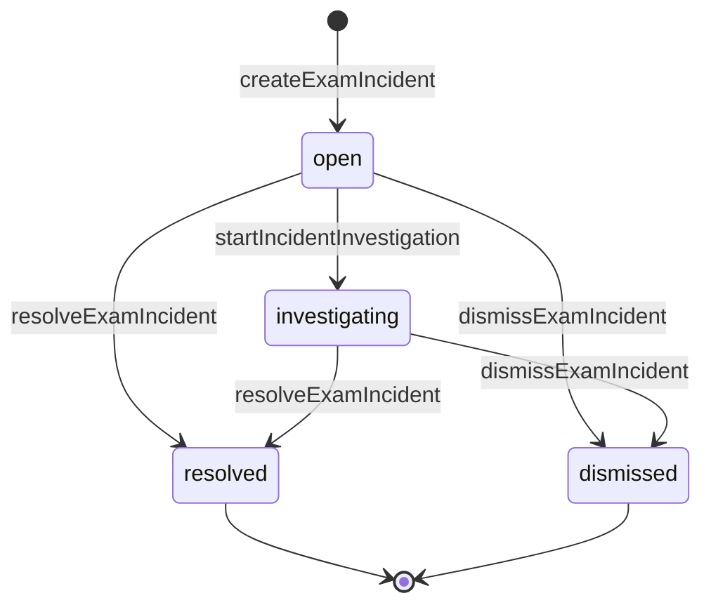

# ADR-014 — Exam Incident Authority

## Status

Proposed

This ADR is recorded for human review. It becomes binding only when a human
decision owner marks it **Accepted**. Until then:

- no incident table, migration, domain type, repository, route, permission
  constant, preset change, or UI may be implemented on its authority;
- `grantAttemptTime()` must keep rejecting non-null `incidentId`;
- `source=system_incident` time adjustments remain disabled;
- the existing audit-event-only `proctor.incident_marked` route remains the
  only live incident surface.

Runtime implementation: **NOT STARTED**. Implementation is authorized only by
the follow-up Job `REC-I6-I1-INCIDENT-PERSISTENCE-COMMANDS` (J3) after this
ADR is accepted. This ADR authorizes no runtime change by itself.

## Metadata

| Field | Value |
| --- | --- |
| Date | 2026-08-01 |
| Decision owners | jnhu76 |
| Supersedes | none |
| Superseded by | — |
| Related decisions | ADR-005, ADR-006, ADR-008, ADR-010, ADR-012, ADR-013 |
| Reality audit | [`docs/audits/REC-I6-R0-INCIDENT-AUTHORITY-REALITY-AUDIT.md`](../audits/REC-I6-R0-INCIDENT-AUTHORITY-REALITY-AUDIT.md) |
| Architecture doc | [`docs/architecture/exam-system/incident-authority.md`](../architecture/exam-system/incident-authority.md) (TARGET) |

## Terminology

The keywords MUST, MUST NOT, REQUIRED, SHALL, SHALL NOT, SHOULD, SHOULD NOT,
and MAY are to be interpreted as described in RFC 2119. Tables, schemas,
routes, and commands in this ADR are **proposals frozen for implementation**
unless explicitly labeled as a current runtime fact.

## Context

The platform already records proctor incident observations as **audit events
only**: `POST /api/admin/attempts/:attemptId/proctor-incident` writes one
atomic `proctor.incident_marked` audit row (gated by
`attempt.misconduct.mark`) and changes nothing else. There is no incident
entity, no incident status, no incident permission, and no incident UI.

Meanwhile, three operator actions are separately authoritative and fully
implemented:

- operator time grant — `grantAttemptTime()` + the
  `attempt_time_adjustments` ledger (`Permission.AttemptTimeGrant`,
  Admin-only; REC-I4-I3B2 closeout audit);
- force submit — route-composed `submitAttempt({ source: "proctor" })` +
  `gradeAttemptIdempotent` (`Permission.AttemptForceSubmit`);
- misconduct marking — `flagMisconduct()`, an Attempt jsonb field with no
  status change (`Permission.AttemptMisconductMark`).

ADR-013 froze the interruption-time policy and reserved exactly one durable
hook for this decision: `attempt_time_adjustments.incident_id` is nullable,
`grantAttemptTime()` rejects non-null `incidentId`
("reserved until REC-I6"), and `source=system_incident` adjustments are
disabled "until REC-I6 defines a System-only incident grant permission and
incident authority" (ADR-013 §5, §8, §10). ADR-013 also froze that an
`interruptionId` (one attempt) and a future `incidentId` (possibly many
attempts) are never interchangeable.

The recovery workstream (`docs/roadmap/recovery-operations-jobs.md`, J2)
requires that the incident concept be frozen — identity, lifecycle,
authority, relationships, concurrency, audit — before any persistence or API
work begins, so that J3 implements frozen semantics instead of inventing
them. This ADR is that freeze.

### Current runtime facts constraining this decision

1. No Incident aggregate exists anywhere (domain, contracts, db, engine,
   api, web). The only incident-shaped surface is the audit-event-only
   proctor marker.
2. `attempt_time_adjustments.incident_id` is the only `incident_id` column
   in the schema; it is nullable and has zero non-null writers.
3. The only incident token in `packages/authz` is the audit action
   `proctor.incident_marked` — an audit action, not a permission.
4. Proctor authority is exam-scoped by preset `defaultScope` but scope
   enforcement (M11) is NOT implemented; Proctor product activation remains
   blocked.
5. Interruption episodes (`attempt_interruptions` /
   `attempt_interruption_events`) are attempt-scoped, event-derived
   detection lifecycle with no status or version columns; their semantics
   are frozen by ADR-013 and MUST NOT absorb incident semantics.
6. Lock ordering `Enrollment → Attempt → Exam` (ADR-013 §9) is frozen; no
   `Exam → Attempt` path may be introduced.
7. Idempotency precedent: `operationId` command identity with
   `idempotent_replay` / `IdempotencyConflictError` (HTTP 409
   `IDEMPOTENCY_CONFLICT`), a named unique constraint as final arbiter, and
   23505 recognized only on that named constraint.
8. Server time authority: `fastify.now()` is the sole clock (ADR-006);
   audit metadata is bounded at 4096 bytes.

## Decision

### 1. What an incident is — and is not

An `ExamIncident` is a **durable operational case**: a reported or detected
exam problem plus its investigation state, notes, resolution, and links to
separately authoritative operator actions.

An incident is NOT:

- an Attempt status or an Attempt field;
- an `InterruptionEpisode` (attempt-scoped detection lifecycle; ADR-013);
- an audit log row (audit rows are immutable observations, not cases);
- a misconduct penalty, score mutation, time grant, or force submit;
- a universal mutable blob that arbitrary workflows may reshape.

Incident and Attempt lifecycles are **orthogonal state dimensions** (see
`docs/architecture/exam-system/state-and-authority.md`). An incident can
exist in any combination with any Attempt status; an Attempt can have zero,
one, or many incidents; an exam-wide incident can have no Attempt anchor at
all.

### 2. Aggregate identity

The frozen aggregate fields (proposal for J3):

```text
ExamIncident
- id                  uuid, server-generated
- organizationId      internal data boundary, NOT NULL
- examId              NOT NULL — incidents live in an exam operational context
- attemptId           nullable — direct single-attempt anchor
- candidateId         nullable
- type                closed enum (§4)
- severity            closed enum (§4), default info
- status              closed enum (§3), default open
- occurredAt          nullable — operator-declared observation time
- detectedAt/createdAt  server time (fastify.now())
- reportedBy          creating actor, NOT NULL
- description         immutable after creation, 1–1000 chars
- resolutionSummary   mutable projection, set at resolve, 1–1000 chars
- resolvedAt          nullable, server time
- resolvedBy          nullable actor
- version             integer, starts at 1, bumps on each state/severity change
- updatedAt           server time
```

`occurredAt` is a **recorded claim**, not a computation input. No deadline,
grace, compensation, or any other exam logic MAY read `occurredAt`; the
server clock remains the only time authority (ADR-006).

Multi-attempt incidents are exam-scoped (`attemptId` null). The individual
attempts involved appear through action links (§7 — every linked operator
action carries its own `attemptId`) and through event/note references. No
incident↔attempt junction table exists in the initial implementation.

### 3. Lifecycle state machine



| Status | Meaning | Terminal |
| --- | --- | --- |
| `open` | recorded, not yet actively investigated | no |
| `investigating` | active investigation | no |
| `resolved` | closed with a resolution summary | yes |
| `dismissed` | closed as not actionable (duplicate, mistaken, informational) | yes |

Rules:

- Terminal status is monotonic. There is no reopen transition in the
  initial implementation; a genuinely new problem is a new incident.
- `addIncidentNote()` and `linkIncidentAction()` are append-only side writes
  allowed in **any** status — operators MAY annotate or correlate after
  resolution. They never change status or version.
- `changeIncidentSeverity()` is allowed only in non-terminal status and
  bumps version.
- Do not add further statuses before real workflows require them. No
  user-defined statuses.

Required reason text per transition:

| Transition | Required | Optional |
| --- | --- | --- |
| create | `description` (1–1000) | `reasonCode` (≤100), `occurredAt`, anchors |
| investigate | — | `reasonCode`, `reasonText` (≤1000) |
| note | `body` (1–500) | — |
| severity change | `severity` | `reasonCode`, `reasonText` |
| resolve | `resolutionSummary` (1–1000) | `reasonCode` |
| dismiss | `reasonText` (1–1000) | `reasonCode` |
| action link | `actionType`, `actionId` | `attemptId` |

### 4. Incident types and severity

Closed type enum (9 values):

```text
network_interruption        device_failure
power_failure               candidate_unable_to_continue
suspected_misconduct        operator_error
system_outage               environmental_disruption
other
```

Closed severity enum (4 values):

```text
info   minor   major   critical
```

Severity informs operator prioritization ONLY. Severity MUST NOT trigger
punishment, score change, time grant, force submit, or any Attempt mutation,
either directly or through any automated rule. No user-defined types.

### 5. Event history (append-only)

Every command appends one immutable event; the materialized aggregate row is
a projection of that history.

```text
exam_incident_events.eventType ∈
  incident_created
  investigation_started
  note_added
  severity_changed
  incident_resolved
  incident_dismissed
  action_linked
```

Rules:

- Events are append-only. No UPDATE path, no deletion.
- Editing the current `resolutionSummary` projection MUST NOT rewrite
  historical events; a corrected resolution is a new
  `incident_resolved`-family event only if a re-resolve transition exists —
  in the initial implementation it does not, so the projection is set once
  at resolve time and further clarification goes through `note_added`.
- Event payloads are bounded jsonb (note bodies, before/after severity,
  resolution summary, action link identity).
- Incident state MUST be reconstructable and explainable from events plus
  linked actions.

### 6. Authority rules (orthogonality contract)

An incident command MUST NOT:

- mutate `exam_attempts` status or any Attempt field;
- change any score or grading state;
- grant, revoke, or compute time;
- force-submit;
- mark or clear misconduct.

Time grant, force submit, and misconduct marking remain separate canonical
commands under their existing permissions. An incident only **explains and
correlates** those actions through action links (§7). Resolution of an
incident is a judgment record; it does not execute any operator action.

Additional authority rules:

- one incident MAY reference many operator actions;
- one operator action MAY be linked to at most one incident
  (DB-unique `(action_type, action_id)`, §12);
- incident deletion is not supported for normal operators; there is no
  delete route or command;
- dismissal is a terminal business outcome, never row deletion;
- `exam_incidents` rows carry `organizationId` and every repository method
  receives `ctx` (single-tenant data boundary).

### 7. Relationships

| Related concept | Relationship | Mechanism |
| --- | --- | --- |
| Exam | every incident belongs to exactly one exam | `exam_incidents.exam_id` NOT NULL |
| Attempt | optional direct anchor; many attempts via actions | `exam_incidents.attempt_id` nullable; `exam_incident_actions.attempt_id` |
| Candidate | optional; validated against the attempt enrollment when `attemptId` is set | `exam_incidents.candidate_id` nullable |
| InterruptionEpisode | correlation only — NO junction table | the time-adjustment ledger already carries BOTH `interruptionId` and `incidentId` on the same row; plus event/note text |
| Operator actions | durable links to separately authoritative actions | `exam_incident_actions` stores action identity + type, never duplicated mutable action state |

`exam_incident_actions.action_type` initial values:

```text
time_grant   force_submit   misconduct_mark
```

The interruption correlation decision is deliberate: ADR-013 froze
`interruptionId` (one attempt) and `incidentId` (possibly many attempts) as
never interchangeable, and the ledger row is already the authoritative place
where a compensated interruption meets its operator incident. A fourth
link table would add no provable fact.

### 8. Actor and permission model

New permissions (ADR-010 dotted `domain.resource.action` convention):

| Permission | Covers |
| --- | --- |
| `incident.view` | list and read incidents |
| `incident.create` | create an incident |
| `incident.investigate` | start investigation, add note, change severity, link an action retroactively |
| `incident.resolve` | resolve and dismiss (terminal judgment) |

Preset matrix (proposal for J3):

| Actor | view | create | investigate | resolve | Scope / activation |
| --- | :-: | :-: | :-: | :-: | --- |
| Admin | ✅ | ✅ | ✅ | ✅ | organization scope; active on implementation |
| Proctor | ✅ | ✅ | ✅ | ❌ | exam scope by `defaultScope`; **product activation remains blocked until M11** provides Proctor-to-Exam scope enforcement |
| Teacher | ❌ | ❌ | ❌ | ❌ | no default grant |
| Grader | ❌ | ❌ | ❌ | ❌ | no default grant |
| Candidate | ❌ | ❌ | ❌ | ❌ | never; a future candidate report is a separate input protocol an operator MAY convert into an incident |
| System | reserved | reserved | ❌ | ❌ | see below |

`incident.resolve` is flagged sensitive in the Admin preset (terminal
judgment, same scrutiny class as `AttemptForceSubmit`).

**System incidents.** `system.incident.create` is RESERVED by name only —
it is not added to the permission catalog or any preset in the initial
implementation. This satisfies ADR-013's condition ("until REC-I6 defines a
System-only incident grant permission and incident authority") by freezing
the permission's name and authority shape while deferring activation:
`source=system_incident` time adjustments remain disabled, and the
vocabulary-permissive ledger CHECK branch keeps zero writers until a future
system-incident Job wires both the permission and non-null `incidentId`
through a System-only command path. The initial implementation is
operator-only.

**M11 boundary.** Granting incident permissions to the Proctor preset does
not activate Proctor incident operations: without Proctor-to-Exam scope
enforcement (M11, J4), organization-wide Proctor authority is forbidden.
This mirrors the existing Proctor preset posture (grants exist; activation
is blocked).

### 9. Concurrency, idempotency, versioning

- Mutating transitions (`investigate`, `resolve`, `dismiss`, severity
  change) REQUIRE `expectedVersion`. Stale version → HTTP 409
  `INCIDENT_VERSION_CONFLICT` (new message-registry code, added by J3).
- Two simultaneous terminal transitions: the incident row lock plus version
  check admit exactly one winner; the loser receives 409.
- Terminal transitions are deterministic no-ops when the incident is
  already in the **same** terminal state: the committed incident is
  returned (replay semantics, mirroring the time-grant `terminal`
  outcome). A conflicting transition (resolve vs dismiss) or a stale
  version is a conflict, not a replay.
- `createExamIncident()` carries no `operationId`. Duplicate incident
  creation is a human-workflow concern resolved by dismissal; incidents are
  investigation records, not side-effecting commands, so duplicate rows do
  not corrupt exam state.
- Notes are independently appendable: concurrent notes both succeed; notes
  do not require a version.
- Action links: `UNIQUE (organization_id, action_type, action_id)` is the
  final arbiter. Re-linking the same action to the same incident is an
  idempotent replay; linking an already-linked action to a different
  incident → HTTP 409 `INCIDENT_ACTION_ALREADY_LINKED`. PostgreSQL 23505 is
  recognized ONLY on that named constraint (mirrors the
  `operatorGrantExecution` cross-Attempt race pattern); any other 23505 is
  surfaced, never swallowed.

### 10. Transaction boundaries and lock ordering

| Command | Transaction scope | Locks |
| --- | --- | --- |
| createExamIncident | insert incident + `incident_created` event + audit | none beyond the new row |
| startIncidentInvestigation | lock incident row → version check → update + event + audit | `exam_incidents` FOR UPDATE |
| addIncidentNote | insert `note_added` event (+ optional incident `updatedAt`) | none (append-only) |
| changeIncidentSeverity | lock incident row → version check → update + event + audit | `exam_incidents` FOR UPDATE |
| resolveExamIncident / dismissExamIncident | lock incident row → version/terminal check → update + event + audit | `exam_incidents` FOR UPDATE |
| linkIncidentAction | insert link (unique constraint arbiter) + `action_linked` event + audit | none (constraint-arbiterated) |
| grantAttemptTime (extended by J3) | existing ADR-013 chain + optional incident validation + action-link insert | unchanged: Enrollment → Attempt → Exam; incident validation is a NON-LOCKING read |

Orthogonality locks:

- Incident commands MUST NOT lock Attempt or Exam rows. Exam/attempt
  existence and anchor validation are non-locking reads. This keeps
  incident operations deadlock-free against the ADR-013 chain.
- The ADR-013 lock order `Enrollment → Attempt → Exam` is unchanged. If any
  future shared transaction ever locks an incident row, that lock MUST be
  taken strictly AFTER the Exam lock (append-only extension; no reordering
  of the existing three).

Grant + link model (the J3 choice required by the recovery Jobs doc):
**one transaction**. The time-grant route accepts an optional `incidentId`,
validates it (exists, same organization, `attemptId` null or matching the
grant's attempt), and writes the ledger row, deadline update, action link,
and audit atomically under the existing `operationId` idempotency.
Retroactive linking — force submit, misconduct marks, or later correlation —
uses standalone `linkIncidentAction()` in its own transaction. A linked
action MUST NOT exist only in UI memory.

### 11. Audit and privacy

Every command records an atomic audit action under the existing audit
policy (active, privileged mutation where state changes, bounded metadata):

```text
incident.created          incident.investigated
incident.note_added       incident.severity_changed
incident.resolved         incident.dismissed
incident.action_linked
```

Metadata rules (mirroring the time-grant audit policy):

- audit metadata carries identifiers (incident id, exam id, attempt id,
  actor, action type/id, version, reasonCode) and MUST stay within the
  4096-byte bound (ADR-006);
- free-text bodies (description, note body, resolution summary,
  reasonText) stay in incident rows and events; they are NOT duplicated
  into audit metadata — `incident.note_added` carries the note id only.

Privacy:

- incident content MAY contain candidate PII; read access is gated by
  `incident.view` and assignment-backed authority (fail-closed 503
  `AUTHZ_UNAVAILABLE` per ADR-010);
- there is no candidate-facing incident API; candidates never read or
  create incidents in this design;
- callers MUST NOT place candidate answers into incident notes (mirrors the
  existing `MarkProctorIncidentRequest` contract).

### 12. Persistence schema proposal (for J3)

Three additive tables; no backfill; no synthesis of historical incidents.

```text
exam_incidents
  id uuid PK, organization_id NOT NULL, exam_id NOT NULL FK,
  attempt_id NULL FK, candidate_id NULL FK,
  type text CHECK (in 9 values), severity text CHECK (in 4) DEFAULT 'info',
  status text CHECK (in 4) DEFAULT 'open',
  occurred_at timestamptz NULL, description text NOT NULL,
  resolution_summary text NULL, resolved_at timestamptz NULL,
  resolved_by uuid NULL, reported_by uuid NOT NULL,
  version integer NOT NULL DEFAULT 1,
  created_at timestamptz NOT NULL, updated_at timestamptz NOT NULL
  indexes: (organization_id, exam_id, status);
           partial (organization_id, status)
             WHERE status IN ('open', 'investigating')

exam_incident_events
  id uuid PK, organization_id NOT NULL, incident_id NOT NULL FK,
  event_type text CHECK (in 7 values), actor_id uuid,
  payload jsonb NOT NULL DEFAULT '{}', created_at timestamptz NOT NULL
  index: (incident_id, created_at)
  append-only: no UPDATE path in the repository; no cascade delete

exam_incident_actions
  id uuid PK, organization_id NOT NULL, incident_id NOT NULL FK,
  action_type text CHECK (time_grant | force_submit | misconduct_mark),
  action_id uuid NOT NULL, attempt_id uuid NULL, actor_id uuid,
  linked_at timestamptz NOT NULL, operation_id uuid NULL
  UNIQUE (organization_id, action_type, action_id)   -- §9 final arbiter
```

`attempt_time_adjustments.incident_id` already exists (nullable, zero
non-null writers). J3 activates non-null writes exclusively through the
extended grant path of §10. No other existing table changes.

### 13. API contract proposal (for J3)

```http
POST   /api/admin/exams/:examId/incidents             incident.create
GET    /api/admin/exams/:examId/incidents             incident.view
GET    /api/admin/incidents/:incidentId               incident.view
POST   /api/admin/incidents/:incidentId/investigate   incident.investigate
POST   /api/admin/incidents/:incidentId/notes         incident.investigate
POST   /api/admin/incidents/:incidentId/severity      incident.investigate
POST   /api/admin/incidents/:incidentId/resolve       incident.resolve
POST   /api/admin/incidents/:incidentId/dismiss       incident.resolve
POST   /api/admin/incidents/:incidentId/actions       incident.investigate
```

Request bodies follow §3 (required reason text table) and §9
(`expectedVersion` on mutating transitions). Responses project the incident
including `version`, plus the command outcome where a replay/conflict
distinction exists.

Error contract:

| Condition | HTTP | Code |
| --- | --- | --- |
| incident not found / cross-organization | 404 | `NOT_FOUND` |
| stale `expectedVersion` | 409 | `INCIDENT_VERSION_CONFLICT` |
| action already linked to another incident | 409 | `INCIDENT_ACTION_ALREADY_LINKED` |
| invalid anchor (attempt not in exam, enum violation) | 400 | validation error |
| capability denied | 403 | existing authz error |
| authorization service unavailable | 503 | `AUTHZ_UNAVAILABLE` (fail-closed) |

Proctor routes, after M11, reuse the same handlers under scoped authority.
No organization-wide Proctor incident route may be introduced.

### 14. Migration and backfill

- Additive tables only; serialized migration under the existing migration
  discipline.
- NO backfill. Historical `proctor.incident_marked` audit events remain
  audit events. Synthesizing historical incidents from audit history is
  forbidden — it would manufacture investigation state that never existed.
- The existing nullable `attempt_time_adjustments.incident_id` column is
  not altered; J3 changes only which writers may set it.

### 15. Relationship to the existing proctor incident marker

The audit-event-only `POST /admin/attempts/:attemptId/proctor-incident`
route remains as implemented. When J3 lands, there MUST NOT be a silent
dual-write that also creates incident rows behind the existing route;
changing the marker's behavior is a separate, explicit UI/Job decision
(the J5/J6 recovery centers own that migration).

`ProctorIncidentTypeEnum` → incident `type` mapping is guidance for
operators and future UI, not an automatic conversion:

| Marker type | Suggested incident type |
| --- | --- |
| `suspicious_behavior_marked` | `suspected_misconduct` |
| `network_issue_marked` | `network_interruption` |
| `identity_check_failed` | `suspected_misconduct` or `other` |
| `manual_note_added` | `other` |

### 16. Alternatives considered

| Alternative | Verdict | Reason |
| --- | --- | --- |
| A. Audit-log-only (status quo marker) | REJECT | no durable investigation state, no resolution workflow, no queryable case, no action correlation; audit rows are immutable observations, not cases |
| B. Reuse `InterruptionEpisode` | REJECT | episodes are attempt-scoped, event-derived detection lifecycle with no status/version columns; incidents span attempts and carry investigation workflow; ADR-013 freezes episode semantics and declares the two identities never interchangeable |
| C. Fields on `ExamAttempt` | REJECT | cannot represent many incidents per attempt or exam-wide incidents; bloats the hottest row; mixes investigation state with exam state; amplifies Attempt lock contention |
| D. Dedicated aggregate + materialized state + append-only events | **ADOPTED** | orthogonal state dimension with its own lock scope; follows the ADR-013 ledger/event precedent; queryable reads plus immutable history |
| E. Pure event sourcing | REJECT for initial implementation | operational list/filter needs a materialized read model; projection machinery is unjustified at this scale; D's hybrid provides auditability without event-sourcing infrastructure |

### 17. Non-goals

- persistence implementation, migrations, repositories (J3);
- recovery center UI (J5/J6);
- Proctor assignment/scope enforcement (M11, J4);
- Redis, WebSocket/SSE, background jobs;
- automatic punishment or any automated effect from severity or resolution;
- attachment / evidence binary storage (separately designed if ever);
- arbitrary user-defined incident statuses or types;
- candidate-facing incident reporting (separate future input protocol);
- system-generated incidents (reserved permission; future Job);
- incident retention purge policy (durable records; separate ops decision);
- reopening resolved/dismissed incidents (a new problem is a new incident).

### 18. Implementation decomposition

J3 (`REC-I6-I1-INCIDENT-PERSISTENCE-COMMANDS`) implements, after acceptance:

1. migration for the three tables (§12);
2. domain types + closed enums in `packages/domain`;
3. Zod contracts (§13) + message-registry codes (§9);
4. catalog permissions (§8) + preset matrix + sensitive flag;
5. repositories (ctx-first, organization-scoped, tx-bound factory);
6. canonical commands (§3, §10) — no universal `updateIncident()`;
7. routes under `requireScopedCapability` (§13);
8. extension of the time-grant route/command for optional `incidentId`
   (§10 one-transaction model) and removal of the "reserved until REC-I6"
   guard for the validated path only;
9. audit actions under the existing audit policy (§11);
10. unit, integration, permission-matrix, concurrency, and audit tests.

Remaining future work explicitly NOT authorized by acceptance of this ADR:
M11 Proctor scope (J4), recovery centers (J5/J6), scenario closeout (J7),
system incidents, incident retention, candidate reporting.

### 19. Consequences and acceptance

When accepted and implemented by J3:

- every incident transition has exactly one command owner;
- incident and Attempt lifecycles remain provably orthogonal (no incident
  command writes `exam_attempts`);
- time grants, force submits, and misconduct marks stay separately
  authoritative, correlated by durable links;
- the ADR-013 `incidentId` reservation is activated exactly as prescribed,
  and `source=system_incident` remains disabled;
- historical events are append-only and reconstructable;
- concurrency and idempotency expectations are DB-arbiterated.

Acceptance of this ADR is a human review act. J3 remains blocked until that
acceptance is recorded in this Status section and in
`docs/roadmap/recovery-operations-jobs.md`.
