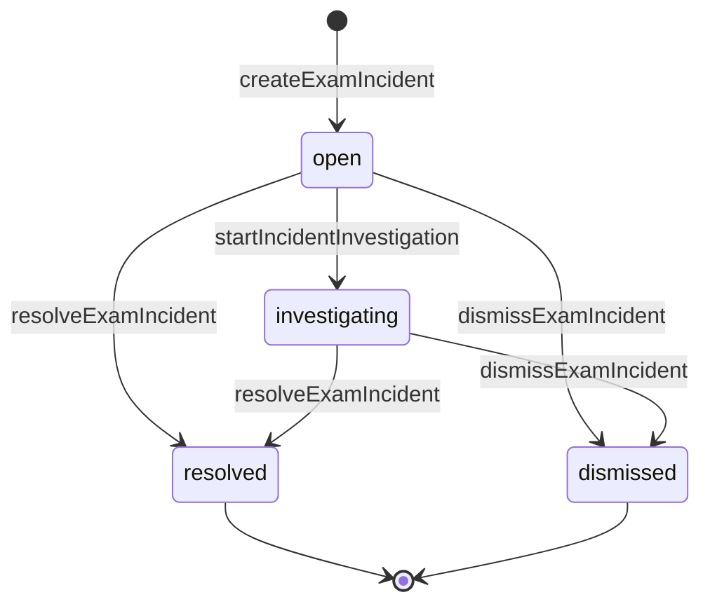

# ADR-014 — Exam Incident Authority

## Status

Proposed

This ADR is recorded for human review. It becomes binding only when a human
decision owner marks it **Accepted**. Until then:

- no incident table, migration, domain type, repository, route, permission
  constant, preset change, or UI may be implemented on its authority;
- `grantAttemptTime()` must keep rejecting non-null `incidentId`;
- `source=system_incident` time adjustments remain disabled;
- the existing audit-event-only `proctor.incident_marked` route remains the
  only live incident surface.

Runtime implementation: **NOT STARTED**. Implementation is authorized only by
the follow-up Job `REC-I6-I1-INCIDENT-PERSISTENCE-COMMANDS` (J3) after this
ADR is accepted. This ADR authorizes no runtime change by itself.

## Metadata

| Field | Value |
| --- | --- |
| Date | 2026-08-01 |
| Decision owners | jnhu76 |
| Supersedes | none |
| Superseded by | — |
| Related decisions | ADR-005, ADR-006, ADR-008, ADR-010, ADR-012, ADR-013 |
| Reality audit | [`docs/audits/REC-I6-R0-INCIDENT-AUTHORITY-REALITY-AUDIT.md`](../audits/REC-I6-R0-INCIDENT-AUTHORITY-REALITY-AUDIT.md) |
| Architecture doc | [`docs/architecture/exam-system/incident-authority.md`](../architecture/exam-system/incident-authority.md) (TARGET) |

### Revision notes

- **R4 (2026-08-01)** — hardened per PR #241 review round 3 (P1 blocking):
  - `force_submit` verification uses `attempt.forceSubmit` audit fact existence instead of non-persistent `submissionSource` (§7);
  - `operationId` concurrency recovery: removed "cannot happen" claim; defined real recovery flow (rollback → fresh-transaction query → replay/conflict) (§9);
  - `candidateId` link-scope extended from `linkIncidentAttempt` only to ALL target links (action, interruption, combined grant) — scope quadruple replaces scope triple (§7);
  - protocol-catalog.md synced to match ADR-014 R3+R4 (lock strategy, scope quadruple, force-submit verification, concurrency recovery, non-bump chain exclusion);
  - notes/links no longer update `exam_incidents.updatedAt` (conflict risk without row lock) (§10);
  - incident API wire outcome renamed to `idempotent_replayed` (matching the API response proposal) (§9, §13);
  - route prefix standardized to `/admin/...` (matching existing Fastify routes) (§13).
- **R3 (2026-08-01)** — frozen per decision-owner review round 3:
  - `action_id` type changed from `uuid` to `text` to match the house entity-id convention (`text`, via the `id()` helper) — both referents (`attempt_time_adjustments.id`, `exam_attempts.id`) are `text` (§12);
  - notes/links version-chain contiguity is explicitly excluded — they carry `after=before` and do not participate in chain verification (§5);
  - `operationId` vs link-unique arbitration priority is frozen: `operationId` lookup precedes all writes, and `IDEMPOTENCY_CONFLICT` takes priority over `INCIDENT_ACTION_ALREADY_LINKED` (§9);
  - `force_submit` action links require server-side verification that the attempt was actually force-submitted (§7);
  - `candidateId` semantic matrix frozen: when `attemptId` is null and `candidateId` is set, membership links are restricted to that candidate's attempts (§7).
- **R2 (2026-08-01)** — hardened after PR #241 review round 2:
  - `operationId` is command identity on **every** write command, arbitrated
    by `UNIQUE (organization_id, operation_id)` on the event table; the
    reason-text replay rule is removed (§5, §9);
  - `misconduct_mark` action links are DEFERRED until a stable append-only
    misconduct receipt exists — initial action types are `time_grant` and
    `force_submit` only (§7);
  - a frozen link-scope validation triple (same organization, same exam,
    anchor null-or-matching) applies to every link and the combined grant
    path, derived server-side from authoritative rows (§7);
  - formal `exam_incident_attempts` membership and
    `exam_incident_interruption_links` evidence links replace the "no
    junction table" claim (§2, §7, §12);
  - `event_sequence` (`BIGINT GENERATED ALWAYS AS IDENTITY`) is the sole
    ordering authority and every event carries `before_version` /
    `after_version` (§5);
  - incident `type` is immutable after creation (§4);
  - relational integrity via composite FKs that reuse existing uniques —
    zero changes to existing tables (§12, §14);
  - the error contract uses public wire codes (`RESOURCE_NOT_FOUND`, not the
    domain-internal `NOT_FOUND`) and is fully frozen (§13);
  - the ADR-013 runtime activation gate is explicitly NOT satisfied by the
    name reservation (§8).

## Terminology

The keywords MUST, MUST NOT, REQUIRED, SHALL, SHALL NOT, SHOULD, SHOULD NOT,
and MAY are to be interpreted as described in RFC 2119. Tables, schemas,
routes, and commands in this ADR are **proposals frozen for implementation**
unless explicitly labeled as a current runtime fact.

## Context

The platform already records proctor incident observations as **audit events
only**: `POST /api/admin/attempts/:attemptId/proctor-incident` writes one
atomic `proctor.incident_marked` audit row (gated by
`attempt.misconduct.mark`) and changes nothing else. There is no incident
entity, no incident status, no incident permission, and no incident UI.

Meanwhile, three operator actions are separately authoritative and fully
implemented:

- operator time grant — `grantAttemptTime()` + the
  `attempt_time_adjustments` ledger (`Permission.AttemptTimeGrant`,
  Admin-only; REC-I4-I3B2 closeout audit);
- force submit — route-composed `submitAttempt({ source: "proctor" })` +
  `gradeAttemptIdempotent` (`Permission.AttemptForceSubmit`);
- misconduct marking — `flagMisconduct()`, an Attempt jsonb field with no
  status change (`Permission.AttemptMisconductMark`).

ADR-013 froze the interruption-time policy and reserved exactly one durable
hook for this decision: `attempt_time_adjustments.incident_id` is nullable,
`grantAttemptTime()` rejects non-null `incidentId`
("reserved until REC-I6"), and `source=system_incident` adjustments are
disabled "until REC-I6 defines a System-only incident grant permission and
incident authority" (ADR-013 §5, §8, §10). ADR-013 also froze that an
`interruptionId` (one attempt) and a future `incidentId` (possibly many
attempts) are never interchangeable.

The recovery workstream (`docs/roadmap/recovery-operations-jobs.md`, J2)
requires that the incident concept be frozen — identity, lifecycle,
authority, relationships, concurrency, audit — before any persistence or API
work begins, so that J3 implements frozen semantics instead of inventing
them. This ADR is that freeze.

### Current runtime facts constraining this decision

1. No Incident aggregate exists anywhere (domain, contracts, db, engine,
   api, web). The only incident-shaped surface is the audit-event-only
   proctor marker.
2. `attempt_time_adjustments.incident_id` is the only `incident_id` column
   in the schema; it is nullable and has zero non-null writers.
3. The only incident token in `packages/authz` is the audit action
   `proctor.incident_marked` — an audit action, not a permission.
4. Proctor authority is exam-scoped by preset `defaultScope` but scope
   enforcement (M11) is NOT implemented; Proctor product activation remains
   blocked.
5. Interruption episodes (`attempt_interruptions` /
   `attempt_interruption_events`) are attempt-scoped, event-derived
   detection lifecycle with no status or version columns; their semantics
   are frozen by ADR-013 and MUST NOT absorb incident semantics.
6. Lock ordering `Enrollment → Attempt → Exam` (ADR-013 §9) is frozen; no
   `Exam → Attempt` path may be introduced.
7. Idempotency precedent: `operationId` command identity with
   `idempotent_replay` / `IdempotencyConflictError` (HTTP 409
   `IDEMPOTENCY_CONFLICT`), a named unique constraint as final arbiter, and
   23505 recognized only on that named constraint.
8. Server time authority: `fastify.now()` is the sole clock (ADR-006);
   audit metadata is bounded at 4096 bytes.

## Decision

### 1. What an incident is — and is not

An `ExamIncident` is a **durable operational case**: a reported or detected
exam problem plus its investigation state, notes, resolution, and links to
separately authoritative operator actions.

An incident is NOT:

- an Attempt status or an Attempt field;
- an `InterruptionEpisode` (attempt-scoped detection lifecycle; ADR-013);
- an audit log row (audit rows are immutable observations, not cases);
- a misconduct penalty, score mutation, time grant, or force submit;
- a universal mutable blob that arbitrary workflows may reshape.

Incident and Attempt lifecycles are **orthogonal state dimensions** (see
`docs/architecture/exam-system/state-and-authority.md`). An incident can
exist in any combination with any Attempt status; an Attempt can have zero,
one, or many incidents; an exam-wide incident can have no Attempt anchor at
all.

### 2. Aggregate identity

The frozen aggregate fields (proposal for J3):

```text
ExamIncident
- id                  uuid, server-generated
- organizationId      internal data boundary, NOT NULL
- examId              NOT NULL — incidents live in an exam operational context
- attemptId           nullable — direct single-attempt anchor
- candidateId         nullable
- type                closed enum (§4)
- severity            closed enum (§4), default info
- status              closed enum (§3), default open
- occurredAt          nullable — operator-declared observation time
- createdAt           server time (fastify.now())
- reportedBy          creating actor, NOT NULL
- description         immutable after creation, 1–1000 chars
- resolutionSummary   mutable projection, set at resolve, 1–1000 chars
- resolvedAt          nullable, server time
- resolvedBy          nullable actor
- version             integer, starts at 1, bumps on each state/severity change
- updatedAt           server time
```

`occurredAt` is a **recorded claim**, not a computation input. No deadline,
grace, compensation, or any other exam logic MAY read `occurredAt`; the
server clock remains the only time authority (ADR-006).

All actor identities (`reportedBy`, `resolvedBy`, event `actor_id`) are
**server-derived from the authenticated ctx**. Request bodies can never set
an actor field.

An incident expresses its attempt relationship in exactly one way (§7):
either a single direct **anchor** (`attemptId` set at creation, immutable)
for a single-attempt incident, or zero-or-many **affected-attempt
membership** rows (`exam_incident_attempts`) for an exam-wide incident
(`attemptId` null). Anchor and membership are mutually exclusive: an
anchored incident rejects membership links. Membership rows and
interruption evidence links (`exam_incident_interruption_links`) are
append-only relationships — they record which attempts and episodes an
incident touched; they never absorb Attempt or InterruptionEpisode
authority.

### 3. Lifecycle state machine



| Status | Meaning | Terminal |
| --- | --- | --- |
| `open` | recorded, not yet actively investigated | no |
| `investigating` | active investigation | no |
| `resolved` | closed with a resolution summary | yes |
| `dismissed` | closed as not actionable (duplicate, mistaken, informational) | yes |

Rules:

- Terminal status is monotonic. There is no reopen transition in the
  initial implementation; a genuinely new problem is a new incident.
- `addIncidentNote()`, `linkIncidentAction()`, `linkIncidentAttempt()`, and
  `linkIncidentInterruption()` are append-only side writes allowed in
  **any** status — operators MAY annotate or correlate after resolution.
  They never change status or version. Evidence links have no unlink
  command in the initial implementation; a wrong link is annotated with a
  note (and, if the incident itself was mistaken, dismissed).
- `changeIncidentSeverity()` is allowed only in non-terminal status and
  bumps version.
- Do not add further statuses before real workflows require them. No
  user-defined statuses.

Required reason text per transition:

| Transition | Required | Optional |
| --- | --- | --- |
| create | `description` (1–1000) | `reasonCode` (≤100), `occurredAt`, anchors |
| investigate | — | `reasonCode`, `reasonText` (≤1000) |
| note | `body` (1–500) | — |
| severity change | `severity` | `reasonCode`, `reasonText` |
| resolve | `resolutionSummary` (1–1000) | `reasonCode` |
| dismiss | `reasonText` (1–1000) | `reasonCode` |
| action link | `actionType`, `actionId` | — |
| attempt link | `attemptId`, `relationshipType` | — |
| interruption link | `interruptionId` | — |

Every write command additionally carries a client-generated `operationId`
(UUIDv4) — the command identity (§9). Version-bumping transitions
(investigate, severity change, resolve, dismiss) additionally REQUIRE
`expectedVersion`. Identity and scope values (organization, exam, and the
attempt of a linked action) are server-derived from authoritative rows,
never accepted from the request body (§7 link-scope rule).

### 4. Incident types and severity

Closed type enum (9 values):

```text
network_interruption        device_failure
power_failure               candidate_unable_to_continue
suspected_misconduct        operator_error
system_outage               environmental_disruption
other
```

Closed severity enum (4 values):

```text
info   minor   major   critical
```

Severity informs operator prioritization ONLY. Severity MUST NOT trigger
punishment, score change, time grant, force submit, or any Attempt mutation,
either directly or through any automated rule. No user-defined types.

Incident `type` is **immutable after creation**. There is no
`changeIncidentType()` command and no `type_changed` event. A
classification mistake is corrected by dismissing the incident (the
required dismiss reason records the mistake) and creating a new incident
with the correct type; the new incident MAY reference the dismissed one in
a note.

### 5. Event history (append-only)

Every command appends exactly one immutable event; the materialized
aggregate row is a projection of that history.

```text
exam_incident_events.eventType ∈
  incident_created
  investigation_started
  note_added
  severity_changed
  incident_resolved
  incident_dismissed
  action_linked
  attempt_linked
  interruption_linked
```

Every event row carries:

- `event_sequence` — `BIGINT GENERATED ALWAYS AS IDENTITY`. This is the
  **sole ordering authority** for reconstruction and timeline display
  (`ORDER BY event_sequence`). `created_at` is a wall-clock annotation
  only; UUID ids and timestamps define no order. Concurrent appends can
  share a transaction-clock timestamp; the identity column never does.
- `operation_id` (NOT NULL) + `command_type` (NOT NULL) — the command
  identity that produced the event. `UNIQUE (organization_id,
  operation_id)` is the idempotency arbiter for every write command (§9).
- `before_version` / `after_version` (NOT NULL integers) — the aggregate
  version before and after the command. Version-bumping commands:
  `after = before + 1`; append-only commands (note, links):
  `after = before`; `incident_created`: `before = 0, after = 1`.

Rules:

- Events are append-only. No UPDATE path, no deletion.
- Editing the current `resolutionSummary` projection MUST NOT rewrite
  historical events; the projection is set once at resolve time (there is
  no re-resolve transition) and further clarification goes through
  `note_added`.
- Event payloads are bounded jsonb (note bodies, before/after severity,
  resolution summary, link referents); the contract field limits (§3) are
  the payload bound. Payloads are self-describing (before/after severity,
  note id, resolution text, link identity).
- Incident state MUST be reconstructable and explainable from events plus
  links, ordered by `event_sequence` alone. The reconstruction is
  verifiable: per incident, the `event_sequence`-ordered version chain is
  contiguous (`incident_created` starts at 1; each bump satisfies
  `before == previous after`; the materialized `version` equals the latest
  `after_version`). **Notes and links do not participate in chain
  contiguity**: they carry `after = before` and their `event_sequence` is
  interleavable with version-bumping events from concurrent transactions.
  The contiguity assertion skips events where `before == after` and only
  validates that the bump chain is contiguous. J3 asserts this skipping
  logic in integration tests.

### 6. Authority rules (orthogonality contract)

An incident command MUST NOT:

- mutate `exam_attempts` status or any Attempt field;
- change any score or grading state;
- grant, revoke, or compute time;
- force-submit;
- mark or clear misconduct.

Time grant, force submit, and misconduct marking remain separate canonical
commands under their existing permissions. An incident only **explains and
correlates** those actions through action links (§7). Resolution of an
incident is a judgment record; it does not execute any operator action.

Additional authority rules:

- one incident MAY reference many operator actions, affected attempts, and
  interruption episodes;
- one operator action MAY be linked to at most one incident
  (DB-unique `(organization_id, action_type, action_id)`, §12);
- one attempt (respectively interruption episode) MAY appear at most once
  per incident (DB-unique `(incident_id, attempt_id)` /
  `(incident_id, interruption_id)`, §12);
- incident deletion is not supported for normal operators; there is no
  delete route or command;
- dismissal is a terminal business outcome, never row deletion;
- `exam_incidents` rows carry `organizationId` and every repository method
  receives `ctx` (single-tenant data boundary).

### 7. Relationships

| Related concept | Relationship | Mechanism |
| --- | --- | --- |
| Exam | every incident belongs to exactly one exam, regardless of exam status | `exam_incidents.exam_id` NOT NULL |
| Attempt — anchor | optional single direct subject, set at creation, immutable | `exam_incidents.attempt_id` nullable; composite FK `(organization_id, attempt_id)` |
| Attempt — membership | zero-or-many affected attempts for exam-wide incidents | `exam_incident_attempts` junction (append-only) |
| Candidate | optional; always enrollment-validated (see below) | `exam_incidents.candidate_id` nullable |
| InterruptionEpisode | zero-or-many evidence links, plus ledger correlation | `exam_incident_interruption_links` junction (append-only); the time-adjustment ledger still carries BOTH `interruptionId` and `incidentId` on the same row for compensated interruptions |
| Operator actions | durable links to separately authoritative actions | `exam_incident_actions` stores action identity + type, never duplicated mutable action state |

Incident creation is NOT gated by exam status: post-exam investigations
(retrospective misconduct review, delayed disruption reports) are a primary
use case. The exam must merely resolve in the actor organization.

**Candidate validation (frozen V1 semantic matrix).**

```text
| attemptId | candidateId | 语义 (semantics)                            | membership 规则                         |
|-----------|-------------|---------------------------------------------|-----------------------------------------|
| null      | null        | 全考试范围 incident，无特定考生焦点           | 可添加任意 enrolled attempt             |
|           |             | Exam-wide incident, no specific candidate   | Any enrolled attempt may be linked      |
| null      | set         | 考试范围但聚焦于特定考生                     | 仅可添加该 candidate 的 attempt         |
|           |             | Exam-wide, candidate-specific focus         | Only the candidate's attempts may link  |
| set       | null        | 单 attempt incident，candidate 从 attempt 派生 | 锚定，拒绝 membership（互斥）          |
|           |             | Single-attempt, candidate derived           | Anchored, no membership                 |
| set       | set         | 单 attempt incident，显式 candidate          | 锚定，拒绝 membership（互斥）          |
|           |             | Single-attempt, explicit candidate          | Anchored, no membership                 |
```

Validation rules (non-locking reads; violation → 400 `VALIDATION_ERROR`):

- When `candidateId` is set AND `attemptId` is set: the candidate MUST match
  the attempt's enrollment candidate.
- When `candidateId` is set AND `attemptId` is null: the candidate MUST hold
  an enrollment in the exam.
- When `candidateId` is null AND `attemptId` is set: the candidate is derived
  server-side from the attempt's enrollment; no separate validation.
- When `incident.candidateId` is set, EVERY target link — `linkIncidentAction`
  (both `time_grant` and `force_submit`), `linkIncidentAttempt`,
  `linkIncidentInterruption`, and the combined `grantAttemptTime()` with
  `incidentId` — MUST validate that the target attempt's candidate matches
  `incident.candidateId`. Violation → 400 `VALIDATION_ERROR`. This ensures
  that a candidate-specific incident cannot accumulate links to other
  candidates' attempts through any link path. The general link-scope rule
  (§7 below) is extended for candidate-specific incidents: the triple
  `(same org, same exam, attemptId null-or-matching)` becomes a quadruple
  `(same org, same exam, attemptId null-or-matching, candidateId matching)`.

**Anchor vs membership.** An incident expresses attempt involvement in
exactly one way. The `attemptId` anchor is the single subject of a
single-attempt incident, fixed at creation. `exam_incident_attempts`
membership records the affected set of an exam-wide incident (`attemptId`
null) — e.g. a system outage touching 50 attempts, of which 10 later
receive time grants. The two are mutually exclusive:
`linkIncidentAttempt()` on an anchored incident is rejected (409
`INVALID_STATE_TRANSITION`). Membership rows are append-only; V1 has no
unlink command and no bulk-link command (a batch is N command calls, each
with its own `operationId`). `relationshipType` ∈ {`affected`,
`referenced`}: `affected` = the attempt's execution was impacted by the
incident; `referenced` = mentioned or examined during investigation
without an impact determination. This is the frozen V1 vocabulary;
extending it is a design-note decision, not a J3 implementation choice.

**Link-scope validation (frozen for EVERY link).** Action links, attempt
links, interruption links, and the combined grant+link path MUST validate,
by non-locking reads of the authoritative target rows, before any write:

```text
incident.organizationId == target.organizationId
incident.examId         == target.examId
incident.attemptId == null || incident.attemptId == target.attemptId
incident.candidateId == null || target.candidateId == incident.candidateId
```

The candidate condition is an extension of the triple: when
`incident.candidateId` is set, the target attempt's candidate MUST match.
For the combined grant+link path, the target is the grant attempt (locked
by the ADR-013 transaction); for interruption links, the target is the
episode's attempt. All four values are **derived server-side** from those
rows; the request body carries identifiers only (`actionType` + `actionId`,
`attemptId`, or `interruptionId`), never an organization, exam, or
candidate. Violation → 400 `VALIDATION_ERROR`. This rule is enforced by
commands plus the §12 composite FKs, never by UI alone.

`exam_incident_actions.action_type` initial values:

```text
time_grant   force_submit
```

Frozen `action_id` referent per type:

| action_type | `action_id` referent | Durable truth it correlates with |
| --- | --- | --- |
| `time_grant` | `attempt_time_adjustments.id` | the append-only ledger row |
| `force_submit` | the force-submitted `exam_attempts.id` | the one-time terminal submit fact + `attempt.forceSubmit` audit |

`force_submit` identity is stable because force submit is a one-time
terminal fact — an attempt is force-submitted at most once — so the attempt
id denotes an immutable event. For `force_submit`, `attempt_id` equals
`action_id`; for `time_grant`, `attempt_id` is the adjustment's attempt
(derived from the ledger row).

**`force_submit` verification.** Before accepting a `force_submit` action
link, the server MUST verify that the target attempt was actually
force-submitted. The verification is a non-locking read for the existence of
a committed `attempt.forceSubmit` audit fact for that attempt (the force-submit
route writes `action: "attempt.forceSubmit"` atomically only when the
`in_progress/disrupted → submitted` transition actually commits). The
`exam_attempts` row alone is insufficient: the only persisted submission
metadata is `submissionReason` ∈ {`manual`, `deadline`}, which does not
distinguish force-submit from candidate self-submit. If no
`attempt.forceSubmit` audit fact exists, the command returns 400
`VALIDATION_ERROR` with a message indicating that the attempt was not
force-submitted. This prevents false correlation: a `force_submit` link
represents a durable assertion that a force submit did occur, not merely an
attempt ID reference.

**Deferred action identity: `misconduct_mark`.** Misconduct marking is NOT
linkable in the initial implementation. The current runtime stores a single
jsonb `MisconductFlag` on the attempt and re-flagging OVERWRITES it
(existing `flagMisconduct()` behavior): a mutable field is not a stable
action identity, and the `UNIQUE (organization_id, action_type, action_id)`
arbiter would make a second misconduct mark on the same attempt
unrepresentable — the first link would consume the attempt, and the link
would silently come to "point at" the overwritten flag content. Linking
`misconduct_mark` is blocked until a stable append-only misconduct receipt
exists (e.g. a future `attempt_misconduct_actions` table whose row id the
link references). Audit log row ids MUST NOT substitute for business action
identity — audit rows are evidence, not authority. J3 rejects
`misconduct_mark` as an `action_type` (400 `VALIDATION_ERROR`); the value
is reserved in this design but appears in no CHECK constraint and no
command.

**Interruption correlation.** Compensated interruptions already meet their
operator grant on the ledger row that carries both `interruptionId` and
`incidentId` (ADR-013). The `exam_incident_interruption_links` junction
adds the facts the ledger cannot express: episodes correlated with an
incident that received NO time grant (e.g. a network incident linked to
3 episodes but resolved without compensation). The junction is an evidence
relationship — episode detection and recovery semantics remain frozen by
ADR-013 — and `interruptionId` (one attempt) and `incidentId` (possibly
many attempts) are never interchangeable.

### 8. Actor and permission model

New permissions (ADR-010 dotted `domain.resource.action` convention):

| Permission | Covers |
| --- | --- |
| `incident.view` | list and read incidents |
| `incident.create` | create an incident |
| `incident.investigate` | start investigation, add note, change severity, link an action / affected attempt / interruption episode |
| `incident.resolve` | resolve and dismiss (terminal judgment) |

Preset matrix (frozen target; activation column states who applies the grant
and when):

| Actor | view | create | investigate | resolve | Scope / activation |
| --- | :-: | :-: | :-: | :-: | --- |
| Admin | ✅ | ✅ | ✅ | ✅ | organization scope; **granted by J3**, active on implementation |
| Proctor | ✅ | ✅ | ✅ | ❌ | **target grant — applied by J4 (M11)** together with Proctor-to-Exam scope enforcement. J3 MUST leave the Proctor preset unchanged: without M11 scope enforcement, a granted Proctor preset would be organization-wide authority, which this design forbids |
| Teacher | ❌ | ❌ | ❌ | ❌ | no default grant |
| Grader | ❌ | ❌ | ❌ | ❌ | no default grant |
| Candidate | ❌ | ❌ | ❌ | ❌ | never; a future candidate report is a separate input protocol an operator MAY convert into an incident |
| System | reserved | reserved | ❌ | ❌ | see below |

J3 adds the four permissions to the catalog and grants them to the **Admin
preset only**. Proctor holds zero incident permissions until J4 (M11) applies
the target grant above together with exam-scope enforcement.

`incident.resolve` is flagged sensitive in the Admin preset (terminal
judgment, same scrutiny class as `AttemptForceSubmit`).

**System incidents.** `system.incident.create` is RESERVED by name and
authority shape only — it is not added to the permission catalog or any
preset in the initial implementation. This reservation does **NOT**
satisfy the ADR-013 runtime activation gate ("until REC-I6 defines a
System-only incident grant permission and incident authority"). The gate
remains UNSATISFIED until ALL of the following hold:

1. `system.incident.create` exists in the closed permission catalog;
2. only the System actor receives it (no Admin/Proctor/Teacher/Grader
   preset grant);
3. a canonical System-only incident command exists;
4. non-null `incidentId` is validated end-to-end through the grant path;
5. `source=system_incident` has executable tests.

Until then, `source=system_incident` time adjustments remain disabled and
the vocabulary-permissive ledger CHECK branch keeps zero writers. The
initial implementation is operator-only. A future reader or agent MUST NOT
infer from the reserved name that the gate is open.

**M11 boundary.** This design does not rely on "granted but not activated"
for Proctor incident authority: the Proctor preset receives no incident
permission in J3 at all, so there is no organization-wide Proctor incident
authority to accidentally exercise. The target grant is applied by J4 (M11)
at the same time Proctor-to-Exam scope enforcement lands. (The pre-existing
Proctor preset grants for force submit / misconduct marking predate this ADR
and are tracked by the M11 open item; this design does not widen that gap.)

### 9. Concurrency, idempotency, versioning

Two independent protections with distinct jobs: `operationId` solves retry
uncertainty (did my command commit?); `expectedVersion` solves lost updates
(did someone change the aggregate since I read it?). One does not
substitute for the other.

**operationId — command identity.** Every write command carries a
client-generated `operationId` (UUIDv4) — including `createExamIncident`,
`addIncidentNote`, and all three link commands. An HTTP client retrying a
write MUST reuse the same `operationId`. `UNIQUE (organization_id,
operation_id)` on `exam_incident_events` is the single arbiter (every
command appends exactly one event, §5). Frozen semantics, mirroring the
ADR-013 time-grant precedent (`IdempotencyConflictError`, `GrantOutcome`):

```text
	same operationId + same command_type + same canonical payload
	  → idempotent replay: the committed incident is returned
	    (wire outcome `idempotent_replayed`)

same operationId + different command_type or canonical payload
  → 409 IDEMPOTENCY_CONFLICT

new operationId + stale expectedVersion (version-bumping commands)
  → 409 INCIDENT_VERSION_CONFLICT

new operationId + transition invalid in the current status
  (including ANY transition attempt on a terminal incident)
  → 409 INVALID_STATE_TRANSITION
```

Canonical payload comparison covers the documented command fields with
trimmed strings (mirroring time-grant payload canonicalization); J3 ships
the canonical comparator with tests. Replay detection is a lookup on the
named unique that PRECEDES all writes (§10): on replay the command returns
before touching the aggregate or inserting any link. There is no
reason-text equivalence rule — replay identity is `operationId` alone. Two
operators resolving with identical reason text are two distinct
operations: the second receives 409 `INVALID_STATE_TRANSITION` (terminal
monotonicity), which is the correct outcome.

**expectedVersion — lost updates.** Mutating transitions (`investigate`,
`resolve`, `dismiss`, severity change) REQUIRE `expectedVersion`. Two
simultaneous transitions: the incident row lock plus version check admit
exactly one winner; losers receive 409 `INCIDENT_VERSION_CONFLICT` (new
message-registry code, added by J3). Append-only commands (create, note,
links) carry no `expectedVersion`.

**operationId vs link-unique arbitration priority (frozen).** The
`operationId` lookup precedes writes, but a pre-read alone CANNOT eliminate
DB unique-constraint races. Two concurrent transactions can both pass the
pre-read (same `operationId` not found), then one inserts and commits while
the other hits `23505` on the event table's
`UNIQUE (organization_id, operation_id)`. The recovery flow is:

```text
1. pre-read operationId (non-locking)
   →  found: matching operationId + matching command_type + matching
      canonical payload
      → idempotent_replayed (return committed incident, NO write)
   →  found: matching operationId + DIFFERENT command_type or payload
      → 409 IDEMPOTENCY_CONFLICT (NO write)

2. validate scope, preconditions (non-locking)

3. BEGIN transaction (repeatable read)

4. insert event row first (carries the operation unique constraint)

5. insert link / mutate incident state (only after event insert succeeds)

6. atomic audit

7. COMMIT

On 23505 at step 4 (operation unique):
  → rollback the current transaction
  → in a fresh transaction, query by operationId
  → same command + same canonical payload → idempotent_replayed
  → different command or payload → 409 IDEMPOTENCY_CONFLICT

On 23505 at step 5 (link unique):
  → the entire transaction, including the event insert, rolls back
  → return 409 INCIDENT_ACTION_ALREADY_LINKED
  (the event is not committed, so no orphaned event exists)

On any other 23505:
  → surfaced, never swallowed (mirrors the operatorGrantExecution
     cross-Attempt race pattern)
```

This means `IDEMPOTENCY_CONFLICT` always takes priority over
`INCIDENT_ACTION_ALREADY_LINKED`: if a client sends a new `operationId` to
link an action that is already linked to any incident, the link unique
constraint fires (step 5) and the entire transaction rolls back, returning
`INCIDENT_ACTION_ALREADY_LINKED`. If the same client retries the same
`operationId`, step 1 catches it as `idempotent_replayed` before any insert.
The two error codes are never ambiguous: `IDEMPOTENCY_CONFLICT` = "this
operationId is already consumed by a different command";
`INCIDENT_ACTION_ALREADY_LINKED` = "this action is already linked (by any
operationId)".

**Link arbiters.** Action links: `UNIQUE (organization_id, action_type,
action_id)` is the final arbiter for step 2. Under a new `operationId`, any
duplicate
— re-linking the same action to the same incident, or linking an
already-linked action to a different incident — returns 409
`INCIDENT_ACTION_ALREADY_LINKED`; a true replay carries the same
`operationId` and returns before any insert. Evidence links:
`UNIQUE (incident_id, attempt_id)` and
`UNIQUE (incident_id, interruption_id)` arbitrate duplicate membership and
interruption links the same way. The code name covers all three incident
link uniques. PostgreSQL 23505 is recognized ONLY on the three named link
uniques and the operation unique (mirrors the `operatorGrantExecution`
cross-Attempt race pattern); any other 23505 is surfaced, never swallowed.

Notes are independently appendable: concurrent notes both succeed, each
under its own `operationId`; their order is their `event_sequence` (§5).

### 10. Transaction boundaries and lock ordering

| Command | Transaction scope | Locks |
| --- | --- | --- |
| createExamIncident | insert incident + `incident_created` event + audit | none beyond the new row |
| startIncidentInvestigation | lock incident row → version check → update + event + audit | `exam_incidents` FOR UPDATE |
| addIncidentNote | insert `note_added` event + audit | none (append-only, no incident row lock, no `updatedAt` update) |
| changeIncidentSeverity | lock incident row → version check → update + event + audit | `exam_incidents` FOR UPDATE |
| resolveExamIncident / dismissExamIncident | lock incident row → version/terminal check → update + event + audit | `exam_incidents` FOR UPDATE |
| linkIncidentAction | scope validation (non-locking, §7) → insert link (unique arbiter) + `action_linked` event + audit | none (constraint-arbiterated, no incident row lock) |
| linkIncidentAttempt | scope validation (non-locking, §7; anchor exclusivity) → insert junction (unique arbiter) + `attempt_linked` event + audit | none (constraint-arbiterated, no incident row lock) |
| linkIncidentInterruption | scope validation (non-locking, §7) → insert junction (unique arbiter) + `interruption_linked` event + audit | none (constraint-arbiterated, no incident row lock) |
| grantAttemptTime (extended by J3) | existing ADR-013 chain + optional incident validation (§7 triple) + action-link insert | unchanged: Enrollment → Attempt → Exam; incident validation is a NON-LOCKING read |

Notes and links do not lock the incident row because they do not change
version (§5). Their `event_sequence` is interleavable with version-bumping
events from concurrent transactions; the contiguity assertion skips events
where `before == after` (§5). This is the frozen design — notes/links
append under their own transaction without `FOR UPDATE`, and the version
chain is validated only across bump events. Notes and links also MUST NOT
update `exam_incidents.updatedAt`: without a row lock, a concurrent
`updatedAt` write could conflict with a version-bumping transaction or
produce time regression. The `updatedAt` column is updated only by
version-bumping commands (which hold `FOR UPDATE`).

Orthogonality locks:

- Incident commands MUST NOT lock Attempt or Exam rows. Exam/attempt
  existence, anchor, membership, and interruption validation are
  non-locking reads. This keeps incident operations deadlock-free against
  the ADR-013 chain.
- The ADR-013 lock order `Enrollment → Attempt → Exam` is unchanged. If any
  future shared transaction ever locks an incident row, that lock MUST be
  taken strictly AFTER the Exam lock (append-only extension; no reordering
  of the existing three).

Grant + link model (the J3 choice required by the recovery Jobs doc):
**one transaction**. The time-grant route accepts an optional `incidentId`
and validates the full §7 link-scope triple against the authoritative rows
— incident exists; `incident.organizationId` and `incident.examId` equal
the grant attempt's organization and exam (derived from the locked Attempt
row, never from the request); `incident.attemptId` is null or equal to the
grant attempt — then writes the ledger row, deadline update, action link,
and audit atomically under the grant's existing `operationId` idempotency.
The operation-ID lookup precedes all writes: on `idempotent_replay` the
route returns BEFORE the link insert (the original transaction already
wrote the link), so a replay never re-inserts and never trips the link's
unique constraint. Retroactive linking — force submit or later correlation
— uses standalone `linkIncidentAction()` in its own transaction
(misconduct marking is not linkable, §7). A linked action MUST NOT exist
only in UI memory.

Crash behavior:

- every incident command is a single PostgreSQL transaction; a crash before
  COMMIT leaves no incident state whatsoever;
- incidents carry no derived or asynchronous state, so NO background
  reconciliation is needed or introduced;
- the combined grant+link path is atomic: a crash leaves neither the grant
  nor the link, and a retry with the same `operationId` replays both;
- a grant committed without a link (combined path declined, or later
  correlation) is always recoverable via standalone `linkIncidentAction()`.

### 11. Audit and privacy

Every command records an atomic audit action under the existing audit
policy (active, privileged mutation where state changes, bounded metadata):

```text
incident.created          incident.investigated
incident.note_added       incident.severity_changed
incident.resolved         incident.dismissed
incident.action_linked    incident.attempt_linked
incident.interruption_linked
```

Metadata rules (mirroring the time-grant audit policy):

- audit metadata carries identifiers (incident id, exam id, attempt id,
  actor, action type/id, version, reasonCode) and MUST stay within the
  4096-byte bound (ADR-006);
- free-text bodies (description, note body, resolution summary,
  reasonText) stay in incident rows and events; they are NOT duplicated
  into audit metadata — `incident.note_added` carries the note id only.

Privacy:

- incident content MAY contain candidate PII; read access is gated by
  `incident.view` and assignment-backed authority (fail-closed 503
  `AUTHZ_UNAVAILABLE` per ADR-010);
- there is no candidate-facing incident API; candidates never read or
  create incidents in this design;
- callers MUST NOT place candidate answers into incident notes (mirrors the
  existing `MarkProctorIncidentRequest` contract).

### 12. Persistence schema proposal (for J3)

Five additive tables; **zero changes to existing tables** (no new column,
index, or constraint on any table that exists today); no backfill; no
synthesis of historical incidents. Every composite FK below reuses a
unique that already exists — `exam_attempts_org_id_unique
(organization_id, id)` and `attempt_interruptions_org_attempt_id_unique
(organization_id, attempt_id, id)` — so the migration adds nothing to
existing tables and rollback is a plain `DROP` of the five. Column types
follow the house schema: entity ids and actor ids are `text`; incident ids
and operation ids are `uuid` (matching the existing nullable
`attempt_time_adjustments.incident_id` uuid column).

```text
exam_incidents
  id uuid PK, organization_id text NOT NULL FK organizations,
  exam_id text NOT NULL FK exams,
  attempt_id text NULL, candidate_id text NULL FK candidate_profiles,
  type text CHECK (in 9 values), severity text CHECK (in 4) DEFAULT 'info',
  status text CHECK (in 4) DEFAULT 'open',
  occurred_at timestamptz NULL, description text NOT NULL,
  resolution_summary text NULL, resolved_at timestamptz NULL,
  resolved_by text NULL, reported_by text NOT NULL,
  version integer NOT NULL DEFAULT 1,
  created_at timestamptz NOT NULL, updated_at timestamptz NOT NULL
  UNIQUE (organization_id, id)              -- child composite-FK target
  composite FK (organization_id, attempt_id)
    → exam_attempts (organization_id, id)   -- enforced when attempt_id NOT NULL
  indexes: (organization_id, exam_id, status);
           partial (organization_id, status)
             WHERE status IN ('open', 'investigating')
  command-time invariants (non-locking reads, §7):
    attempt.exam_id == exam_id; candidate enrollment per §7

exam_incident_events
  id uuid PK, organization_id text NOT NULL, incident_id uuid NOT NULL,
  event_sequence bigint GENERATED ALWAYS AS IDENTITY,  -- ordering authority
  event_type text CHECK (in 9 values),
  command_type text NOT NULL, operation_id uuid NOT NULL,
  actor_id text, before_version integer NOT NULL,
  after_version integer NOT NULL,
  payload jsonb NOT NULL DEFAULT '{}', created_at timestamptz NOT NULL
  UNIQUE (organization_id, operation_id)    -- §9 idempotency arbiter
  composite FK (organization_id, incident_id)
    → exam_incidents (organization_id, id)
  index: (incident_id, event_sequence)
  append-only: no UPDATE path in the repository; no cascade delete

exam_incident_actions
  id uuid PK, organization_id text NOT NULL, incident_id uuid NOT NULL,
  action_type text CHECK (time_grant | force_submit),  -- misconduct_mark DEFERRED (§7)
  action_id text NOT NULL, attempt_id text NOT NULL,   -- both server-derived; action_id is text
                                                       -- to match the house id() convention
                                                       -- (both referents are text)
  actor_id text, linked_at timestamptz NOT NULL, operation_id uuid NOT NULL
  UNIQUE (organization_id, action_type, action_id)     -- §9 link arbiter
  composite FK (organization_id, incident_id)
    → exam_incidents (organization_id, id)
  composite FK (organization_id, attempt_id)
    → exam_attempts (organization_id, id)
  index: (incident_id)                                 -- per-incident link list

exam_incident_attempts
  id uuid PK, organization_id text NOT NULL, incident_id uuid NOT NULL,
  attempt_id text NOT NULL,
  relationship_type text CHECK (affected | referenced),
  linked_at timestamptz NOT NULL, linked_by text NOT NULL,
  operation_id uuid NOT NULL
  UNIQUE (incident_id, attempt_id)           -- §9 evidence arbiter
  composite FK (organization_id, incident_id)
    → exam_incidents (organization_id, id)
  composite FK (organization_id, attempt_id)
    → exam_attempts (organization_id, id)
  command-time: incident.attempt_id IS NULL (anchor exclusivity, §7)

exam_incident_interruption_links
  id uuid PK, organization_id text NOT NULL, incident_id uuid NOT NULL,
  attempt_id text NOT NULL, interruption_id uuid NOT NULL,
  linked_at timestamptz NOT NULL, linked_by text NOT NULL,
  operation_id uuid NOT NULL
  UNIQUE (incident_id, interruption_id)      -- §9 evidence arbiter
  composite FK (organization_id, incident_id)
    → exam_incidents (organization_id, id)
  composite FK (organization_id, attempt_id, interruption_id)
    → attempt_interruptions (organization_id, attempt_id, id)
  command-time: the episode's attempt is in incident.exam_id; anchored
    incidents require episode.attempt_id == incident.attempt_id (§7)
```

`action_id` referents are frozen per type in §7 (adjustment id for
`time_grant`; attempt id for `force_submit`; `misconduct_mark` deferred).

FK delete behavior: no `ON DELETE CASCADE` anywhere in the five tables.
exam/attempt/candidate/interruption FKs use the default no-action, so
deleting a referenced row fails closed while incidents reference it —
incidents are durable records and are never destroyed by parent deletion.

Relational integrity is DB-enforced where the schema can express it — the
composite FKs prove organization and attempt/episode consistency — and
command-enforced where it cannot: `exam_id` membership of an anchored
attempt, candidate enrollment, and anchor exclusivity are validated by
non-locking reads against authoritative rows (§7), with organization
context taken from `ctx`, never from the request. `organization_id`
columns are therefore real constraints, not duplicated storage.

`attempt_time_adjustments.incident_id` already exists (nullable uuid, zero
non-null writers, no FK). J3 activates non-null writes exclusively through
the extended grant path of §10; the column gains no FK (so rollback stays
a plain five-table DROP) and its consistency is enforced by the grant
path's link-scope validation. No other existing table changes.

### 13. API contract proposal (for J3)

```http
POST   /admin/exams/:examId/incidents               incident.create
GET    /admin/exams/:examId/incidents               incident.view
GET    /admin/incidents/:incidentId                 incident.view
POST   /admin/incidents/:incidentId/investigate     incident.investigate
POST   /admin/incidents/:incidentId/notes           incident.investigate
POST   /admin/incidents/:incidentId/severity        incident.investigate
POST   /admin/incidents/:incidentId/resolve         incident.resolve
POST   /admin/incidents/:incidentId/dismiss         incident.resolve
POST   /admin/incidents/:incidentId/actions         incident.investigate
POST   /admin/incidents/:incidentId/attempts        incident.investigate
POST   /admin/incidents/:incidentId/interruptions   incident.investigate
```

Every write body carries `operationId` (UUIDv4, §9); version-bumping
transitions additionally carry `expectedVersion` (§3). Link bodies carry
identifiers only (`actionType` + `actionId`; `attemptId` +
`relationshipType`; `interruptionId`) — organization, exam, and the attempt
of a linked action are server-derived (§7). Responses project the incident
including `version`, plus the command outcome where a replay/conflict
distinction exists (`applied` | `idempotent_replayed`).

Error contract — public wire codes from the `@exam/contracts` message
registry (domain error classes map onto them via the API error normalizer;
the domain-internal `NOT_FOUND` surfaces on the wire as
`RESOURCE_NOT_FOUND`):

| Condition | HTTP | Code |
| --- | --- | --- |
| incident / action / attempt / episode not found; cross-organization access (deliberately 404, not 403) | 404 | `RESOURCE_NOT_FOUND` |
| capability denied | 403 | `PERMISSION_DENIED` |
| enum violation (including deferred `misconduct_mark`), field bounds, link-scope triple failure, candidate not enrolled | 400 | `VALIDATION_ERROR` |
| transition invalid in current status; any new-`operationId` transition on a terminal incident; evidence link on an anchored incident | 409 | `INVALID_STATE_TRANSITION` |
| `operationId` reused with a different command type or canonical payload | 409 | `IDEMPOTENCY_CONFLICT` |
| stale `expectedVersion` under a new `operationId` | 409 | `INCIDENT_VERSION_CONFLICT` (new, added by J3) |
| incident-link unique violation: action linked elsewhere, duplicate re-link under a new `operationId`, duplicate attempt/interruption evidence link | 409 | `INCIDENT_ACTION_ALREADY_LINKED` (new, added by J3; covers all three link uniques) |
| authorization service unavailable | 503 | `AUTHZ_UNAVAILABLE` (fail-closed) |

J3 adds the two new codes to the message registry (with zh-CN messages)
and matching domain error classes; all other codes are reused unchanged.

Proctor routes, after M11, reuse the same handlers under scoped authority.
No organization-wide Proctor incident route may be introduced.

### 14. Migration and backfill

- Five additive tables (§12); serialized migration under the existing
  migration discipline.
- ZERO changes to existing tables: every composite FK reuses an existing
  unique (`exam_attempts_org_id_unique`,
  `attempt_interruptions_org_attempt_id_unique`). No new column, index, or
  constraint is added to any table that exists today.
- NO backfill. Historical `proctor.incident_marked` audit events remain
  audit events. Synthesizing historical incidents from audit history is
  forbidden — it would manufacture investigation state that never existed.
- The existing nullable `attempt_time_adjustments.incident_id` column is
  not altered (no FK added); J3 changes only which writers may set it.
- Rollback is the `DROP` of the five additive tables in reverse dependency
  order. No up/down data migration exists because no existing table is
  altered and no data is backfilled.

### 15. Relationship to the existing proctor incident marker

The audit-event-only `POST /admin/attempts/:attemptId/proctor-incident`
route remains as implemented. When J3 lands, there MUST NOT be a silent
dual-write that also creates incident rows behind the existing route;
changing the marker's behavior is a separate, explicit UI/Job decision
(the J5/J6 recovery centers own that migration).

`ProctorIncidentTypeEnum` → incident `type` mapping is guidance for
operators and future UI, not an automatic conversion:

| Marker type | Suggested incident type |
| --- | --- |
| `suspicious_behavior_marked` | `suspected_misconduct` |
| `network_issue_marked` | `network_interruption` |
| `identity_check_failed` | `suspected_misconduct` or `other` |
| `manual_note_added` | `other` |

### 16. Alternatives considered

| Alternative | Verdict | Reason |
| --- | --- | --- |
| A. Audit-log-only (status quo marker) | REJECT | no durable investigation state, no resolution workflow, no queryable case, no action correlation; audit rows are immutable observations, not cases |
| B. Reuse `InterruptionEpisode` | REJECT | episodes are attempt-scoped, event-derived detection lifecycle with no status/version columns; incidents span attempts and carry investigation workflow; ADR-013 freezes episode semantics and declares the two identities never interchangeable |
| C. Fields on `ExamAttempt` | REJECT | cannot represent many incidents per attempt or exam-wide incidents; bloats the hottest row; mixes investigation state with exam state; amplifies Attempt lock contention |
| D. Dedicated aggregate + materialized state + append-only events | **ADOPTED** | orthogonal state dimension with its own lock scope; follows the ADR-013 ledger/event precedent; queryable reads plus immutable history |
| E. Pure event sourcing | REJECT for initial implementation | operational list/filter needs a materialized read model; projection machinery is unjustified at this scale; D's hybrid provides auditability without event-sourcing infrastructure |

### 17. Non-goals

- persistence implementation, migrations, repositories (J3);
- recovery center UI (J5/J6);
- Proctor assignment/scope enforcement (M11, J4);
- Redis, WebSocket/SSE, background jobs;
- automatic punishment or any automated effect from severity or resolution;
- attachment / evidence binary storage (separately designed if ever);
- arbitrary user-defined incident statuses or types;
- candidate-facing incident reporting (separate future input protocol);
- system-generated incidents (reserved permission; future Job);
- `misconduct_mark` action links — deferred until a stable append-only
  misconduct receipt exists (§7);
- changing an incident's type after creation (§4 — dismiss and replace);
- unlinking or removing evidence links (append-only V1; annotate with a
  note, or dismiss a mistaken incident);
- bulk link commands (a batch is N `operationId`-keyed command calls);
- incident retention purge policy (durable records; separate ops decision);
- reopening resolved/dismissed incidents (a new problem is a new incident).

### 18. Implementation decomposition

J3 (`REC-I6-I1-INCIDENT-PERSISTENCE-COMMANDS`) implements, after acceptance:

1. migration for the five tables (§12) — additive only; composite FKs
   reuse existing uniques; no existing table is altered;
2. domain types + closed enums in `packages/domain` (9 commands, 9 event
   types, 2 action types, 2 relationship types);
3. Zod contracts (§13) + the two new message-registry codes (§9, §13) +
   the canonical payload comparator (§9) with tests;
4. catalog permissions (§8) + Admin-only preset grant + sensitive flag —
   the Proctor preset is NOT touched;
5. repositories (ctx-first, organization-scoped, tx-bound factory);
6. canonical commands (§3, §5, §9, §10) — `operationId` on every write,
   `event_sequence` + before/after versions on every event, the link-scope
   triple on every link; no universal `updateIncident()`;
7. routes under `requireScopedCapability` (§13);
8. extension of the time-grant route/command for optional `incidentId`
   (§10 one-transaction model, full link-scope triple) and removal of the
   "reserved until REC-I6" guard for the validated path only;
9. audit actions under the existing audit policy (§11);
10. unit, integration, permission-matrix, concurrency, idempotency-replay,
    version-chain reconstruction, and audit tests.

Remaining future work explicitly NOT authorized by acceptance of this ADR:
M11 Proctor scope (J4), recovery centers (J5/J6), scenario closeout (J7),
system incidents, incident retention, candidate reporting.

### 19. Consequences and acceptance

When accepted and implemented by J3:

- every incident transition has exactly one command owner, and every write
  carries a retry-safe `operationId` identity;
- incident and Attempt lifecycles remain provably orthogonal (no incident
  command writes `exam_attempts`);
- time grants and force submits stay separately authoritative, correlated
  by durable links; misconduct marks stay separate and unlinkable until a
  stable receipt exists;
- exam-wide incidents record structured affected-attempt and interruption
  evidence without absorbing Attempt or episode authority;
- the ADR-013 `incidentId` reservation is activated exactly as prescribed,
  `source=system_incident` remains disabled, and its activation gate
  remains explicitly unsatisfied by this ADR;
- historical events are append-only, `event_sequence`-ordered, and
  reconstructable with a verifiable version chain;
- concurrency, idempotency, and link uniqueness are DB-arbiterated;
  organization/exam/anchor consistency is DB-enforced by composite FKs
  plus server-derived validation.

Acceptance of this ADR is a human review act. J3 remains blocked until that
acceptance is recorded in this Status section and in
`docs/roadmap/recovery-operations-jobs.md`.
