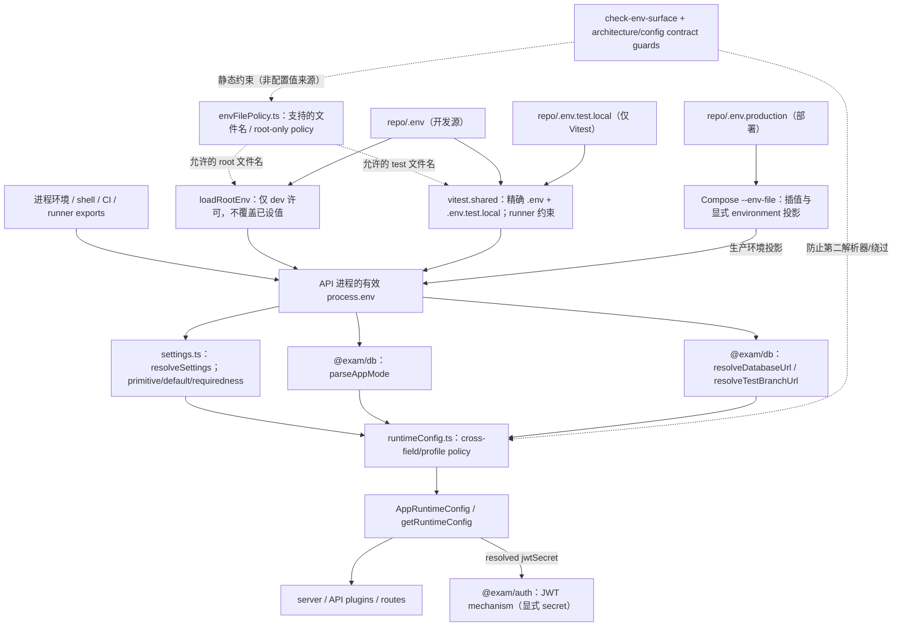
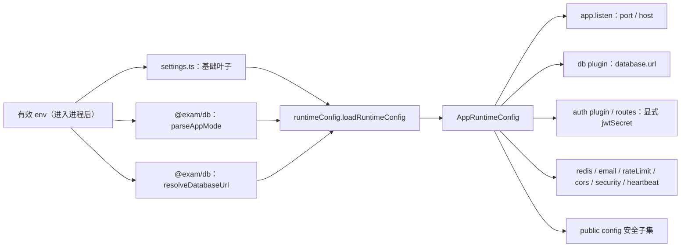
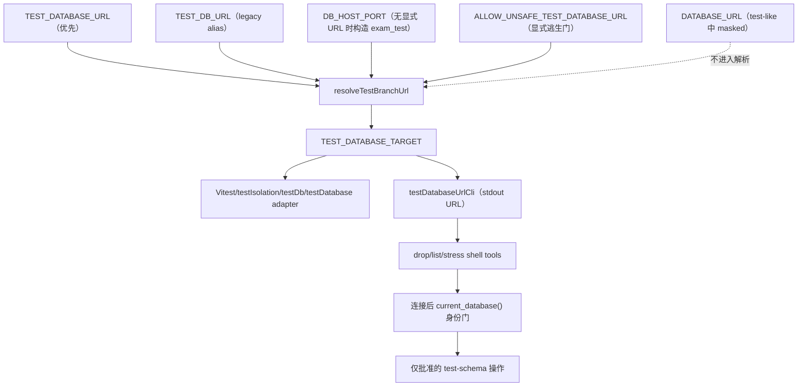
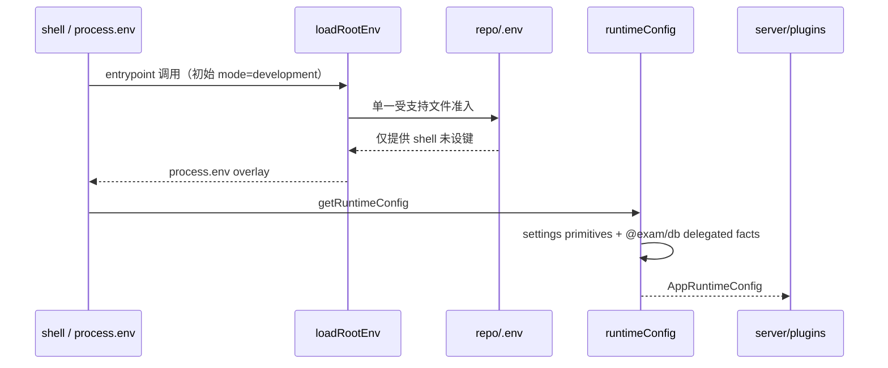

# Exam 配置权威：DAG、配置项、消费者与优先级

> **性质：架构导航与实现映射（descriptive architecture reference）**  
> **审计基线：** `dc0fcce62f48dcf98e7c71f2834b70e9caee19b5`（2026-10-08，#733 最终 closeout）  
> **审计结果：** `PASS_WITH_DEFERRED_DEBT`；最终审计摘要报告为 24 个语义事实，但 [#744 Artifact 1](https://github.com/jnhu76/exam/issues/744#issuecomment-6050737949) 的 registry 表逐行数实际为 **25 行**（`SEED_*` 与 evidence CLI escape hatch 分列）；本文件保留全部 25 行，不擅自合并为一个 fact。已审计事实未发现第二权威或生产 API 配置绕过。  
> **重要：** 本文**不是另一套 settings 默认值、解析算法或部署拓扑的规范根**。运行中的配置语义以表中指明的代码 authority 为准；测试/部署契约以现有权威文档及脚本为准。本文的表格是它们的**索引与 DAG 投影**。当代码发生变化，必须同步本文，而不是让本文成为第二 resolver。

## 目录

1. [核心问题与四种关系](#1-核心问题与四种关系)
2. [配置 authority DAG](#2-配置-authority-dag)
3. [物理来源、profile 与优先级](#3-物理来源profile-与优先级)
4. [权威归属总表（24 类事实）](#4-权威归属总表24-类事实)
5. [配置变量 → 解析者 → 消费者索引](#5-配置变量--解析者--消费者索引)
6. [真实执行路径与关键隔离](#6-真实执行路径与关键隔离)
7. [反例与可观察验证](#7-反例与可观察验证)
8. [门禁、保证范围与盲区](#8-门禁保证范围与盲区)
9. [新增或修改配置的维护流程](#9-新增或修改配置的维护流程)
10. [历史修复、未决事项与证据](#10-历史修复未决事项与证据)

## 1. 核心问题与四种关系

一个配置键的存在，不等于它的**值、含义、优先级和使用权**由同一模块拥有。必须分别回答：

| 问题 | 例子 | 答案所在 |
| --- | --- | --- |
| **Source**：值可以从哪里来？ | 继承的进程环境、仓库根 `.env`、测试 runner、Compose 插值 | `envFilePolicy.ts` + 相应 admission entrypoint |
| **Admission / overlay**：允许谁进入、谁覆盖谁？ | dev 允许根 `.env`，managed profile 不允许；shell 优先于 dotenv | `loadRootEnv.ts`、`vitest.shared.ts`、Vite/Compose 调用者 |
| **Semantic authority**：键如何解析成事实？ | `APP_MODE` 模式、`TEST_DATABASE_URL` 优先级、`JWT_SECRET` 默认/必填 | `settings.ts`、`runtimeConfig.ts`、`@exam/db` 等下文所列 owner |
| **Projection / consumer**：谁最终实际使用？ | `app.listen`、`createDatabase`、JWT 签发、Redis、Email worker | `AppRuntimeConfig`、独立 CLI 或 test harness |

**唯一性约束**：

> `ONE_CANONICAL_RESOLUTION_POLICY_PER_SEMANTIC_FACT`  
> 允许多个原始键、输入渠道、profile、consumer 和 projection；不允许同一语义事实由多个彼此独立的算法决定。**单个文件不是目标，单个语义权威才是目标。**

本文采用四种 DAG 边：
- **admission 边**：物理来源 → 允许进入的值集合；
- **resolution 边**：原始键 → canonical typed/semantic fact；
- **projection 边**：fact → consumer 所需的接口；
- **check 边**：contract/guard/test 对前面三种边进行验证，但不成为运行时权威。

特别注意：不同目的地（API runtime、Vitest worker、Web build、Compose container）有各自的 priority overlay；**不存在一条适用于所有目的地的全局 env 优先级链**。

## 2. 配置 authority DAG

### 2.1 总图：物理源 → 解析 → API consumer

这是**逻辑依赖图**，不是单个进程的同时执行流程：dev、test、production 的 admission 路径互斥或由不同 owner 启动；`resolveDatabaseUrl` 等也可独立供 CLI 使用。`settings.ts` **不解析**被明确 delegated 的 DB/mode 原始值。`runtimeConfig` 会先调用 DB 的 canonical resolver，再解析 settings，以保留 production error precedence。

### 2.2 API runtime 的唯一 facade

- [`apps/api/src/config/settings.ts`](../../apps/api/src/config/settings.ts)：**API application primitive-settings model**。每个 leaf 的名字、类型/解析器、默认值、production requiredness、secret 标记、binding class 由这里拥有；`resolveSettings` 的**唯一生产 runtime consumer** 是 `runtimeConfig.ts`。
- [`apps/api/src/config/runtimeConfig.ts`](../../apps/api/src/config/runtimeConfig.ts)：**API runtime policy facade**。决定跨字段约束、依赖默认值、profile mask、组合为 `AppRuntimeConfig`；`getRuntimeConfig` 缓存实际运行时配置。
- [`packages/db/src/databaseUrl.ts`](../../packages/db/src/databaseUrl.ts)：被显式委托的 `RUNTIME_MODE` / `DATABASE_TARGET` / `TEST_DATABASE_TARGET` 的 canonical owner。这样 `packages/db` 不必反向依赖 `apps/api`。
- [`packages/db/src/testIsolation.ts`](../../packages/db/src/testIsolation.ts)：`TEST_DB_ISOLATION_ENABLED` 的唯一 predicate。
- [`config/envFilePolicy.ts`](../../config/envFilePolicy.ts)：**文件名 policy data**，不是各个 env 值的解释器。

**不得据此要求 `apps/api/src` 的每个 `process.env` 字面出现都为零**：研究开关、脚本自有事实、测试拓扑和 npm build metadata 是不同目的地/事实；重点是不能绕过已建模的 API setting。

### 2.3 一条独立但 canonical 的 test-DB DAG

这里的 `current_database()` 是**实际连接身份的独立安全断言**，不是又一个 target resolver。drop 操作沿用 `exam_test` / `exam_test_w*` allowlist，不因为 canonical name-safety 允许 `test/e2e/ci` 就放宽 destructive permission。

## 3. 物理来源、profile 与优先级

### 3.1 root-only 文件集

| 仓库根文件 | 归属 / 被谁读取 | 不得被谁隐式读取 |
| --- | --- | --- |
| `.env` | bare dev API `loadRootEnv`；Web development Node/Vite config；Vitest 共享 loader；Drizzle CLI；development Compose | managed API（test/e2e/ci/production）；Web production build |
| `.env.test.local` | `vitest.shared.ts`，可选本地测试覆盖 | API runtime、Web Vite dev/prod、Drizzle、生产 Compose |
| `.env.production` | production `docker compose --env-file .env.production` 的**插值输入** | API dotenv loader、Vitest、Web production build 的 dotenv parser、Drizzle |
| `.env.example` | tracked 开发模板，不是运行时值来源 | 所有 runtime readers |
| `.env.production.example` | tracked 部署模板，不是运行时值来源 | 所有 runtime readers |

所有 non-root `.env*`（例如 `apps/api/.env`、`apps/web/.env.local`、`packages/db/.env.test`）以及 root 下未批准的 `.env.local`、`.env.test`、`.env.development*`、`.env.production.local` 等均**不属于 supported source**。`scripts/check-env-surface.mjs` 在 `verify:static` 中对现有文件 **FAIL LOUD**，包括 Git 忽略的残留；Vite/Vitest 全部采用 `envDir: false` 禁止库默认的 package-local 隐式 discovery。测试的物理 dotenv fixture 只能写在隔离临时目录，不能写仓库内的真实 authority 路径。

> Compose `--env-file` 是**插值入口**，不是容器自动加载文件的 `env_file:`。真正进入容器的是 Compose service `environment` 的显式投影。`.env.production` 位于 repo root，并不表示 API 生产进程会运行 dotenv。

### 3.2 priority / mask matrix（按目的地，而非按文件名合并）

| 目的地 / 语义事实 | 优先级（左胜右） | 被 mask、禁止或特殊情况 | Owner |
| --- | --- | --- | --- |
| bare dev API 的同名 env key | 已继承的进程值 > 根 `.env` | dotenv 默认不 override；仅 dev admission | `loadRootEnv` |
| Vitest 进程 env 播种 | 已设进程值 > `.env.test.local` > `.env` | 只填充 undefined；worker `test.env` 是不同投影 | `vitest.shared` |
| Vitest `test.env` 投影 | `TEST_RUNTIME_ENV` 对 `APP_MODE/NODE_ENV` 优先 > fileEnv | 不应把这条与进程播种链强行合成一条顺序 | `vitest.shared` |
| `RUNTIME_MODE` | `APP_MODE` > `NODE_ENV`（仅 production/test）> development | **显式无效 APP_MODE 必须报错** | `parseAppMode` |
| dev `API_BIND_PORT` | `DEV_API_PORT` > 3000 | `APP_PORT` 被 mask，**不是 fallback** | `resolveApiBindPort` |
| production `API_BIND_PORT` | `APP_PORT` > 3000 | `DEV_API_PORT` masked | `resolveApiBindPort` |
| test/e2e/ci `API_BIND_PORT` | `APP_PORT` > `DEV_API_PORT` > 3000 | 子进程应显式提供自有端口 | `resolveApiBindPort` |
| dev `DATABASE_TARGET` | `DATABASE_URL` > 构造 `exam` @ `DB_HOST_PORT`（默认 5432） | 不自动转为 test DB | `resolveDatabaseUrl` |
| production `DATABASE_TARGET` | 必需 `DATABASE_URL` | 缺失 fail-fast；不构造 localhost DB | `resolveDatabaseUrl` |
| test/e2e/ci `TEST_DATABASE_TARGET` | 非空 `TEST_DATABASE_URL` > 非空 `TEST_DB_URL` > 构造 `exam_test` @ `DB_HOST_PORT` | `DATABASE_URL` **永不入选**；名称 safety guard | `resolveTestBranchUrl` |
| `TEST_DB_ISOLATION_ENABLED` | `0` / `false` → disabled；其他值及 unset → enabled | `worker-database` opt-in/strategy 是**不同语义事实** | `isTestDbIsolationEnabled` |
| JWT secret | production 要求显式 `JWT_SECRET`；非 production 可使用 settings 中的开发默认 | `@exam/auth` 不得创建第二 secret fallback | `settings` + `runtimeConfig` |
| Web dev Vite Node config | 进程 env > repo `.env` > port defaults | 仅 development；不写入 `process.env` | `apps/web/vite.config.ts` |
| Web production build | 进程 env / 构建参数 | **不加载任何 env file**；`import.meta.env.VITE_*` 是构建期进程投影 | Vite/build owner |
| production Compose | shell 环境 > 显式 `--env-file .env.production` 插值结果 | dev `.env` 不参与 production invocation | Compose/deployment |
| `PUBLIC_WEB_ORIGIN` / `CORS_ORIGIN` | 显式设置 > 依据 `VITE_PORT` 的非 prod 默认 | production required；origin 与安全传输派生不可重解释 | `settings` + `runtimeConfig` |
| `REDIS_MODE` | 显式 off/optional/required；未设则根据 `REDIS_URL` 是否存在推导 | 非 off 模式需要 URL | `runtimeConfig.resolveRedisConfig` |

**关键边界**：当 `APP_MODE` **仅写在根 `.env` 内**且进程没有提前导出 mode，loader 的准入判断会先把进程视为 development，读取文件，后续 runtime resolver 再看到文件内的模式。这是 #733 审计承认的**当前法律**，不是 managed runner 的受支持启动方式；managed test/e2e/ci/production 必须由自己的启动 owner 提前注入 `APP_MODE`。

## 4. 权威归属总表（原始 registry 的 25 行）

本节逐行保留 [#744 Artifact 1](https://github.com/jnhu76/exam/issues/744#issuecomment-6050737949) 中的 **25 条 registry 记录**。该证据正文与 #733 closeout 摘要均标称“24”，但实际表格有 25 个数据行；计数差异是**证据的记录不一致**，这里显式披露，不能为了让统计漂亮而把本来不同的两个 owner 合并。**分组复合事实**只是审计分类，不暗示一个 env key 必然等于一个 fact。

| 语义事实 / 族 | 唯一权威（或明确 owner pair） | 主要实际消费者 |
| --- | --- | --- |
| 1. RUNTIME_MODE | `packages/db::parseAppMode` | runtimeConfig、loadRootEnv、backup-evidence、demo-seed、DB mode routing |
| 2. API_BIND_PORT | `runtimeConfig::resolveApiBindPort`（原始 port leaf 在 settings） | `server.ts app.listen` |
| 3. DATABASE_TARGET | `packages/db::resolveDatabaseUrl` | API DB plugin、migrate/rollback/admin CLI、Drizzle |
| 4. TEST_DATABASE_TARGET | `packages/db::resolveTestBranchUrl` | testDb/testIsolation、globalSetup、testDatabase adapter、shell CLI projection |
| 5. JWT_SIGNING_SECRET_POLICY | settings `JWT_SECRET` + runtimeConfig `authSecret` | auth plugin/route → `@exam/auth` 显式 secret |
| 6. TEST_DB_ISOLATION_ENABLED | `packages/db::isTestDbIsolationEnabled` | testDatabase adapter、testIsolation setup |
| 7. Worker-DB opt-in（不同事实） | `routes/testDatabase::isWorkerDatabaseMode` | testDatabase adapter |
| 8. Isolation strategy（不同事实） | `packages/db::testScope.resolveDbIsolationMode` | testDb / testDbBootstrap |
| 9. DEVELOPER_DOTENV_ADMISSION | `loadRootEnv`（`envFilePolicy` 限制文件名） | server、seed、e2e-seed entrypoints |
| 10. ROOT_ENV_FILE_POLICY | `envFilePolicy.ts`（`check-env-surface` 验证） | API/Vitest/Vite/Drizzle readers、deployment contract |
| 11. VITEST_TEST_ENV_ADMISSION | `config/vitest.shared.ts` | 显式强制 test mode 的 Vitest config（API 含两个 fixture child config、DB、Auth）→ test worker；其余 Vitest project 不消费它 |
| 12. WEB_DEV_ENV_ADMISSION | `apps/web/vite.config.ts` | Vite dev port / API proxy |
| 13. DEPLOYMENT_ENV_FILE | Compose 显式 `--env-file` | production containers 的 `environment` |
| 14. REDIS settings | `settings.redis` + `runtimeConfig.resolveRedisConfig` | Redis plugin、redisRuntime |
| 15. EMAIL settings | `settings.email/emailWorker` + runtimeConfig email policies | Email plugin / emailOutboxLoop / SMTP 或 fake sender |
| 16. RATE_LIMIT settings | `settings.app.RATE_LIMIT_*` + runtimeConfig | rateLimit plugin |
| 17. PUBLIC_WEB_ORIGIN | settings leaf + `runtimeConfig.resolvePublicWebOrigin` | identity links、grade notification、security transport |
| 18. CORS_ORIGIN | settings leaf + `runtimeConfig.resolveCorsOrigin` | cors/security plugins |
| 19. TRUSTED_PROXY_CIDRS | settings leaf + `runtimeConfig.parseTrustedProxyCidrs` | Fastify `trustProxy` / `request.ip` |
| 20. HEARTBEAT/DEADLINE | settings leaves + runtimeConfig | heartbeat、deadlineScanner |
| 21. LAUNCHPAD_SETUP_TOKEN | settings secret leaf + runtimeConfig projection | launchpad bootstrap route |
| 22. APP_TIMEZONE / HOST / DEPLOYMENT_MODE / NODE_ENV(AppEnv) / API_DOCS | settings app leaves + runtimeConfig | server、docs UI、timezone、tenant/public-config 投影 |
| 23. CAPACITY_RESEARCH | `lib/capacityResearch::isCapacityResearchEnabled`（N-01 P4 例外） | DB plugin instrumentation、capacityResearch route、route registration |
| 24. SEED_* values | API seed entrypoint 的 admission + DB seed mechanism 自有默认 | dev/E2E seed CLIs、seed orchestrator |
| 25. ALLOW_UNSAFE_EVIDENCE_TEST_DB | `apps/api/src/scripts/backup-evidence.ts` 的 script-owned fact | backup-evidence CLI 安全选择 |

第 24、25 行分别属于 seed mechanism 和 evidence CLI 的**不同配置事实**，不共享一个 resolver；原始资料的“24”计数与 25 行表格暂未在证据 issue 内统一。此外 `NODE_ENV` 的宽松 `AppEnv` 展示投影，与 authoritative `RUNTIME_MODE` 也是不同事实，不能误合并。

## 5. 配置变量 → 解析者 → 消费者索引

**如何读表**：同一行的原始 env key 在 `settings.ts` 有且仅有一个 primitive leaf（标注“委托”的除外），由 `runtimeConfig` 组合并投影到字段。最后一列写**使用领域/入口**，不是声称该环境变量在该使用点被直接读取。精确类型、默认值、必填/secret 标记以 [SETTINGS 对象](../../apps/api/src/config/settings.ts) 为唯一依据；这里不复制所有 numeric defaults，以免形成第二配置规范。

### 5.1 `SETTINGS.auth` 和 `SETTINGS.app`

| 原始键 | 解析/组合权威 → 投影 | 最终使用方 / 影响 |
| --- | --- | --- |
| `JWT_SECRET` | settings secret leaf → `authSecret.jwtSecret` | auth plugin 验签、auth route 签发（显式参数）；生产必填 |
| `APP_MODE` | **委托** `@exam/db::parseAppMode` → `app.mode` | runtimeConfig mode/profile、seed/backup safety、DB routing |
| `NODE_ENV` | settings 的 lenient AppEnv → `env`；mode fallback **另由 parseAppMode 拥有** | build/fallback 展示投影；不得用它取代 RUNTIME_MODE |
| `DEPLOYMENT_MODE` | settings（仅 `singleTenant`）→ `mode/tenancy` | 租户运行边界、public config；`multiTenant` 不可运行 |
| `HOST` | settings → `host` | `server.ts app.listen` |
| `APP_PORT` | settings TCP port leaf → `resolveApiBindPort` → `port` | `server.ts app.listen`，prod/test-like owner |
| `DEV_API_PORT` | settings TCP port leaf → `resolveApiBindPort` → `port` | development API bind / test-like backup fallback；Web Vite proxy **另有 tooling 读取** |
| `VITE_PORT` | settings string leaf → `defaultDevWebOrigin` | 非 prod CORS / PUBLIC_WEB_ORIGIN 派生；Web Vite 端口 **另有 build owner** |
| `API_DOCS_ENABLED` | settings truthy leaf → `apiReference.enabled` | Swagger/API reference UI、public config；production masked |
| `RATE_LIMIT_DISABLED` | settings truthy leaf → `rateLimit.enabled` | rateLimit plugin；production 不能靠 env 全局关闭 |
| `RATE_LIMIT_MAX` | settings posInt → `rateLimit.max` | rateLimit plugin |
| `RATE_LIMIT_WINDOW_MS` | settings posInt → `rateLimit.timeWindow` | rateLimit plugin |
| `TRUSTED_PROXY_CIDRS` | settings string → `parseTrustedProxyCidrs` → `trustedProxy.cidrs` | Fastify trustProxy、真实客户端 IP、安全/审计链 |
| `APP_TIMEZONE` | settings IANA timezone leaf → `timezone.timezone` | 展示、诊断、日志时区；不改变业务 instant |
| `HEARTBEAT_SCAN_INTERVAL_MS` | settings posInt → `heartbeat.scanIntervalMs` | heartbeat/scanner；也作 deadline 扫描间隔默认 |
| `HEARTBEAT_TIMEOUT_MS` | settings posInt → `heartbeat.timeoutMs/heartbeatTimeoutSeconds` | heartbeat 超时 / scanner；须能被 1000 整除 |
| `DEADLINE_SCAN_INTERVAL_MS` | settings optional posInt → `heartbeat.deadlineScanIntervalMs` | deadlineScanner；未设时依赖 heartbeat scan |
| `CORS_ORIGIN` | settings required-in-prod leaf → `resolveCorsOrigin` → `cors.origin` | cors/security plugins；非 prod 可依据 VITE_PORT 默认 |
| `PUBLIC_WEB_ORIGIN` | settings absolute-origin required-in-prod → `resolvePublicWebOrigin` → `publicWebOrigin.origin/isSecure` | identity/reset links、grade notification、cookie Secure/HSTS/UIR 传输策略 |
| `LAUNCHPAD_SETUP_TOKEN` | settings secret leaf → `launchpad.setupToken` | launchpad 初次管理员 bootstrap；未设为拒绝启动流程，不是 API boot failure |

### 5.2 `SETTINGS.database`（登记存在，但**值解析全部委托**）

| 原始键 | 权威 | 谁使用 / 重要 mask |
| --- | --- | --- |
| `DATABASE_URL` | `@exam/db::resolveDatabaseUrl` | API DB plugin、管理/迁移 CLIs；**test-like 被完全 mask** |
| `TEST_DATABASE_URL` | `@exam/db::resolveTestBranchUrl` | test infra、globalSetup、test-schema shell tools；test-like 首选 |
| `TEST_DB_URL` | 同一个 `resolveTestBranchUrl` | legacy alias，低于 TEST_DATABASE_URL |
| `ALLOW_UNSAFE_TEST_DATABASE_URL` | `resolveTestBranchUrl` name safety guard | 明确放宽 test DB **名称检查**，不是允许 shell 绕过 canonical resolver |
| `DB_HOST_PORT` | `@exam/db` 构造本地 dev/test DB URL | 仅在缺少更高优先级 explicit URL 时使用；对应 dev Compose published port |

### 5.3 `SETTINGS.redis`

| 原始键 | 权威与投影 | 谁使用 |
| --- | --- | --- |
| `REDIS_URL` | settings nullable string → runtimeConfig `redis.url` | Redis plugin/runtime；与 REDIS_MODE 有 cross-field 关系 |
| `REDIS_MODE` | settings enum + runtimeConfig `resolveRedisConfig` | Redis plugin/runtime；`off/optional/required`，未设时依赖 URL |
| `REDIS_KEY_PREFIX` | settings → `redis.keyPrefix` | Redis keys / namespace |
| `REDIS_CONNECT_TIMEOUT_MS` | settings → `redis.connectTimeoutMs` | Redis 连接 |
| `REDIS_COMMAND_TIMEOUT_MS` | settings → `redis.commandTimeoutMs` | Redis 请求超时 |
| `REDIS_STARTUP_TIMEOUT_MS` | settings → `redis.startupTimeoutMs` | Redis startup readiness |

### 5.4 `SETTINGS.email`（Email transport、SMTP、fake sender）

| 原始键 | 权威与投影 | 谁使用 |
| --- | --- | --- |
| `EMAIL_ENABLED` | settings → `email.enabled` | Email plugin、outbox 工作流 |
| `EMAIL_TRANSPORT` | settings enum + runtimeConfig `resolveEmailConfig` → `email.transport` | fake/smtp 实现；test-like 强制 smtp→fake |
| `EMAIL_FAKE_MODE` | settings → `email.fakeMode` | fake sender 的 success/failure 行为 |
| `EMAIL_FAKE_DELAY_MS` | settings → `email.fakeDelayMs` | fake sender 人为延迟 |
| `EMAIL_FAKE_SEND_ENTERED_FILE` | settings → `email.fakeSendEnteredFile` | fake sender 的测试/部署彩排 witness；非普通数据目录 |
| `EMAIL_FROM` | settings → `email.from` | outbound Email 发件人 |
| `EMAIL_FROM_NAME` | settings → `email.fromName` | outbound Email 发件人显示名 |
| `EMAIL_MAX_ATTEMPTS` | settings → `email.maxAttempts` | outbox 重试上限 |
| `EMAIL_RETRY_BASE_SECONDS` | settings → `email.retryBaseSeconds` | outbox backoff |
| `SMTP_HOST` | settings → `email.smtp.host`（smtp 时必需） | SMTP transporter / connection |
| `SMTP_PORT` | settings → `email.smtp.port` | SMTP connection |
| `SMTP_SECURE` | settings → `email.smtp.secure` | SMTP TLS mode |
| `SMTP_REQUIRE_TLS` | settings → `email.smtp.requireTls` | SMTP STARTTLS 约束 |
| `SMTP_TLS_REJECT_UNAUTHORIZED` | settings → `email.smtp.tlsRejectUnauthorized` | SMTP TLS certificate validation |
| `SMTP_TLS_SERVERNAME` | settings → `email.smtp.tlsServername` | SMTP TLS hostname |
| `SMTP_CONNECTION_TIMEOUT_MS` | settings → `email.smtp.connectionTimeoutMs` | SMTP 连接超时 |
| `SMTP_GREETING_TIMEOUT_MS` | settings → `email.smtp.greetingTimeoutMs` | SMTP greeting 超时 |
| `SMTP_SOCKET_TIMEOUT_MS` | settings → `email.smtp.socketTimeoutMs` | SMTP 活动空闲超时 |
| `SMTP_USER` | settings → `email.smtp.user` | SMTP auth |
| `SMTP_PASSWORD` | settings secret leaf → `email.smtp.password` | SMTP auth；不得回显凭据 |

**联动约束：** `EMAIL_TRANSPORT=smtp` 必须配置 `SMTP_HOST`；`EMAIL_WORKER_LOCK_TIMEOUT_MS` 要大于 SMTP connection/greeting/socket timeout 之和（**best-effort sanity**，不是 send 生命周期的严格上界，DNS 与 slow-active 发送不在此和式中）。test-like 会将 SMTP 发送改为 fake；请勿把这一点复制实现到 Email plugin。

### 5.5 `SETTINGS.emailWorker`

| 原始键 | 权威与投影 | 谁使用 |
| --- | --- | --- |
| `EMAIL_WORKER_POLL_INTERVAL_MS` | settings → `emailWorker.pollIntervalMs` | `emailOutboxLoop` 轮询 |
| `EMAIL_WORKER_BATCH_SIZE` | settings → `emailWorker.batchSize` | outbox batch claim |
| `EMAIL_WORKER_LOCK_TIMEOUT_MS` | settings + runtimeConfig lease guard → `emailWorker.lockTimeoutMs` | outbox processing lease / recovery |
| `EMAIL_WORKER_HEARTBEAT_STALE_MS` | settings → `emailWorker.heartbeatStaleThresholdMs` | worker 健康/失联判定 |
| `EMAIL_WORKER_SHUTDOWN_TIMEOUT_MS` | settings → `emailWorker.shutdownTimeoutMs` | worker 退出预算；与 Compose `stop_grace_period` 配套 |

`emailWorker.concurrency` **当前固定为 1，不是独立 env leaf**；不要擅自造出 `EMAIL_WORKER_CONCURRENCY` authority。

### 5.6 不属于 `settings.ts` 的合法事实与外部消费

| 原始键或键族 | 真正 owner | 具体消费者 / 不应误判原因 |
| --- | --- | --- |
| `VITE_API_BASE_URL` | Web build 进程 `import.meta.env` 投影 | `apps/web/src/lib/api.ts`、`clientEvents.ts`；客户端 API URL，非服务端 runtime setting |
| `VITE_APP_TIMEZONE` | Web build 进程 `import.meta.env` 投影 | `DateTimeContext.tsx`、`lib/dateTime.ts`；客户端展示 fallback |
| `import.meta.env.DEV` | Vite build | Web dev-only branches；不是 API `APP_MODE` |
| `TEST_DB_ISOLATION` | `isTestDbIsolationEnabled` + **不同的** worker opt-in/strategy owner | `testIsolation`、testDatabase adapter / worker routing；同一 raw key 可能参与不同事实，不能合并算法 |
| `TEST_DB_NAMESPACE`、`TEST_INFRA_TRACE` 等 | `packages/db` test harness | schema namespace、测试基础设施调试；生产应用 settings 外 |
| `SEED_ORG_NAME`、`SEED_ADMIN_*`、`SEED_CANDIDATE_*` | API seed entrypoint 的 admission + DB seed mechanism 自有默认 | dev/E2E seed chain；共享 DB package **不加载 dotenv** |
| `ALLOW_UNSAFE_EVIDENCE_TEST_DB` | `apps/api/src/scripts/backup-evidence.ts` | evidence CLI 的自有写入安全选择，**不同于** test-name escape hatch |
| `CAPACITY_RESEARCH` | `lib/capacityResearch.ts::isCapacityResearchEnabled` | DB instrumentation、capacityResearch route、route registration；单解析器但未登记为 `settings` leaf（N-01 / P4） |
| `npm_package_version` | npm package manager 注入 | system 版本展示/诊断（process metadata，不是部署配置） |
| `E2E_*`、`PLAYWRIGHT_*`、`QD_*`、`OPTICAL_*` | E2E/Playwright harness | base URL、shards、账号、图像测试等拓扑；与 API runtime 不同事实 |
| `COMPOSE_DISABLE_ENV_FILE` | Docker/Compose 调用 owner | managed E2E 阻断 Compose 默认文件插值 |
| `JAVA_HOME`、`TLA2TOOLS_JAR`、`FORMAL_WORKERS` | formal/tooling scripts | TLC runner 工具定位与并行度 |
| `MIGRATIONS_DIR_OVERRIDE` 等 migration-journal 开关 | DB tooling | 迁移检查脚本独立工具事实 |

请通过 [#744 原始 env 读取 census](https://github.com/jnhu76/exam/issues/744#issuecomment-6050738247) 查看 reader-by-reader 证据。`packages/auth/src` **没有任何 raw env 读取**；JWT crypto mechanism 必须接受显式 secret 依赖。

## 6. 真实执行路径与关键隔离

### 6.1 bare development

生产环境不是“相同路径但读另一份文件”，而是**另一种 admission owner**。

### 6.2 managed test/e2e/ci 与 production

- **Managed test/E2E/CI**：runner 自有 env（CI job `env:`）或 Vitest 的 `TEST_RUNTIME_ENV` worker 投影提前固定 mode，runner env 提供端口和 test DB target；API `loadRootEnv` 不加载开发者 `.env`。Vitest 自身可以按**测试 harness contract**读取根 `.env` + `.env.test.local`，但这不是 `loadRootEnv` 在 managed API 子进程读取文件。
- **Production**：部署命令通过 `--env-file .env.production` 供 Compose 插值，Compose 显式生成 container environment；容器 `APP_MODE=production` 阻断 API 的开发 dotenv admission；production DB 和 JWT/起源类必需项 fail-fast。
- **Web**：Vite 在 development 模式精确读取根 `.env` 来决定 `VITE_PORT` 和 `DEV_API_PORT` 代理目标；`envDir: false`，所以不存在 package-local `.env*` 的前端打包权限。客户端 `VITE_API_BASE_URL` / `VITE_APP_TIMEZONE` 通过**构建进程环境**进入 `import.meta.env`，而非前端绕过 `settings.ts` 读取服务器秘密。
- **Independent DB tools**：migrate、rollback、backup 等调用 `resolveDatabaseUrlFromEnv`；test-schema shell tools 调用 `testDatabaseUrlCli.ts`。CLI 的 env 输入是 process env，不自行运行 dotenv 或复制 TEST_DB_URL fallback。

### 6.3 两个经常误判的区别

**A. target safety 与 connected-target identity**：`resolveTestBranchUrl` 验证所**请求的** test target；destructive shell 还要检查 `current_database()` 来验证**实际连接身份**，两者都不可删除。

**B. 配置权威与业务语义权威**：本文件仅拥有 configuration authority 的导航。Exam/attempt/grading 的冻结、移交和有效状态遵循 [Exam semantic boundaries](exam-semantic-boundaries.md) 与相关 accepted ADR；不要把配置 DAG 当作考试业务状态机。

## 7. 反例与可观察验证

下面的 hostile pair 来自 [#733 最终审计](https://github.com/jnhu76/exam/issues/733#issuecomment-6050711932) 和 [#744 G_observed](https://github.com/jnhu76/exam/issues/744#issuecomment-6050741347)，用于验证**输家确实没有成为权威**：

| 证明族 | 冲突输入 | 胜者 / 实际观察 |
| --- | --- | --- |
| H1 mode | `APP_MODE=production`, `NODE_ENV=development` | production；`APP_MODE=prooduction` 则 fail-fast |
| H2 bind | development：`APP_PORT=46001`, `DEV_API_PORT=46002` | 46002；APP_PORT 完全 masked |
| H3 DB | `APP_MODE=test`, `DATABASE_URL=A` (decoy), `TEST_DATABASE_URL=B` | B；38 个真实 PG test 使用 test target，A 未触达；#730 早期 socket proof A=0、B=3 |
| H4 isolation | `TEST_DB_ISOLATION=yes` | canonical enabled；testDatabase adapter 也委托同一 predicate |
| H5 JWT | `APP_MODE=prooduction`, secret 缺失 | canonical mode 失败；`@exam/auth` 不会自行签出开发 secret |
| H6 managed file | runner-owned `APP_MODE=e2e` + developer `.env` sentinel | 不 admission 开发文件（隔离 fixture 实验） |
| H7 nested file | 隔离树创建 `apps/api/.env` | `check-env-surface` 返回非零并报告 violation |

反例的要求是**不同来源给不同值**，不能让相同值掩盖多个 resolver；优先检查实际 child bind、实际数据库连接、实际 shell argv 等 consumer 观察，而不只是 unit 函数 return value。

## 8. 门禁、保证范围与盲区

| 门禁 / 证明 | 主要防护 | 有界性：它不保证什么 |
| --- | --- | --- |
| `scripts/check-env-surface.mjs` / `pnpm lint:env-surface` | root-only 文件、合法根文件名、approved reader import、test writer 回归、`envDir:false` / Drizzle 路径等结构固定 | G3 对 `*.test.*` 有整体 reader 检查豁免；raw-fs 的所有动态路径不可被 grep 完备证明；`admitEnvFile(path)` 可接受任意 path 的 mechanism seam 尚无未来 caller whitelist |
| `scripts/check-architecture.mjs` | mode/raw-read、shared seed dotenv、auth 包环境 fallback 等历史 defect family | 有界的字符串/结构规则，不是任意代码的形式化验证 |
| `scripts/check-db-config.mjs` | DB 单源解析与 shell 已知 shadow fallback；R6 Guard 6 | 主要针对 audited shell family 和已知 defect shape，不是全程序别名分析 |
| `scripts/repository-contract/config-contract.mjs` | settings leaf 消费、部署 supply contract、配置一致性 | 合同一致性检查 ≠ 运行时 resolver |
| 永久回归 + hostile consumer probe | 观测 profile mask、端口所有权、DB target、JWT、file admission 等 | test PASS 本身不证明未被测试的所有未来调用图 |
| `pnpm verify:static` / `pnpm test` / `pnpm verify` | 仓库现行组合质量门 | 必须报告 exit/code、flake/skip，不可将 build green 等同于配置 authority 审计 |

**边界警示**：#743 曾有一个与 env 改动无关的 `@tiptap/` → `@tiptop/` typo；build 成功但 lazy bundle 拓扑改变。后来由 `074ef94c` 修复。它说明审查不能只核本次 config 命题；**整个 diff 的非预期变化**也必须独立检查。

## 9. 新增或修改配置的维护流程

1. **先命名 semantic fact 与目的地**：是 API runtime、test harness、Web build、seed mechanism，还是 deployment tooling？与现有事实相同，还是明确不同？
2. **指定唯一 owner**：普通 application primitive leaf 加入 `settings.ts`；cross-field/profile policy 放 `runtimeConfig.ts`；mode/DB 等 delegated fact 修改真正的 `@exam/db` owner；physical-source policy 修改 `envFilePolicy.ts`（必须有审议），而不是让 consumer 自己读一个新 `.env`。
3. **明确完整顺序**：写清 source admission、process vs file precedence、profile mask、unset/empty/invalid 区分、required/secret、fallback 和 fail-fast 顺序。不要只写“优先读取 X”。
4. **给出真实 consumer 路径**：新增键必须对应一个已有或同时实现的消费者；`settings` 不能长出未使用的 speculative leaves；下游优先使用 `AppRuntimeConfig`，机制库接收 explicit dependency。
5. **从两个方向检查 DAG**：source 正向到 consumer、consumer 反向到 canonical resolver 必须汇合；审查所有 `process.env`、`import.meta.env`、shell/CI/Compose 读写。
6. **测试冲突而不是一致值**：用 hostile A/B 输入证明落选输入不影响最终消费者；为被删除的 shadow resolver 保留 old-fail/new-pass regression（killability）。
7. **运行门禁并同步导航**：至少 `pnpm verify:static`、`pnpm test`、`pnpm verify`，如涉及 build 还检查 bundle/client exposure；更新本文件和适用的 [testing contract](../standards/testing.md)、[ports](../development/ports.md)、[deployment runbook](../deployment/mvp-deployment-runbook.md)；不得直接改写旧审计证据。

**三个 review 反模式**：

- **“共享常量 = 唯一权威”**：两个独立的 `if/else` 即使引用同一默认常量，仍是两个 resolution policies。
- **“任何人都可以用 `process.env.KEY`”**：当键已经归 `settings/runtimeConfig`，生产 consumer 的重新解析/默认属于 bypass。
- **“更少源 = 都放到 settings.ts”**：测试 DB isolation strategy、Web build VITE_*、Compose 插值、研究专用开关可能有不同 owner；强行集中会制造层依赖和语义混淆。

## 10. 历史修复、未决事项与证据

### 10.1 修复前后 DAG delta

| 修复 | 移除的错误边 / 第二权威 | 修复后的 owner / 证明 |
| --- | --- | --- |
| [R1 #734](https://github.com/jnhu76/exam/pull/734) | shutdown / process tests 用错误 dev profile，非自有端口和开发者 `.env` 可污染 | managed child profile + self-owned port + real server bind/identity/SIGTERM |
| [R2 #735](https://github.com/jnhu76/exam/pull/735) | testDatabase adapter 重写 `TEST_DB_ISOLATION` 语法 | 直接委托 `isTestDbIsolationEnabled` |
| [R3 #736](https://github.com/jnhu76/exam/pull/736) | `packages/auth` 自行推导 mode/JWT default | `settings/runtimeConfig` 投影 explicit secret，auth 仅 crypto |
| [R4 #738](https://github.com/jnhu76/exam/pull/738) | backup-evidence、demo-seed 自行解释 mode | `parseAppMode` |
| [R5 #740](https://github.com/jnhu76/exam/pull/740) | shared `packages/db/seed.ts` 无条件 dotenv admission | API entrypoint 拥有 admission；DB module 不再加载物理文件 |
| [R6 #742](https://github.com/jnhu76/exam/pull/742) | 三个 shell tools 从 `DATABASE_URL` 猜测 test URL | `resolveTestBranchUrl` → `testDatabaseUrlCli` |
| [#741/#743](https://github.com/jnhu76/exam/pull/743) | `apps/api/.env` 多候选、Vite/Vitest implicit package env families、真实路径 fixture 写入 | `envFilePolicy` root-only + exact-file admission + temp-only fixtures + structural guard |

### 10.2 不应伪装为已修复的债务

- **F-09**：Vite/E2E/Compose 默认端口的**跨事实一致性耦合**，不是同一 resolver 重复。
- **F-10**：worker opt-in 与 isolation strategy 的**不同语义事实**；不可为了“统一”混合 grammar。
- **F-11**：`REDIS_URL` ambient inheritance / CI rate-limit 相关观察仍 `NEEDS_MORE_EVIDENCE`。
- **F-12**：dev-profile 无 schema 时 `42P01` tolerance 仍 `NEEDS_MORE_EVIDENCE`。
- **N-01（P4）**：`CAPACITY_RESEARCH` 是 production-reachable、研究用途的单一 resolver，但未建模为 settings leaf；可根据未来产品化选择纳入 settings 或正式声明 research seam，**不是**已知重复 authority。
- **#741 结构 guard limits**：测试文件的 broad reader exemption、`admitEnvFile(path)` 机制被未来 production caller 误用的可能性仍是有界盲区。

### 10.3 永久证据与文档维护关系

- [#733 closeout report](https://github.com/jnhu76/exam/issues/733#issuecomment-6050711932)：R1–R6、root-only 合并后的最终裁决，`CLOSED / PASS_WITH_DEFERRED_DEBT`。
- [#744 audit artifacts](https://github.com/jnhu76/exam/issues/744)：七份完整证据（semantic-fact registry、raw env census、`G_static_post`、`G_reverse_post`、`G_observed_post`、priority matrix、settings matrix）。
- [#728 reverse audit](https://github.com/jnhu76/exam/issues/728)、[#729 forward audit](https://github.com/jnhu76/exam/issues/729)、[#730 observed audit](https://github.com/jnhu76/exam/issues/730)、[#732 adjudication](https://github.com/jnhu76/exam/issues/732)：历史证据，不可用于推翻修复后代码与 closeout。
- [#741 root-only audit](https://github.com/jnhu76/exam/issues/741)：物理 env source surface 与 fixture crash-residue 的审计史。
- [Testing & CI Contract](../standards/testing.md)、[Deployment runbook](../deployment/mvp-deployment-runbook.md)、[Config/ports guide](../development/ports.md)：各自仍为对应领域的契约；**本文只索引 DAG 和 consumer ownership，不取代它们**。

> **维护规则：** 每次改变配置的 source、profile mask、priority、canonical resolver 或 consumer 投影，都必须更新相应权威实现与测试，再审阅本文件 DAG、priority matrix 和“变量 → 消费者”索引是否仍属实；不能只改 prose 来制造一致性。
