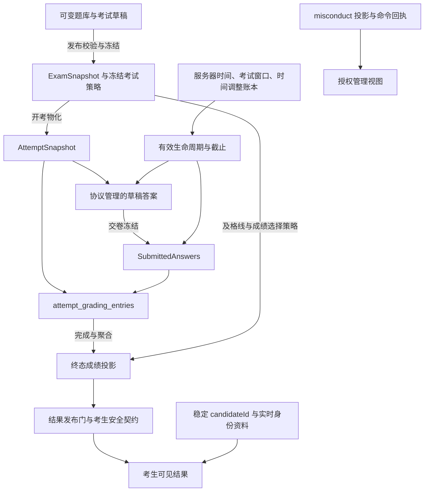

# Exam semantic boundaries

> **跨边界考试语义权威（规范正文）。** 本文由
> [ADR-021](../adr/ADR-021-exam-semantic-authority-adoption.md) 采纳，承载
> EXSEM-001..020 冻结条款：事实归属、权威转移与冻结点、合法 live 事实、考生
> 可观察边界、有效状态判定与受支持能力定义。具体机制（事务边界、锁序、恢复
> 序列、计时实现）继续由未被精确替代的 Accepted ADR、契约与生产代码负责；
> 本文不复制状态机、枚举、DB 约束或评分算法。

## 1. Scope and authority

本文回答以下跨边界问题，答案对整个仓库具有约束力：

```text
Who owns the fact?              每类事实的唯一权威与冻结/转移点（§2、§4）
When does authority transfer?   publish → start → submit → manual completion
When does it freeze?            快照与冻结策略在发布/开考/交卷时建立
What remains legitimately live? 日程窗口、时间调整账本、身份资料、misconduct
What is non-authoritative residue? 撤回发布后保留的旧快照等（EXSEM-004）
What may a Candidate observe?   仅考生安全输出契约允许的最小投影（EXSEM-017/018）
How is effective state determined? 存储事实 + 规范服务器时间 + 策略（EXSEM-013/014）
What counts as a supported capability? §5 的显式能力规则（EXSEM-019）
```

载体分工——同一语义只有一个权威载体：

| 载体 | 职责 |
| --- | --- |
| 本文（EXSEM 条款） | 跨边界事实归属、冻结/转移点、live 例外、考生边界、有效状态、能力定义 |
| [ADR-021](../adr/ADR-021-exam-semantic-authority-adoption.md) | 采纳与 supersession 理由、被精确替代的旧断言清单 |
| 机制 ADR（005/006/008/012/013/014…） | 单事务交卷、时间权威、恢复、锁与授权等具体决策；未被精确替代的条款继续有效 |
| [exam-runtime.md](exam-runtime.md) | 当前命令、状态机接线与协议细节；引用 EXSEM，不重定义跨边界事实 |
| [SPEC](../SPEC.md) / [contracts](../contracts/) / OpenAPI | 产品模型、对外格式、可执行接口；不擅自扩张能力 |
| 代码与测试 | 机制与符合性证据；不是重解释冻结语义的替代立法入口 |
| Issues #640 / #641、closure review、archive | 决策史与历史证据，不是常驻规范根 |

## 2. Authority and freeze graph



这是权威依赖图，不表示每个节点是独立事务。三条移交链：内容（题库 →
ExamSnapshot → AttemptSnapshot）、答案（draft answers → SubmittedAnswers）、
评分（entries → 终态投影 → enrollment 选分）。三个正交 live 权威：考试窗口
与个人时间调整账本、考生身份资料、misconduct 管理投影——它们不能反向改写
已冻结的题目、答案或成绩。首次交卷的答案冻结与评分工作集物化必须原子发生。

## 3. Normative rules（EXSEM-001..020）

| ID | Normative invariant |
| --- | --- |
| **EXSEM-001** | 内容、考试、attempt、身份和结果访问必须受服务器解析的机构归属、资源关系与当前能力授权约束；前端、JWT 展示角色及调用者提供的身份不能成为授权权威。 |
| **EXSEM-002** | Question 是可变作者数据。发布引用不赋予活题对已发布考试或已有 attempt 的运行时权威；快照中的题目 ID 是身份/来源标识，不是重新读取活题的指令。 |
| **EXSEM-003** | 成功发布原子建立经校验的考试内容快照与发布状态；内容和评分相关策略在该次发布有效期间冻结。模板只是作者期输入，日程仅经已支持的命令改变。 |
| **EXSEM-004** | 合法撤回发布恢复 draft 作者权威；保留的旧快照无执行权威。重新发布必须从当前作者输入重新验收和冻结，不能复用旧快照绕过缺题或内容校验。 |
| **EXSEM-005** | attempt 创建后，其题目、选项身份、评分依据及已物化呈现由 AttemptSnapshot 决定；恢复与重载重放同一呈现，不重新读题库或重新随机化。 |
| **EXSEM-006** | 自动题以 `standardAnswer` 与冻结规则判分；人工题以冻结 rubric 指导获授权的人工评分。题型决定自动/人工模式；`isCorrect` 和标准答案是否为空均不得另立分类权威。 |
| **EXSEM-007** | 草稿答案只能通过服务器版本、操作幂等与冲突检查协议接受；客户端时间不决定先后或胜者，未被服务器接受的本地输入不自动成为交卷答案。 |
| **EXSEM-008** | 首次交卷在同一受保护事务内冻结锁内已接受答案、推进提交状态并物化逐题评分工作集；重复交卷不得重建或替换已冻结事实。 |
| **EXSEM-009** | 评分工作集从 SubmittedAnswers 与 AttemptSnapshot 建立并成为持久评分事实；自动条目完成后不重写，人工条目只允许 pending → completed。当前没有终态重评能力。 |
| **EXSEM-010** | 终态成绩、通过与逐题结果只能从完整且一致的终态工作集聚合；同一终态化事务按冻结考试策略更新 enrollment 投影。投影不得反过来成为评分输入或自动历史修复源。 |
| **EXSEM-011** | 服务器时间是截止与时间转移的唯一权威；有效截止遵循现有规范内核的空值/组合规则。客户端倒计时、事件时间和扫描发现时刻不授予额外答题时间。 |
| **EXSEM-012** | attempt 个人 deadline 的初始化之后，时间变动只能经获授权的既有调整语义及账本；考试窗口保持独立权威。补时、准入、心跳与恢复不得自行另造计时真相。 |
| **EXSEM-013** | 持久化状态记录已提交的业务事实，时间触发的状态可以延迟物化；有效状态必须结合这些事实与规范服务器时间，不能把所有 status 当作可任意重算的缓存。 |
| **EXSEM-014** | 状态/截止敏感的变更必须在既有事务与并发协议内先对账或检查规范有效状态，再作合法性决定；扫描器只是发现和收敛机制，所有物化通过现有领域命令完成。 |
| **EXSEM-015** | `(organizationId, candidateId)` 确定 attempt 的稳定历史归属；普通展示和报表读取当前身份资料与字段定义，不承诺考试当时身份的可重现性。 |
| **EXSEM-016** | misconduct 是独立、获授权、可在提交后更新的管理投影，命令回执记录已提交操作事实；其变化不自动重评、不自动作废 attempt，也不向考生开放管理 notes/actor。 |
| **EXSEM-017** | 所有考生响应使用考生安全输出契约和最小投影；标准答案、rubric、原始 gradingRule 及管理秘密字段不可作为服务器数据经这些契约输出。 |
| **EXSEM-018** | 评分事实与可见性分离：先满足既有结果就绪语义，再经考试发布门，才输出考生结果；列表、加载、结果及已知补考决策表面必须使用同一可见性权威，不得绕门泄露结果。 |
| **EXSEM-019** | 存储/Schema 可表示、读侧能处理、存在辅助计算代码都不等于受支持产品能力；保留值不得产生未经明确采纳的生产写入、执行效果或安全保证。 |
| **EXSEM-020** | 向正常产品路径提供"有效数据"的 demo seed/fixture 必须满足同一冻结与评分完整性；历史兼容和损坏数据修复只能走明确、有限的既有协议，不得成为新写入的第二套语义。 |

## 4. Authority by stage

| 阶段 | 内容权威 | 说明 |
| --- | --- | --- |
| draft（未发布或撤回后） | 当前 `questionIds` + 活 Question 作者内容 | 引用可暂时失效，但不能带着缺题成功发布；撤回残留的旧快照是非权威残留，不补齐已删除活题 |
| published（未实际开考） | 当前发布的 ExamSnapshot + 冻结考试策略 | 新 attempt 一律从该快照生成，不重新读题库 |
| active attempt | 该 attempt 的 AttemptSnapshot + 规范允许的实时窗口/个人时间调整 | 题库编辑/删除、模板变更不反向传播 |
| submitted | SubmittedAnswers（冻结一次） | draft answers 从此永不为评分真相 |
| graded attempt | AttemptSnapshot + SubmittedAnswers + 完成 entries + 终态投影 | 姓名等展示资料仍可 live；不改变历史分数 |

裁决常量（D1–D7 的冻结形式）：

```text
QUESTION_AFTER_PUBLISH_MUTABILITY = ALLOWED_IN_AUTHORING_SCOPE
SNAPSHOT_EXECUTION_AUTHORITY = PUBLISHED_EXAM_SNAPSHOT_THEN_IMMUTABLE_ATTEMPT_SNAPSHOT
QUESTION_REFERENCE_MEANING = DRAFT_SELECTION_REFERENCE_OR_SNAPSHOT_PROVENANCE_ID; NOT_A_RUNTIME_LIVE_LINK
UNPUBLISH_SNAPSHOT_POLICY = RETAIN_AS_NON_AUTHORITATIVE_RESIDUE
CANDIDATE_SECRET_BOUNDARY = SECRET_FIELDS_UNREPRESENTABLE_IN_CANDIDATE_OUTPUT_CONTRACTS
CONTRACT_VS_MAPPER_RULE = SAFE_CONTRACT_AND_MINIMAL_PROJECTION; MAPPER_OMISSION_ALONE_IS_INSUFFICIENT
GRADING_RULE_VISIBILITY = HIDDEN_ON_ALL_CURRENT_CANDIDATE_QUESTION_SURFACES
CANDIDATE_IDENTITY_AUTHORITY = STABLE_ORGANIZATION_SCOPED_CANDIDATE_ID
REPORTING_IDENTITY_POLICY = LIVE_PROFILE_AND_LIVE_FIELD_DEFINITIONS_AT_READ_OR_EXPORT_TIME
AUDIT_GRADE_IDENTITY_POLICY = NOT_CURRENTLY_SUPPORTED
STORED_STATUS_SEMANTICS = DURABLE_BUSINESS_STATE_WITH_LAZY_TIME_TRANSITION_MATERIALIZATION
EFFECTIVE_STATE_AUTHORITY = STORED_FACTS_PLUS_CANONICAL_SERVER_TIME_AND_POLICY
RECONCILIATION_RULE = RECONCILE_OR_EVALUATE_CANONICAL_EFFECTIVE_STATE_BEFORE_STATE_DEPENDENT_MUTATION_UNDER_ITS_EXISTING_SERIALIZATION_PROTOCOL
SCANNER_ROLE = DISCOVERY_AND_CONVERGENCE; NOT_TRUTH_AUTHORITY
REPRESENTABILITY_VS_SUPPORT_RULE = REPRESENTABLE_DOES_NOT_IMPLY_SUPPORTED
RESERVED_VOCABULARY_POLICY = READ_COMPATIBILITY_ALLOWED; NO_IMPLICIT_WRITER_OR_ACTIVATION
QUESTION_CORRECTNESS_AUTHORITY = AUTO_QUESTIONS_USE_STANDARD_ANSWER_AND_FROZEN_GRADING_RULE; MANUAL_QUESTIONS_USE_FROZEN_RUBRIC_AND_COMPLETED_MANUAL_ENTRY
OPTIONS_IS_CORRECT_ROLE = NON_AUTHORITATIVE_LEGACY_AUTHORING_METADATA; NO_EXECUTION_OR_GRADING_AUTHORITY
```

评分与有效截止的裁定：

```text
GRADING_WORKSET_AUTHORITY = ATTEMPT_SNAPSHOT_PLUS_SUBMITTED_ANSWERS_TO_DURABLE_PER_QUESTION_ENTRIES
TERMINAL_SCORE_PROJECTION_ROLE = VALIDATED_DERIVED_OUTPUT; NEVER_SCORING_INPUT
REGRADING_CURRENTLY_SUPPORTED = NO
```

`passed` 与 enrollment 最终选分还依赖发布后冻结的考试及格线/成绩策略（发布
冻结的一部分，不在 AttemptSnapshot 内重复）。有效截止的定义域：

| `exam.closeAt` | `attempt.deadlineAt` | 有效截止 |
| --- | --- | --- |
| 有 | 有 | 两者最早者 |
| 有 | 无 | 考试关闭边界 |
| 无 | 无 | 无截止；不因时间自动过期 |
| 无 | 有 | 当前非法混合形状；fail closed |

存在截止时 `now >= effectiveDeadline` 即过期；deadline 提交沿用有效截止作为
提交时间。审计级历史身份制品是独立的未来能力，当前普通报表不承诺重现考试
当时的姓名或字段定义。

## 5. Supported capability boundary

可表示（schema/枚举有值）≠ 可读取（读侧不崩溃）≠ 可达（存在代码路径）≠
受支持（产品能力）。受支持语义的判定标准：

```text
SUPPORTED_SEMANTIC_TEST =
  已采纳的当前契约
  + 可达且受守卫的授权生产路径
  + 必需的守卫、效果与回归证据
```

当前保留（读兼容允许、无生产 writer、不得静默激活）的词表示例：

- attempt 状态 `not_started` / `queued` / `voided`（无 `voidAttempt` writer）；
- enrollment 状态 `blocked`（无 writer）；
- 考试 `timed_sync`（发布门拒绝）、`random` 选题（发布门要求 manual）；
- `answerVisibility = visible`（当前所有考生表面恒 hidden，无 writer 翻转）；
- 存储但惰性的 control flags（监控、复制/IP 限制、lockdown 等）；
- 终态重评/改分（普通 API 不支持）。

保留值的存在不构成产品承诺；激活任一保留能力需要一次显式的 superseding
architecture decision（§6）。能力清单的权威在
[contracts](../contracts/)、生成 OpenAPI 与 [exam-runtime.md](exam-runtime.md)，
本文不复制全量枚举。

## 6. Change and conformance

反漂移规则：

- 代码不能静默重定义冻结语义——实现行为变化不自动修改或重解释 EXSEM 条款；
- 测试不能发明语义——新增测试、fixture 或期望值不自行创造语义；
- 注释是非权威的——只解释原因与边界，不是独立规范来源；
- schema/枚举可表示性不创造能力（EXSEM-019）；
- 保留值不自动激活——不得因既存配置值激活此前无运行效果的能力；
- 实现、测试、文档或已采纳决策对同一事实不一致时，先记录 as-built 证据及
  受影响条款，判定是修复违规还是变更语义；不得以"代码现在如此""测试已通
  过""旧文档这样写"为由消除冲突。

改变已冻结语义必须通过一个显式 superseding architecture decision，其必须：

1. 点名受影响的 EXSEM/既有决策条款；
2. 定义替换语义；
3. 说明接口、旧数据、运维兼容与迁移影响（无影响也应说明）；
4. 明确旧条款被替代的精确范围；
5. 保持未点名条款继续有效。

纯实现、性能、存储机制或 UI 调整，只要不改变这些含义，不需要新的语义决
策；发现代码违反冻结语义时，依当前任务授权直接修复并补充分层验证，不以
新增 ADR 把缺陷合法化。命令入口、锁序与回归证据见
[exam-runtime.md](exam-runtime.md) 与相应机制 ADR。
