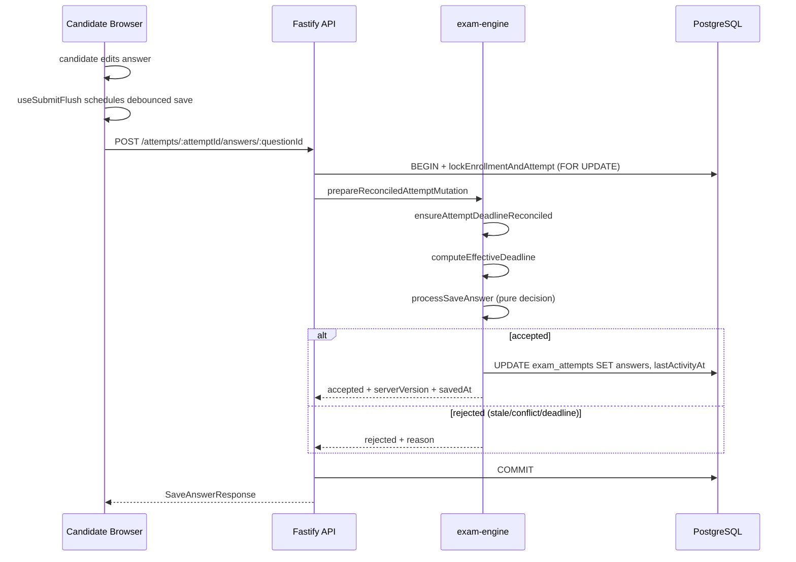
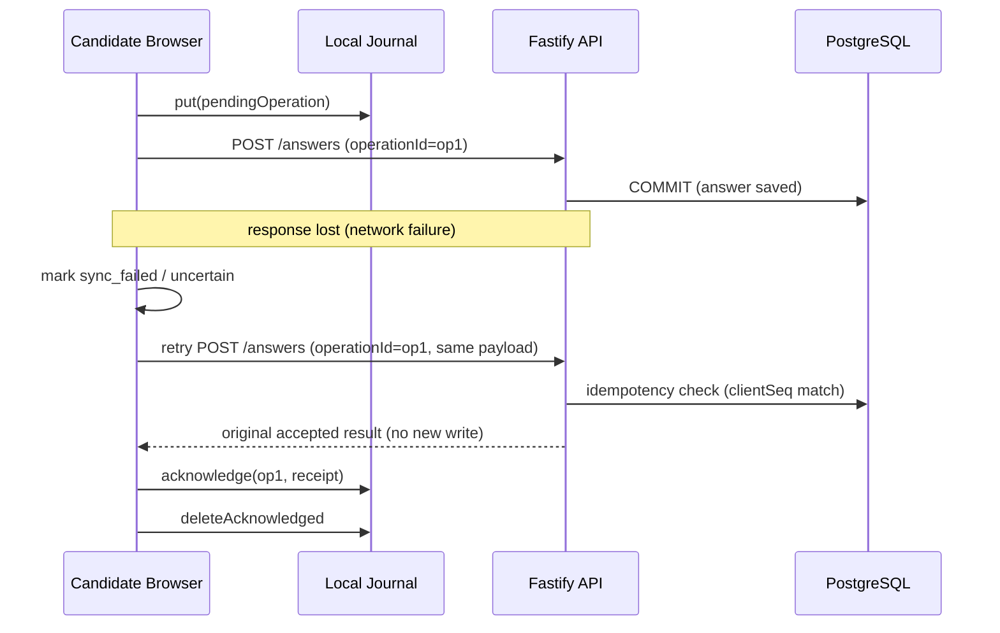
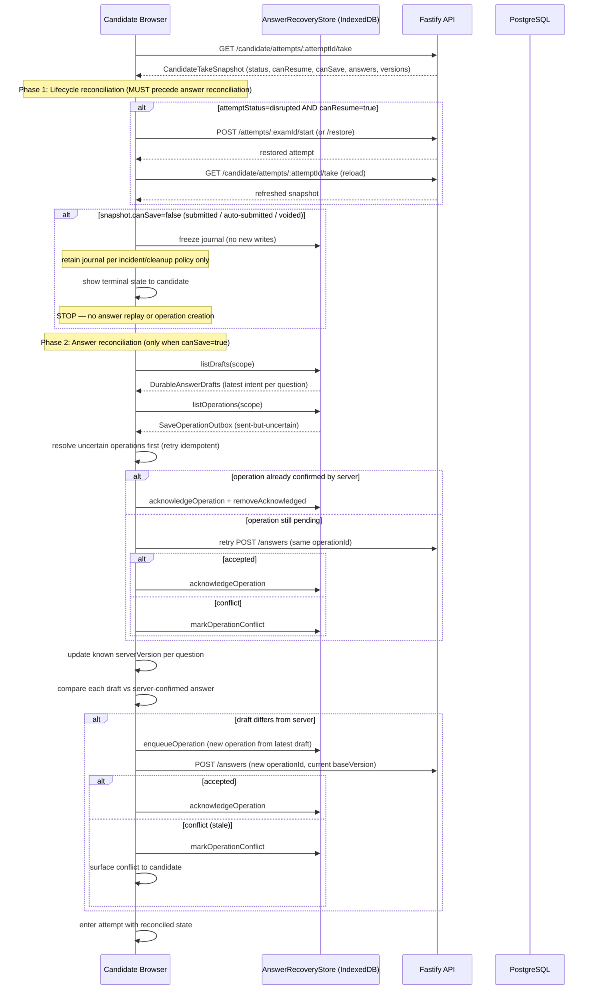
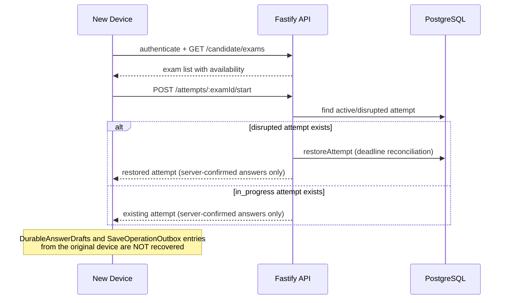
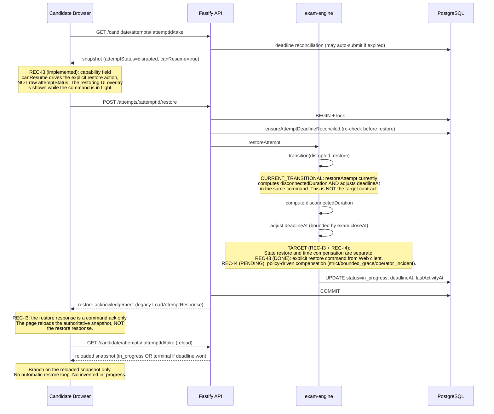
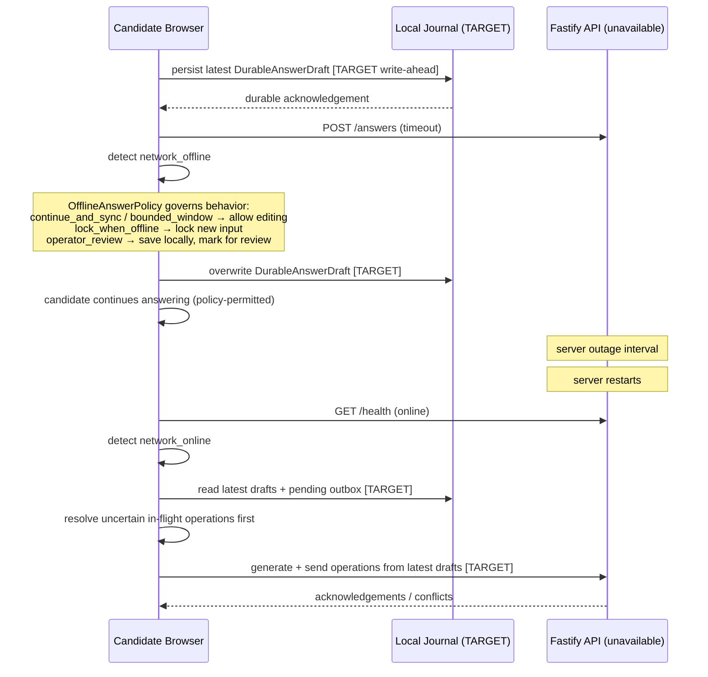
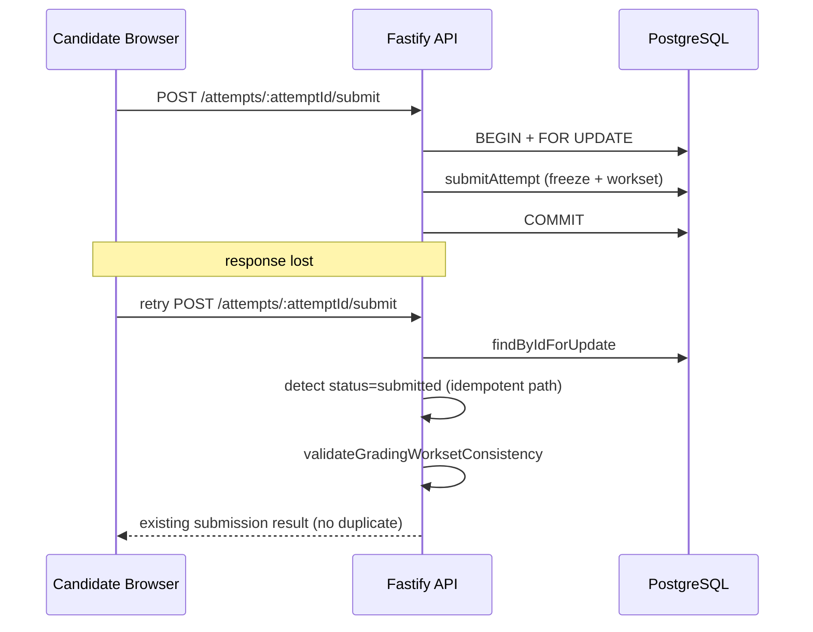

# Candidate Recovery Architecture

Authority: ADR-012. This document provides sequence diagrams, state tables,
and decision matrices for the candidate exam recovery contract.

---

## Sequence Diagrams

### Normal Answer Save (CURRENT)



### Response Lost After Server Commit (TARGET)



### Browser Restart Recovery (TARGET)



### Device Replacement



### Disrupted-Attempt Restore (CURRENT + TARGET)



### Disrupted-Attempt Restore — Web Client Implementation Status (REC-I3)

The Web recovery flow frozen by ADR-012 §Recovery Semantics is implemented in
`apps/web/src/exam/useAttemptRestore.ts` and wired into
`apps/web/src/pages/exam/TakeExamPage.tsx`. Behavior summary:

```text
GET /candidate/attempts/:attemptId/take (authoritative snapshot)
  ↓
IF snapshot.canResume == true:
  → render restoring UI overlay
  → POST /api/attempts/:attemptId/restore EXACTLY ONCE
  → reload GET /candidate/attempts/:attemptId/take
  → branch on the reloaded snapshot
ELSE:
  → initialize normally from the snapshot (existing flow)
```

Properties preserved by the implementation:

- `CandidateTakeSnapshot` remains the page business truth source. The restore
  POST response is treated only as a command acknowledgement.
- `snapshot.canResume` — NOT raw `attemptStatus === "disrupted"` — governs
  whether restore is attempted.
- Restore fires at most once concurrently per mounted attempt. Guards
  (per `useAttemptRestore`):
  - **`restoreInFlightRef` keyed by `attemptId`** (NOT a boolean): stores the
    identity of the attempt that currently owns the in-flight POST/GET chain.
    A route change to a NEW attempt while an OLD attempt's POST is still
    pending is NOT a duplicate, so the new attempt's restore proceeds and
    claims the slot; the old attempt's stale resolution only clears the slot
    when it is STILL the owner.
  - **`restoredForAttemptRef`** — per-attempt identity guard, committed INSIDE
    `performRestore` after the in-flight guard passes (not pre-marked in the
    auto-restore effect), so an effect whose `performRestore` was rejected by
    the guard can still restore once the owner changes.
  - **`generationRef` + `currentAttemptIdRef`** — monotonic generation token
    and latest-bound `attemptId`. Both are captured at the start of each async
    restore chain and re-checked after every await; a stale POST/GET from a
    previous route cannot apply its snapshot or mutate UI state. The
    generation is bumped ONLY on a real `attemptId` change (render-time
    prev-value check), never on StrictMode re-mount of the same attempt.
  This replaces the earlier shared-boolean `cancelledRef` cleanup flag, which
  a new effect setup could reset before a stale async chain resumed. Verified
  by component tests against React Strict Mode effect replay, snapshot
  re-renders, and cross-attempt races (resumable→resumable, old GET late
  success/failure).
- The same generation discipline guards the PAGE's own `loadSnapshot`
  (`loadGenerationRef` + `currentAttemptIdRef`): a late GET from a previous
  route cannot overwrite the new route's snapshot or write `loadError` onto an
  already-loaded page.
- On a real route change ALL attempt-scoped page state is reset (snapshot,
  loadError, isLoading, currentIndex, answers, save/submit/transient/flush
  states, and the submit/deadline refs), so nothing from the previous attempt
  can leak onto the new route — in particular, a retained `currentIndex` out
  of range for the new exam cannot pin the page to the generic ErrorState.
- **The answer-save queue is isolated per attempt.** Because `TakeExamPage`
  reuses one instance across `:attemptId` route changes, `useSubmitFlush`
  receives the route `attemptId` as a `scopeKey` and gives each scope its OWN
  pending/inflight/status/generation maps (keyed by `questionId`). On a scope
  change (`useLayoutEffect`, before paint): the old scope's pending debounce
  timers are cancelled; the old scope object is retained so its
  already-inflight saves settle without writing status; a brand-new scope
  with empty maps is installed. Two scopes sharing a `questionId` do NOT
  share a queue — the new scope's save never serializes behind the old
  scope's inflight save. `flush()` binds its scope at call time and never
  drains/awaits/count another scope's work. The page's `saveAnswer` closure
  is stale-guarded on a scope-generation token (captured at schedule time,
  re-checked before any read of page authority, after the `await`, and at
  the top of `catch`) so an in-flight old-attempt save cannot mutate the new
  page's state/refs. `loadGenerationRef` is bumped on EVERY `loadSnapshot`
  call (not just route change) so two concurrent loads of the same attempt
  cannot reorder (latest-GET-wins).
- User-triggered retry after a genuine failure is supported via a dedicated
  "重试恢复" control (a fresh POST is allowed).
- Deadline race: if the deadline wins between GET and POST restore, the
  reloaded snapshot is terminal/non-resumable; the page renders the terminal
  state and does NOT auto-loop restore.
- Snapshot reload failure after a successful restore is treated as an
  uncertain state; the page surfaces a reload/retry path rather than
  inventing `in_progress` from the restore response.
- Restore failure is NOT represented as a save failure and does NOT display
  generic "时间到" / "正在自动交卷" copy merely because the disrupted
  snapshot has `isEditable=false`.

Telemetry: `restore_started` / `restore_succeeded` / `restore_failed` are
emitted via the existing `trackExamEvent` helper, scoped to attemptId/examId
with `durationMs` and `errorCode` only. No answer content is recorded.

Deferred: REC-I4 (time-compensation policy) is NOT modified by REC-I3. The
current `restoreAttempt` engine may still grant full disconnected-time
compensation; the Web client deliberately uses neutral copy
("服务器正在确认考试状态和剩余时间") and does not duplicate time logic.


### Server Outage



### Submission Response Loss (CURRENT)



---

## State / Authority Table

| State | Authority | Storage | Recoverable after crash |
|---|---|---|---|
| Server-confirmed answer | PostgreSQL | `exam_attempts.answers` | Yes |
| Submitted answer snapshot | PostgreSQL | `exam_attempts.submitted_answers` | Yes |
| Attempt lifecycle status | PostgreSQL | `exam_attempts.status` | Yes |
| Effective deadline | PostgreSQL | `min(exam.closeAt, attempt.deadlineAt)` | Yes |
| Grading workset | PostgreSQL | `attempt_grading_entries` | Yes |
| Final result | PostgreSQL | `exam_enrollments.finalScore/finalPassed` | Yes |
| Durable local draft (TARGET) | Client recovery intent | IndexedDB / SQLite | Same device only |
| Save operation outbox (TARGET) | Pending transport intent | IndexedDB / SQLite | Same device only |
| In-memory edit (CURRENT) | Browser memory | React refs | No |
| Client telemetry buffer | Browser memory | in-memory queue | No |

---

## Failure Decision Matrix

| Failure class | Server-confirmed answers | Pending local ops (TARGET) | Time compensation | Recovery path |
|---|---|---|---|---|
| A. Network interruption | Safe (server holds) | Journal holds; replay on reconnect | Policy-dependent (not auto-full); client-claimed duration NOT fully trusted | Replay pending → reconcile |
| B. Client process interruption | Safe | Same device: journal survives; different: lost | Policy-dependent | Reload snapshot → replay journal |
| C. Device loss/replacement | Safe | Lost (original device only) | None automatic | Server-confirmed state only |
| D. Server-side outage | Safe (if committed before outage) | Journal holds; replay after recovery | Operator incident / system-wide; server-observable interval | Replay pending → reconcile |
| E. Concurrent client activity | Version protocol protects | Conflict surfaced to stale client | N/A | Stale client receives STALE_VERSION |
| F. Client persistence failure | Safe (server holds) | Lost or corrupted; degrade to server-only | N/A | Server-confirmed state; warn candidate |

---

## Web vs Future Desktop Adapter Boundary

| Concern | Web adapter | Future desktop adapter |
|---|---|---|
| Journal storage | IndexedDB | SQLite |
| Session identity | HTTP-only cookie + JWT | Desktop installation/session |
| Process lifecycle | Browser tab/process | Desktop process |
| Credential handling | httpOnly cookie | OS credential store |
| Single-writer lock | Web Locks API / BroadcastChannel | Desktop single-instance lock |
| Save protocol | Same (operationId, baseVersion, serverVersion) | Same |
| Restore command | Same (POST /restore) | Same |
| Submission semantics | Same (idempotent) | Same |
| Telemetry vocabulary | Same event names | Same event names |
| Incident model | Same | Same |

---

## Data Retention Table

| Data | Retention trigger | Action |
|---|---|---|
| Pending journal entries | Authoritative submission | Clear attempt journal (physical delete after reconciliation) |
| Pending journal entries | Attempt void/freeze | Remove answer payload; retain operation count + sync state + event IDs for appeal |
| Pending journal entries | Secure logout | Detach from active session; do NOT physically delete unresolved entries |
| Pending journal entries | User B logs in on same device | User B can NEVER query or discover User A's journal |
| Pending journal entries | User A re-logs in on same device | User A MAY rediscover their unresolved journal entries |
| Pending journal entries | Retention expiry | Physical delete (time-based cleanup, policy-configured) |
| Pending journal entries | Exam/attempt deletion signal | Physical delete |
| Pending journal entries | Explicit user abandonment | Physical delete (user-initiated, confirmed) |
| Server-confirmed answers | Permanent | PostgreSQL retention policy |
| Submitted answer snapshot | Permanent | PostgreSQL retention policy |
| Telemetry events | Configurable | No answer content; ids + counts only |

### Logout and user-change semantics (frozen)

```text
Logout:
  Journal entries are NOT physically deleted.
  They are detached from the active session identity.

User B login (same device):
  User B can NEVER read, query, or recover User A's journal.
  Isolation is enforced by scope key: organizationId + userId + attemptId.

User A re-login (same device):
  User A MAY rediscover unresolved journal entries for active attempts.

Physical deletion occurs ONLY on:
  - authoritative submission (after reconciliation)
  - retention expiry (time-based, policy-configured)
  - explicit user abandonment (confirmed)
  - exam/attempt deletion signal
  - lawful deletion request

"Clear" in this document means "make inaccessible to the current user
session", NOT "physically delete", unless the trigger explicitly states
physical deletion.
```
