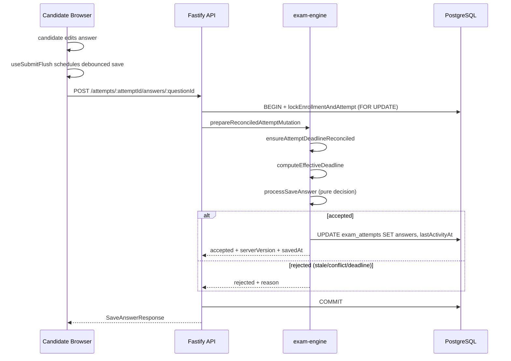
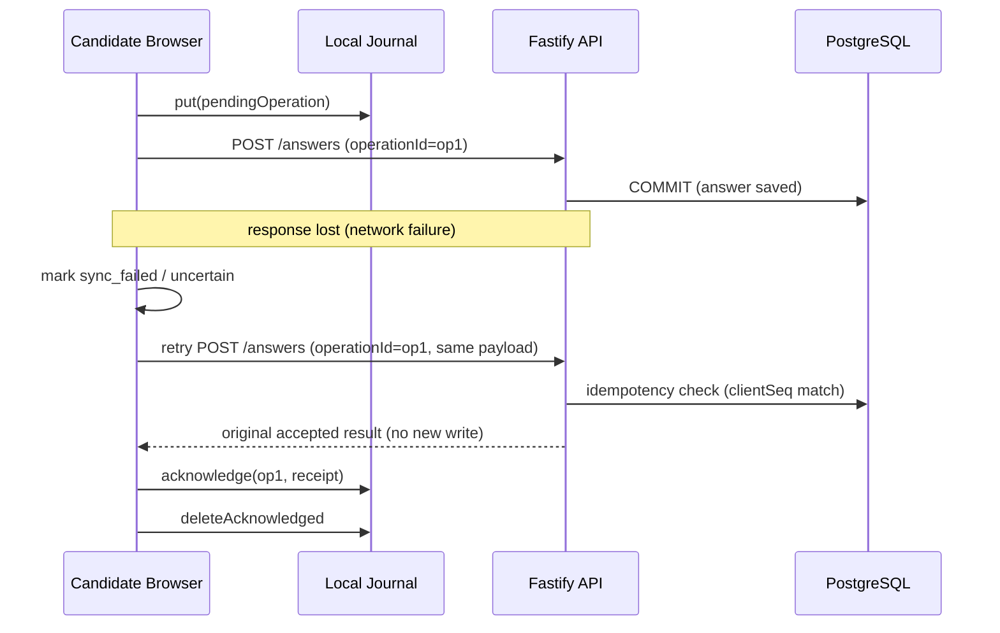
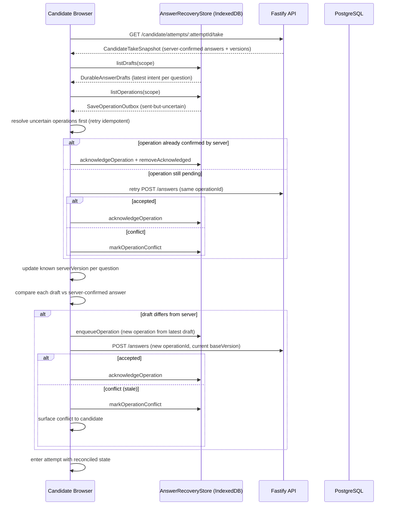
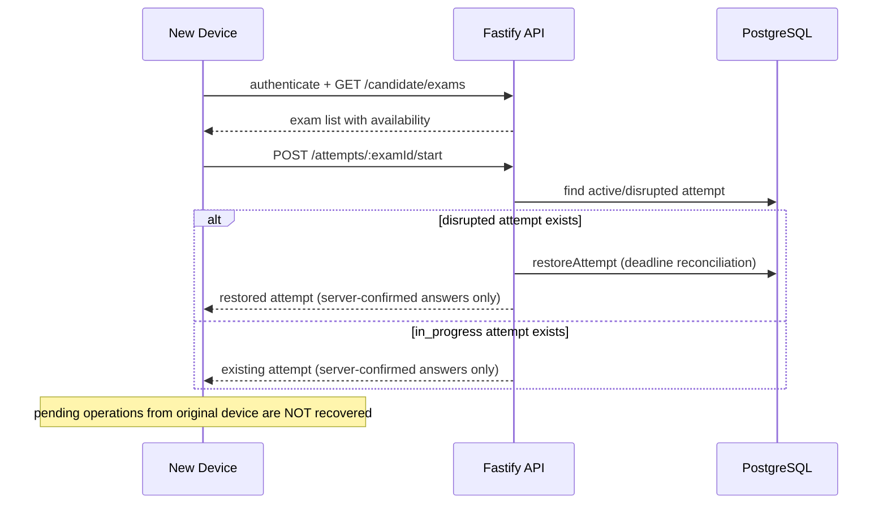
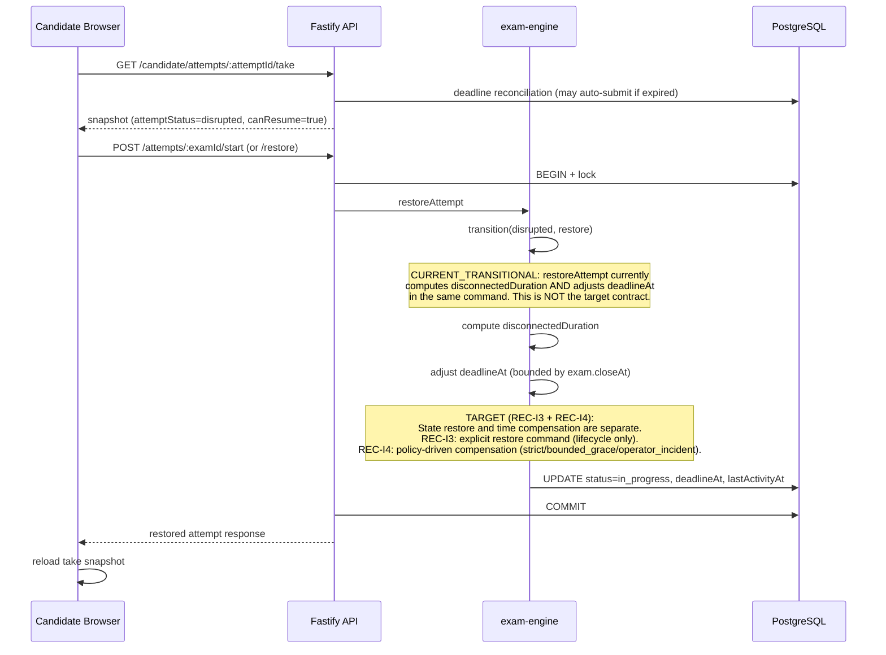
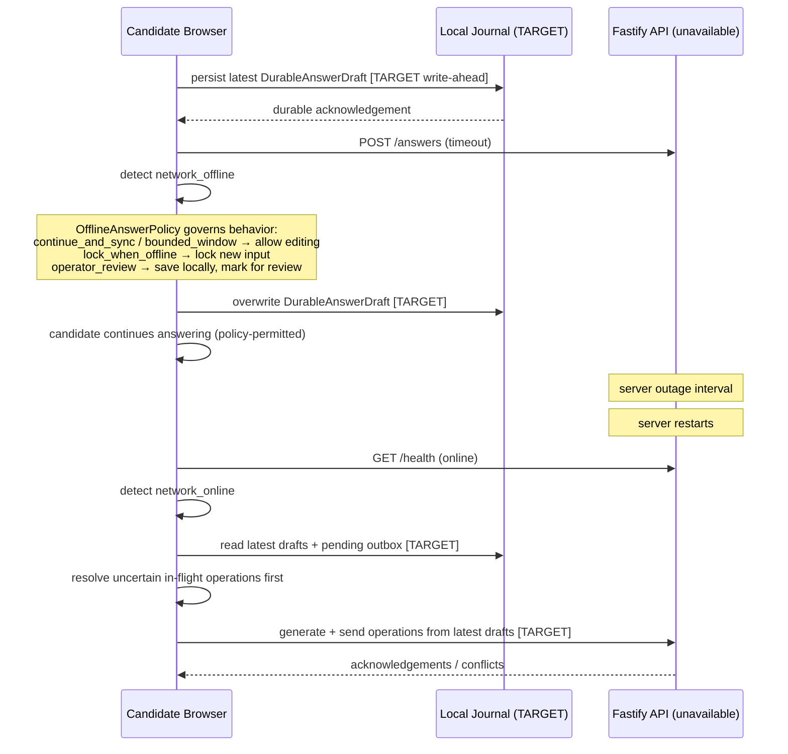
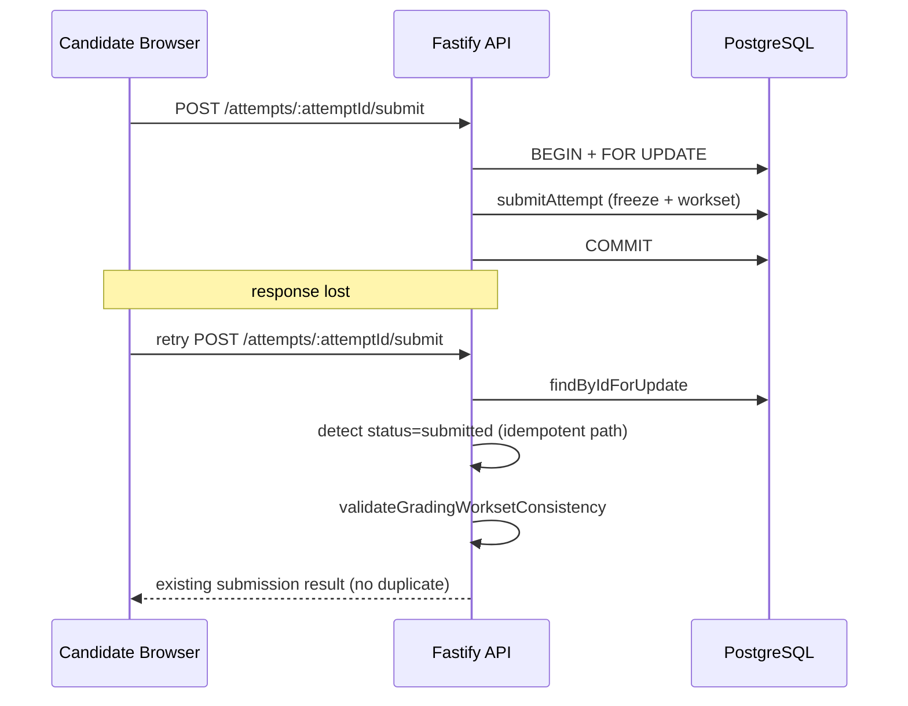

# Candidate Recovery Architecture

Authority: ADR-012. This document provides sequence diagrams, state tables,
and decision matrices for the candidate exam recovery contract.

---

## Sequence Diagrams

### Normal Answer Save (CURRENT)



### Response Lost After Server Commit (TARGET)



### Browser Restart Recovery (TARGET)



### Device Replacement



### Disrupted-Attempt Restore (CURRENT + TARGET)



### Server Outage



### Submission Response Loss (CURRENT)



---

## State / Authority Table

| State | Authority | Storage | Recoverable after crash |
|---|---|---|---|
| Server-confirmed answer | PostgreSQL | `exam_attempts.answers` | Yes |
| Submitted answer snapshot | PostgreSQL | `exam_attempts.submitted_answers` | Yes |
| Attempt lifecycle status | PostgreSQL | `exam_attempts.status` | Yes |
| Effective deadline | PostgreSQL | `min(exam.closeAt, attempt.deadlineAt)` | Yes |
| Grading workset | PostgreSQL | `attempt_grading_entries` | Yes |
| Final result | PostgreSQL | `exam_enrollments.finalScore/finalPassed` | Yes |
| Durable local draft (TARGET) | Client recovery intent | IndexedDB / SQLite | Same device only |
| Save operation outbox (TARGET) | Pending transport intent | IndexedDB / SQLite | Same device only |
| In-memory edit (CURRENT) | Browser memory | React refs | No |
| Client telemetry buffer | Browser memory | in-memory queue | No |

---

## Failure Decision Matrix

| Failure class | Server-confirmed answers | Pending local ops (TARGET) | Time compensation | Recovery path |
|---|---|---|---|---|
| A. Network interruption | Safe (server holds) | Journal holds; replay on reconnect | Policy-dependent (not auto-full); client-claimed duration NOT fully trusted | Replay pending → reconcile |
| B. Client process interruption | Safe | Same device: journal survives; different: lost | Policy-dependent | Reload snapshot → replay journal |
| C. Device loss/replacement | Safe | Lost (original device only) | None automatic | Server-confirmed state only |
| D. Server-side outage | Safe (if committed before outage) | Journal holds; replay after recovery | Operator incident / system-wide; server-observable interval | Replay pending → reconcile |
| E. Concurrent client activity | Version protocol protects | Conflict surfaced to stale client | N/A | Stale client receives STALE_VERSION |
| F. Client persistence failure | Safe (server holds) | Lost or corrupted; degrade to server-only | N/A | Server-confirmed state; warn candidate |

---

## Web vs Future Desktop Adapter Boundary

| Concern | Web adapter | Future desktop adapter |
|---|---|---|
| Journal storage | IndexedDB | SQLite |
| Session identity | HTTP-only cookie + JWT | Desktop installation/session |
| Process lifecycle | Browser tab/process | Desktop process |
| Credential handling | httpOnly cookie | OS credential store |
| Single-writer lock | Web Locks API / BroadcastChannel | Desktop single-instance lock |
| Save protocol | Same (operationId, baseVersion, serverVersion) | Same |
| Restore command | Same (POST /restore) | Same |
| Submission semantics | Same (idempotent) | Same |
| Telemetry vocabulary | Same event names | Same event names |
| Incident model | Same | Same |

---

## Data Retention Table

| Data | Retention trigger | Action |
|---|---|---|
| Pending journal entries | Authoritative submission | Clear attempt journal (physical delete after reconciliation) |
| Pending journal entries | Attempt void/freeze | Remove answer payload; retain operation count + sync state + event IDs for appeal |
| Pending journal entries | Secure logout | Detach from active session; do NOT physically delete unresolved entries |
| Pending journal entries | User B logs in on same device | User B can NEVER query or discover User A's journal |
| Pending journal entries | User A re-logs in on same device | User A MAY rediscover their unresolved journal entries |
| Pending journal entries | Retention expiry | Physical delete (time-based cleanup, policy-configured) |
| Pending journal entries | Exam/attempt deletion signal | Physical delete |
| Pending journal entries | Explicit user abandonment | Physical delete (user-initiated, confirmed) |
| Server-confirmed answers | Permanent | PostgreSQL retention policy |
| Submitted answer snapshot | Permanent | PostgreSQL retention policy |
| Telemetry events | Configurable | No answer content; ids + counts only |

### Logout and user-change semantics (frozen)

```text
Logout:
  Journal entries are NOT physically deleted.
  They are detached from the active session identity.

User B login (same device):
  User B can NEVER read, query, or recover User A's journal.
  Isolation is enforced by scope key: organizationId + userId + attemptId.

User A re-login (same device):
  User A MAY rediscover unresolved journal entries for active attempts.

Physical deletion occurs ONLY on:
  - authoritative submission (after reconciliation)
  - retention expiry (time-based, policy-configured)
  - explicit user abandonment (confirmed)
  - exam/attempt deletion signal
  - lawful deletion request

"Clear" in this document means "make inaccessible to the current user
session", NOT "physically delete", unless the trigger explicitly states
physical deletion.
```
