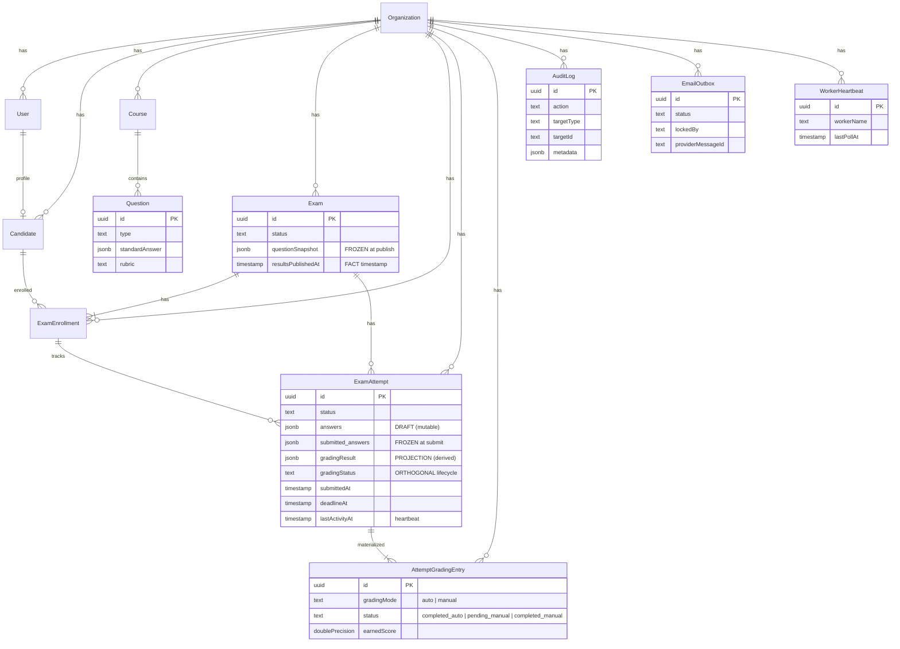
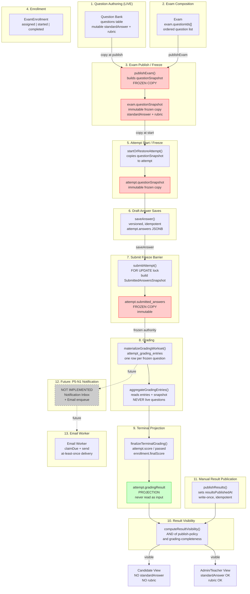
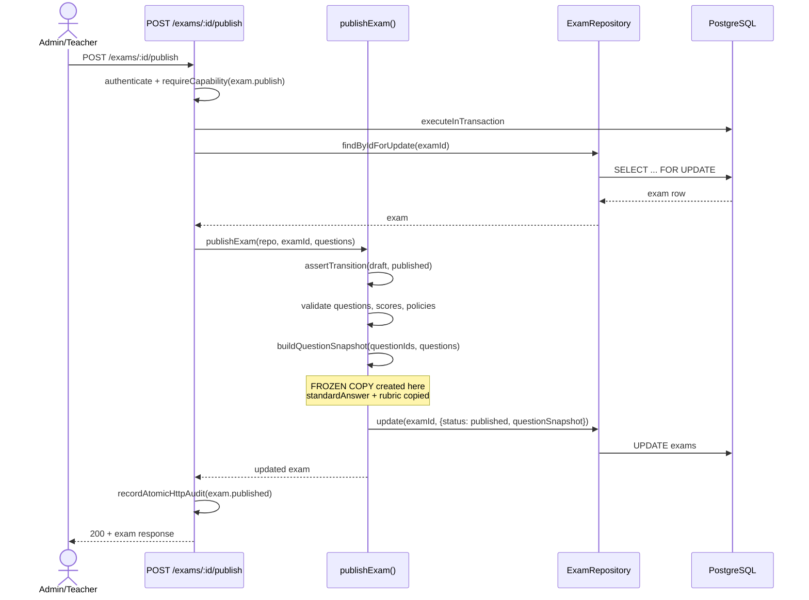
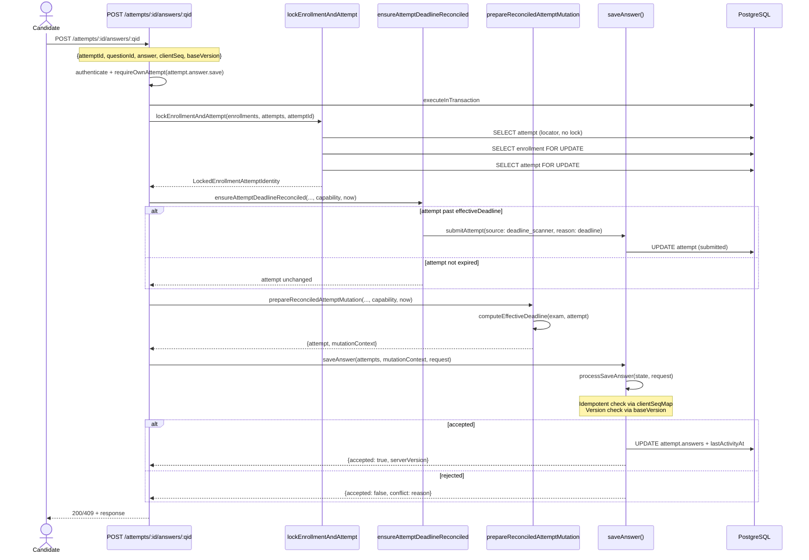
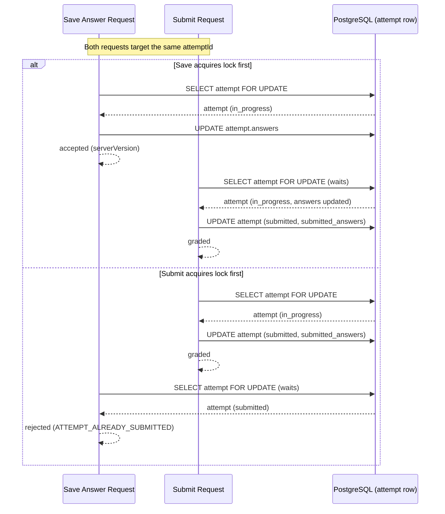
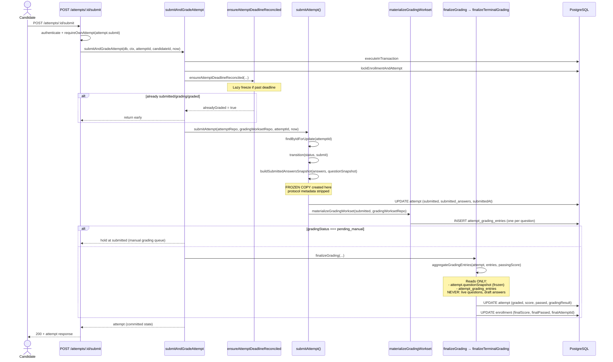
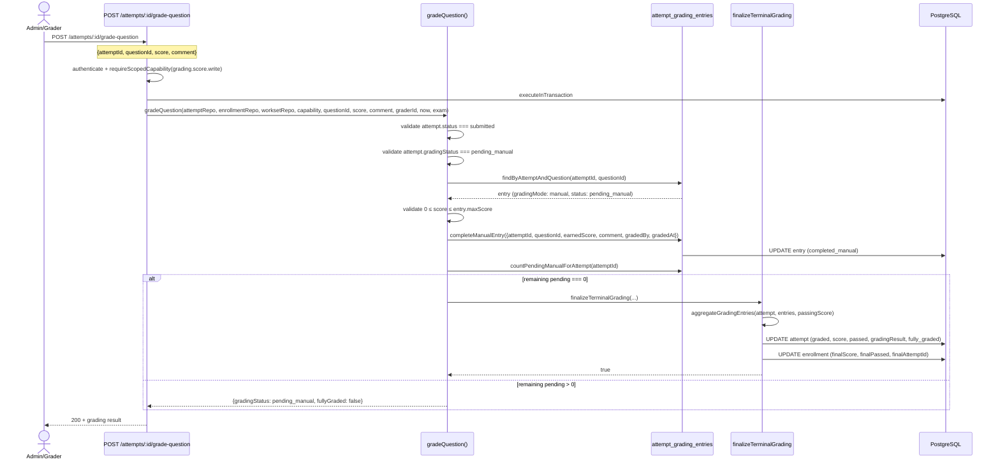
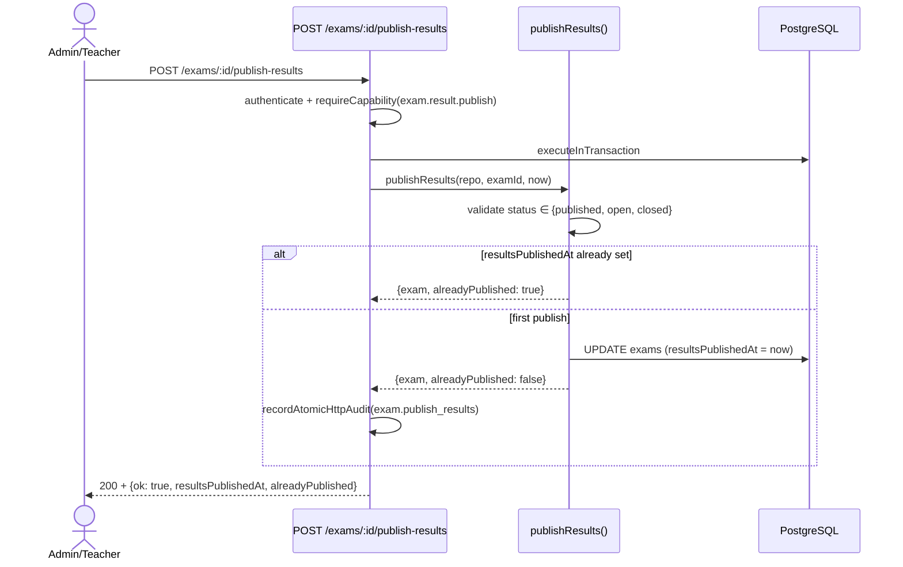
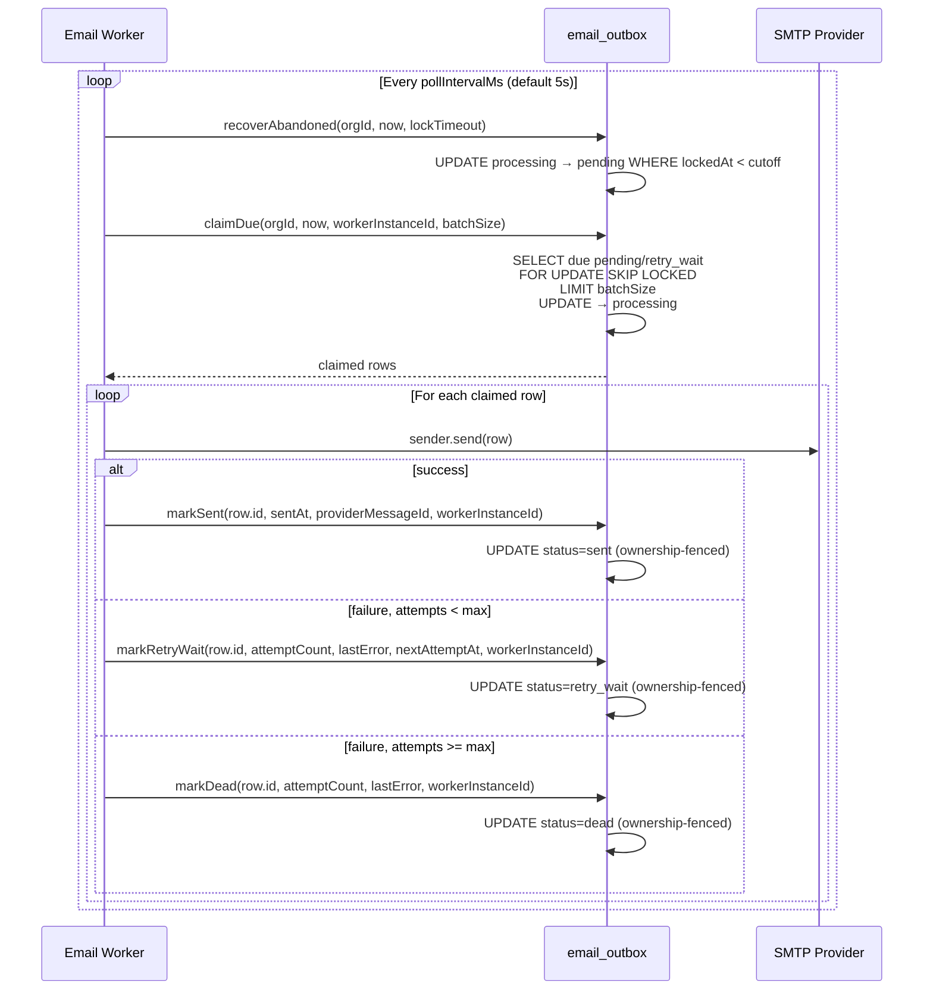
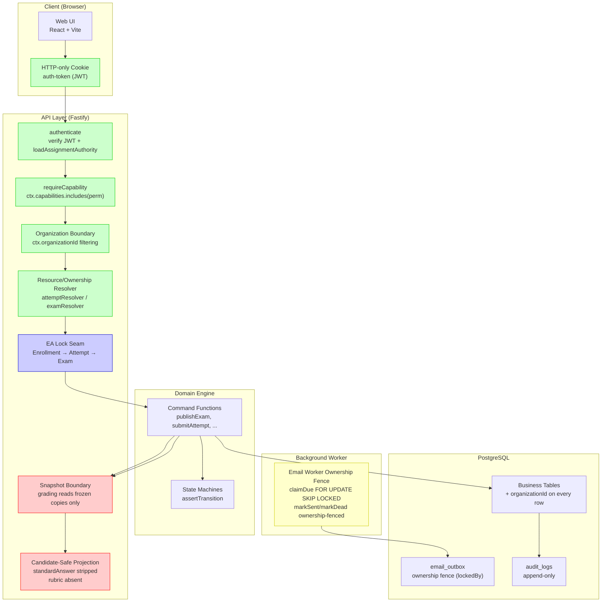

# Architecture Diagrams

> Evidence-backed Mermaid diagrams of the exam system.

```text
Last verified against commit:
cac6b85c425c85ad4077002bc518fca0b50f766f

Verification scope:
Current master implementation after merged P5-0 / PR #210.
```

---

## 1. System Context Diagram

```mermaid
C4Context
    title System Context — Exam Platform

    person(admin, "Admin", "Configures courses, questions, exams, enrollments, grading, exports")
    person(teacher, "Teacher", "Course/exam authoring and lifecycle manager")
    person(proctor, "Proctor", "Exam-room runtime authority")
    person(grader, "Grader", "Manual scoring of subjective questions")
    person(candidate, "Candidate", "Takes assigned exams")
    person(maintainer, "Maintainer", "Read-only operational observer (health / diagnostics / backup evidence)")

    system(exam_system, "Exam Platform", "LAN/on-premise exam and assessment platform")

    system_Ext(smtp, "SMTP / Email Provider", "External email delivery")

    rel(admin, exam_system, "Manages", "HTTPS / Web UI")
    rel(teacher, exam_system, "Manages", "HTTPS / Web UI")
    rel(proctor, exam_system, "Monitors", "HTTPS / Web UI")
    rel(grader, exam_system, "Grades", "HTTPS / Web UI")
    rel(candidate, exam_system, "Takes exams", "HTTPS / Web UI")
    rel(maintainer, exam_system, "Views operational health / diagnostics / evidence", "HTTPS / Web UI")

    rel(exam_system, smtp, "Sends email", "SMTP (async)")
```

**Authority**: `apps/api/src/server.ts`, `packages/authz/src/presets.ts`, `apps/api/src/plugins/emailOutboxLoop.ts` (#320 CONVERGE — in-process outbox loop; standalone `workers/emailDeliveryWorker.ts` remains as an optional escape hatch)
**Evidence**: 7 built-in role presets total — 6 assignable human roles (Admin, Teacher, Proctor, Grader, Candidate, Maintainer; Maintainer added by P7-E2A — read-only Operational Observer; ADR-017) + 1 synthetic non-assignable System actor (not rendered as a person; deadline auto-submit / heartbeat scan / reconcile). Maintainer holds exactly 5 operational `*.view` capabilities, 0 business permissions, 0 writes — the relation is **observation only: no business mutation, no infrastructure execution**. Admin ∩ Maintainer = ∅ is enforced server-side (D14). SMTP is the only external system dependency (async via the in-process email outbox loop).
**Known limitations**: Teacher/Proctor/Grader are Phase 3 roles (capability infrastructure exists; product role UI is incomplete). Teacher course-scope is NOT enforced — see P7-RBAC F-04. Email delivery is the only async external dependency. No CDN, no cloud services, no external APIs.

---

## 2. Aggregate and Data Relationship Diagram



**Legend**:
- **Aggregate root**: Organization, User, Candidate, Course, Question, Exam, ExamAttempt
- **Child entity**: ExamEnrollment (owned by Exam), AttemptGradingEntry (owned by Attempt)
- **Embedded value**: QuestionSnapshot (inside Exam/Attempt), AnswerRecord, SubmittedAnswersSnapshot
- **Projection**: gradingResult (derived from AttemptGradingEntry)
- **Infrastructure record**: AuditLog, EmailOutbox, WorkerHeartbeat

**Authority**: `packages/db/src/schema/pg.ts`, `packages/domain/src/types.ts`
**Evidence**: Table definitions in schema.ts mirror the aggregate types. Foreign keys enforce parent-child relationships.
**Known limitations**: Paper is an implicit composition concept (no table). Result is a projection (no table). Notification Inbox is NOT IMPLEMENTED.

---

## 3. End-to-End Data Flow Diagram



**Freeze points** (red): questionSnapshot at publish, questionSnapshot at attempt start, submitted_answers at submit.
**Projection boundary** (green): gradingResult is a projection, never read as scoring input.
**Async boundary**: Email worker sends SMTP outside any DB transaction.

**Authority**: `packages/exam-engine/src/examCommands.ts`, `attemptCommands.ts`, `answerProtocol.ts`, `gradingWorkset.ts`, `grading.ts`, `apps/api/src/routes/attempts.shared.ts`
**Evidence**: Each step maps to a documented command function. Freeze points are enforced by `buildQuestionSnapshot()`, `buildSubmittedAnswersSnapshot()`.
**Known limitations**: P5-N1 (Notification Inbox + Email enqueue) is NOT IMPLEMENTED — shown as future/dashed. Teacher/Proctor/Grader are Phase 3 roles. IP/CIDR, device binding, emergency access are NOT IMPLEMENTED.

---

## 4. State Machine Diagrams

See [state-and-authority.md](./state-and-authority.md) for the following state machine diagrams:

- Exam lifecycle (6 states)
- Attempt lifecycle (8 states, 4 reachable)
- Grading sub-process (3 states, orthogonal)
- Enrollment lifecycle (4 states)
- Email outbox lifecycle (5 states)

---

## 5. Sequence Diagrams

### 5.1 Exam Publish and Question-Snapshot Creation



**Authority**: `apps/api/src/routes/exam.ts`, `packages/exam-engine/src/examCommands.ts`
**Evidence**: Route uses `executeAdminExamTransition` → `findByIdForUpdate` → `publishExam()`.
**Known limitations**: `published` and `open` are distinct states. Publish does NOT open the exam (that's a separate transition or lazy auto-open).

### 5.2 Save Answer



**Authority**: `apps/api/src/routes/attempts.candidate.ts`, `packages/exam-engine/src/answerProtocol.ts`, `deadlineReconciliation.ts`, `lockSeam.ts`
**Evidence**: Route delegates to `lockEnrollmentAndAttempt` → `prepareReconciledAttemptMutation` → `saveAnswer`.
**Known limitations**: `processSaveAnswer` is a pure function (no IO). The composite `saveAnswer` owns load-decide-apply-persist.

### 5.3 Save-vs-Submit Concurrency (ADR-008)



**Authority**: ADR-008, `packages/exam-engine/src/attemptCommands.ts` `submitAttempt()`
**Evidence**: `submitAttempt()` reads via `findByIdForUpdate`. `saveAnswer()` runs inside EA lock. The FOR UPDATE serializes concurrent access. Existing test: `apps/api/src/routes/submitFreezeBarrier.test.ts` (real PostgreSQL, 5 race iterations).
**Known limitations**: Both outcomes are protocol-legitimate. The invariant is that grading reads the same answer set the row ended with (no stale snapshot).

### 5.4 Candidate Submit + Freeze + Automatic Grading



**Authority**: `apps/api/src/orchestrators/submitAndGradeAttempt.ts`, `packages/exam-engine/src/attemptCommands.ts`, `gradingWorkset.ts`, `grading.ts`
**Evidence**: `submitAndGradeAttempt` composes submit + grade in ONE transaction under EA lock.
**Known limitations**: Submit carries NO answer payload. The `grading` state is unreachable — auto-graded attempts go directly from `submitted` to `graded`.

### 5.5 Manual Grading Terminal Closure



**Authority**: `packages/exam-engine/src/manualGrading.ts`, `grading.ts`
**Evidence**: `gradeQuestion` completes one pending_manual entry and delegates to `finalizeTerminalGrading` when the last one is done.
**Known limitations**: Manual grading completion is one-way. A `completed_manual` entry cannot be revised by the ordinary grading command.

### 5.6 Manual Result Publication



**Authority**: `apps/api/src/routes/exam.ts`, `packages/exam-engine/src/examCommands.ts`
**Evidence**: Route uses `executeInTransaction` → `publishResults()` → `recordAtomicHttpAudit(action: "exam.publish_results")`. No route-level reconciliation step.
**Known limitations**: Publish does NOT advance grading. If grading is still pending, results stay hidden behind `not_graded` hiddenReason.

### 5.7 Email Worker Claim/Send/Retry/Dead



**Authority**: `apps/api/src/plugins/emailOutboxLoop.ts`, `packages/db/src/repository/emailOutboxRepo.ts`, `apps/api/src/email/outboxService.ts`
**Evidence**: The in-process loop polls, claims via `FOR UPDATE SKIP LOCKED`, sends outside transaction, marks result with ownership fence (#320 CONVERGE).
**Known limitations**: At-least-once delivery (crash after SMTP acceptance but before markSent causes duplicate). No production business caller enqueues emails (P5-N1 scope).

---

## 6. Security Boundary Diagram



**Trust boundaries**:
- **Green** (authentication/authorization): Cookie → authenticate → capability gate → org boundary → ownership resolver
- **Blue** (transactional): EA lock seam serializes concurrent mutations
- **Red** (data protection): Snapshot boundary ensures grading reads frozen copies; Candidate projection strips standardAnswer/rubric
- **Yellow** (infrastructure): Email worker ownership fence prevents stale-lock corruption

**Authority**: `apps/api/src/plugins/auth.ts`, `authz.ts`, `packages/exam-engine/src/lockSeam.ts`, `apps/api/src/routes/attempts.shared.ts`
**Evidence**: Each boundary maps to documented code. `loadAssignmentAuthority` resolves from `user_role_assignments`. `computeAnswerVisibility` always returns hidden.
**Known limitations**: Teacher resource-scope (Teacher@course) is NOT IMPLEMENTED — capabilities are flat org-wide. IP/CIDR, device binding, emergency access are NOT IMPLEMENTED.
