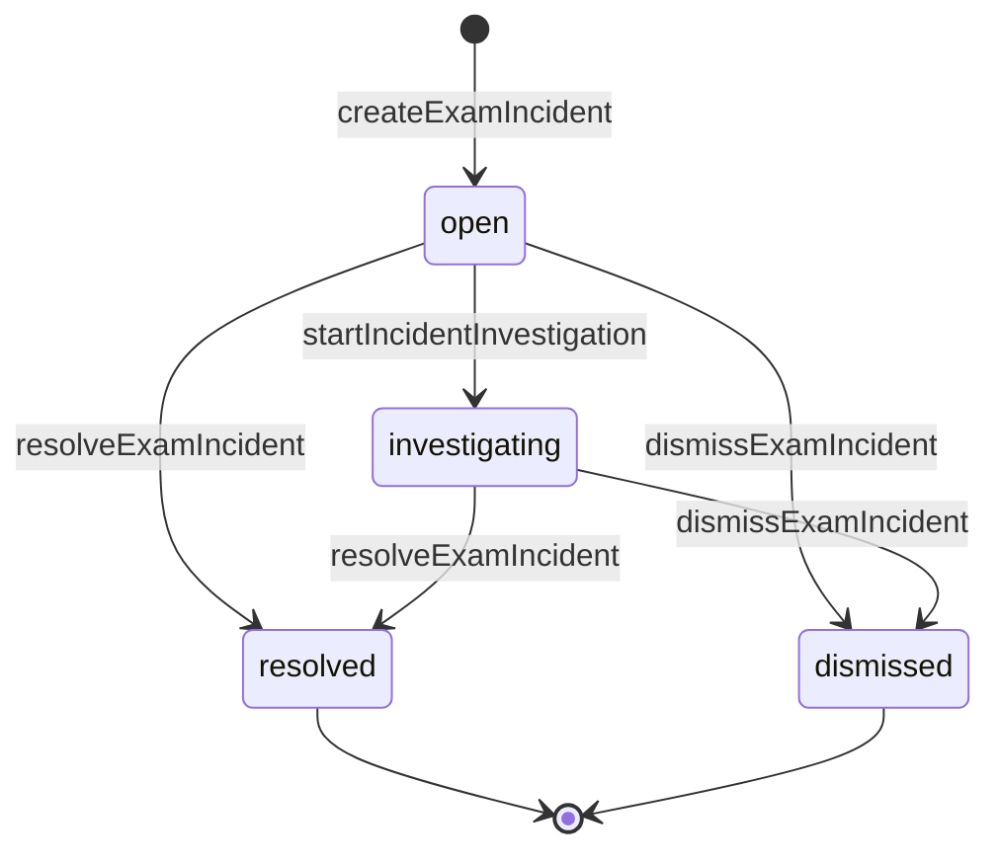
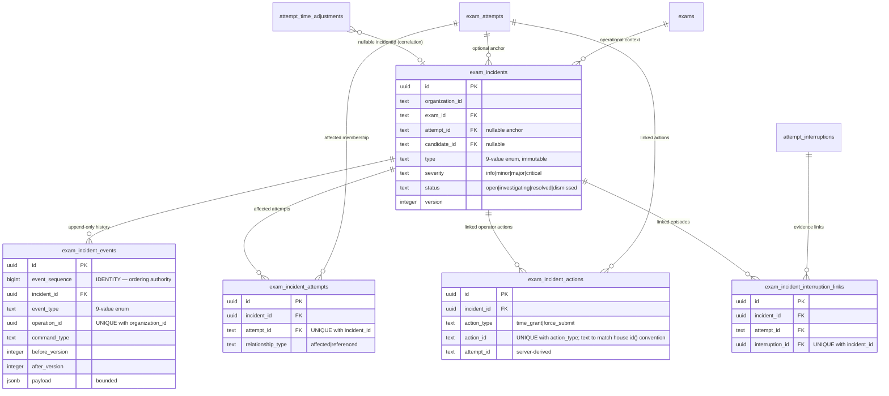

# Exam Incident Authority

> Status: IMPLEMENTED — ADR-014 ACCEPTED; J3 CLOSED (PR #242 merged); J4-I1
> CLOSED (PR #250 merged)
>
> Runtime implementation: J3 (`REC-I6-I1-INCIDENT-PERSISTENCE-COMMANDS`) is
> implemented and merged on master (PR #242, merge commit `5b653c13`,
> 2026-08-01). Five incident tables (migration `0023`), domain types,
> repositories, nine canonical write commands, Admin-only permissions, API
> routes, audit actions, and the `grantAttemptTime()` optional `incidentId`
> operator path are live. The Proctor Incident **backend** authority is
> **implemented for assigned Exams** by J4-I1 (CLOSED, 2026-08-02, PR #250,
> merge commit `62f84407`): an actively-assigned Proctor can
> `incident.view` / `incident.create` / `incident.investigate` on the Exam
> they are assigned to (ADR-015 §13). The dangerous terminal authority
> (`incident.resolve` / `incident.dismiss`, `AttemptTimeGrant`,
> `AttemptForceSubmit`, `AttemptMisconductMark`) is **NOT** granted to
> Proctor and remains Admin-only. The Admin **and** Proctor Recovery Center
> product UIs (J5 / J6) and system-generated incidents remain NOT
> IMPLEMENTED; the J5-R0 Admin Recovery Center contract is IN REVIEW (see
> [`../../roadmap/j5-r0-admin-recovery-center-contract.md`](../../roadmap/j5-r0-admin-recovery-center-contract.md)).
>
> Authority: [`ADR-014 — Exam Incident Authority`](../../adr/ADR-014-exam-incident-authority.md)
> (Accepted). This document is the accepted target contract for J3. It provides
> the state tables, command inventory, permission matrix, transaction
> boundaries, and sequence diagrams for that contract. The commands, tables,
> and Admin routes below are implemented per this contract; sections that
> remain proposals are marked explicitly.

Reality baseline: [`REC-I6-R0 reality audit`](../../audits/REC-I6-R0-INCIDENT-AUTHORITY-REALITY-AUDIT.md).
The pre-J3 live incident surface was the audit-event-only
`proctor.incident_marked` marker; `attempt_time_adjustments.incident_id` is
the only `incident_id` column. J3 adds the incident tables and the Admin
incident API; the proctor marker is NOT dual-written to incidents (see
"Relationship to the existing proctor marker" below).

---

## Position in the state model

An incident is an **orthogonal operational state dimension**, alongside Exam
lifecycle, Attempt lifecycle, Grading, Enrollment, Email outbox, and the
ADR-013 interruption episode / time-adjustment facts. See
[`state-and-authority.md`](state-and-authority.md).

An incident is a durable operational case — a reported or detected exam
problem plus its investigation, notes, resolution, and links to separately
authoritative operator actions. It is not an Attempt status, not an
interruption episode, not an audit row, and not a penalty. Incident and
Attempt lifecycles combine freely: any incident status can coexist with any
Attempt status, an Attempt can have zero or many incidents, and an
exam-wide incident carries no Attempt anchor — its affected attempts are
recorded as append-only membership links.

## Incident status

| Status | Meaning | Terminal |
| --- | --- | --- |
| `open` | recorded, not yet actively investigated | no |
| `investigating` | active investigation | no |
| `resolved` | closed with a resolution summary | yes |
| `dismissed` | closed as not actionable | yes |



Terminal status is monotonic (no reopen in the initial implementation).
`addIncidentNote()`, `linkIncidentAction()`, `linkIncidentAttempt()`, and
`linkIncidentInterruption()` are append-only side writes allowed in any
status; they never change status and have no unlink command. Severity
changes are allowed only while non-terminal. Incident `type` is immutable
after creation — a classification mistake is dismissed and replaced by a
new incident.

Closed enums: type ∈ {`network_interruption`, `device_failure`,
`power_failure`, `candidate_unable_to_continue`, `suspected_misconduct`,
`operator_error`, `system_outage`, `environmental_disruption`, `other`};
severity ∈ {`info`, `minor`, `major`, `critical`}. Severity informs
prioritization only — it never triggers punishment, score change, time
grant, or Attempt mutation.

## Command inventory

| Command | Transition | Permission | Audit action | Lock |
| --- | --- | --- | --- | --- |
| `createExamIncident()` | `[*] → open` | `incident.create` | `incident.created` | none (new row) |
| `startIncidentInvestigation()` | `open → investigating` | `incident.investigate` | `incident.investigated` | incident row FOR UPDATE |
| `addIncidentNote()` | any status (side write) | `incident.investigate` | `incident.note_added` (note id only) | none (append-only) |
| `changeIncidentSeverity()` | non-terminal (side write) | `incident.investigate` | `incident.severity_changed` | incident row FOR UPDATE |
| `resolveExamIncident()` | `open\|investigating → resolved` | `incident.resolve` | `incident.resolved` | incident row FOR UPDATE |
| `dismissExamIncident()` | `open\|investigating → dismissed` | `incident.resolve` | `incident.dismissed` | incident row FOR UPDATE |
| `linkIncidentAction()` | any status (side write) | `incident.investigate` | `incident.action_linked` | none (constraint-arbiterated) |
| `linkIncidentAttempt()` | any status (side write; exam-wide incidents only) | `incident.investigate` | `incident.attempt_linked` | none (constraint-arbiterated) |
| `linkIncidentInterruption()` | any status (side write) | `incident.investigate` | `incident.interruption_linked` | none (constraint-arbiterated) |
| `grantAttemptTime()` (extended) | unchanged Attempt-side | `attempt.time.grant` | `attempt.timeGrant` | ADR-013 chain; incident = non-locking read |

No universal `updateIncident()` command exists. Incident commands never
lock Attempt or Exam rows and never write `exam_attempts`. Every write
command carries a client-generated `operationId` (command identity — see
Transaction boundaries); version-bumping transitions additionally require
`expectedVersion`.

## Permission matrix

| Actor | `incident.view` | `incident.create` | `incident.investigate` | `incident.resolve` | Activation |
| --- | :-: | :-: | :-: | :-: | --- |
| Admin | ✅ | ✅ | ✅ | ✅ (sensitive) | granted by J3; active on implementation |
| Proctor | ✅ | ✅ | ✅ | ❌ | **implemented for assigned Exams** by J4-I1 (CLOSED, 2026-08-02, PR #250) behind ADR-015 §13 exam-scope enforcement; resolve/dismiss stay Admin-only terminal judgment |
| Teacher | ❌ | ❌ | ❌ | ❌ | — |
| Grader | ❌ | ❌ | ❌ | ❌ | — |
| Candidate | ❌ | ❌ | ❌ | ❌ | never; future candidate report is a separate input protocol |
| System | reserved | `system.incident.create` reserved | ❌ | ❌ | future system-incident Job only |

Authority is assignment-backed and fail-closed (ADR-010): authorization
unavailability returns 503 `AUTHZ_UNAVAILABLE`, never an open fallback.

## Transaction boundaries

| Operation | Scope | Invariants |
| --- | --- | --- |
| Incident state transition | `operationId` lookup → lock incident row → `expectedVersion` check → update materialized row + append event + atomic audit, one transaction | same `operationId` + same canonical payload → replay (wire outcome `idempotent_replayed`); same `operationId` + different payload → 409 `IDEMPOTENCY_CONFLICT`; new `operationId` + stale `expectedVersion` → 409 `INCIDENT_VERSION_CONFLICT`; new `operationId` on a terminal incident → 409 `INVALID_STATE_TRANSITION`. On `23505` operation-unique: rollback → fresh-transaction query → replay/conflict. |
| Note append | insert `note_added` event + audit; no incident row lock, no `updatedAt` update | concurrent notes both succeed, each under its own `operationId`; order = `event_sequence`; `23505` operation-unique triggers rollback + fresh-transaction recovery |
| Action link | scope quadruple validated server-side (org, exam, attempt, candidate) → insert link + `action_linked` event + audit; no incident row lock | `UNIQUE (organization_id, action_type, action_id)` arbiter; action types `time_grant` / `force_submit` only (`force_submit` requires committed `attempt.forceSubmit` audit fact; `misconduct_mark` deferred); duplicate link under a new `operationId` → 409 `INCIDENT_ACTION_ALREADY_LINKED`; `23505` on operation-unique → rollback + fresh-transaction recovery; `23505` on link-unique → entire transaction rolls back (no orphaned event); other `23505` surfaced |
| Evidence link (attempt / interruption) | scope quadruple validated server-side (org, exam, attempt, candidate) → insert junction + event + audit; no incident row lock | `UNIQUE (incident_id, attempt_id)` / `(incident_id, interruption_id)` arbiters; attempt membership only on exam-wide incidents (anchor exclusivity → 409 `INVALID_STATE_TRANSITION`); composite FKs to existing uniques enforce org + attempt/episode consistency; `23505` on operation-unique → rollback + fresh-transaction recovery |
| Time grant with incident | existing ADR-013 transaction (Enrollment → Attempt → Exam) + non-locking incident validation + action-link insert + audit, under the existing `operationId` idempotency | full link-scope quadruple: same organization AND same exam (derived from the locked Attempt, never the request) AND `incident.attemptId` null-or-matching AND `incident.candidateId` null-or-matching the grant attempt's candidate; ledger remains the time authority; `incidentId` is correlation metadata, never a deadline input |

If any future shared transaction locks an incident row, the lock is taken
strictly AFTER the Exam lock — the ADR-013 order
`Enrollment → Attempt → Exam` is never reordered.

Crash behavior: every incident command is a single transaction — a crash
before COMMIT leaves no incident state, and no background reconciliation is
needed (incidents carry no derived or asynchronous state). The combined
grant+link path is atomic (crash leaves neither; same-`operationId` retry
replays both), and a grant committed without a link is recovered via
standalone `linkIncidentAction()`.

## Data model



The materialized `exam_incidents` row is a projection of
`exam_incident_events`, ordered by `event_sequence`
(`BIGINT GENERATED ALWAYS AS IDENTITY` — the sole ordering authority;
`created_at` and UUID ids define no order). State events carry
`before_version` / `after_version`, so the materialized version is
verifiable against the event chain. Exam-wide incidents record affected
attempts through `exam_incident_attempts` and correlated episodes through
`exam_incident_interruption_links`; both are append-only evidence
relationships that never absorb Attempt or InterruptionEpisode authority.
Compensated interruptions still correlate through the ledger row that
carries both `interruptionId` and `incidentId`, and the two identities are
never interchangeable (ADR-013).

`exam_incident_actions.action_id` referents (ADR-014 §7): `time_grant` →
`attempt_time_adjustments.id`; `force_submit` → the force-submitted
`exam_attempts.id` (a one-time terminal fact, hence a stable identity).
`misconduct_mark` is NOT linkable in the initial implementation: the jsonb
`MisconductFlag` is overwritten on re-flag, so it is a mutable field, not a
stable action identity — linking it is deferred until a stable append-only
misconduct receipt exists. Every link (action, attempt, interruption)
satisfies the frozen scope quadruple — same organization, same exam,
`incident.attemptId` null-or-matching, and `incident.candidateId`
null-or-matching the target attempt's candidate — derived server-side from
authoritative rows, never from the request. Links store identity only,
never mutable state. Integrity is DB-enforced by composite FKs reusing
existing uniques, and there is no `ON DELETE CASCADE`: incidents are
durable and parent deletion fails closed while incidents reference it.

## Sequence — time grant linked to an incident

```mermaid
sequenceDiagram
    participant A as Admin Dashboard
    participant API as Fastify API
    participant DB as PostgreSQL

    A->>API: POST /admin/attempts/:attemptId/time-grants<br/>(operationId, addedSeconds, reason, incidentId?)
    API->>API: requireScopedCapability(attempt.time.grant)
    API->>DB: BEGIN (repeatable read)
    API->>DB: lock Enrollment FOR UPDATE
    API->>DB: lock Attempt FOR UPDATE
    API->>DB: lock Exam FOR UPDATE
    API->>DB: operation-ID lookup (replay / conflict)
    opt incidentId present
        API->>DB: read exam_incidents (NON-LOCKING): exists;<br/>same org; same exam as the locked Attempt;<br/>attemptId null-or-matching;<br/>candidateId null-or-matching the grant attempt's candidate
    end
    API->>DB: deadline reconciliation
    API->>DB: insert attempt_time_adjustments (incidentId)
    API->>DB: update exam_attempts.deadlineAt
    opt incidentId present
        API->>DB: insert exam_incident_actions<br/>(time_grant, adjustment id) + action_linked event
    end
    API->>DB: atomic attempt.timeGrant audit
    API->>DB: COMMIT
    API-->>A: GrantOutcome (granted | idempotent_replay | terminal)
```

## Sequence — concurrent terminal transitions

```mermaid
sequenceDiagram
    participant X as Operator A (resolve, operationId=X)
    participant Y as Operator B (dismiss, same operationId=X — retry)
    participant DB as PostgreSQL

    X->>DB: pre-read operationId → not found
    Y->>DB: pre-read operationId → not found
    X->>DB: BEGIN; SELECT ... FOR UPDATE (incident row)
    Y->>DB: BEGIN; SELECT ... FOR UPDATE (blocked)
    X->>DB: re-check operationId inside lock → uncommitted
    X->>DB: version check (expectedVersion = v) ✓
    X->>DB: UPDATE status = resolved, version = v+1
    X->>DB: append incident_resolved event; audit; COMMIT
    Y->>DB: (unblocked) re-check operationId inside lock
    Y->>DB: → committed matching operation X found
    Y-->>Y: rollback, return idempotent_replayed
```

## Relationship to the existing proctor marker

The audit-event-only `POST /admin/attempts/:attemptId/proctor-incident`
route is unchanged by this design. No silent dual-write creates incident
rows behind it; migrating the marker into incident creation is an explicit
future UI/Job decision owned by the J5/J6 recovery centers. Marker → type
mapping guidance lives in ADR-014 §15.

## Related documents

- [`ADR-014 — Exam Incident Authority`](../../adr/ADR-014-exam-incident-authority.md) — normative contract (Accepted).
- [`state-and-authority.md`](state-and-authority.md) — orthogonal state dimensions.
- [`candidate-recovery.md`](candidate-recovery.md) — ADR-012/ADR-013 recovery sequences.
- [`protocol-catalog.md`](protocol-catalog.md) — Incident protocols (Admin runtime implemented in J3; the assigned-Proctor view/create/investigate backend authority is implemented in J4-I1; the Proctor **product** UI is J6, not started).
- [`domain-model.md`](domain-model.md) — explicitly absent / designed aggregates.
- [`../../roadmap/recovery-operations-jobs.md`](../../roadmap/recovery-operations-jobs.md) — J2/J3/J4 workstream; the J5 Admin Recovery Center contract is
  [`../../roadmap/j5-r0-admin-recovery-center-contract.md`](../../roadmap/j5-r0-admin-recovery-center-contract.md).
