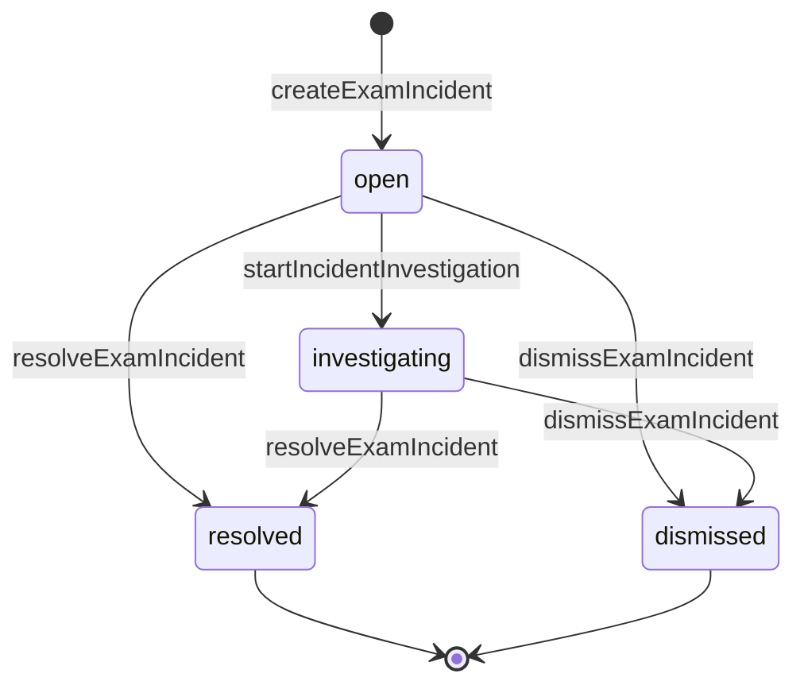
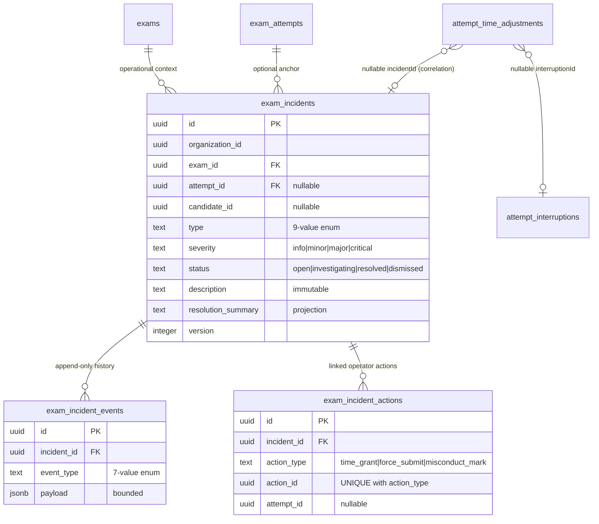
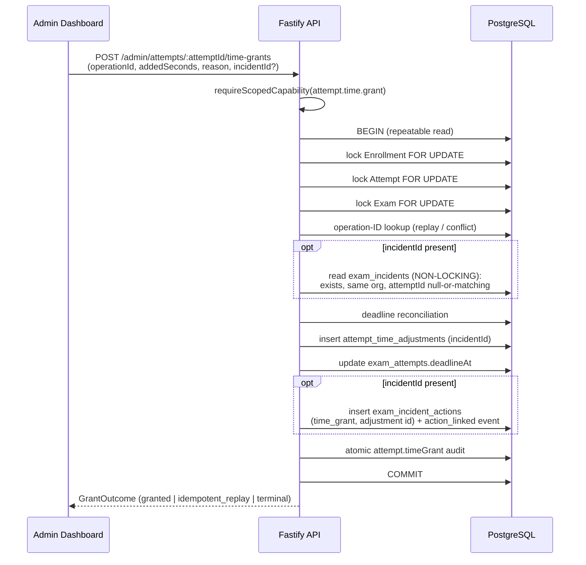

# Exam Incident Authority

> Status: TARGET — ADR-014 PROPOSED
>
> Runtime implementation: NOT STARTED
>
> Authority: [`ADR-014 — Exam Incident Authority`](../../adr/ADR-014-exam-incident-authority.md)
> (Proposed). This document provides the state tables, command inventory,
> permission matrix, transaction boundaries, and sequence diagrams for that
> contract. Nothing described here is implemented; every table, route,
> permission, and command below is a frozen proposal for the follow-up Job
> `REC-I6-I1-INCIDENT-PERSISTENCE-COMMANDS` (J3).

Reality baseline: [`REC-I6-R0 reality audit`](../../audits/REC-I6-R0-INCIDENT-AUTHORITY-REALITY-AUDIT.md).
The only live incident surface today is the audit-event-only
`proctor.incident_marked` marker; `attempt_time_adjustments.incident_id` is
the only `incident_id` column and has zero non-null writers.

---

## Position in the state model

An incident is an **orthogonal operational state dimension**, alongside Exam
lifecycle, Attempt lifecycle, Grading, Enrollment, Email outbox, and the
ADR-013 interruption episode / time-adjustment facts. See
[`state-and-authority.md`](state-and-authority.md).

An incident is a durable operational case — a reported or detected exam
problem plus its investigation, notes, resolution, and links to separately
authoritative operator actions. It is not an Attempt status, not an
interruption episode, not an audit row, and not a penalty. Incident and
Attempt lifecycles combine freely: any incident status can coexist with any
Attempt status, an Attempt can have zero or many incidents, and an
exam-wide incident can have no Attempt anchor.

## Incident status

| Status | Meaning | Terminal |
| --- | --- | --- |
| `open` | recorded, not yet actively investigated | no |
| `investigating` | active investigation | no |
| `resolved` | closed with a resolution summary | yes |
| `dismissed` | closed as not actionable | yes |



Terminal status is monotonic (no reopen in the initial implementation).
`addIncidentNote()` and `linkIncidentAction()` are append-only side writes
allowed in any status; they never change status. Severity changes are
allowed only while non-terminal.

Closed enums: type ∈ {`network_interruption`, `device_failure`,
`power_failure`, `candidate_unable_to_continue`, `suspected_misconduct`,
`operator_error`, `system_outage`, `environmental_disruption`, `other`};
severity ∈ {`info`, `minor`, `major`, `critical`}. Severity informs
prioritization only — it never triggers punishment, score change, time
grant, or Attempt mutation.

## Command inventory

| Command | Transition | Permission | Audit action | Lock |
| --- | --- | --- | --- | --- |
| `createExamIncident()` | `[*] → open` | `incident.create` | `incident.created` | none (new row) |
| `startIncidentInvestigation()` | `open → investigating` | `incident.investigate` | `incident.investigated` | incident row FOR UPDATE |
| `addIncidentNote()` | any status (side write) | `incident.investigate` | `incident.note_added` (note id only) | none (append-only) |
| `changeIncidentSeverity()` | non-terminal (side write) | `incident.investigate` | `incident.severity_changed` | incident row FOR UPDATE |
| `resolveExamIncident()` | `open\|investigating → resolved` | `incident.resolve` | `incident.resolved` | incident row FOR UPDATE |
| `dismissExamIncident()` | `open\|investigating → dismissed` | `incident.resolve` | `incident.dismissed` | incident row FOR UPDATE |
| `linkIncidentAction()` | any status (side write) | `incident.investigate` | `incident.action_linked` | none (constraint-arbiterated) |
| `grantAttemptTime()` (extended) | unchanged Attempt-side | `attempt.time.grant` | `attempt.timeGrant` | ADR-013 chain; incident = non-locking read |

No universal `updateIncident()` command exists. Incident commands never
lock Attempt or Exam rows and never write `exam_attempts`.

## Permission matrix

| Actor | `incident.view` | `incident.create` | `incident.investigate` | `incident.resolve` | Activation |
| --- | :-: | :-: | :-: | :-: | --- |
| Admin | ✅ | ✅ | ✅ | ✅ (sensitive) | active on implementation |
| Proctor | ✅ | ✅ | ✅ | ❌ | blocked until M11 (J4) enforces exam scope |
| Teacher | ❌ | ❌ | ❌ | ❌ | — |
| Grader | ❌ | ❌ | ❌ | ❌ | — |
| Candidate | ❌ | ❌ | ❌ | ❌ | never; future candidate report is a separate input protocol |
| System | reserved | `system.incident.create` reserved | ❌ | ❌ | future system-incident Job only |

Authority is assignment-backed and fail-closed (ADR-010): authorization
unavailability returns 503 `AUTHZ_UNAVAILABLE`, never an open fallback.

## Transaction boundaries

| Operation | Scope | Invariants |
| --- | --- | --- |
| Incident state transition | lock incident row → `expectedVersion` check → update materialized row + append event + atomic audit, one transaction | stale version → 409 `INCIDENT_VERSION_CONFLICT`; same-terminal replay returns the committed incident |
| Note append | insert `note_added` event + audit | concurrent notes both succeed; no version required |
| Action link | insert link + `action_linked` event + audit | `UNIQUE (organization_id, action_type, action_id)` arbiter; 23505 recognized only on that named constraint; re-link same incident = replay, different incident = 409 `INCIDENT_ACTION_ALREADY_LINKED` |
| Time grant with incident | existing ADR-013 transaction (Enrollment → Attempt → Exam) + non-locking incident validation + action-link insert + audit, under the existing `operationId` idempotency | incident must exist in the same organization; `attemptId` null or matching; ledger remains the time authority; `incidentId` is correlation metadata, never a deadline input |

If any future shared transaction locks an incident row, the lock is taken
strictly AFTER the Exam lock — the ADR-013 order
`Enrollment → Attempt → Exam` is never reordered.

## Data model (proposal)



The materialized `exam_incidents` row is a projection of
`exam_incident_events`; incident state is reconstructable from events plus
linked actions. Interruption correlation flows through the ledger row that
carries both `interruptionId` and `incidentId` — there is no
incident↔interruption junction table, and the two identities are never
interchangeable (ADR-013).

## Sequence — time grant linked to an incident (TARGET)



## Sequence — concurrent terminal transitions (TARGET)

```mermaid
sequenceDiagram
    participant X as Operator A (resolve)
    participant Y as Operator B (dismiss)
    participant DB as PostgreSQL

    X->>DB: BEGIN; SELECT ... FOR UPDATE (incident row)
    Y->>DB: BEGIN; SELECT ... FOR UPDATE (blocked)
    X->>DB: version check (expectedVersion = v) ✓
    X->>DB: UPDATE status = resolved, version = v+1
    X->>DB: append incident_resolved event; audit; COMMIT
    Y->>DB: (unblocked) reads status = resolved, version = v+1
    Y-->>Y: 409 INCIDENT_VERSION_CONFLICT<br/>(or committed-incident replay if same terminal)
```

## Relationship to the existing proctor marker

The audit-event-only `POST /admin/attempts/:attemptId/proctor-incident`
route is unchanged by this design. No silent dual-write creates incident
rows behind it; migrating the marker into incident creation is an explicit
future UI/Job decision owned by the J5/J6 recovery centers. Marker → type
mapping guidance lives in ADR-014 §15.

## Related documents

- [`ADR-014 — Exam Incident Authority`](../../adr/ADR-014-exam-incident-authority.md) — normative contract (Proposed).
- [`state-and-authority.md`](state-and-authority.md) — orthogonal state dimensions.
- [`candidate-recovery.md`](candidate-recovery.md) — ADR-012/ADR-013 recovery sequences.
- [`protocol-catalog.md`](protocol-catalog.md) — proposed Incident protocols (TARGET).
- [`domain-model.md`](domain-model.md) — explicitly absent / designed aggregates.
- [`../../roadmap/recovery-operations-jobs.md`](../../roadmap/recovery-operations-jobs.md) — J2/J3 workstream.
