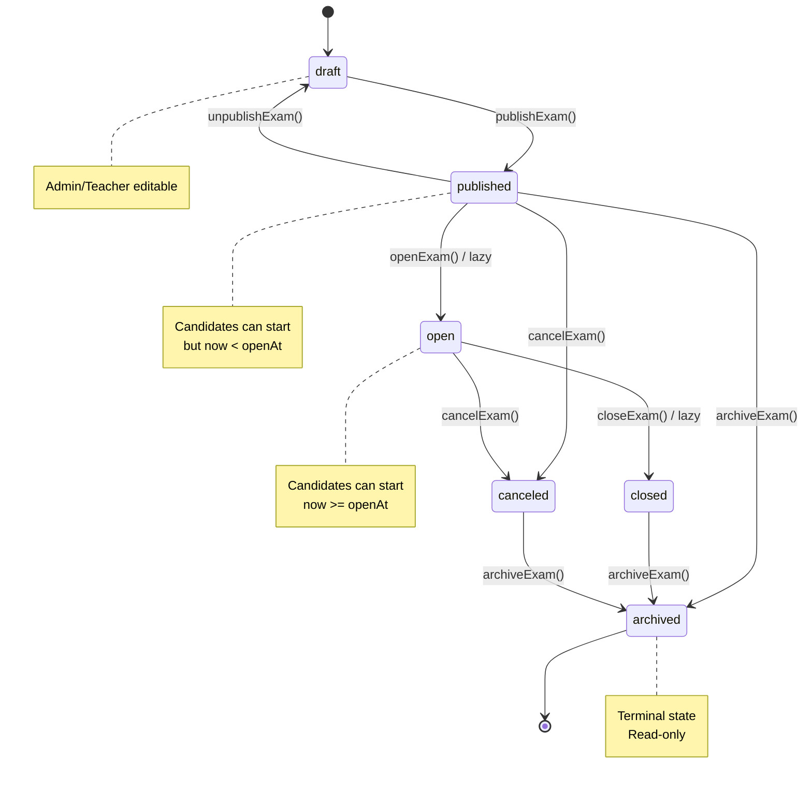
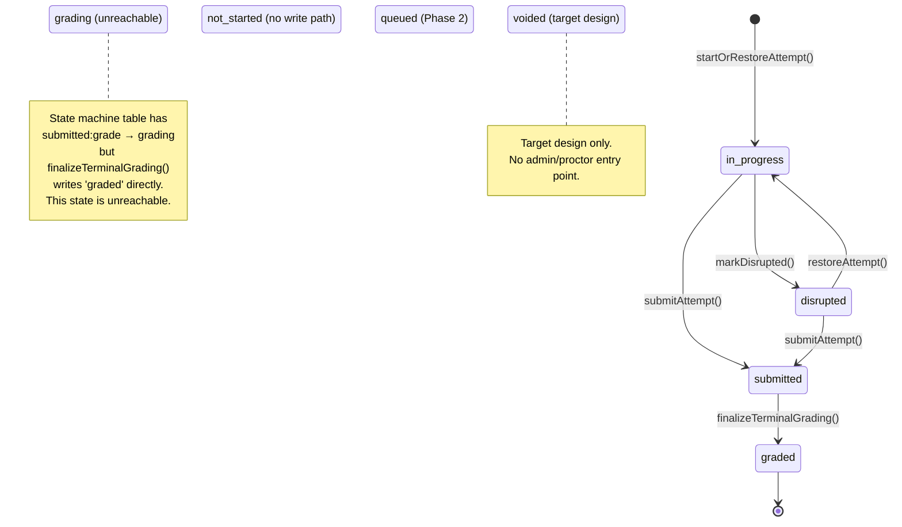
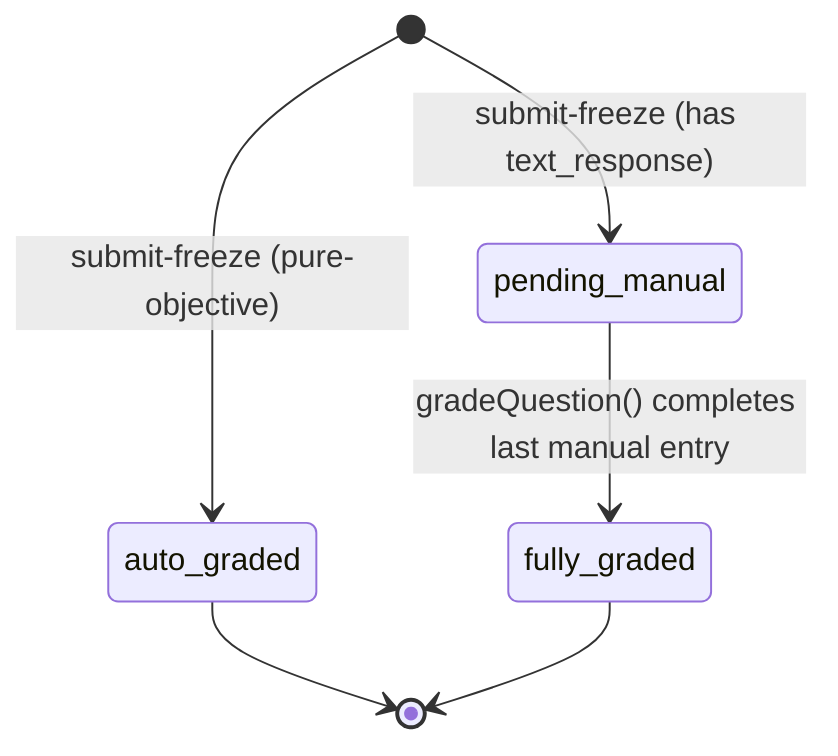
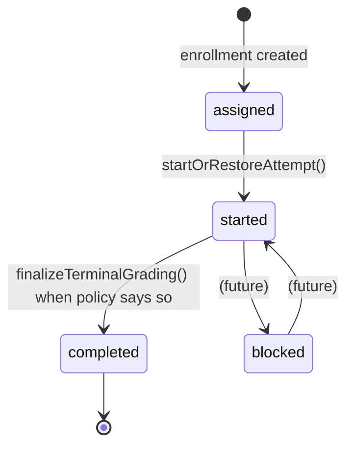
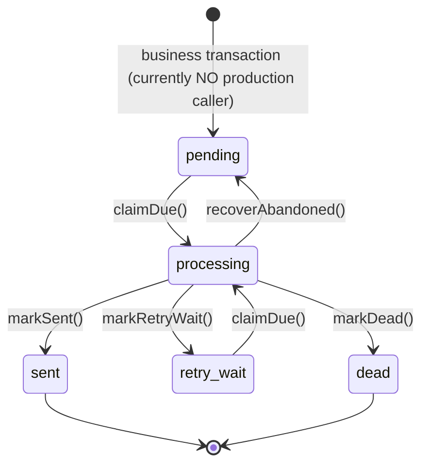

# State and Authority Model

> Normative description of the exam system's lifecycle states, sub-process states, policies, and fact timestamps.
> Recovery semantics and the frozen recovery contract are governed by [ADR-012](../../adr/ADR-012-candidate-recovery-contract.md) and described in [candidate-recovery.md](./candidate-recovery.md).

```text
Last runtime verified against: bcf02847b0231e233dcb3ff98ec7ae681739b028
Recovery contract updated in: ccdf879e8f21d208c9d491f9a555ed07c5281b8f (PR #218)

Verification scope:
Runtime behavior verified against master after merged P5-0 / PR #210.
Recovery back-reference added in PR #218.
```

## Why these must not be collapsed

The system has **five orthogonal state dimensions**:

1. **Exam lifecycle status** — the publication/operation state of the exam container.
2. **Attempt lifecycle status** — the execution state of one candidate's attempt.
3. **Attempt grading status** — the scoring pipeline state, orthogonal to attempt lifecycle.
4. **Enrollment status** — the candidate's overall qualification state for an exam.
5. **Email outbox status** — the delivery lifecycle of an email record.

Collapsing these into one enum would create a combinatorial explosion and make it impossible to reason about one dimension independently.

---

## 1. Exam Lifecycle Status

### States

| State | Meaning | Candidates can start attempts? |
|-------|---------|-------------------------------|
| `draft` | Being configured by Admin | No |
| `published` | Released; `now < openAt` | Yes (OPEN_STATUSES includes published) |
| `open` | `now >= openAt`; actively accepting attempts | Yes |
| `closed` | Normal end | No |
| `canceled` | Abnormal cancellation | No |
| `archived` | Terminal archive; read-only | No |

### State machine diagram



**Authority**: `packages/exam-engine/src/examStateMachine.ts` `EXAM_VALID_TRANSITIONS`
**Evidence**: All transitions go through `assertTransition()` in `examCommands.ts`
**Known limitations**: `published → archived` is legal in the state machine but the route layer only allows archive from `closed` or `canceled` after reconciliation.

### Commands owning each transition

| Transition | Command | Actor |
|------------|---------|-------|
| `draft → published` | `publishExam()` | Admin, Teacher |
| `published → draft` | `unpublishExam()` | Admin |
| `published → open` | `openExam()` (or `checkAndUpdateExamStatus()`) | Admin / System (lazy) |
| `open → closed` | `closeExam()` (or `checkAndUpdateExamStatus()`) | Admin, Teacher / System (lazy) |
| `published → canceled` | `cancelExam()` | Admin |
| `open → canceled` | `cancelExam()` | Admin |
| `published → archived` | `archiveExam()` | Admin |
| `closed → archived` | `archiveExam()` | Admin |
| `canceled → archived` | `archiveExam()` | Admin |

---

## 2. Attempt Lifecycle Status

### States

| State | Meaning | Answers writable? | Reachable? |
|-------|---------|-------------------|------------|
| `not_started` | Enrolled but not started | N/A | **NO** — no write path |
| `queued` | Waiting for batch entry (Phase 2) | N/A | **NO** — Phase 2 planned |
| `in_progress` | Actively taking the exam | Yes | YES |
| `disrupted` | Heartbeat timeout; disconnected | No | YES |
| `submitted` | Candidate submitted; frozen | No | YES |
| `grading` | Auto-grading in progress (transient) | No | **NO** — no write path |
| `graded` | All scoring complete | No | YES |
| `voided` | Terminal override | No | **NO** — target design |

### State machine diagram



**Authority**: `packages/exam-engine/src/attemptStateMachine.ts` `TRANSITION_TABLE`
**Evidence**: `submitAttempt()`, `markDisrupted()`, `restoreAttempt()`, `finalizeTerminalGrading()` all use `transition()` from the state machine
**Known limitations**: The `grading` state is unreachable — `finalizeTerminalGrading()` writes `status = 'graded'` directly. The state machine table entries `submitted:grade → grading` and `grading:complete_grading → graded` exist but are never invoked.

### Commands owning each transition

| Transition | Command | Actor |
|------------|---------|-------|
| (enrollment) → `in_progress` | `startOrRestoreAttempt()` | Candidate |
| `in_progress → disrupted` | `markDisrupted()` | Heartbeat scanner (System) |
| `disrupted → in_progress` | `restoreAttempt()` | Candidate |
| `in_progress → submitted` | `submitAttempt()` | Candidate / System (deadline) / Admin (force) |
| `disrupted → submitted` | `submitAttempt()` | System (deadline) / Admin (force) |
| `submitted → graded` | `finalizeTerminalGrading()` | System (auto-grade or manual-grade closure) |

---

## 3. Grading Status (sub-process state)

### States

| State | Meaning |
|-------|---------|
| `auto_graded` | Scored entirely by the auto-grading engine (set at submit-freeze for pure-objective attempts) |
| `pending_manual` | Has text_response questions awaiting manual scoring |
| `fully_graded` | All questions (auto + manual) scored |

### Orthogonality to Attempt Status

`gradingStatus` is **orthogonal** to `attemptStatus`. An attempt may be:
- `submitted` + `pending_manual` (awaiting manual scoring)
- `graded` + `auto_graded` (pure-objective, graded at submit)
- `graded` + `fully_graded` (manual scoring complete)

### State machine diagram



**Authority**: Set once at submit-freeze by `submitAttempt()`, advanced to `fully_graded` by `finalizeTerminalGrading()`
**Evidence**: `packages/exam-engine/src/attemptCommands.ts` `submitAttempt()` sets gradingStatus; `grading.ts` `finalizeTerminalGrading()` advances it

---

## 4. Enrollment Status

### States

| State | Meaning |
|-------|---------|
| `assigned` | Candidate enrolled; no attempt started yet |
| `started` | At least one attempt created |
| `completed` | Retake policy exhausted, passed, or exam window closed |
| `blocked` | Violation; candidate is blocked |

### State machine diagram



**Authority**: `packages/exam-engine/src/enrollmentStateMachine.ts` `ENROLLMENT_VALID_TRANSITIONS`
**Evidence**: `startOrRestoreAttempt()` transitions `assigned → started`; `finalizeTerminalGrading()` transitions `started → completed`

---

## 5. Email Outbox Status

### States

| State | Meaning |
|-------|---------|
| `pending` | Queued for sending |
| `processing` | Claimed by a worker |
| `retry_wait` | Failed; waiting for retry |
| `sent` | Successfully delivered (terminal) |
| `dead` | Max attempts exceeded (terminal) |

### State machine diagram



**Authority**: `packages/db/src/repository/emailOutboxRepo.ts` + DB CHECK constraints
**Evidence**: `claimDue()` uses `FOR UPDATE SKIP LOCKED`; `markSent()`/`markRetryWait()`/`markDead()` are ownership-fenced
**Known limitations**: No production business caller exists. The infrastructure is implemented (P5-0 merged) but the business notification-to-outbox protocol is NOT IMPLEMENTED (P5-N1 scope).

---

## 6. Policy Fields

### 6.1 Result Publication Policy

| Field | Type | Effect |
|-------|------|--------|
| `exam.resultPublicationMode` | `immediate` / `after_grading` / `manual` | Controls when candidates see results |

- `immediate`: visible as soon as grading is computable.
- `after_grading`: visible only when `gradingStatus = fully_graded`.
- `manual`: hidden until `publishResults()` sets `resultsPublishedAt`.

### 6.2 Retake Policy

| Field | Type | Effect |
|-------|------|--------|
| `exam.retakePolicy` | `unlimited` / `max_attempts` / `pass_then_stop` | Controls whether a new attempt is allowed |

### 6.3 Score Strategy

| Field | Type | Effect |
|-------|------|--------|
| `exam.scoreStrategy` | `highest` / `latest` / `first` | Selects which attempt's score becomes the enrollment final score |

---

## 7. Fact Timestamps

| Field | Meaning | Set by | Writable? |
|-------|---------|--------|-----------|
| `exam.resultsPublishedAt` | First publish-results instant | `publishResults()` | Write-once |
| `attempt.startedAt` | When the attempt began | `startOrRestoreAttempt()` | Write-once |
| `attempt.submittedAt` | When the attempt was submitted | `submitAttempt()` / deadline reconciliation | Write-once |
| `attempt.gradedAt` | When grading finalized | `finalizeTerminalGrading()` | Write-once |
| `attempt.deadlineAt` | Effective deadline for the attempt | `startOrRestoreAttempt()` / `extendAttemptTime()` / `restoreAttempt()` | Updated by extension/restore |
| `attempt.lastActivityAt` | Heartbeat field | `saveAnswer()` / heartbeat route / `restoreAttempt()` | Updated on activity |
| `emailOutbox.sentAt` | When the email was delivered | `markSent()` | Write-once |

---

## 8. Summary: State Machine Independence

| Dimension | States | Independent? |
|-----------|--------|--------------|
| Exam status | 6 | Yes — unrelated to any specific candidate |
| Attempt status | 8 (4 reachable) | Yes — each attempt progresses independently |
| Grading status | 3 | Yes — orthogonal to attempt lifecycle |
| Enrollment status | 4 | Yes — describes candidate qualification |
| Email outbox status | 5 | Yes — describes delivery progress |
