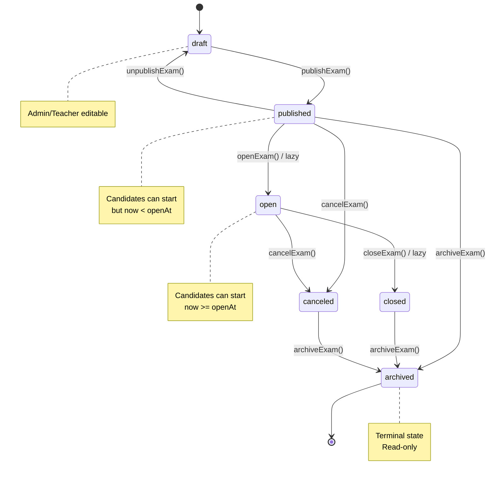
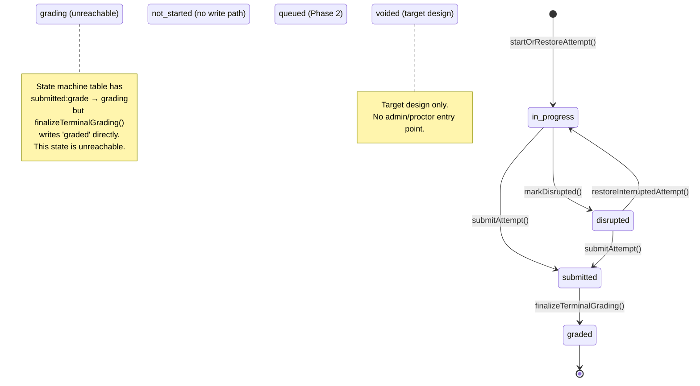
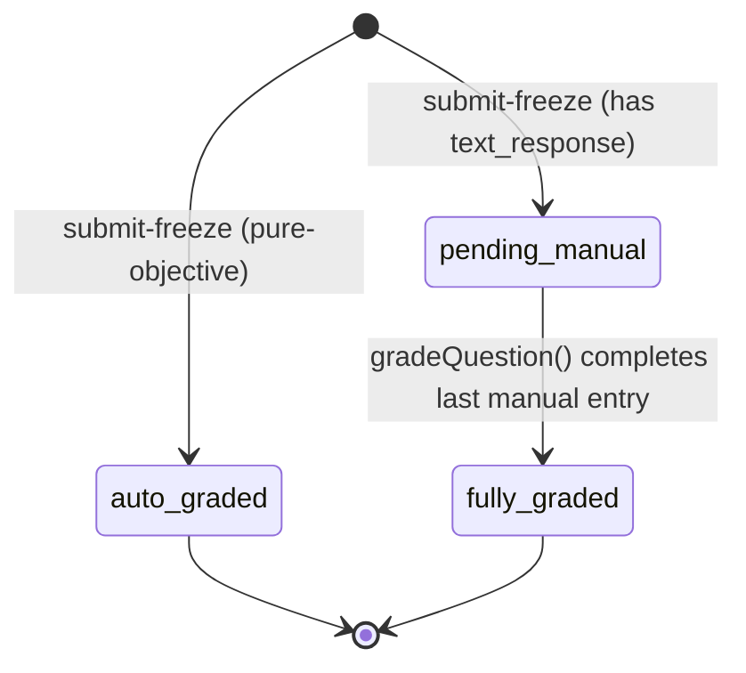
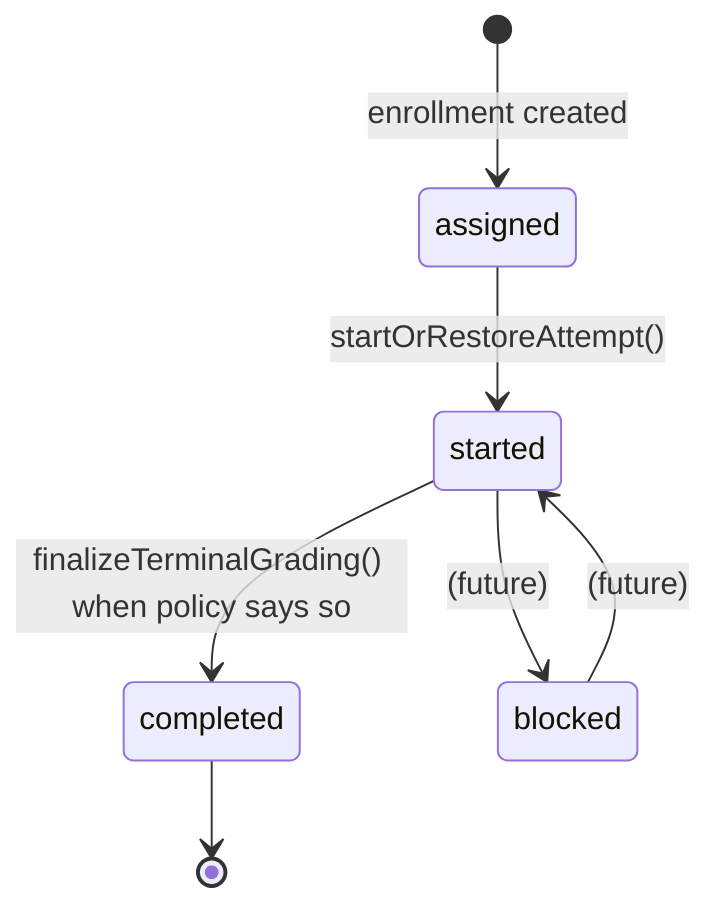
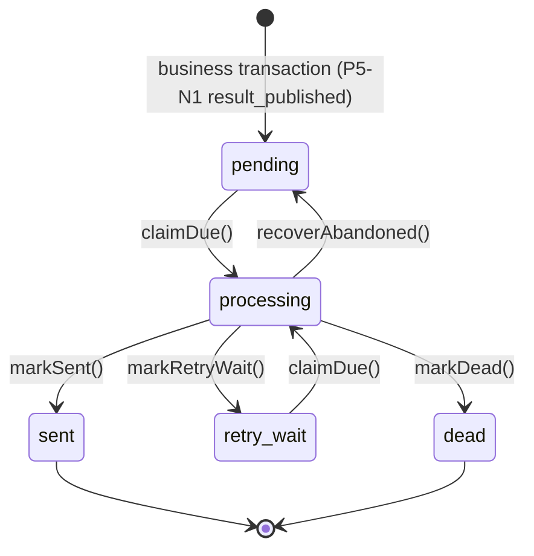

# State and Authority Model

> Normative description of the exam system's lifecycle states, sub-process states, policies, and fact timestamps.
> Recovery semantics are governed by [ADR-012](../../adr/ADR-012-candidate-recovery-contract.md). Interruption detection and time compensation are governed by [ADR-013](../../adr/ADR-013-interruption-time-compensation-policy.md). Both are described in [candidate-recovery.md](./candidate-recovery.md).

```text
Last runtime verified against: 1d3a0bd8 + P7-S2 branch (fix/p7-s2-runtime-authority-hardening)
Recovery contract authority: PR #218 / ADR-012 (amended by P7-S2-B)
Interruption-policy freeze: ADR-013 / REC-I4-R0

Verification scope (P7-S2 closeout, see docs/audits/P7-S2-RUNTIME-AUTHORITY-HARDENING-CLOSEOUT.md):
- Result publication is SINGLE-WINNER (P7-S2-A): `publishResults()` locks the
  exam row (FOR UPDATE) and re-reads `resultsPublishedAt` under the lock;
  concurrent publishers cannot both observe NULL. Deterministic two-connection
  race tests prove one applied + one alreadyPublished under both READ COMMITTED
  and REPEATABLE READ.
- Answer version protocol (P7-S2-B): `baseVersion === currentVersion` is
  required for a new save; future base versions are rejected with
  `FUTURE_VERSION` (ANSWER_BASE_VERSION_MUST_EQUAL_CURRENT_VERSION).
- Email delivery is classified AT-LEAST-ONCE (P7-S2-D): the PostgreSQL outbox
  state machine is durable, SMTP delivery is an external side effect, and a
  fail-fast config invariant requires EMAIL_WORKER_LOCK_TIMEOUT_MS to exceed
  the SMTP phase timeouts. Worker liveness is observable via
  `GET /api/system` (emailStatus.worker heartbeat).
- No general startup reconciler exists (P7-S2 Phase 5 negative result):
  crash-atomicity tests prove all cross-domain mutations commit in ONE
  PostgreSQL transaction. Read-only integrity diagnostics for legacy-only
  attempt shapes are exposed at `GET /api/system/diagnostics` → `integrity`.
```

Historical note: the previous verification entry (53ac3524, post-PR #238,
Proctor time grants "inactive until M11") described the runtime before J3/J4
(incidents + proctor scope) landed; the M11 milestone wording is stale — the
current fact is that Proctor presets do not include time grants (J4-I1B), so
`grantAttemptTime()` remains Admin-only today.

## Why these must not be collapsed

The system has **five orthogonal state dimensions**:

1. **Exam lifecycle status** — the publication/operation state of the exam container.
2. **Attempt lifecycle status** — the execution state of one candidate's attempt.
3. **Attempt grading status** — the scoring pipeline state, orthogonal to attempt lifecycle.
4. **Enrollment status** — the candidate's overall qualification state for an exam.
5. **Email outbox status** — the delivery lifecycle of an email record.

ADR-013 adds two persistent recovery evidence concepts without collapsing
them into attempt lifecycle:

1. **Interruption episode** — one server-detected interruption of one Attempt.
2. **Time adjustment** — one positive, attributable deadline change.

Items 6–7 are part of the ADR-013 persistence model and are present in the
schema (interruption episodes, time-adjustment ledger, append-only interruption
events, `currentInterruptionId` / `interruptedAt` on attempts).

Collapsing these into one enum would create a combinatorial explosion and make it impossible to reason about one dimension independently.

---

## 1. Exam Lifecycle Status

### States

| State | Meaning | Candidates can start attempts? |
|-------|---------|-------------------------------|
| `draft` | Being configured by Admin | No |
| `published` | Released; `now < openAt` | Yes (OPEN_STATUSES includes published) |
| `open` | `now >= openAt`; actively accepting attempts | Yes |
| `closed` | Normal end | No |
| `canceled` | Abnormal cancellation | No |
| `archived` | Terminal archive; read-only | No |

### State machine diagram



**Authority**: `packages/exam-engine/src/examStateMachine.ts` `EXAM_VALID_TRANSITIONS`
**Evidence**: All transitions go through `assertTransition()` in `examCommands.ts`
**Known limitations**: `published → archived` is legal in the state machine but the route layer only allows archive from `closed` or `canceled` after reconciliation.

### Commands owning each transition

| Transition | Command | Actor |
|------------|---------|-------|
| `draft → published` | `publishExam()` | Admin, Teacher |
| `published → draft` | `unpublishExam()` | Admin |
| `published → open` | `openExam()` (or `checkAndUpdateExamStatus()`) | Admin / System (lazy) |
| `open → closed` | `closeExam()` (or `checkAndUpdateExamStatus()`) | Admin, Teacher / System (lazy) |
| `published → canceled` | `cancelExam()` | Admin |
| `open → canceled` | `cancelExam()` | Admin |
| `published → archived` | `archiveExam()` | Admin |
| `closed → archived` | `archiveExam()` | Admin |
| `canceled → archived` | `archiveExam()` | Admin |

---

## 2. Attempt Lifecycle Status

### States

| State | Meaning | Answers writable? | Reachable? |
|-------|---------|-------------------|------------|
| `not_started` | Enrolled but not started | N/A | **NO** — no write path |
| `queued` | Waiting for batch entry (Phase 2) | N/A | **NO** — Phase 2 planned |
| `in_progress` | Actively taking the exam | Yes | YES |
| `disrupted` | Heartbeat timeout; disconnected | No | YES |
| `submitted` | Candidate submitted; frozen | No | YES |
| `grading` | Auto-grading in progress (transient) | No | **NO** — no write path |
| `graded` | All scoring complete | No | YES |
| `voided` | Terminal override | No | **NO** — target design |

### State machine diagram



**Authority**: `packages/exam-engine/src/attemptStateMachine.ts` `TRANSITION_TABLE` documents the intended lifecycle graph. It is **not** the only transition enforcement: `submitAttempt()` / terminal grading use the established `transition()` seams, but the REC-I4 disruption/restore transitions (`markDisrupted()`, the lifecycle-only helper `restoreAttemptState()`) enforce their transition **directly** inside the canonical locked commands — explicit status precondition + row lock + direct `attemptRepo.update(...)`, not a `TRANSITION_TABLE.transition()` call.
**Evidence**: `submitAttempt()` calls `transition()` (`attemptCommands.ts:367`); `markDisrupted()` writes `status: "disrupted"` directly after re-checking `status === "in_progress"` under the row lock (`attemptCommands.ts:531`); `restoreAttemptState()` writes `status: "in_progress"` directly after re-checking `status === "disrupted"` (`attemptCommands.ts:598`). The `TRANSITION_TABLE` is the lifecycle *contract*, not a single chokepoint every command funnels through.
**Known limitations**: The `grading` state is unreachable — `finalizeTerminalGrading()` writes `status = 'graded'` directly. The state machine table entries `submitted:grade → grading` and `grading:complete_grading → graded` exist but are never invoked.

### Commands owning each transition

| Transition | Command | Actor |
|------------|---------|-------|
| (enrollment) → `in_progress` | `startOrRestoreAttempt()` | Candidate |
| `in_progress → disrupted` | `markDisrupted()` | Heartbeat scanner (System) |
| `disrupted → in_progress` | `restoreInterruptedAttempt()` | Candidate |
| `in_progress → submitted` | `submitAttempt()` | Candidate / System (deadline) / Admin (force) |
| `disrupted → submitted` | `submitAttempt()` | System (deadline) / Admin (force) |
| `submitted → graded` | `finalizeTerminalGrading()` | System (auto-grade or manual-grade closure) |

---

## 3. Grading Status (sub-process state)

### States

| State | Meaning |
|-------|---------|
| `auto_graded` | Scored entirely by the auto-grading engine (set at submit-freeze for pure-objective attempts) |
| `pending_manual` | Has text_response questions awaiting manual scoring |
| `fully_graded` | All questions (auto + manual) scored |

### Orthogonality to Attempt Status

`gradingStatus` is **orthogonal** to `attemptStatus`. An attempt may be:

- `submitted` + `pending_manual` (awaiting manual scoring)
- `graded` + `auto_graded` (pure-objective, graded at submit)
- `graded` + `fully_graded` (manual scoring complete)

### State machine diagram



**Authority**: Set once at submit-freeze by `submitAttempt()`, advanced to `fully_graded` by `finalizeTerminalGrading()`
**Evidence**: `packages/exam-engine/src/attemptCommands.ts` `submitAttempt()` sets gradingStatus; `grading.ts` `finalizeTerminalGrading()` advances it

---

## 4. Enrollment Status

### States

| State | Meaning |
|-------|---------|
| `assigned` | Candidate enrolled; no attempt started yet |
| `started` | At least one attempt created |
| `completed` | Retake policy exhausted, passed, or exam window closed |
| `blocked` | Violation; candidate is blocked |

### State machine diagram



**Authority**: `packages/exam-engine/src/enrollmentStateMachine.ts` `ENROLLMENT_VALID_TRANSITIONS`
**Evidence**: `startOrRestoreAttempt()` transitions `assigned → started`; `finalizeTerminalGrading()` transitions `started → completed`

---

## 5. Email Outbox Status

### States

| State | Meaning |
|-------|---------|
| `pending` | Queued for sending |
| `processing` | Claimed by a worker |
| `retry_wait` | Failed; waiting for retry |
| `sent` | Successfully delivered (terminal) |
| `dead` | Max attempts exceeded (terminal) |

### State machine diagram



**Authority**: `packages/db/src/repository/emailOutboxRepo.ts` + DB CHECK constraints
**Evidence**: `claimDue()` uses `FOR UPDATE SKIP LOCKED`; `markSent()`/`markRetryWait()`/`markDead()` are ownership-fenced
**Known limitations**: The business notification-to-outbox protocol is
implemented for result publication (P5-N1, PR #213): `notificationService`
inserts Inbox + Email outbox rows atomically with the publication transaction,
and the outbox insert is required when a normalized recipient email exists.

### Delivery semantics (P7-S2-D)

```text
DB outbox processing = durable (PostgreSQL state machine, ownership-fenced)
SMTP delivery        = external side effect (no transaction boundary)
delivery semantics   = AT LEAST ONCE
```

Exactly-once is NOT claimed. The canonical ambiguity: SMTP accepts the mail →
the process/network fails before the app records `markSent` → the outbox row
remains recoverable → a retry may send a duplicate. This is acceptable because
it is documented, bounded (retry policy + `maxAttempts` → `dead`), and each
outbox row's claim/mark cycle is ownership-fenced so only one worker owns a
row at a time.

Lease safety (fail-fast config invariant in `runtimeConfig.ts`): the worker
lock timeout must be strictly greater than the sum of the SMTP phase timeouts
(connection + greeting + socket), otherwise an alive worker could be reclaimed
while still sending. Because nodemailer's `socketTimeout` is an *inactivity*
timeout (not a total-operation cap), a slow-but-active SMTP server can in
principle extend a send beyond that sum — the residual window is the
at-least-once boundary above, not a config error.

Worker liveness is observable: `GET /api/system` reports
`emailStatus.worker.status` (`available`/`degraded`/`unknown`) from the
`worker_heartbeats` row vs `EMAIL_WORKER_HEARTBEAT_STALE_MS`. Abandoned
`processing` rows are recovered by `recoverAbandoned()` inside the worker poll
loop (worker-owned by design — the API does not duplicate recovery ownership;
the operational question is answered by the heartbeat observability, not by
moving lifecycle into the API).
Additional operational notification types remain P5-N2+ scope.

---

## 6. Policy Fields

### 6.1 Result Publication Policy

| Field | Type | Effect |
|-------|------|--------|
| `exam.resultPublicationMode` | `immediate` / `after_grading` / `manual` | Controls when candidates see results |

- `immediate`: visible as soon as grading is computable.
- `after_grading`: visible only when `gradingStatus = fully_graded`.
- `manual`: hidden until `publishResults()` sets `resultsPublishedAt`.

**Single-winner invariant (P7-S2-A, RESULT_PUBLISH_IS_SINGLE_WINNER)**:
for one exam, `resultsPublishedAt` transitions `NULL → timestamp` exactly once.
`publishResults()` reads the exam under `FOR UPDATE` and re-checks
`resultsPublishedAt` under the lock, so two concurrent publishers cannot both
observe `NULL`: exactly one caller owns the applied publication, every loser
observes `alreadyPublished=true`, the stored timestamp never changes after the
first publication, and exactly one `exam.publish_results` audit + one logical
fan-out event exist (audit + Inbox/outbox fan-out commit in the same
transaction as the timestamp). Proof: `apps/api/src/routes/publishResults.concurrency.test.ts`
(deterministic two-connection barrier, READ COMMITTED + REPEATABLE READ).

### 6.2 Retake Policy

| Field | Type | Effect |
|-------|------|--------|
| `exam.retakePolicy` | `unlimited` / `max_attempts` / `pass_then_stop` | Controls whether a new attempt is allowed |

### 6.3 Score Strategy

| Field | Type | Effect |
|-------|------|--------|
| `exam.scoreStrategy` | `highest` / `latest` / `first` | Selects which attempt's score becomes the enrollment final score |

---

## 7. Fact Timestamps

| Field | Meaning | Set by | Writable? |
|-------|---------|--------|-----------|
| `exam.resultsPublishedAt` | First publish-results instant | `publishResults()` (row-lock serialized, P7-S2-A) | Write-once |
| `attempt.startedAt` | When the attempt began | `startOrRestoreAttempt()` | Write-once |
| `attempt.submittedAt` | When the attempt was submitted | `submitAttempt()` / deadline reconciliation | Write-once |
| `attempt.gradedAt` | When grading finalized | `finalizeTerminalGrading()` | Write-once |
| `attempt.deadlineAt` | Effective deadline for the attempt | `startOrRestoreAttempt()` / `grantAttemptTime()` / `restoreInterruptedAttempt()` | Updated by operator grant/restore |
| `attempt.lastActivityAt` | Heartbeat field | `saveAnswer()` / heartbeat route / `restoreInterruptedAttempt()` | Updated on activity |
| `emailOutbox.sentAt` | When the email was delivered | `markSent()` | Write-once |

REC-I4-I2 replaced the transitional coupling: `restoreInterruptedAttempt()` is
the composed candidate restore command — it evaluates the interruption policy
(`evaluateInterruptionTimePolicy()`), writes a `bounded_grace` adjustment when
policy grants one, reconciles the deadline
(`ensureAttemptDeadlineReconciled()`), restores the lifecycle via the
lifecycle-only helper `restoreAttemptState()`, and writes the `restored`
outcome event. `grantAttemptTime()` is an independent operator-grant command,
not part of candidate restore.

### Interruption and adjustment facts (ADR-013, implemented)

| Field | Meaning | Set by | Writable? |
| --- | --- | --- | --- |
| `attempt.currentInterruptionId` | Active interruption episode pointer | Heartbeat disrupted scanner | Cleared on restore/terminal resolution |
| `attempt.interruptedAt` | Server instant when disrupted transition committed | Heartbeat disrupted scanner | Cleared with active pointer |
| `interruption.detected.occurredAt` | Durable detection instant | Heartbeat disrupted scanner | Append-only event |
| `interruption.detected.observedLastActivityAt` | `lastActivityAt` observed by the scanner | Heartbeat disrupted scanner | Append-only event |
| `interruption.outcome.occurredAt` | Restore or terminal resolution instant | `restoreInterruptedAttempt()` / `resolveActiveInterruptionOnTerminalization()` | Append-only event |
| `adjustment.beforeDeadline` | Deadline before a positive grant | `grantAttemptTime()` / `restoreInterruptedAttempt()` (bounded_grace) | Write-once |
| `adjustment.afterDeadline` | Deadline after a positive grant | `grantAttemptTime()` / `restoreInterruptedAttempt()` (bounded_grace) | Write-once |
| `adjustment.createdAt` | Server adjustment decision instant | `grantAttemptTime()` / `restoreInterruptedAttempt()` (bounded_grace) | Write-once |

## 8. Interruption-Time Policy (implemented)

### Policy states

| Policy | Candidate restore | Automatic grant |
| --- | --- | --- |
| `strict` | Lifecycle restore after deadline reconciliation | 0 |
| `bounded_grace` | Policy evaluation precedes final reconciliation | Explicitly capped |
| `operator_incident` | Same as strict | 0; separate operator command |

`strict` is the default and migration backfill. `bounded_grace` requires
explicit positive per-incident and per-attempt aggregate caps. The policy and
caps are copied to an immutable Attempt snapshot at creation.

### Authority boundaries

| Fact or decision | Authority |
| --- | --- |
| Recent qualifying activity | PostgreSQL `lastActivityAt` |
| Disrupted lifecycle state | PostgreSQL Attempt row |
| One interruption identity | PostgreSQL interruption episode + Attempt pointer |
| Effective deadline | `min(exam.closeAt, attempt.deadlineAt)` after any committed adjustment |
| Automatic aggregate already granted | Sum of committed `bounded_grace` ledger rows |
| Positive time grant attribution | PostgreSQL append-only time-adjustment ledger |
| Client offline duration | Diagnostic only; never authority |
| Redis presence/TTL | Optional cache evidence only; never authority |

The supported current single-app scanner remains an in-process Fastify
interval. A future multi-instance scanner may coordinate leadership with a
PostgreSQL advisory lock. Redis is not introduced by REC-I4 and cannot own a
deadline or irreversible attempt transition.

---

## 9. Summary: State Machine Independence

| Dimension | States | Independent? |
|-----------|--------|--------------|
| Exam status | 6 | Yes — unrelated to any specific candidate |
| Attempt status | 8 (4 reachable) | Yes — each attempt progresses independently |
| Grading status | 3 | Yes — orthogonal to attempt lifecycle |
| Enrollment status | 4 | Yes — describes candidate qualification |
| Email outbox status | 5 | Yes — describes delivery progress |
| Interruption episode (implemented) | active/resolved evidence | Yes — identity and evidence, not lifecycle entitlement |
| Time adjustment (implemented) | append-only positive facts | Yes — deadline provenance, not attempt status |
| Incident (ADR-014) | 4 | Yes — operational case orthogonal to Attempt; Admin runtime IMPLEMENTED by J3 (CLOSED — PR #242 merged); Proctor scope and recovery UI NOT IMPLEMENTED |

---

## 10. P7-S2 Authority Amendments (current implementation status)

### Answer version protocol (P7-S2-B)

`ANSWER_BASE_VERSION_MUST_EQUAL_CURRENT_VERSION`: for a new, non-idempotent
answer save, `baseVersion === currentVersion` is required. Classification:

```text
baseVersion < currentVersion  → STALE_VERSION     (conflict)
baseVersion == currentVersion → eligible           (accepted, version+1)
baseVersion > currentVersion  → FUTURE_VERSION     (conflict, new in P7-S2-B)
```

Same-`clientSeq` idempotent replay is evaluated BEFORE the version check and
is unaffected (same payload → replay, different payload → CONFLICTING_PAYLOAD).
The wire enum `SaveAnswerRejectReason` gained `FUTURE_VERSION`
(`packages/contracts/src/attempt.ts`); the frontend treats it as a generic
save rejection (only `STALE_VERSION` triggers server-answer reconciliation).
Previously (ADR-012 KNOWN_DEFECT REC-I2a) a future `baseVersion` was silently
accepted as `currentVersion + 1`; ADR-012 is amended below.

### Crash/rollback evidence (P7-S2 Phase 4)

`apps/api/src/routes/crashAtomicity.test.ts` injects a deterministic
throw-after-mutation inside the same uncommitted transaction shape the routes
use, for: submit freeze, manual-grading terminalization, result publication,
interruption detection, interruption restore, and operator time grant. Every
flow rolls back fully (zero committed partial state) and a fresh retry
succeeds. Receipt-backed commands (force-submit, misconduct, incident,
proctor assignment) have replay evidence in their dedicated concurrency
suites. Conclusion: **no general startup reconciler is implemented** — no
committed incomplete state is reachable from current supported runtime
behavior. Legacy-only anomalies are DETECTED read-only at
`GET /api/system/diagnostics` → `integrity` (submitted+auto_graded not
terminalized; submitted workset mismatch) and are never auto-repaired.

### Redis boundary (unchanged)

Redis remains limited to shared rate-limit ephemeral state and read-only
system-health diagnostics. It owns no exam fact, and no TTL can trigger an
irreversible transition (ADR-013 §11 freeze). P7-S2 adds no Redis
responsibility.
