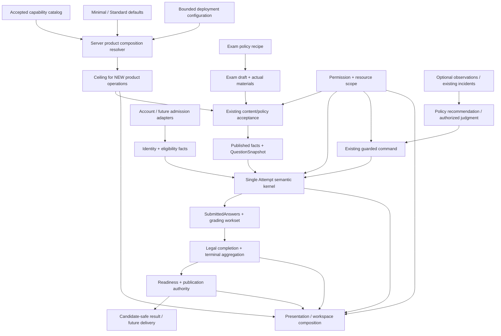

# Product capability composition

> **产品能力组合规范正文。** 本文由
> [ADR-022](../adr/ADR-022-product-capability-composition.md) 采纳，定义 Exam
> 如何在**同一考试语义内核**之上组合产品能力、部署配置、策略与呈现。
> 本文不建立第二套 Attempt / grading / answer / result 语义，也不把产品能力
> 与 RBAC 权限混为一谈。
>
> 设计来源：2026-10-02 独立架构评审，基线 `master@eb5d580`。
> 相关工作入口：[Issue #678](https://github.com/jnhu76/exam/issues/678)。

## 1. Decision

Exam 采用**有界能力组合（bounded capability composition）**：

```text
Exam 产品
= 单一考试语义内核
  + 经采纳且有证据的可选能力
  + 机构/资源授权与统一身份准入边界
  + 具体考试的已物化策略及快照
  + 产品组合默认值与界面呈现规则
  + 满足运行要求的部署环境
```

`Simple / General` 不再作为领域顶层分类，也不得成为 runtime mode。
近期只保留两个产品 preset：`Minimal` 与 `Standard`。它们是默认组合与呈现
复杂度，不拥有考试事实，不改变 QuestionType → grading mode，不创建第二套
状态机。

**Minimal 可以包含 Plain `text_response` 与基础人工阅卷。** 产品简单度与
是否存在主观题是两个不同事实。

## 2. Authority boundaries

本设计遵守现有 [Exam semantic boundaries](exam-semantic-boundaries.md)：
产品组合只决定**当前部署允许新增哪些产品操作**，不重新解释已经冻结或已被
服务器接受的考试事实。

```text
Kernel owns correctness.
Modules own optional capability.
Policies own configurable decisions.
Profiles own composition defaults.
Presentation owns UX exposure.
Permissions own actor authority.
```

这些概念必须保持分离：

| 对象 | 回答的问题 | Authority |
| --- | --- | --- |
| `ProductPreset` | 部署最初开放哪些功能、默认显示什么？ | 默认值；名称不是运行时判据 |
| `DeploymentProductConfiguration` | 当前部署允许新增哪些产品操作？ | 服务器权威、版本化 |
| `ExamPolicyProfile` | 一场考试采用哪些策略默认值？ | 作者期 copy-on-apply；具体 Exam 持有实际值 |
| `PresentationPreferences` | 如何渐进呈现已允许能力？ | 仅 UI；不能授予权限或扩大产品能力 |
| `Permission` / resource scope | 当前 actor 能否执行该操作？ | 现有 authz authority；独立于产品 capability |

`basic_quiz` / `standard_online` 继续是考试策略 recipe，不是产品 SKU。

## 3. Orthogonal dimensions

概念上保留以下八个轴。轴可区分，不意味着必须实现成八个插件或八套 package。

| 轴 | 必须区分的事实 | 约束 |
| --- | --- | --- |
| 机构归属与资源授权 | 谁拥有考试、谁管理、资源属于哪里 | 当前单租户/default organization；外部 claim 不能直接改写内部 owner |
| 身份与准入 | 我是谁、如何证明、是否有资格、能否此刻开始 | identity ≠ eligibility；#645 独立负责未来 roster/federation |
| 测评与表达 | QuestionType、题干/选项、答案表示 | Math/Table/Code 是内容能力，不是新题型 |
| 评分工作流 | auto/manual、评分依据、完成与聚合 | 题型决定 grading mode；产品配置不能重分类 |
| 考试与结果策略 | 窗口/时长/恢复/重考/结果发布 | 继续使用现有 policy 与 publication authority |
| 完整性证据与处置 | operator observation、incident、授权后果 | observation ≠ violation ≠ grading fact |
| 交付与运行环境 | remote/on-site/LAN/未来 offline | delivery 不创建第二份 Attempt/Submission truth |
| 呈现复杂度 | Minimal/Standard、导航、工作台 | 只影响 surface；不能隐藏必须处理的 correctness work |

### 3.1 `companyId` / organization

`companyId` 没有固定领域含义：

- 一个部署就是公司 A：属于部署机构设置，内部仍使用服务器解析的
  `organizationId` 作为归属权威；
- 外部 OA company claim：属于 issuer namespace，经服务器映射，不能直接当
  内部 organization primary key；
- 公司内员工群组：属于 eligibility/membership 事实；
- 纯展示字段：只能是 metadata；
- 真正多公司隔离：是新的 multi-tenant/platform 决策，不由本设计暗示已支持。

## 4. Kernel / module / policy / presentation boundary

### 4.1 Kernel — 产品配置不可绕开

以下语义不得成为可关闭模块：

- stable Attempt owner 与资源授权边界；
- Exam / Attempt lifecycle 与服务器时间权威；
- QuestionSnapshot / AttemptSnapshot 与冻结点；
- SaveAnswer 版本、幂等、冲突协议；
- 首次 submit 的答案冻结与评分工作集物化；
- grading entry completion、terminal aggregation、score/pass truth；
- result readiness / publication / candidate-safe projection；
- 必要 recovery / audit / security validation。

“Kernel”表示**产品配置不得绕开**，不是要求新建一个巨大 Kernel class。

### 4.2 Modules — 可选产品能力

近期模块是**静态内部能力边界**，不是动态插件生态。例如：

- Plain/Rich authoring 与 renderer；
- manual grading 产品 surface；
- admission queue；
- operator monitoring / incident surface；
- 未来 roster/federation adapter；
- 未来 external result delivery provider。

当前不采用第三方动态 plugin package、插件 marketplace、通用规则语言或微服务
拆分。

### 4.3 Policies

Policy 只能在已支持决策范围内选择，例如 eligibility template、运行参数、结果
发布或完整性观察后的合法处置。Policy 不得直接获得任意 status / score writer。

### 4.4 Presentation

Presentation 控制导航、按钮、工作台和渐进披露。它：

- 不授予权限；
- 不扩大部署能力；
- 不改变冻结 answerMode / grading mode；
- 不得隐藏 pending manual、recovery、incident 等仍要求人工处理的义务。

## 5. Product capability vocabulary

产品 capability 使用独立命名空间 `ProductCapabilityId`；不得复用
`Permission.*` 或 Web `capabilities.ts` 的操作者授权含义。

首期目录只包含**已经采纳且实现**的产品能力。未来提案不得因为出现在目录设计
文档中就自动变成可启用能力。

近期可表达的能力族包括：

```text
question.single_choice
question.multiple_choice
question.true_false
question.fill_blank
question.text_response

content.prompt.rich
content.option.rich
answer.text.rich

grading.manual
admission.account
admission.queue
result.publication
operator.monitoring
```

说明：

- `question.text_response` 当前天然要求 manual completion；不能开启主观题却关闭
  其 completion path；
- 基础非空文字 rubric 是当前 `text_response` 发布契约，不是可关闭 feature；
- Math authoring/editing 是 Rich V1 内容 facet。首期 Math/Table/Code 不必分别成为
  deployment flag；若未来承诺“禁用 Math 时 API 也不能写 Math”，必须升级为真正的
  server-side content write policy；
- Rich prompt、Rich option、Rich answer 是不同槽位，不得用一个模糊 `rich=true`
  推导全部行为；
- `grading.manual` 是产品 surface，但是否某场考试实际需要人工评分由冻结题目派生；
- roster / provisional / federated launch、structured rubric、multi-grader、camera/AI
  proctoring、durable offline client 仍是 FUTURE/DEFERRED，不能作为当前 enabled 值。

## 6. Canonical composition root

产品组合只有一个服务器权威入口；它不得复制既有 policy/content/authz 规则。

```text
Supported Product Catalog
        +
ProductPreset defaults
        +
Bounded explicit configuration
        ↓
resolveDeploymentProductConfiguration
        ↓
ResolvedProductConfiguration
        ↓
Actual draft/publish requirements
        ↓
Product capability available
AND actor Permission valid
AND resource scope/ownership valid
AND lifecycle/content/policy valid
        ↓
Existing domain command
```

规范关系：

```text
ResolvedProductConfiguration
= ValidateSupported(PresetDefaults ⊕ ExplicitConfiguration)

RequiredCapabilities(exam/materials)
⊆ capabilities currently allowed for NEW commitments
```

`⊕` 为有定义的覆盖。未知、reserved、future 或不支持项必须 fail closed；禁止
通过集合交集静默丢弃用户请求。

建议类型形状（字段仍可在实现阶段细化）：

```ts
type ProductCapabilityId = keyof typeof supportedProductCatalog;

interface DeploymentProductConfiguration {
  revision: number;
  enabled: readonly ProductCapabilityId[];
  presentation: "minimal" | "standard";
}

interface ResolvedProductConfiguration {
  revision: number;
  enabled: ReadonlySet<ProductCapabilityId>;
  requirements: readonly ProductRequirement[];
  presentation: "minimal" | "standard";
}
```

消费者不得按 preset 名称建立语义分支：

```text
BAD:  if (profile === "minimal") ...
GOOD: resolvedProduct.allows(operation/capability)
```

但必要的 QuestionType dispatch、grading classification 等现有领域 switch 继续保留；
不是所有 switch 都应改造成 registry。

## 7. Enforcement layers

真实 disabled capability 不能只隐藏 UI。至少覆盖：

1. authoring UI；
2. authoritative API write seam；
3. import / bulk / copy seam；
4. publish validation；
5. profile/template creation where relevant；
6. navigation / Dashboard composition。

首期通常**不需要动态注销 route**；保持同一 API/OpenAPI，写入口 server-side guard
即可。Rich editor bundle 可以继续 lazy-load，但历史数据需要的 decoder/renderer
不能随 capability 关闭而消失。

## 8. Capability changes and historical obligations

必须区分三类事实：

```text
NEW authoring / new commitments
ACCEPTED execution obligations
LIVE actor authorization / revocation
```

部署降级首先限制**新增使用**。它不得使以下已有义务失效：

- 已发布但尚未开始的考试；
- active attempt；
- pending manual grading；
- 历史 Rich 内容读取；
- 已接受的 result delivery obligation。

因此 capability change 必须有 impact preview，并在无法安全履约时拒绝降级或进入
显式 draining；禁止删除/重写历史事实，也禁止把 Rich 转成 Plain。

首期若配置只在 bootstrap 读取，可通过 startup preflight 保证稳定 revision。未来
引入应用内配置写入时，必须增加 revision/CAS 或等价序列化，使 publish acceptance
与 capability revision 竞争有明确结果。

实时安全撤销仍由 authz/credential authority 处理；普通产品 profile 改动不等于
安全撤销。

## 9. Administrator composition model

目标采用：**少量 preset + bounded customization**。

| 类别 | 内容 |
| --- | --- |
| FIXED | 单一 kernel、stable owner、authz、server deadline、save protocol、submit freeze、workset、terminal aggregation、安全输出、必要 recovery/audit |
| CONFIGURABLE | 当前题型开放集、已支持 Rich 作者操作、presentation、已支持 policy defaults、已采纳 admission 策略 |
| DERIVED | objective-only、manual-required、uses-rich-answer、pending grading、result readiness、异常处理入口 |
| FORBIDDEN | 关闭核心 correctness、空 owner、任意 status/score writer、通过 profile 激活 reserved/future 值、profile 更新改写历史事实 |

管理边界：

- Exam/Product Admin：选择受支持产品组合；未来若增加部署配置写权限，应独立定义；
- Host Operator：provider、secrets、网络、容量、部署环境；
- Maintainer：保持 ADR-017 的既有边界；
- Teacher / Grader / Proctor：继续由 Permission + resource scope 决定具体操作。

**Enable capability 不等于 grant Permission。**

## 10. Presets

近期只定义两个 preset，避免 SKU 扩张。

| Dimension | Minimal | Standard |
| --- | --- | --- |
| identity | 当前 Account + Candidate | 相同 |
| admission | 当前 Enrollment；默认不要求 queue | Enrollment；可使用已支持 queue |
| questions | 默认 single_choice、true_false、Plain text_response；multiple_choice 可开放 | 当前五种题型 |
| content | 默认 Plain；不要求 Rich editor | 支持当前 Rich prompt/options/answer |
| grading | auto + 基础 manual；复用统一 workset/grade command | 同一 grading engine 与完整现有 surface |
| delivery | browser + LAN/on-premise；不承诺 offline client | 相同 |
| proctoring | 不要求数字监考；物理监考可独立存在 | 可呈现现有 operator/incident/recovery surface；不默认 camera |
| result | 使用既有 publication authority | 相同 authority，更完整 surface |
| presentation | 最小 authoring/candidate/grading flow；必要 work 必须出现 | 标准完整 progressive surface |

`Minimal` **不是 objective-only**。合法组合示例：

```text
Minimal presentation
+ single_choice
+ true_false
+ Plain text_response
+ basic manual grading
+ no Rich/Math
```

保留“客观小测”作为创建 recipe，但 recipe 不定义整个产品。

## 11. Representative scenarios

### 11.1 Company qualification

```text
organization = company A deployment
eligibility = selected employees / existing Enrollment
question = objective + Plain subjective
grading = auto + manual
delivery = on-site browser + LAN
proctoring = physical
result = existing publication authority
presentation = Minimal or Standard
```

无账号 roster proof 依赖 #645；不要创建“企业考试 mode”。

### 11.2 Minimal subjective

```text
Account + Enrollment
single_choice + true_false + Plain text_response
basic manual grading
no Rich / Math / structured rubric
Minimal presentation
```

该场景必须通过现有 grading workset 完成，不能另存“简易分数”。

### 11.3 Rich academic exam

```text
Account + Enrollment
objective + text_response
Rich prompt/answer + Math/Table
manual grading
manual/delayed publication as already supported
Standard presentation
```

Rich protocol correctness继续由 #669/#673 负责；新 Math UX 由 #679 负责。

### 11.4 Federated enterprise certification

```text
trusted external issuer
signed launch grant
objective-only
auto grading
remote delivery
optional integrity provider
signed result delivery
```

这是目标组合，不是当前已交付能力。identity/session/federation/result integration 由
#645 独立冻结与实现。

### 11.5 Local exam room

```text
Account/roster eligibility
LAN/on-site
objective + subjective
physical invigilation
central server submission truth
```

LAN/on-premise ≠ durable offline client。未 ACK 输入、进程重启后的本地 outbox、全离线
交卷继续受 ADR-016/后续协议约束。

## 12. Proctoring and integrity boundary

推荐关系：

```text
Provider / authorized operator
  → observation / incident evidence
  → policy recommendation or authorized judgment
  → existing guarded command
  → kernel writes a legal fact
```

规范：

```text
observation ≠ violation
violation ≠ grading fact
```

现有 heartbeat/recovery 是考试执行正确性机制，不等同作弊判定。未来 camera/mic/
recording/AI provider 在启用前必须有独立真实性边界、隐私/retention、故障策略和授权
设计；本产品组合文档不使它们自动成为 supported capability。

## 13. Module loading meaning

“模块化”近期定义为：

- **YES**：逻辑能力边界；
- **YES**：静态内部 module/import；
- **LIMITED**：typed product catalogue / provider registry；
- **NO**：动态第三方 plugin ABI / marketplace。

Disabled capability 的近期行为：

- 常规 UI 不显示；
- 新 writes/import/publish 被 server authority 拒绝；
- 通常不动态注销 route；
- 可选 editor bundle 可不加载；
- 真正外部 provider/worker 可按配置不启动，但历史待履约 obligation 需要 draining；
- 不为 profile 裁剪镜像或删除旧 codec。

## 14. Implementation sequence

### Phase 0 — authority design

**本文 + ADR-022 + #678 即 Phase 0 的 authority root。**

冻结：

- product capability 与 RBAC 分离；
- Minimal 可含 Plain subjective；
- 基础文字 rubric 不可假关闭；
- future/reserved 功能不会因目录存在而启用；
- capability change 必须保护已接受执行义务；
- Product Admin / Host Operator / Maintainer / Teacher/Grader/Proctor 边界分离。

当前 EXSEM 不因本设计修改。

### Sequencing gate

**实施 Phase 1 及以后，默认在 Rich correctness umbrella #669 完成其当前
protocol/backend closure 与 Gate-1 对账后启动。**

该顺序是工程排期，不表示 capability architecture 依赖 Rich 才成立；#678 的设计
authority 已可冻结，#669 继续独立闭环。

### Phase 1 — behavior-equivalent catalogue/resolver

- 以当前支持行为建立显式 `Standard/current` configuration；
- closed typed catalogue；
- pure resolver；
- server composition root；
- safe Web projection；
- 不先加数据库表、plugin framework 或 profile-name runtime branch。

Gate：Standard 行为等价、unknown fail closed、无第二语义源。

### Phase 2 — authoritative new-operation guards

覆盖 question CRUD/import/copy、exam authoring/publish 等真实写入 seam；实际材料推导
requirements，再调用既有 content/policy/authz owners。

Gate：disabled capability 无法绕过，同时 read/active/save/submit/manual completion 等
已有义务不被卡死。

### Phase 3 — Minimal + subjective end-to-end

交付 Minimal presentation，并证明：

- Minimal objective；
- Minimal Plain subjective + basic manual grading；
- 同一 API、同一 Attempt、同一 grading workset、同一 result authority。

### Phase 4 — bounded configuration management

仅在前三阶段证明价值后增加：持久配置、专用权限、impact preview、revision/CAS、
audit、upgrade/downgrade、draining/reject 与 startup compatibility preflight。

### Phase 5 — independent future capabilities

- #645：roster / provisional / federation / external result delivery；
- #679：在 #669 Gate-1 后的 Math UX；
- structured rubric / multi-grader；
- new proctoring providers；
- durable offline client。

这些不是 #678 closure 的前置大项目。

## 15. Verification strategy

不测试所有轴的笛卡尔积。

| Layer | What to prove |
| --- | --- |
| Resolver/domain properties | supported catalogue、依赖/冲突、确定性、unknown fail closed |
| Module contracts | 每个可选能力自己的闭环与安全约束 |
| Authoritative API + real PG | CRUD/import/publish bypass、配置竞争、事务边界 |
| High-risk interactions | Rich×retry×submit×deadline、manual×downgrade×result 等 |
| Pairwise | 大量低风险组合；不替代高风险多项测试 |
| Preset smoke/E2E | Standard current、Minimal objective、Minimal subjective |
| Lifecycle migration | downgrade 后 active/pending/history obligations 继续履约 |
| Existing kernel properties | 配置不能绕过 submit freeze、time authority、result gate 等 |

## 16. Failure modes / stop conditions

必须避免：

- `mode explosion`：企业/线下/Rich/监考组合各自建 mode；
- feature-flag soup：Web/API/grading 各自读取 ENABLE 字符串；
- authority fragmentation：resolver 复制 time/authz/grading 规则；
- UI/backend drift：隐藏按钮但 API 仍接受；
- tenant/admission confusion：外部 company claim 直接决定 organizationId；
- downgrade strands work：关闭模块后 active/pending/history 无法履约；
- permission expansion：enable manual 自动授予 Teacher grading；
- proctoring overreach：observation 自动改 failed/passed/score；
- offline false promise：把 LAN 或短暂恢复称为全离线考试；
- premature framework：为五种题型建立 loader/plugin ABI/generic policy language。

出现以下任一情况时，#678 不得进入 implementation freeze：

1. 必须修改 EXSEM 却没有明确 superseding decision；
2. 已接受义务没有安全 downgrade/compatibility 路径；
3. 同一产品规则出现两个 resolver/authority；
4. Minimal subjective 依靠 fake rubric 或绕过 grading workset；
5. preset 需要激活当前 reserved/unsupported capability 才能成立。

## 17. Relationship to active work

- **#678**：本架构的产品能力组合与 implementation umbrella；
- **#645**：身份、proof、eligibility、session continuity、federation 与 integration，独立正交；
- **#669**：Rich Subjective correctness/UX umbrella，不能降格为 capability bundle；
- **#673**：Rich evidence ledger；#681 的修复不等于所有 Gate-1 obligation 已闭环；
- **#679**：Math UX facet；保持单一 ContentDocumentV1，不创建新题型/评分模式。

## 18. Architecture graph



The graph describes authority dependencies, not service boundaries or required
microservices.
