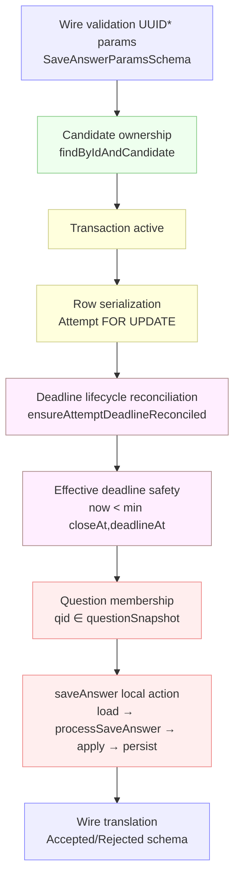

# EXAM-ANSWER-PRECONDITION-REVIEW-0 — Save Answer Precondition Topology Audit

**Date:** 2026-07-09
**HEAD:** `553add52f67d7cdb3943632a352cdb1d2fbdde38`
**Branch:** `fix/invariant-enforcement`
**Mode:** READ-ONLY (no production code, tests, lint, migrations, or models modified; no commit)
**Scope:** Predicate topology of the three preconditions required to call `saveAnswer` correctly — question membership (P1), whole-`answers` write serialization (P2), effective deadline (P3).

---

## Skill Invocation Evidence

- **`audit-context-building`** — loaded via the Skill tool; line-by-line / cross-function flow analysis applied to the Save Answer path.
- **`variant-analysis`** — methodology applied manually via repo-wide `grep` for alternate caller shapes and writer inventories (symbols + semantics, not just symbol names).
- **`fp-check`** — methodology applied manually to every claim below (the closure-review's "SAFE_FAIL_CLOSED" and "CALLER_LOCK_ENFORCED" verdicts are each re-derived from current code, and one is overturned).
- **`static-analysis`** — NOT in the available-skills list; methodology applied manually from the on-disk SKILL.md.
- **`semgrep-rule-creator`** — deliberately NOT invoked (no static rule is being created).

---

## Baseline

```
CURRENT_HEAD   = 553add52f67d7cdb3943632a352cdb1d2fbdde38
CURRENT_BRANCH = fix/invariant-enforcement
WORKTREE_STATE = staged + untracked (the EXAM-ANSWER-CLOSURE-0 work itself, in progress):
    M  apps/api/src/routes/attempts.candidate.ts
    A  apps/api/src/runtime/answer-protocol-ownership.structural.test.ts
    M  packages/exam-engine/src/answerProtocol.ts
    A  packages/exam-engine/src/saveAnswer.test.ts
    A  docs/audit/exam-answer-closure-review.md   (untracked)
```

`ANSWER_CLOSURE_IMPLEMENTATION_COMMIT`: there is no dedicated commit yet — the closure work is the uncommitted/staged diff above, layered on HEAD. This audit treats that worktree state as the current implementation baseline, per §1.2.

The latest adversarial context document is `docs/audit/exam-answer-closure-review.md` (`EXAM-ANSWER-CLOSURE-REVIEW-0`). It is accepted as the baseline closure verdict (`ANSWER_STATE_OWNERSHIP_CLOSED = YES`) and is NOT re-audited for code-movement; it IS re-queried where its P1/P2/P3 sub-claims bear on precondition topology.

---

# 0. Central Question — Framing

Three predicates gate a correct Save Answer:

```
P1  questionId ∈ attempt.questionSnapshot
P2  SaveMutation requires serialization vs concurrent whole-attempt.answers writers
P3  SaveAllowed requires now < EffectiveDeadline(exam, attempt)
        EffectiveDeadline(exam, attempt) = min(exam.closeAt, attempt.deadlineAt)
```

For each, this report answers: who owns the fact, who establishes it, whether `saveAnswer` preserves safety alone if it is absent, its locality, and its normative placement.

**Headline result before the detail:** all three are **caller-established** today. One of them — P3 — is caller-established in a *load-bearing* way: `saveAnswer`'s own deadline predicate is **not** the canonical effective-deadline, and the canonical invariant `attempt.deadlineAt <= exam.closeAt` is **FALSE** in the writer domain (it is only true because the predecessor seam reconciles). So the closure review's `SAFE_FAIL_CLOSED` for P3 holds *only* under the seam; without the predecessor it becomes `UNSAFE`. P1 and P2 are genuine external preconditions whose current placement is defensible.

---

# 1. Hard Rules — Adherence

READ-ONLY honored: no production code, tests, lint, migrations, models, or manifests were modified. No commit was created. Exactly one report file is produced. The closure baseline is accepted. Scope is held to P1/P2/P3; cross-region systems (grading authority, terminal grading, error taxonomy, EA lock topology, scanner architecture) are inspected only as evidence for the three predicates. No corrective is designed before the FACT → PRECONDITION CLASS → FAILURE MODE → CURRENT ENFORCEMENT chain is established (§13/§14 do not commit to a candidate).

---

# 2. Reconstructed Call Precondition Chain (Current Code Order)

Traced from the current Save Answer route body, `apps/api/src/routes/attempts.candidate.ts:779-920`, in actual execution order. The route-implied chain in the brief listed "transaction begin → … → question membership → saveAnswer"; the *actual* order is reconstructed below (deadline reconciliation precedes question membership; the question-membership check is the last caller guard before `saveAnswer`).

```
1. wire validation        SaveAnswerParamsSchema / SaveAnswerRequestSchema (Zod, fastify preHandler)
2. path/body id match     body.attemptId === attemptId && body.questionId === questionId
3. now = fastify.now()    (server time authority)
4. tx begin               executeInTransaction(fastify.db, async (tx) => { … })
5. candidate profile      createCandidateRepo(tx).findByUserId(ctx, actorId)  — existence check
6. engine repos built     createExamEngineRepos({examRepo, attemptRepo: txRepo, enrollmentRepo}, ctx)
7. EA capability mint     cap = lockEnrollmentAndAttempt(enrollments, attempts, attemptId)
8. ownership re-read      lockedAttempt = txRepo.findById(ctx, attemptId)  + candidateId match
9. deadline reconcile     currentAttempt = ensureAttemptDeadlineReconciled(exams, enrollments, attempts, gradingWorksetAdapter, cap, now)
10. ownership re-check    currentAttempt.candidateId === candidateProfile.id
11. question membership   currentAttempt.questionSnapshot.some(q => q.originalQuestionId === questionId)
12. saveAnswer            saveAnswer(attempts, attemptId, request, now)
13. tx commit             (route returns the ProcessSaveResult; audit + wire translation outside tx)
14. wire translation      SaveAnswerAcceptedSchema / SaveAnswerRejectedSchema
15. audit                 recordAudit(...) when result.accepted
```

| Step | Symbol / location | State read | State written | Predicate established for `saveAnswer` |
|---|---|---|---|---|
| 1 | `SaveAnswerParamsSchema` / `SaveAnswerRequestSchema` (contracts/src/attempt.ts:154,226) | — | — | request shape valid; `questionId` is a syntactic UUID |
| 2 | route line 798 | — | — | path/body id consistency |
| 4 | `executeInTransaction` | — | tx begin | transaction active |
| 7 | `lockEnrollmentAndAttempt` (lockSeam.ts:68) | enrollment, attempt | Enrollment `FOR UPDATE`, Attempt `FOR UPDATE` | **P2 (whole-answers serialization)** — attempt row lock held in this tx |
| 9 | `ensureAttemptDeadlineReconciled` (deadlineReconciliation.ts:121) | attempt, exam, grading workset | possibly freeze+grade | **P3 (effective deadline)** — if expired, attempt is frozen; `saveAnswer` then sees `submitted` |
| 11 | route lines 860-866 | `currentAttempt.questionSnapshot` | — | **P1 (question membership)** — only the current enforcement point |
| 12 | `saveAnswer` (answerProtocol.ts:353) | attempt (findById) | attempt.answers, lastActivityAt | (the action itself) |

### Current saveAnswer Preconditions

| Precondition | Explicit in `saveAnswer` type? | Checked inside action? | Established by current caller? | Mechanically enforced? |
|---|---:|---:|---:|---:|
| transaction active | No | No | Yes (route wraps in `executeInTransaction`) | No (convention) |
| attempt row serialized/locked | No | No | Yes (`lockEnrollmentAndAttempt` step 7) | PARTIAL — seam + structural test lock 7 entry points; `saveAnswer` neither receives nor asserts the lock |
| question belongs to attempt snapshot | No | **No** | Yes (route step 11) | No (route-only check) |
| deadline mutation safety | No | **Partially** — `processSaveAnswer` checks `attempt.deadlineAt` only | Yes (route step 9 reconciles first) | No |
| deadline lifecycle reconciled | No | No | Yes (route step 9) | No |
| candidate owns attempt | No | No | Yes (route steps 8,10) | No |
| request shape valid | No | No | Yes (Zod step 1) | Yes (Zod schema) |
| authoritative `now` | Yes (4th param) | Yes (`if (!now) throw ValidationError`) | Yes (`fastify.now()`) | Yes (runtime assert) |

The table above is context. Only P1/P2/P3 receive the deep audit below.

---

# 4. (cont.) Path-Order Correction vs the Brief

The brief's implied chain placed question-membership before deadline reconciliation. Actual code (lines 846-866) runs **deadline reconciliation (step 9) before question membership (step 11)**, on the *same* `currentAttempt` object returned by `ensureAttemptDeadlineReconciled`. This matters for P3: the freeze that closes mutation safety happens before `saveAnswer` is ever reached. It does not change the P1/P2 conclusions.

---

# 5. P1 — Question Membership Authority

## 5.1 Current check inventory

Grep for every production implementation of the membership predicate (`questionSnapshot.some`, `originalQuestionId === questionId`):

| Location | Caller / action | Failure behavior | Production significance |
|---|---|---|---|
| `apps/api/src/routes/attempts.candidate.ts:860-866` | Save Answer route | `ValidationError("问题不在此尝试中")` | **The only production enforcement point for the save path** |
| (none other) | — | — | `saveAnswer` does not consult `questionSnapshot` at all (answerProtocol.ts reads `attempt.answers`, `attempt.status`, `attempt.deadlineAt`, `now` only) |

The Save Answer route is the sole enforcement point for "is this question a legal target for this frozen attempt."

## 5.2 Remove HTTP — direct-save thought experiment

Trace current `saveAnswer` (answerProtocol.ts:353-402) with `questionId ∉ attempt.questionSnapshot`, all else valid (attempt exists, active, locked, owned, deadline valid):

- `findById` loads the attempt.
- `normalizePersistedAnswers` / `buildClientSeqMap` run on `attempt.answers`.
- `processSaveAnswer`:
  - status checks pass (`in_progress`);
  - deadline check passes;
  - idempotency key `${request.questionId}:${request.clientSeq}` not in map → no replay branch;
  - `existingAnswer = state.answers.find(a => a.questionId === request.questionId)` → `undefined` (no draft for this unrelated question);
  - `currentVersion = 0`, `request.baseVersion = 0` → not stale;
  - **accepts**: builds `newAnswer`, returns `accepted: true, newAnswer, newClientSeqMap`.
- `applyAcceptedResult` filters out any prior answer for this questionId (none), concents the new record → the non-member question is now persisted in `attempt.answers`.
- `attemptRepo.update(attemptId, { answers, lastActivityAt })` writes it.

```
CURRENT_DIRECT_SAVE_BEHAVIOR_FOR_NONMEMBER_QUESTION = ACCEPT_AND_PERSIST
```

`saveAnswer` does not independently preserve the membership invariant.

## 5.3 Semantic nature

Distinguish:
- `questionId` is a **syntactically valid identifier** — UUID shape, owned by the contracts Zod schema (`SaveAnswerParamsSchema.questionId: z.string().uuid()`).
- `questionId` is a **legal command target for this frozen attempt** — `questionId ∈ attempt.questionSnapshot.map(q => q.originalQuestionId)`. This is a property of the *frozen attempt*, not of the wire.

Does this predicate affect whether the Save Answer protocol command is legally applicable to the persisted Attempt state? **Yes.** The attempt is a frozen universe of questions (`questionSnapshot` is frozen at creation, INV-010); accepting an answer for a question outside that universe produces a structurally invalid `attempt.answers` element. It is therefore an **attempt-protocol** fact, not merely a request-shape fact. That said, it is *local to the attempt record* (answerProtocol already reads `attempt.answers` and could read `attempt.questionSnapshot` from the same row).

Primary classification:

```
P1_QUESTION_MEMBERSHIP_CLASS = ATTEMPT_PROTOCOL_INVARIANT
```

(It is local to the attempt record and bears on the legality of the protocol command, but it is about the attempt's frozen question universe rather than about the per-answer protocol fields. It sits between `LOCAL_ANSWER_INVARIANT` and `ATTEMPT_PROTOCOL_INVARIANT`; the stronger label is warranted because the membership fact is part of the attempt's creation contract.)

## 5.4 Authority

```
P1_NORMATIVE_OWNER = EXAM_ENGINE
```

`questionSnapshot` is frozen by the engine (`startOrRestoreAttempt` copies `exam.questionSnapshot` into the attempt at creation). The semantic fact "this question is part of this attempt" is established entirely by engine-owned creation logic and is part of the attempt's protocol state. The route merely *observes* it for request gating. `SHARED` is not justified — no independent second owner of the fact exists; multiple layers merely *read* it.

## 5.5 Failure mode (downstream trace if the route check is removed)

Trace a non-member draft answer through the downstream consumers:

- `buildSubmittedAnswersSnapshot` (answerProtocol.ts:419-438): iterates **`questionSnapshot`** in snapshot order, pulling each question's value from a `Map(draftAnswers.map(a => [a.questionId, a.answer]))`. A non-member draft's `questionId` is **never a key** in the snapshot's `originalQuestionId` set, so it is **dropped** at freeze time. The frozen `submitted_answers` is unaffected.
- `materializeGradingWorkset` / `computeExpectedGradingEntries` (gradingWorkset.ts:134-167): iterate `attempt.questionSnapshot` → one entry per frozen question. The non-member draft is never read. No stray grading entry is created.
- `aggregateGradingEntries` (gradingWorkset.ts:405): reads `attempt.questionSnapshot` + grading entries (which are 1:1 with the snapshot). The non-member draft is invisible.
- Terminal aggregation therefore fails closed on the **valid** universe (exact-count check `entries.length === questions.length`).

So the *graded score* is safe. The cost is **local state pollution only**: a durable draft row in `attempt.answers` that is silently ignored at every downstream phase, and that wastes/confuses the take snapshot / recovery projection. No cross-phase corruption, no score impact, no freeze failure.

```
P1_DIRECT_SAVE_NONMEMBER_FAILURE_CLASS = LOCAL_STATE_POLLUTION
```

(Not `FREEZE_BARRIER_REJECTS` — freeze silently drops it; not `SILENTLY_IGNORED` because the row *is* durably persisted, even though ignored downstream; `LOCAL_STATE_POLLUTION` is the exact fit: a durable invalid draft with no immediate detection and no downstream effect.)

---

# 6. P2 — Whole-Answers Write Serialization

## 6.1 Writer topology of `attempt.answers`

| Writer | Read-modify-write? | Lock acquired? | Lock mechanically proven? |
|---|---:|---:|---:|
| `saveAnswer` → `attemptRepo.update(attemptId, {answers, lastActivityAt})` (answerProtocol.ts:395) | **Yes** — read `attempt.answers` (line 378) → derive new whole array (`applyAcceptedResult`) → write whole array | **No** by the action itself; relies on caller-held `FOR UPDATE` | No (convention) |
| `startOrRestoreAttempt` → `attemptRepo.create({…, answers: []})` (attemptCommands.ts:210) | No — initialization at create | n/a (row is being created) | n/a |
| `submitAttempt` | No — writes `submittedAnswers`, `status`, `submittedAt`, `gradingStatus` (attemptCommands.ts:350); does NOT write `answers` | (its own `findByIdForUpdate`) | — |
| seed / migration / test helpers | (non-production) | — | — |

`submittedAnswers` is correctly NOT counted as an `answers` writer (it is a separate column frozen from a snapshot). **`saveAnswer` is the sole production read-modify-write of `attempt.answers`.**

## 6.2 Concurrency counterexample

Two concurrent saves, no Attempt row lock:

```
Initial attempt.answers = A   (e.g. [{q1, v1}])

T1 save q2: read A → derive A2 = A + q2  → write A2
T2 save q3: read A → derive A3 = A + q3  → write A3
final      = A3   → q2 lost   (last-write-wins on the whole JSONB)
```

The whole-array update in `saveAnswer` (line 396) overwrites `attempt.answers` entirely. `baseRepo.update` (baseRepo.ts:156) is a plain `UPDATE … SET …` with no `FOR UPDATE`, no optimistic version column, no row-version compare. So a concurrent different-question writer is a lost update absent external serialization.

```
P2_DIFFERENT_QUESTION_LOST_UPDATE_WITHOUT_LOCK = YES
```

Do `baseVersion` / `clientSeq` / idempotency history prevent the *different-question* race?

| Mechanism | Same-question race | Different-question race |
|---|---|---|
| `baseVersion` (optimistic per-question version) | **Prevents** — the later save sees `currentVersion > baseVersion` → `STALE_VERSION` reject (processSaveAnswer:155) | **Does NOT prevent** — `baseVersion` is per-question; a save for q2 with `baseVersion=0` and a save for q3 with `baseVersion=0` both see their own `currentVersion=0` and both accept. The lost update is on the *aggregate* JSONB, which `baseVersion` never touches. |
| `clientSeq` / idempotency map | **Prevents** replay/conflict on the same `questionId:clientSeq` | **Does NOT prevent** — different `questionId`s produce disjoint idempotency keys; neither save blocks the other |
| whole-row `FOR UPDATE` (caller-held) | n/a | **Prevents** — the second `findById`/write blocks until the first tx commits, so the second read sees the first's write |

Confirmed: `baseVersion` is a **per-question** optimistic lock. It cannot protect aggregate JSONB state against a different-question concurrent writer. Only the whole-row `FOR UPDATE` does.

## 6.3 Current canonical path

```
TRANSACTION_OWNER             = executeInTransaction (apps/api) — the caller
ATTEMPT_LOCK_ACQUISITION_SYMBOL = lockEnrollmentAndAttempt (lockSeam.ts:68)
LOCK_ORDER                    = Enrollment FOR UPDATE  →  Attempt FOR UPDATE
LOCKED_ROW                    = exam_attempts row (via findByIdForUpdate at lockSeam.ts:99)
SAVE_ANSWER_REPO_OBJECT       = attempts (the tx-bound AttemptRepository from createExamEngineRepos)
```

`saveAnswer` reuses the **same tx-bound repo** (`attempts`) the seam minted the capability against, and under REPEATABLE READ it observes the seam's own `FOR UPDATE` write. So in the canonical path the two-saves scenario serializes: T2's `findById` blocks until T1 commits, then sees `A2` and derives `A3 = A2 + q3`. No lost update.

```
P2_CURRENT_CANONICAL_SAVE_PATH_SERIALIZED = YES
```

## 6.4 Mechanical expression of "row lock already held"

Does `saveAnswer`'s API/type mechanically express "Attempt row lock already held"? Audited surfaces:

- capability argument: **no** (signature is `(attemptRepo, attemptId, request, now)` — no capability param)
- branded locked repository: **no** (`AttemptRepository` is the plain interface)
- locked-attempt value: **no** (it takes `attemptId`, not a `LockedAttempt`)
- private constructor/token: **no**
- runtime assertion: **no** (`saveAnswer` never calls `assertCapabilityFor`, never checks affinity)
- architecture lint: **no** (no rule ties `saveAnswer` callers to the seam)
- structural test: **no** — `answer-protocol-ownership.structural.test.ts` forbids the route from calling `processSaveAnswer` directly and from constructing `AnswerState`; it does NOT require the route to have minted a capability before `saveAnswer`
- JSDoc only: **yes** — the docstring (answerProtocol.ts:338-342) states "runs inside a caller-owned transaction that has already acquired the EA capability"
- call-site convention: **yes** — the one route does mint the capability first

```
P2_ROW_SERIALIZATION_PRECONDITION = DOCUMENTED_ONLY
```

(Documentation + the single current call-site convention. The strongest *actual* mechanism is the JSDoc + the one correctly-written caller. `assertCapabilityFor` exists in the seam but `saveAnswer` does not invoke it; it is invoked only by the grading/finalize consumers. Do NOT credit the EA capability — `saveAnswer` neither receives nor asserts it.)

## 6.5 Classify and evaluate candidate models

```
P2_WRITE_SERIALIZATION_CLASS = APPLICATION_COMPOSITION_PRECONDITION
```

Write serialization is *transactional mechanics*: it is about holding a row lock across a read-modify-write window. That is naturally a transaction-composition concern, not an AnswerRegion semantic — but it is a precondition the deep module silently depends on, expressed only in prose.

Candidate architecture comparison (evaluation only, no recommendation committed):

| Model | Correctness visibility | Coupling cost | Double-lock/re-entry risk | Caller complexity |
|---|---|---|---|---|
| A. caller lock convention (current) | LOW (silent) | none | none | LOW (route already does it) |
| B. EA capability passed into `saveAnswer` | MEDIUM | HIGH — couples AnswerRegion to Enrollment, the EA protocol, and the 2-repo affinity receipt | LOW (capability is identity-only, no re-lock) | MEDIUM (thread cap through) |
| C. narrow Attempt-lock capability | MEDIUM | MEDIUM — couples to a narrower Attempt-only lock token (would need a new mint surface distinct from EA) | LOW | MEDIUM |
| D. `saveAnswer` internally calls `findByIdForUpdate` | HIGH (self-proving) | LOW (one repo method it already has) | **HIGH** — re-locks in a tx that may already hold the lock; under REPEATABLE READ a second `FOR UPDATE` on the same row is a no-op for correctness, but a *second lock seam* mint would diverge from the EA order protocol and double the lock surface | LOW |

Architecture-cost read: A is the lightest and is what the system actually does; D is self-proving but re-enters the lock surface the EA seam was designed to own (the codebase deliberately centralized EA ordering — `lock-order.structural.test.ts` locks 7 entry points precisely to avoid ad-hoc per-action locks). B over-couples. C is the cleanest *theoretical* fit but invents a parallel lock token. The evaluation does not pick one (§14).

---

# 7. P3 — Effective Deadline Precondition

## 7.0 Canonical authority (independently verified)

The canonical symbols (deadlineReconciliation.ts):

```
CANONICAL_EFFECTIVE_DEADLINE_SYMBOL = computeEffectiveDeadline(exam, attempt)
                                     = attempt.deadlineAt && attempt.deadlineAt < exam.closeAt
                                         ? attempt.deadlineAt
                                         : exam.closeAt
CANONICAL_EXPIRY_PREDICATE          = isAttemptDeadlineExpired(exam, attempt, now)
                                     = now.getTime() >= computeEffectiveDeadline(...).getTime()
```

`EffectiveDeadline(exam, attempt) = min(exam.closeAt, attempt.deadlineAt)` (with the documented NULL `deadlineAt` defensive fallback to `exam.closeAt`). This is accepted as the canonical mutation-safety predicate.

## 7.1 What `saveAnswer` actually checks

`saveAnswer` never loads the exam. It supplies to `processSaveAnswer`:

```ts
processSaveAnswer(
  {
    attemptStatus: attempt.status,
    answers: attempt.answers,
    clientSeqMap,
    ...(attempt.deadlineAt ? { deadlineAt: attempt.deadlineAt } : {}),  // ← ONLY this
    now,
  },
  request,
)
```

(answerProtocol.ts:375-384). `processSaveAnswer`'s deadline branch (answerProtocol.ts:116-123) is:

```ts
if (state.deadlineAt && now.getTime() > state.deadlineAt.getTime()) {
  return { accepted: false, …, conflict: { reason: "DEADLINE_EXCEEDED" } };
}
```

So the action's *own* predicate is `now <= attempt.deadlineAt`. It is the **attempt deadline only**.

```
P3_SAVE_ANSWER_LOCAL_DEADLINE_INPUT = ATTEMPT_DEADLINE
```

(Note also: `processSaveAnswer` uses strict `>` while `isAttemptDeadlineExpired` uses `>=` — a boundary divergence at the instant `now === deadlineAt`, but immaterial to the reachability question below.)

The canonical mutation-safety predicate is `now < min(exam.closeAt, attempt.deadlineAt)`. For these to be equivalent over the protocol-reachable domain, we need:

```
∀ reachable active a:   a.deadlineAt <= exam.closeAt
```

If that holds, `min(exam.closeAt, attempt.deadlineAt) = attempt.deadlineAt` and `saveAnswer`'s local predicate ≡ canonical. If it does **not** hold, there exists a reachable state with `attempt.deadlineAt > exam.closeAt`, where after `exam.closeAt` but before `attempt.deadlineAt` the canonical predicate is *expired* while the local predicate is *not expired* — `saveAnswer` would **accept a draft mutation past the canonical effective deadline**.

## 7.2 Reachability proof — is `attempt.deadlineAt <= exam.closeAt` guaranteed by writers?

Writer-by-writer evidence (production writers of `attempt.deadlineAt`):

| Writer | How `deadlineAt` is set | `<= exam.closeAt` guaranteed? |
|---|---|---|
| `startOrRestoreAttempt` (attemptCommands.ts:200) | `calculateDeadlineAt(now, exam.durationMinutes)` = `now + durationMinutes` | **NO.** The only exam-window gate is `now < exam.closeAt` (line 146). The computed deadline is **not clamped** to `exam.closeAt`. A candidate who starts at 09:55 for a 90-minute exam closing at 10:00 gets `deadlineAt = 11:25 > exam.closeAt = 10:00`. |
| `restoreAttempt` (attemptCommands.ts:432-443) | `adjustedDeadline + disconnectedDuration`, then `Math.min(adjustedDeadline, exam.closeAt.getTime())` | **YES** (explicitly clamped) |
| `extendAttemptTime` (attemptCommands.ts:533-546) | `baseMs + additionalMinutes`, then **rejects** if `newDeadlineAt > exam.closeAt` | **YES** (rejected if it would exceed) |

So the invariant is **NOT** established by `startOrRestoreAttempt` — the dominant writer for active attempts. The reachable domain contains attempts with `attempt.deadlineAt > exam.closeAt`.

Concrete reachable adversarial state (entirely ordinary, no corruption):

```
exam.openAt   = 09:00
exam.closeAt  = 10:00          (exam window closes)
candidate starts at 09:55, duration = 90 min
attempt.deadlineAt = 09:55 + 90min = 11:25
now           = 10:10

EffectiveDeadline = min(10:00, 11:25) = 10:00   → canonical: EXPIRED
saveAnswer local:  10:10 <= 11:25              → NOT EXPIRED → ACCEPTS
```

```
ACTIVE_DEADLINE_LE_CLOSE = FALSE
```

The theorem "for every protocol-reachable active attempt a, a.deadlineAt <= exam.closeAt" is **FALSE** in the writer domain. It is not proven by writers, not runtime-guarded by `saveAnswer`, not modeled formally, not DB-constrained. The closure review's prose asserting `saveAnswer` "fails closed" took the equivalence as given; it does not hold.

## 7.3 Direct save without reconciliation

Given §7.2, evaluate `saveAnswer` called directly (no `ensureAttemptDeadlineReconciled` predecessor) in the reachable adversarial state `exam.closeAt < now < attempt.deadlineAt`:

- `saveAnswer` loads attempt (still `in_progress`).
- `processSaveAnswer`: status `in_progress` → pass; deadline `now <= attempt.deadlineAt` → **pass** (not expired).
- Accepts and **persists a draft mutation** at `now = 10:10`, which is *past the canonical effective deadline* `10:00`.

The mutation-safety predicate and the canonical predicate are **not equivalent** over the reachable domain. The action does **not** independently refuse a post-effective-deadline save.

```
P3_DIRECT_SAVE_WITHOUT_RECONCILIATION = UNSAFE
```

This **overturns** the closure review's `SAFE_FAIL_CLOSED` (exam-answer-closure-review.md §4.2, §18.2). That verdict was reached by assuming `saveAnswer`'s deadline check is the canonical effective-deadline check. It is the *attempt* deadline only; the canonical authority additionally folds `exam.closeAt`, and the attempt deadline is reachable beyond `exam.closeAt`.

What actually closes mutation safety today is the **predecessor seam**: `ensureAttemptDeadlineReconciled` (deadlineReconciliation.ts:121) loads the exam, evaluates the *canonical* `isAttemptDeadlineExpired(exam, attempt, now)`, and freezes the attempt (`submitAttempt` → `submitted`) **before** `saveAnswer` runs. The route calls it at step 9 (lines 846-856). Remove that predecessor and `saveAnswer` becomes unsafe over a reachable state.

## 7.4 Deadline reconciliation semantic role

`ensureAttemptDeadlineReconciled` does, beyond mutation safety:

| Effect | Produced? |
|---|---|
| freeze `submittedAnswers` | **Yes** — via `submitAttempt` (line 170) with `submissionReason: 'deadline'` |
| set `submittedAt` | **Yes** — to `effectiveDeadline` (not wall-clock `now`) |
| set `submissionReason` | **Yes** — `'deadline'` |
| materialize grading workset | **Yes** — `submitAttempt` → `materializeGradingWorkset` |
| auto grade | **Yes** (when not `pending_manual`) — `finalizeGrading` (line 200) |
| leave `pending_manual` | **Yes** (when manual questions exist) |

Classification:

```
DEADLINE_RECONCILIATION_IS = COMBINATION
```

It is simultaneously a **mutation-safety precondition** (it is the *only* thing today that enforces the canonical effective-deadline for the save path) AND a **lifecycle reconciliation** action (freeze + grade) AND a **cross-region protocol action** (it touches the Answer/Freeze/Grading regions and reads the Exam region).

> Must a Save Answer action own deadline reconciliation to be a complete AnswerRegion action?

**No — for completeness of the AnswerRegion as a mutation authority, `saveAnswer` would need to own the *effective-deadline mutation-safety predicate* (P3's correctness), but it does NOT need to own freeze/grade reconciliation.** The mutation-safety fact and the lifecycle-freeze action are separable: the former is a precondition on every save (and is currently load-bearing-but-external), the latter is a side-effecting reconciliation that belongs at the entry-point composition layer. Owning reconciliation inside `saveAnswer` would wrongly expand AnswerRegion into cross-region orchestration. Owning the *effective-deadline check* would not.

---

# 8. Save Answer Precondition Dependency Graph



Node classifications:
- `[WIRE]` WIRE: wire validation, wire translation.
- `[AUTH]` AUTH: candidate ownership.
- `[LOCAL]` LOCAL AnswerRegion: question membership (local to the attempt record), `saveAnswer` local action.
- `[CROSS]` CROSS region: deadline reconciliation (Exam + Enrollment + Attempt + Grading-Workset), effective-deadline safety (needs the Exam).
- `[APP]` APP composition: transaction, row serialization.

Two nodes carry the load-bearing external dependencies: **Row serialization [APP]** (P2) and **Effective deadline safety [CROSS]** (P3). The latter is the one whose locality is genuinely cross-region (it cannot be computed without the Exam) and whose current placement is load-bearing rather than cosmetic.

---

# 9. Deep Module Precondition Test

Principle applied: a deep module need not establish every global condition, but any omitted condition must be an explicit, legitimate precondition whose ownership is clearer and cheaper outside.

| Predicate | Semantic locality | Failure severity | Caller discoverability | Cost to internalize | Legitimate external precondition? |
|---|---|---|---|---|---:|
| P1 question membership | HIGH (local to attempt record) | LOW (local pollution, downstream drops it) | MEDIUM (not in signature; visible only by reading route) | LOW (attempt row already loaded; one `.some()`) | PARTIAL — legitimate today, but the cost to internalize is low and locality is high |
| P2 row serialization | LOW (transactional mechanics) | HIGH (silent lost update) | LOW (JSDoc only) | MEDIUM (couples to lock surface / re-entry) | YES (legitimate composition precondition; but expression is too weak) |
| P3 effective deadline | MEDIUM (mutation-safety) | HIGH (draft accepted past canonical deadline) | LOW (looks like `saveAnswer` "has a deadline check" — misleading) | MEDIUM (needs Exam load) | NO for the *safety predicate*; YES for the *reconciliation side effect* |

> Which precondition, if moved into `saveAnswer`, would deepen the module without materially increasing coupling?

**The effective-deadline mutation-safety check.** Today the action advertises a deadline check that is *not* the canonical one and that becomes unsafe without an external predecessor — the worst kind of hidden knowledge, because it *looks* self-sufficient. Internalizing the canonical effective-deadline check (which requires loading the Exam) would make the action's own safety claim true over the reachable domain. The coupling cost is one Exam read, which `saveAnswer` does not currently do.

> Which precondition, if moved into `saveAnswer`, would wrongly expand AnswerRegion into cross-region orchestration?

**Deadline reconciliation (freeze + grade).** Reconciliation is a cross-region lifecycle action, not an AnswerRegion mutation concern. Moving it inside `saveAnswer` would entangle answer saving with submit/grading and duplicate the entry-point composition logic.

---

# 10. Capability Necessity Review

| Capability model | Fact proven | Matches Save Answer need? | Coupling introduced | Verdict |
|---|---|---|---|---|
| EA capability (`LockedEnrollmentAttemptIdentity`) | Enrollment→Attempt lock order + 2-repo tx affinity | PARTIAL — proves a lock is held, but over-broad (couples to Enrollment, the EA protocol) | HIGH — pulls the EA protocol, 2-repo affinity receipt, and `assertCapabilityFor` into AnswerRegion | OVERBROAD |
| Attempt-lock capability (narrow, hypothetical) | Attempt row `FOR UPDATE` held | YES (exactly the P2 need) | MEDIUM — a new narrow token distinct from EA; would need its own mint surface | GOOD_FIT (theoretically) |
| Transaction affinity (tx-bound repo object) | repo bound to a live tx | PARTIAL — does not prove the *row lock* | LOW | UNDERPOWERED (already true; insufficient alone) |
| No capability (current) | none | — | none | UNNECESSARY if an internal check (P3) + a narrow lock proof (P2) cover it |

```
SHOULD_SAVE_ANSWER_ACCEPT_EA_CAPABILITY = NO
WOULD_A_NARROW_ATTEMPT_LOCK_CAPABILITY_BE_ARCHITECTURALLY_CLEANER = UNRESOLVED
  (cleaner in *theory* for P2; but it invents a parallel lock token alongside
   the deliberately-centralized EA seam, and does nothing for P3, which is the
   higher-risk gap. Net cleaner only if paired with internalizing P3.)
```

Neither is implemented (read-only).

---

# 11. API Knowledge Classification

Facts the Save Answer route still owns after EXAM-ANSWER-CLOSURE-0:

| Caller knowledge | Classification | Legitimate API knowledge? | Why |
|---|---|---:|---|
| candidate ownership (findByIdAndCandidate, re-check) | AUTHORIZATION | YES | access control is an API-layer duty |
| `questionSnapshot` membership check | LOCAL_PROTOCOL | PARTIAL | it is an attempt-protocol invariant (local to the attempt); the route gates it, but ownership arguably belongs to the engine |
| EA lock predecessor (`lockEnrollmentAndAttempt`) | TRANSACTION_MECHANICS | YES | lock acquisition is transaction composition |
| deadline reconciliation placement (`ensureAttemptDeadlineReconciled`) | CROSS_REGION_PROTOCOL | NO (load-bearing) | it is the *sole* enforcer of the canonical effective-deadline for the save path; treating it as optional composition contradicts `saveAnswer`'s advertised self-sufficiency |
| `saveAnswer` invocation | LOCAL_PROTOCOL | YES | the engine action |
| semantic result → wire translation | OBSERVABILITY / WIRE | YES | wire serialization is an API duty |
| audit event | OBSERVABILITY | YES | observability is an API duty |

```
SAVE_ANSWER_CALLER_PROTOCOL_KNOWLEDGE = PARTIAL
```

NOT `MINIMAL`: the route still establishes one genuinely local AnswerRegion invariant (question membership) and, more importantly, the canonical effective-deadline safety that `saveAnswer`'s own deadline check does not actually cover. The closure review's `MINIMAL` (exam-answer-closure-review.md §3, §20) is **overstated**: it credited `saveAnswer` with a deadline check it treated as canonical, which §7.2 shows it is not.

---

# 12. Finding Classification

| ID | Predicate/fact | Finding | Classification | Severity |
|---|---|---|---|---|
| F-01 | P3: `saveAnswer`'s deadline predicate is `attempt.deadlineAt` only, not `min(exam.closeAt, attempt.deadlineAt)` | Action accepts draft mutations past the canonical effective deadline when called without the reconciliation predecessor | REACHABILITY_GAP | **HIGH** |
| F-02 | P3: `attempt.deadlineAt <= exam.closeAt` is not guaranteed by `startOrRestoreAttempt` | Reachable active attempts can have `deadlineAt > exam.closeAt`; the equivalence assumed by the closure review is false | SEMANTIC_DRIFT | **HIGH** |
| F-03 | P3: canonical mutation safety is enforced *only* by the predecessor seam, not by `saveAnswer` | The action's "deadline check" is load-bearing-external; removing/forgetting `ensureAttemptDeadlineReconciled` reintroduces post-deadline saves | PRECONDITION_NOT_EXPRESSED | **HIGH** |
| F-04 | P2: whole-`answers` serialization is caller-convention only | A future tx-bound caller without the row lock gets silent different-question lost updates; `baseVersion`/`clientSeq` do not protect aggregate JSONB | PRECONDITION_NOT_EXPRESSED | MEDIUM |
| F-05 | P1: question membership enforced only in the route | `saveAnswer` accepts+persistence a non-member draft (downstream drops it, so impact is local pollution) | LOCAL_INVARIANT_LEAK | LOW |
| F-06 | P2: `processSaveAnswer` uses `>` (strict) vs canonical `>=` | Boundary divergence at `now === deadlineAt` instant; immaterial to reachability, noted for completeness | SEMANTIC_DRIFT | INFO |
| F-07 | P1: questionId UUID validity is correctly owned by contracts schema | Clean wire/protocol split | BOUNDARY_CORRECT | INFO |
| F-08 | P2: `saveAnswer` is the sole production read-modify-write of `attempt.answers` | Writer inventory converged; no second writer | BOUNDARY_CORRECT | INFO |

Severity reflects realistic reintroduction risk and protocol blast radius, not "not type-enforced" inflation. F-01..F-03 are HIGH because the reachable state is ordinary (not corrupt) and the failure is a post-deadline persisted draft — a real exam-integrity gap if the predecessor is ever dropped.

---

# 13. Required Predicate Verdicts

```
P1_QUESTION_MEMBERSHIP_CLASS =
  ATTEMPT_PROTOCOL_INVARIANT

P1_NORMATIVE_OWNER =
  EXAM_ENGINE

P1_CURRENTLY_ENFORCED_BY =
  API_ROUTE (sole production check; route lines 860-866)

P1_DIRECT_SAVE_NONMEMBER_BEHAVIOR =
  ACCEPT_AND_PERSIST

P1_ACTION_REQUIRED =
  VALIDATE_IN_SAVE_ANSWER
  (locality HIGH, cost LOW, severity LOW-but-real; the action already loads the
   attempt row, so a snapshot-membership guard internalizes the invariant with
   no new coupling. Rejected options: KEEP_EXTERNAL is defensible but leaves a
   local-protocol invariant in the route; MECHANICALLY_CHECK_EXTERNAL has no
   mechanical surface to attach to today.)
```

```
P2_WRITE_SERIALIZATION_CLASS =
  APPLICATION_COMPOSITION_PRECONDITION

P2_DIFFERENT_QUESTION_LOST_UPDATE_WITHOUT_LOCK =
  YES

P2_CURRENT_SERIALIZATION =
  DOCUMENTED_ONLY

P2_CANONICAL_PATH_CORRECT =
  YES

P2_ACTION_REQUIRED =
  UNRESOLVED
  (Candidate A is legitimately lightest; but "DOCUMENTED_ONLY" is too weak for
   a HIGH-severity lost-update. A narrow Attempt-lock capability (C) or an
   internal findByIdForUpdate (D) would close it at the cost of a parallel lock
   surface / re-entry. No single candidate is clearly correct without resolving
   P3 first, since P3 is the higher-risk gap and also touches the lock/Exam
   surface. Read-only: no recommendation committed.)
```

```
P3_EFFECTIVE_DEADLINE_CLASS =
  CROSS_REGION_INVARIANT
  (mutation-safety over a reachable domain where the authority is
   min(exam.closeAt, attempt.deadlineAt); cannot be computed without the Exam)

P3_CANONICAL_EFFECTIVE_DEADLINE =
  computeEffectiveDeadline(exam, attempt) =
    attempt.deadlineAt && attempt.deadlineAt < exam.closeAt
      ? attempt.deadlineAt : exam.closeAt
  expiry: isAttemptDeadlineExpired(exam, attempt, now) =
    now >= computeEffectiveDeadline(...)

P3_SAVE_ANSWER_LOCAL_DEADLINE_INPUT =
  ATTEMPT_DEADLINE

P3_ACTIVE_DEADLINE_LE_CLOSE =
  FALSE
  (startOrRestoreAttempt computes deadlineAt = now + duration with only a
   now < exam.closeAt gate, no clamp; reachable attempts can have
   deadlineAt > exam.closeAt. restoreAttempt clamps; extendAttemptTime
   rejects beyond close — but the dominant active-attempt writer does not.)

P3_DIRECT_SAVE_WITHOUT_RECONCILIATION =
  UNSAFE
  (reachable state exam.closeAt < now < attempt.deadlineAt exists; canonical
   effective deadline expired, saveAnswer local predicate not expired →
   accepts and persists a draft mutation past the canonical deadline)

P3_ACTION_REQUIRED =
  COMPOSE_HIGHER_LEVEL_ACTION
  (the mutation-safety predicate is genuinely cross-region — it needs the Exam;
   the cleanest expression is a higher-level Save Answer composition that loads
   the Exam and evaluates the canonical effective deadline, with
   reconciliation remaining a separable predecessor. KEEP_PREDECESSOR_RECONCILIATION
   alone preserves current safety but leaves saveAnswer's advertised deadline
   check semantically misleading; LOAD_EXAM_IN_SAVE_ANSWER is an alternative if
   the action is to become genuinely self-sufficient. Read-only: no commit.)
```

---

# 14. Architecture Decision Test

For each candidate (evaluation, no selection by line count):

| Candidate change | Semantic benefit | Dependency/coupling cost | Caller knowledge removed | New failure mode |
|---|---|---|---|---|
| A. membership check into `saveAnswer` | closes F-05; local invariant owned where the attempt row is loaded | LOW (attempt already loaded; reads `questionSnapshot`) | route drops the `.some()` guard | none (deterministic reject) |
| B. EA capability into `saveAnswer` | proves a lock is held (part of F-04) | HIGH (couples AnswerRegion to Enrollment + EA protocol + 2-repo affinity) | caller still must mint it | re-entry / double-mint risk; no help for F-01..03 |
| C. narrow Attempt-lock capability | proves the right (Attempt) lock (F-04) | MEDIUM (new parallel token vs centralized EA seam) | lock provenance visible | new mint surface to govern |
| D. `saveAnswer` internal `findByIdForUpdate` | self-proving serialization (F-04) | LOW (one repo method) | caller lock optional | re-entry on an already-locked row; diverges from EA-order centralization |
| E. pass `effectiveDeadline` into `saveAnswer` | makes the canonical predicate visible (F-01..03) | LOW (one Date param) | route computes canonical deadline | caller could still pass a wrong value — does not remove the cross-region dependency, only makes it explicit |
| F. add `ExamRepository` to `saveAnswer` | action computes canonical effective deadline itself (F-01..03) | MEDIUM (Exam read in the action) | route no longer reconciles-for-safety | action now Exam-coupled; reconciliation still needed for freeze/grade |
| G. higher-level `saveAnswerWithReconciliation` | composes Exam load + canonical deadline + save (F-01..03) + keeps reconciliation | MEDIUM (new composite at composition layer) | route calls one action | duplicates the entry-point composition already in the route |
| H. no production change | none | none | none | F-01..04 remain as documented external preconditions |

Decision criteria applied (invariant locality, coupling, discoverability, mechanical-enforcement value, AI-misuse probability):

- **A** is the cleanest single win: HIGH locality, LOW coupling, removes a local invariant from the route. No downside.
- **E/F/G** all address the HIGH-severity F-01..03. E is cheapest but does not remove the cross-region dependency (just surfaces it). F makes the action genuinely self-sufficient on mutation safety. G is the most architecturally honest (a named composite) but is closest to what the route already does.
- **B/C/D** address the MEDIUM-severity F-04. D is self-proving but re-enters the lock surface; C is the cleanest fit but invents a parallel token; B over-couples.
- The highest combined (hidden-knowledge × misuse-risk × low-cost-ownership) is **P3's effective-deadline safety** — addressed by E/F/G, not by lock work.

---

# 15. Required Final Verdict

```
EXAM-ANSWER-PRECONDITION-REVIEW-0:
  PASS_WITH_FINDINGS

ANSWER_STATE_OWNERSHIP_CLOSED = YES

SAVE_ANSWER_FULL_ACTION_LEGALITY_CLOSED = PARTIAL
  (P1 open as a local-protocol leak; P2 open as documented-only serialization;
   P3 open as a load-bearing cross-region precondition whose absence is UNSAFE)

SAVE_ANSWER_CALLER_PROTOCOL_KNOWLEDGE = PARTIAL

QUESTION_MEMBERSHIP_OWNER =
  EXAM_ENGINE

QUESTION_MEMBERSHIP_CURRENT_PLACEMENT_CORRECT = NO
  (the normative owner is the engine; the route is the sole checker and
   saveAnswer accepts+persists a non-member draft if it is removed)

DIFFERENT_QUESTION_LOST_UPDATE_WITHOUT_LOCK = YES

SAVE_ANSWER_ROW_SERIALIZATION =
  CALLER_LOCK_ENFORCED
  (canonical path correct; mechanical expression is DOCUMENTED_ONLY)

CALLER_LOCK_PRECONDITION_LEGITIMATE = YES

CALLER_LOCK_PRECONDITION_SUFFICIENTLY_EXPRESSED = NO

ACTIVE_DEADLINE_LE_EXAM_CLOSE =
  FALSE
  (startOrRestoreAttempt does not clamp deadlineAt to exam.closeAt)

DIRECT_SAVE_WITHOUT_RECONCILIATION =
  UNSAFE
  (overturns the closure review's SAFE_FAIL_CLOSED over the reachable domain)

DEADLINE_RECONCILIATION_IS_LEGITIMATE_CALLER_COMPOSITION = PARTIAL
  (the freeze/grade side effects are legitimate caller composition; the
   effective-deadline mutation-safety enforcement that the seam also provides
   is NOT legitimate to leave external, because saveAnswer advertises its own
   deadline check)

EA_CAPABILITY_REQUIRED_BY_SAVE_ANSWER = NO

NARROW_ATTEMPT_LOCK_CAPABILITY_JUSTIFIED = UNRESOLVED

IMMEDIATE_PRODUCTION_CORRECTIVE_REQUIRED = NO
  (no reachable production path currently mis-behaves: the canonical route runs
   ensureAttemptDeadlineReconciled and holds the lock. The defect is a
   precondition-topology / hidden-knowledge defect, not a live production bug.)

TARGETED_PRECONDITION_CORRECTIVE_REQUIRED = YES
  (P3 effective-deadline mutation safety should not remain load-bearing-external)

MECHANICAL_PRECONDITION_ENFORCEMENT_REQUIRED = YES
  (P2 serialization expression and P3 safety should be expressible, not prose)
```

### TOP_3_PRECONDITION_FACTS

1. The canonical effective deadline is `min(exam.closeAt, attempt.deadlineAt)`; `saveAnswer` checks only `attempt.deadlineAt` (P3).
2. `attempt.deadlineAt <= exam.closeAt` is **not** guaranteed by `startOrRestoreAttempt` (P3 reachability).
3. Whole-`answers` updates are serialized only by the caller-held Attempt `FOR UPDATE`; `baseVersion`/`clientSeq` protect same-question races only (P2).

### TOP_3_CURRENT_CALLER_ASSUMPTIONS

1. "A deadline check exists inside `saveAnswer`, so it's safe to call directly." — false over the reachable domain.
2. "`attempt.deadlineAt` reflects the real exam deadline." — it can exceed `exam.closeAt`.
3. "Holding the EA capability is what serializes the save." — it's the Attempt `FOR UPDATE` inside the seam, which `saveAnswer` neither receives nor asserts.

### TOP_3_PRECONDITIONS_THAT_BELONG_INSIDE_SAVE_ANSWER

1. **Effective-deadline mutation safety (P3, canonical).** Highest hidden-knowledge + misuse-risk + the action already *appears* to check it. Requires loading the Exam.
2. **Question membership (P1).** High locality, low cost; the attempt row is already loaded.
3. *(No third legitimate candidate.)* P2 serialization is legitimately external; internalizing it re-enters the lock surface. Forcing a third item would be invention.

### TOP_3_PRECONDITIONS_THAT_SHOULD_REMAIN_OUTSIDE_SAVE_ANSWER

1. **Deadline reconciliation (freeze + grade).** Cross-region lifecycle; moving it in expands AnswerRegion into orchestration.
2. **Row serialization / transaction / lock acquisition (P2).** Transactional mechanics legitimately owned by the composition layer (though its *expression* should be strengthened).
3. **Candidate ownership + wire translation + audit.** Authorization, wire, and observability are API-layer duties.

### RECOMMENDED_NEXT_ACTION

Targeted precondition corrective for **P3 effective-deadline mutation safety** (candidate E, F, or G from §14), with P1 (membership, candidate A) as a low-cost companion. P2 serialization expression is a separate, lower-priority follow-up. No immediate production hotfix is required because the canonical route currently runs the reconciliation predecessor and holds the lock — the defect is a topology/hidden-knowledge defect, not a live mis-behaving path.

---

# 16. Final Architecture Question

> Is `saveAnswer` a properly deep module with legitimate external preconditions, or is it still a partially closed protocol action?

**Partially closed.** EXAM-ANSWER-CLOSURE-0 genuinely transferred answer-state ownership (load → reconstruct → decide → apply → persist) into the engine, and that part is real. But full *action legality* is not closed: one of the three preconditions required to call it safely — the canonical effective-deadline mutation safety — is load-bearing-external, and the action's own deadline check is *not equivalent* to the canonical one over the reachable domain. A deep module may legitimately omit external conditions, but only when they are explicit and their ownership is clearer outside. P3 fails that test: its ownership is *not* clearer outside (the action already advertises a deadline check that implies self-sufficiency), and omitting it is *unsafe* without the predecessor. That is the signature of a partially closed action.

> Which single caller-established precondition currently creates the highest combination of hidden knowledge, accidental misuse risk, and low-cost opportunity for deeper ownership?

**The canonical effective-deadline mutation-safety predicate (P3).** It is hidden (the action looks self-sufficient), high-misuse-risk (a future caller that skips reconciliation, or a refactor that "simplifies" the route, reintroduces post-deadline saves over an ordinary reachable state), and low-cost-to-own (one Exam read, or one explicit `effectiveDeadline` parameter, surfaces it).

> If no code is changed, what exact rule must a future AI coding agent know to call `saveAnswer` correctly?

A future agent must know **all three** of:

1. **Deadline — never call `saveAnswer` without first running `ensureAttemptDeadlineReconciled(exams, enrollments, attempts, gradingWorkset, cap, now)` in the same transaction.** The action's internal `DEADLINE_EXCEEDED` check uses `attempt.deadlineAt` only, which can be later than `exam.closeAt`; the predecessor is the *sole* enforcer of the canonical `min(exam.closeAt, attempt.deadlineAt)` mutation safety. Do not "optimize it away" because the action "already checks the deadline."
2. **Lock — never call `saveAnswer` outside a transaction that holds the Attempt row `FOR UPDATE` (via `lockEnrollmentAndAttempt`).** The action performs a whole-`answers` read-modify-write with no internal serialization; `baseVersion`/`clientSeq` do not protect a concurrent different-question writer.
3. **Membership — validate `questionId ∈ attempt.questionSnapshot` before calling.** The action will otherwise accept and persist a draft answer for a question that is not part of the frozen attempt (silently dropped at freeze/grade, but durable in `attempt.answers`).

---

# 17. Output

Report written to `docs/audit/answer-precondition-topology-review.md`. No other file modified. No commit.

---

*End of EXAM-ANSWER-PRECONDITION-REVIEW-0. READ-ONLY; one report file created; no commit.*
