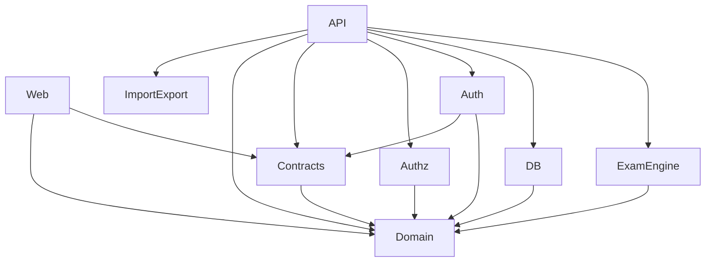

# EXAM-ARCH-RECON-0 — Architecture Reconstruction Audit

**Date:** 2026-07-09
**HEAD:** `553add52f67d7cdb3943632a352cdb1d2fbdde38`
**Branch:** `master`
**Worktree:** Clean (only `.mimocode/` untracked)

---

## 1. Baseline Reconstruction

### Repository State

| Field | Value |
|-------|-------|
| CURRENT_BRANCH | `master` |
| CURRENT_HEAD | `553add52f67d7cdb3943632a352cdb1d2fbdde38` |
| MASTER_HEAD | `553add5` (HEAD, origin/master) |
| WORKTREE_CLEAN | Yes (only `.mimocode/` untracked) |
| RECENT_ARCHITECTURAL_CHANGE_WINDOW | `21be1ff..553add5` (PR #177 — formal EA lock order + deadline semantics + terminal closure) |

### Recent Architectural Change Timeline

| Commit | Change | Architectural effect | Still present? |
|--------|--------|---------------------|----------------|
| `b9125c8` | unify terminal closure for manual results | `finalizeTerminalGrading` became the single canonical terminal closure for both auto and manual paths | Yes |
| `d28c3e8` | unify effective deadline authority | `computeEffectiveDeadline` is the single source of truth; NULL `deadlineAt` is defensive recovery, not protocol state | Yes |
| `21be1ff` | unify formal p0 repair baseline | Consolidated the P0 repair work into a single merge point | Yes |
| `e29be53` | close nullable deadline semantics | NULL `attempt.deadlineAt` is reachable-but-protocol-unreachable; defensive fallback to `exam.closeAt` | Yes |
| `1a85e49` | separate reachability from null recovery | Active-deadline invariant: `ProtocolReachable(a) AND Active(a) => a.deadlineAt != NULL` | Yes |
| `c56bae1` | enforce enrollment-attempt lock order | `lockEnrollmentAndAttempt` is the canonical seam; Enrollment FOR UPDATE before Attempt FOR UPDATE | Yes |
| `9a6fb0b` | remove redundant FOR UPDATE after lock seam | Removed redundant row lock post-mint; lock relies on the capability's affinity assertion | Yes |
| `553add5` | merge PR #177 | All P0 formal repairs landed on master | Yes |

---

## 2. Repository Topology

### Workspace Packages

```
apps/
  web/          @exam/web       React 19 + Vite + shadcn/ui frontend
  api/          @exam/api       Fastify HTTP server, orchestrators, adapters, routes
  e2e/          (not a package) Playwright E2E test harness

packages/
  domain/       @exam/domain    Domain types, enums, errors, grading engine (leaf)
  contracts/    @exam/contracts Zod schemas, DTO types, API contracts
  db/           @exam/db        Drizzle ORM schema, repositories, migration
  exam-engine/  @exam/exam-engine  Protocol kernel: state machines, commands, grading
  auth/         @exam/auth      Session/JWT management, argon2 hashing
  authz/        @exam/authz     RBAC role/permission definitions
  import-export/ @exam/import-export CSV/Excel/PDF import/export
```

### Actual Dependency Graph



**Key invariant:** `@exam/exam-engine` depends ONLY on `@exam/domain`. It has zero dependency on `@exam/db`, Fastify, Drizzle, or React. Repository interfaces are defined inside the engine (ports), and the API adapter layer bridges concrete DB repos to those ports.

### Package Classification

| Package | Responsibility | Business decisions? | DB access? | Owns transactions? | Main consumers |
|---------|---------------|-------------------:|:----------:|:------------------:|---------------|
| `@exam/domain` | Types, enums, errors, pure grading logic | Yes (grading rules) | No | No | Everything |
| `@exam/contracts` | Zod validation schemas, DTOs | No | No | No | API routes, Web |
| `@exam/db` | Drizzle schema, migrations, repository implementations | No | Yes | No (provides tx helper) | API routes |
| `@exam/exam-engine` | Protocol kernel: state machines, submit-freeze, grading, deadline, locking | Yes (all protocol decisions) | No (ports only) | No (caller-owned) | API orchestrators/routes |
| `@exam/auth` | Password hashing, JWT sessions | No | No | No | API plugins |
| `@exam/authz` | RBAC role/permission maps | No | No | No | API auth middleware |
| `@exam/import-export` | CSV/Excel/PDF generation | No | No | No | API routes |
| `@exam/api` | HTTP transport, orchestration, adapters, audit | Yes (orchestration only) | Via repos | Yes (`executeInTransaction`) | External clients |
| `@exam/web` | React frontend | No (UI only) | No | No | External users |

---

## 3. System Architecture Map

### Layer Identification

| Layer | Responsibility | Main modules | Owns business decisions? | Owns transactions? | Owns persistence? |
|-------|---------------|-------------|:------------------------:|:------------------:|:-----------------:|
| HTTP Transport | Request routing, validation, response serialization | `apps/api/src/routes/*.ts` | No | No | No |
| Orchestration | Transaction composition, repo adapter creation, capability minting | `apps/api/src/orchestrators/*.ts`, route handlers | Partially (composition) | Yes (`executeInTransaction`) | No |
| Protocol Kernel | Exam lifecycle, attempt lifecycle, submit-freeze, grading, deadline, locking | `packages/exam-engine/src/*` | Yes (all protocol decisions) | No (caller-owned) | No (ports only) |
| Domain Primitives | Types, enums, errors, pure grading math | `packages/domain/src/*` | Yes (grading rules) | No | No |
| Contracts | Zod schemas, API DTOs | `packages/contracts/src/*` | No | No | No |
| Repository Adapters | Bridge concrete DB repos to engine port interfaces | `apps/api/src/adapters/repoAdapters.ts` | No | No | No |
| Persistence | Drizzle schema, SQL, migrations, repository implementations | `packages/db/src/*` | No | No (provides tx helper) | Yes |

### Key Architectural Questions

**Is `apps/api` primarily transport, orchestration, or business logic?**
Transport + orchestration. Routes handle HTTP concerns (validation, response, auth) and orchestration (transaction composition, adapter creation, capability minting). Business protocol decisions live in `@exam/exam-engine`. However, some orchestration-level business logic exists in routes (e.g., the answer-save route builds `clientSeqMap`, normalizes stored answers, and calls `processSaveAnswer` with constructed state — this is orchestration, not pure transport).

**What is `packages/exam-engine`?**
It is a **protocol kernel** — a hybrid between a domain layer and an application service layer. It owns all protocol state transitions, the submit-freeze barrier, grading authority, deadline authority, and lock discipline. It does NOT own transactions or persistence (caller-owned). It defines repository port interfaces that the API adapter layer implements. It is NOT a workflow engine (no workflow orchestration, no step sequencing beyond what's encoded in its command functions).

**What role does `packages/domain` currently play?**
Pure domain primitives: types, enums, error classes, and the `gradeQuestion`/`gradeAnswers` pure grading functions. It is the leaf node — no internal package dependencies.

**Where are transaction boundaries actually owned?**
`apps/api` owns all transaction boundaries via `executeInTransaction`. The exam-engine does NOT open transactions. All engine functions assume they run inside a caller-provided transaction (or are TX-free).

**Where are persistence semantics actually visible?**
In `packages/db/src/repository/*` (SQL, Drizzle ORM, `FOR UPDATE` locks). Repository methods that need locking expose `findByIdForUpdate` and `findByExamAndCandidateForUpdate`. The exam-engine ports abstract over these.

**Where are cross-aggregate invariants enforced?**
In `finalizeTerminalGrading` (enrollment + attempt), `startOrRestoreAttempt` (enrollment + attempt), `lockEnrollmentAndAttempt` (enrollment + attempt lock order), and `submitAttempt` (attempt + grading workset). These are all in `@exam/exam-engine`, but they rely on the caller providing transactional isolation.

---

## 4. Exam-Engine Complete Inventory

### Production File Inventory

| File | Primary responsibility | Reads authority | Writes authority | Pure/Stateful | Transaction assumption | Main callers |
|------|----------------------|-----------------|-----------------|:-------------:|:----------------------:|-------------|
| `index.ts` | Barrel export | N/A | N/A | Pure | N/A | External consumers |
| `types.ts` | Declares `loadAttempt`, `gradeAttempt`, `voidAttempt` signatures | N/A | N/A | Declaration | N/A | N/A (legacy declarations) |
| `examStateMachine.ts` | Exam status transition table + assertions | — | — | Pure | TX-free | `examCommands.ts`, external |
| `examCommands.ts` | Exam lifecycle commands (publish, open, close, cancel, archive, extend, results) | Exam repo | Exam repo | Stateful (repo I/O) | TX-free (caller provides) | API routes |
| `enrollmentStateMachine.ts` | Enrollment status transition table + assertions | — | — | Pure | TX-free | `attemptCommands.ts`, `grading.ts` |
| `attemptStateMachine.ts` | Attempt status transition table (command-driven) | — | — | Pure | TX-free | `attemptCommands.ts`, `grading.ts` |
| `attemptCommands.ts` | Attempt lifecycle: start, restore, submit, markDisrupted, flagMisconduct, extendTime | Exam, Enrollment, Attempt repos | Attempt, Enrollment repos | Stateful (repo I/O) | TX_REQUIRED (caller-owned) | API routes, orchestrators |
| `answerProtocol.ts` | Answer save protocol (versioned, idempotent conflict detection) + `buildSubmittedAnswersSnapshot` | — | — | Pure (stateless functions) | TX-free | Route handlers, `attemptCommands.ts` |
| `grading.ts` | Grading orchestration: `readGradingSnapshot`, `computeGradingResult`, `finalizeGrading`, `finalizeTerminalGrading`, `gradeAttempt`, `gradeAttemptIdempotent` | Exam, Enrollment, Attempt, GradingWorkset repos | Attempt, Enrollment repos | Stateful (repo I/O) | TX_REQUIRED (EA capability) | Orchestrators, admin routes, `deadlineReconciliation.ts` |
| `gradingWorkset.ts` | Grading workset materialization, validation, terminal aggregation | — (pure functions) + `GradingWorksetRepository` port | GradingWorkset repo | Mixed (pure + repo) | TX_REQUIRED (caller-owned) | `attemptCommands.ts`, `grading.ts`, `manualGrading.ts`, `deadlineReconciliation.ts` |
| `manualGrading.ts` | Manual grading command: `gradeQuestion` (complete pending entry, trigger terminal closure) | Attempt, GradingWorkset repos | GradingWorkset, Attempt, Enrollment repos | Stateful (repo I/O) | TX_REQUIRED (EA capability) | `gradingQueue.ts` route |
| `deadlineReconciliation.ts` | Effective deadline computation + lazy inline reconciliation | Exam, Attempt repos | Attempt, GradingWorkset repos | Stateful (repo I/O) | TX_REQUIRED (EA capability) | `attempts.candidate.ts`, `submitAndGradeAttempt.ts` |
| `timer.ts` | Pure time helpers: `calculateDeadlineAt`, `getRemainingSeconds` | — | — | Pure | TX-free | `attemptCommands.ts` |
| `lockSeam.ts` | Canonical Enrollment→Attempt lock acquisition + EA capability minting + affinity assertion | Enrollment, Attempt repos (FOR UPDATE) | — | Stateful (repo I/O) | TX_REQUIRED | All protocol entry points |
| `candidateExamSummary.ts` | Pure derivation of candidate exam availability/primary-action | — | — | Pure | TX-free | `attempts.candidate.ts` |
| `systemMonitor.ts` | System health status computation | — | — | Pure | TX-free | Health routes |

### Exported Symbol Classification

| Exported symbol | File | Category | Inputs | State read | State written | Caller count |
|----------------|------|----------|--------|-----------|:------------:|:------------:|
| `EXAM_VALID_TRANSITIONS` | examStateMachine | FSM_TRANSITION | — | — | — | 3 |
| `canExamTransition` | examStateMachine | FSM_TRANSITION | current, target | — | — | 0 (used internally) |
| `assertExamTransition` | examStateMachine | FSM_TRANSITION | current, target | — | — | 5 (examCommands) |
| `ENROLLMENT_VALID_TRANSITIONS` | enrollmentStateMachine | FSM_TRANSITION | — | — | — | 1 |
| `canEnrollmentTransition` | enrollmentStateMachine | FSM_TRANSITION | current, target | — | — | 0 |
| `assertEnrollmentTransition` | enrollmentStateMachine | FSM_TRANSITION | current, target | — | — | 3 |
| `publishExam` | examCommands | COMMAND | repo, examId, questions | Exam | Exam | 1 |
| `openExam` | examCommands | COMMAND | repo, examId | Exam | Exam | 2 |
| `closeExam` | examCommands | COMMAND | repo, examId | Exam | Exam | 1 |
| `cancelExam` | examCommands | COMMAND | repo, examId | Exam | Exam | 1 |
| `unpublishExam` | examCommands | COMMAND | repo, examId | Exam | Exam | 1 |
| `extendExam` | examCommands | COMMAND | repo, examId, minutes | Exam | Exam | 1 |
| `archiveExam` | examCommands | COMMAND | repo, examId | Exam | Exam | 1 |
| `publishResults` | examCommands | COMMAND | repo, examId, now | Exam | Exam | 1 |
| `checkAndUpdateExamStatus` | examCommands | ENGINE_ORCHESTRATION | repo, examId, now | Exam | Exam | 2 |
| `buildQuestionSnapshot` | examCommands | PURE_PROTOCOL_FUNCTION | questionIds, questions | — | — | 2 |
| `startAttempt` | attemptCommands | COMMAND | repos, examId, candidateId, now | Exam, Enrollment, Attempt | Enrollment, Attempt | 1 |
| `startOrRestoreAttempt` | attemptCommands | ENGINE_ORCHESTRATION | repos, examId, candidateId, now | Exam, Enrollment, Attempt | Enrollment, Attempt | 2 |
| `submitAttempt` | attemptCommands | COMMAND | repos, attemptId, now, opts | Attempt, GradingWorkset | Attempt, GradingWorkset | 4 |
| `markDisrupted` | attemptCommands | COMMAND | attemptRepo, attemptId | Attempt | Attempt | 0 (not currently called from production) |
| `restoreAttempt` | attemptCommands | COMMAND | repos, attemptId, now | Exam, Attempt | Attempt | 1 |
| `flagMisconduct` | attemptCommands | COMMAND | attemptRepo, attemptId, actorId, severity, notes, now | Attempt | Attempt | 1 |
| `extendAttemptTime` | attemptCommands | COMMAND | repos, attemptId, minutes, now | Exam, Attempt | Attempt | 1 |
| `processSaveAnswer` | answerProtocol | PURE_PROTOCOL_FUNCTION | state, request | — | — | 1 |
| `buildSubmittedAnswersSnapshot` | answerProtocol | PURE_PROTOCOL_FUNCTION | draftAnswers, questionSnapshot | — | — | 2 |
| `computeGradingResult` | grading | PURE_PROTOCOL_FUNCTION | attempt, exam, now | — | — | 1 |
| `readGradingSnapshot` | grading | ENGINE_ORCHESTRATION | repos, attemptId | Exam, Enrollment, Attempt | — | 4 |
| `shouldSelectAttempt` | grading | PURE_PROTOCOL_FUNCTION | strategy, enrollment, score | — | — | 1 (internal) |
| `shouldEnrollmentComplete` | grading | PURE_PROTOCOL_FUNCTION | exam, enrollment, passed, now | — | — | 1 (internal) |
| `finalizeGrading` | grading | COMMAND | repos, capability, exam, now | Attempt, Enrollment, GradingWorkset | Attempt, Enrollment | 3 |
| `finalizeTerminalGrading` | grading | COMMAND | repos, capability, exam, now | Attempt, Enrollment, GradingWorkset | Attempt, Enrollment | 2 |
| `gradeAttempt` | grading | COMMAND | repos, capability, now | Exam, Enrollment, Attempt, GradingWorkset | Attempt, Enrollment | 1 |
| `gradeAttemptIdempotent` | grading | COMMAND | repos, capability, now | Exam, Enrollment, Attempt, GradingWorkset | Attempt, Enrollment | 1 |
| `computeExpectedGradingEntries` | gradingWorkset | PURE_PROTOCOL_FUNCTION | attempt | — | — | 3 |
| `materializeGradingWorkset` | gradingWorkset | WORKSET_OPERATION | attempt, repo | — | GradingWorkset | 1 |
| `validateGradingWorksetConsistency` | gradingWorkset | PURE_PROTOCOL_FUNCTION | attempt, existing | — | — | 1 |
| `aggregateGradingEntries` | gradingWorkset | PROJECTION_DERIVATION | attempt, entries, passingScore | — | — | 1 |
| `gradeQuestion` (exam-engine) | manualGrading | COMMAND | repos, capability, questionId, score, comment, graderId, now, exam | Attempt, GradingWorkset | GradingWorkset, Attempt, Enrollment | 1 |
| `computeEffectiveDeadline` | deadlineReconciliation | PURE_PROTOCOL_FUNCTION | exam, attempt | — | — | 2 |
| `isAttemptDeadlineExpired` | deadlineReconciliation | PURE_PROTOCOL_FUNCTION | exam, attempt, now | — | — | 1 |
| `ensureAttemptDeadlineReconciled` | deadlineReconciliation | ENGINE_ORCHESTRATION | repos, capability, now | Exam, Attempt, GradingWorkset | Attempt, GradingWorkset | 3 |
| `calculateDeadlineAt` | timer | UTILITY | startedAt, durationMinutes | — | — | 1 |
| `getRemainingSeconds` | timer | UTILITY | deadlineAt, now | — | — | 0 |
| `lockEnrollmentAndAttempt` | lockSeam | LOCK_SEAM | enrollmentRepo, attemptRepo, attemptId | Enrollment (FOR UPDATE), Attempt (FOR UPDATE) | — (locks only) | 7 |
| `assertCapabilityFor` | lockSeam | AUTHORITY_SEAM | capability, currentEnrollmentRepo, currentAttemptRepo | — | — | 2 |
| `deriveCandidateExamState` | candidateExamSummary | PROJECTION_DERIVATION | input | — | — | 2 |
| `pickDisplayAttempt` | candidateExamSummary | UTILITY | input | — | — | 2 |
| `computeStatus` | systemMonitor | UTILITY | metrics | — | — | 1 |

---

## 5. Exam-Engine Field Guide

### `examStateMachine.ts` & `enrollmentStateMachine.ts`

**What question do they answer?** "Is this status transition legal for an Exam / Enrollment?"

**Who calls them?** `examCommands.ts`, `attemptCommands.ts`, `grading.ts` — always through `assertTransition`.

**What invariant do they protect?** The local FSM transition table is the sole authority for what status changes are legal. If a transition is not in the table, it is forbidden.

**What state do they consider authoritative?** Only the `status` column of the respective entity.

**What must already be true?** You have read the current `status` from the DB.

**What becomes true?** You know whether the transition is legal.

**Architectural reason they exist:** FSM tables encode local legality. Global legality (cross-aggregate constraints, timing, capability) is enforced by command-layer guards upstream.

### `attemptStateMachine.ts`

**What question does it answer?** "Can this attempt accept this command (submit, disrupt, restore, grade, complete_grading)?"

**Key detail:** Uses a composite key `"${currentStatus}:${command}"` → next status. Supports 5 commands with 6 valid transitions:
```
in_progress:submit → submitted
in_progress:disrupt → disrupted
disrupted:submit → submitted
disrupted:restore → in_progress
submitted:grade → grading
grading:complete_grading → graded
```

**Important missing transitions:** No `start` command (attempt creation is not an FSM transition — it is a repo.create). No direct `in_progress → graded` (must go through submit). No `voided` transitions (void is terminal).

### `attemptCommands.ts`

**What question does it answer?** "How do I create, submit, disrupt, restore, or extend an attempt?"

**Who calls it?** API routes and orchestrators.

**Key functions:**

- **`startOrRestoreAttempt`**: The primary candidate entry point. Checks exam status, window, enrollment (FOR UPDATE), retake policy, late-entry cutoff, then either returns existing active attempt, restores disrupted, or creates new. Creates enrollment transition `assigned → started` if needed.

- **`submitAttempt`**: The **single authoritative submit/freeze/materialization seam**. Reads attempt via `findByIdForUpdate` (row lock). Three-step guard ordering:
  1. Idempotent already-submitted path (validates workset consistency)
  2. State-machine transition assertion
  3. Candidate min-submit guard (source-gated)

  Then: builds `submittedAnswers` snapshot → persists submit state → materializes grading workset. All in one locked path.

- **`restoreAttempt`**: Reads attempt via `findByIdForUpdate`, adjusts deadline for disconnected duration (clamped to `exam.closeAt`), returns to `in_progress`.

- **`extendAttemptTime`**: Admin-only deadline extension. Reads via `findByIdForUpdate`, validates new deadline ≤ `exam.closeAt`, updates.

### `answerProtocol.ts`

**What question does it answer?** "Is this answer save request legal, and what is the idempotency/conflict outcome?"

**Pure functions only.** No IO. The protocol state is passed in via `AnswerState` (attemptStatus, answers, clientSeqMap, deadlineAt, now).

**Key protocol:**
- Version-based conflict detection (`baseVersion < currentVersion` → STALE_VERSION)
- Idempotency via `questionId:clientSeq` key (same key + same payload → replay; same key + different payload → CONFLICTING_PAYLOAD)
- State-based rejection (voided → ATTEMPT_CLOSED; submitted/grading/graded → ATTEMPT_ALREADY_SUBMITTED; past deadline → DEADLINE_EXCEEDED)

**`buildSubmittedAnswersSnapshot`**: Pure function that normalizes draft answers into a frozen `{ questionId, value }[]` snapshot ordered by `questionSnapshot.order`. Strips all protocol metadata (version, savedAt, clientSeq).

### `grading.ts`

**What question does it answer?** "How do we go from frozen answers to a final grade + enrollment result?"

**Key functions:**

- **`finalizeTerminalGrading`**: The **single canonical terminal closure**. Requires the EA capability (proves Enrollment was locked before Attempt). Steps:
  1. Assert capability (repo affinity)
  2. Re-read attempt (non-locking — seam holds lock)
  3. Idempotency guard (already graded → false)
  4. Transition assertion (`submitted → grading` via `attemptStateMachine`)
  5. Aggregate via `aggregateGradingEntries` (terminal-workset precondition)
  6. Write attempt terminal projection (status, gradingResult, score, passed, gradedAt, gradingStatus)
  7. Read enrollment (non-locking — capability proves affinity)
  8. Select enrollment result via `shouldSelectAttempt`
  9. Evaluate enrollment completion via `shouldEnrollmentComplete`
  10. Write enrollment projection

- **`finalizeGrading`**: Auto-path entry into `finalizeTerminalGrading`. Rejects `gradingStatus === PendingManual` (fail closed — only `gradeQuestion` may close a pending_manual attempt).

- **`gradeAttemptIdempotent`**: Used by force-submit and admin grading. Handles `graded` (return existing), `pending_manual` (return partial auto-only score), and `submitted` (finalize via `finalizeGrading`).

### `gradingWorkset.ts`

**What question does it answer?** "What is the expected grading workset, and does the materialized one match?"

**Three responsibilities:**

1. **`computeExpectedGradingEntries`**: Pure function. Derives expected entries from frozen `submittedAnswers` + `questionSnapshot`. Auto questions get `gradeQuestion` (from `@exam/domain`), manual questions get `pending_manual`.

2. **`materializeGradingWorkset`**: Creates `attempt_grading_entries` rows via bulk insert. Called by `submitAttempt` inside the submit transaction.

3. **`aggregateGradingEntries`**: The **single canonical terminal aggregation authority**. Validates every entry is terminal, sums scores, projects results. Throws on any inconsistency.

### `manualGrading.ts`

**What question does it answer?** "How does a grader score a single pending manual question, and does this complete the attempt?"

**Key function: `gradeQuestion`** (the exam-engine version — not the domain `gradeQuestion`):
1. Validate attempt status = `submitted` + gradingStatus = `pending_manual`
2. Load grading entry (fail closed if missing or auto-mode)
3. Validate score in range
4. UPDATE SAME ENTRY `pending_manual → completed_manual`
5. Count remaining pending manual entries
6. If 0 remaining: call `finalizeTerminalGrading` (canonical closure)
7. Return grading status + optional score/passed

### `deadlineReconciliation.ts`

**What question does it answer?** "Is this attempt past its effective deadline, and should it be auto-submitted?"

**Key functions:**

- **`computeEffectiveDeadline`**: `min(exam.closeAt, attempt.deadlineAt)`. NULL `deadlineAt` falls back to `exam.closeAt` (defensive recovery, not protocol state).

- **`isAttemptDeadlineExpired`**: `now >= computeEffectiveDeadline(...)`. The **sole authoritative expiry decision** for any mutation path.

- **`ensureAttemptDeadlineReconciled`**: Lazy inline reconciliation. If attempt is auto-submittable (`in_progress`/`disrupted`) and expired: freeze via `submitAttempt` (submissionReason='deadline', submittedAt=effectiveDeadline), then grade if not pending_manual.

### `lockSeam.ts`

**What question does it answer?** "Has the caller acquired locks in the correct order (Enrollment before Attempt), and is the transaction context valid?"

**Key design:**
- `LockedEnrollmentAttemptIdentity` is an opaque capability with two private Symbol brands: `LOCK_TOKEN` (provenance) and `TX_AFFINITY_TOKEN` (repo references).
- **Only `lockEnrollmentAndAttempt` can mint it** (the Symbol properties are module-private).
- `assertCapabilityFor` validates that the consumer is using the same repo object references as the minter — proving transaction affinity.

**Lock protocol (DO NOT REORDER):**
1. Attempt locator read (no lock — identity columns are immutable)
2. Enrollment FOR UPDATE
3. Revalidate enrollment.id matches locator
4. Attempt FOR UPDATE
5. Revalidate attempt.enrollmentId matches enrollment.id
6. Mint capability

### `candidateExamSummary.ts`

**Pure derivation only.** `deriveCandidateExamState` takes an input bundle (exam, enrollment, attempts, now) and returns `{ availabilityStatus, primaryAction }`. No IO. No side effects. Used by candidate routes to build the exam list and detail views.

---

## 6. Five Major Runtime Flows

### FLOW A — Candidate Attempt Lifecycle

```
GET /candidate/exams
  → reconcileExamForRead (non-tx, lazy status check)
  → load enrollments, attempts
  → deriveCandidateExamState (pure)
  → return list

POST /attempts/:examId/start
  → reconcileExamForRead (non-tx)
  → executeInTransaction:
      → createExamEngineRepos (adapter layer)
      → startOrRestoreAttempt:
          → examRepo.findById (exam status + window check)
          → enrollmentRepo.findByExamAndCandidateForUpdate (ENROLLMENT LOCK)
          → check existing active attempt → return or restore
          → if new: validate retake policy, late-entry cutoff
          → attemptRepo.create (snapshot, deadline)
          → enrollmentRepo.update (status → started, attemptCount++)
  → return attempt

GET /candidate/attempts/:attemptId/take
  → executeInTransaction:
      → lockEnrollmentAndAttempt (EA CAPABILITY MINT)
      → ensureAttemptDeadlineReconciled (lazy deadline check)
  → buildCandidateTakeSnapshot (pure projection)
  → return snapshot

POST /attempts/:attemptId/answers/:questionId
  → executeInTransaction:
      → lockEnrollmentAndAttempt (EA CAPABILITY MINT)
      → ensureAttemptDeadlineReconciled (lazy deadline check)
      → normalizeAnswers, buildClientSeqMap
      → processSaveAnswer (pure protocol)
      → if accepted: attemptRepo.update (answers, lastActivityAt)
  → return accepted/rejected

POST /attempts/:attemptId/heartbeat
  → attemptRepo.update (lastActivityAt only)
  → return { ok, serverNow }

POST /attempts/:attemptId/restore
  → executeInTransaction:
      → lockEnrollmentAndAttempt (EA CAPABILITY MINT)
      → ensureAttemptDeadlineReconciled (lazy deadline check)
      → restoreAttempt (adjusts deadline for disconnected time)
  → return attempt

POST /attempts/:attemptId/submit
  → submitAndGradeAttempt orchestrator (see FLOW B)
```

**Distinguishing `startOrRestoreAttempt` vs `restoreAttempt` vs candidate restore route:**
- `startOrRestoreAttempt`: Full start-or-restore logic (checks exam window, enrollment, retake policy, creates if needed)
- `restoreAttempt`: Low-level restore of a disrupted attempt (adjusts deadline, does not create new)
- Candidate restore route: Calls `ensureAttemptDeadlineReconciled` then `restoreAttempt` (reconciliation first)

### FLOW B — Submission Freeze

```
submitAndGradeAttempt (orchestrator):
  executeInTransaction(db, tx):
    1. createExamEngineRepos (adapter layer — same object pair throughout)
    2. lockEnrollmentAndAttempt (EA CAPABILITY — Enrollment→Attempt order)
    3. Re-read lockedAttempt, validate candidate ownership
    4. Branch on status:
       - graded: return true (idempotent)
       - in_progress/disrupted: 
           a. ensureAttemptDeadlineReconciled (may freeze if expired)
           b. if reconciliation froze → return true
           c. if still active: submitAttempt (FREEZE BARRIER)
           d. if pending_manual after submit → return false (manual path)
           e. readGradingSnapshot + finalizeGrading (AUTO GRADING)
       - submitted (crash recovery):
           a. if pending_manual → return false
           b. readGradingSnapshot + finalizeGrading (AUTO GRADING)
```

**Submit-freeze barrier details:**

| Before submit | After submit |
|---------------|-------------|
| `attempt.status = in_progress/disrupted` | `attempt.status = submitted` |
| `attempt.answers` is mutable draft | `attempt.submittedAnswers` is frozen snapshot |
| `attempt_grading_entries` must be empty | One entry per frozen question materialized |
| Answer saves accepted | Answer saves rejected (ATTEMPT_ALREADY_SUBMITTED) |
| `attempt.submissionReason` = undefined | `attempt.submissionReason` = 'manual' or 'deadline' |
| `attempt.submittedAt` = undefined | `attempt.submittedAt` = now (or effectiveDeadline) |
| `attempt.gradingStatus` = undefined | `attempt.gradingStatus` = 'auto_graded' or 'pending_manual' |

**Atomic guarantee:** `submittedAnswers` freeze + grading workset materialization + status flip all happen in the SAME transaction under the attempt row lock. No partial submit state is visible.

**Repeated submit idempotency:** The idempotent path (step 1 in `submitAttempt`) validates the existing workset for exact consistency and returns the attempt unchanged.

### FLOW C — Grading

**Objective-only exam:**
```
submitAttempt (materializes grading workset with completed_auto entries)
  → finalizeGrading (rejects pending_manual; proceeds to finalizeTerminalGrading)
    → finalizeTerminalGrading
      → aggregateGradingEntries (validates all entries terminal, sums scores)
      → attemptRepo.update (status=graded, gradingResult, score, passed, gradedAt, gradingStatus=auto_graded)
      → enrollmentRepo.read (non-locking, affinity-proven)
      → shouldSelectAttempt → write enrollment (finalScore, finalPassed, finalAttemptId)
      → shouldEnrollmentComplete → write enrollment status (started/completed)
```

**Manual-only exam:**
```
submitAttempt (materializes grading workset with pending_manual entries)
  → attempt stays at submitted + pending_manual
  → gradeQuestion (per question):
      → validate submitted + pending_manual
      → load grading entry
      → completeManualEntry (pending_manual → completed_manual)
      → countRemainingPendingManual
      → if 0: finalizeTerminalGrading (same closure as auto path)
```

**Mixed exam:**
```
submitAttempt (materializes: some completed_auto, some pending_manual)
  → attempt stays at submitted + pending_manual
  → gradeQuestion (for each manual question):
      → complete pending entry
      → when last manual entry scored: finalizeTerminalGrading
```

**Convergence point:** Both auto and manual paths converge on `finalizeTerminalGrading`. The function is **provenance-agnostic** — it does not know or care whether entries came from auto materialization or manual completion. Its sole precondition is a fully terminal workset.

**Authoritative terminal score source:** `aggregateGradingEntries` (reads from `attempt_grading_entries`). NOT `attempt.gradingResult` (that is a projection output). NOT `attempt.answers` (that is mutable draft). NOT `computeGradingResult` (that is a legacy helper for display only).

**Who writes `attempt.score`?** `finalizeTerminalGrading` via `attemptRepo.update`.
**Who writes `attempt.status = graded`?** `finalizeTerminalGrading` via `attemptRepo.update`.
**Who writes `enrollment.finalScore`?** `finalizeTerminalGrading` via `enrollmentRepo.update`.
**Who writes `enrollment.status = completed`?** `finalizeTerminalGrading` via `enrollmentRepo.update`.

### FLOW D — Deadline Enforcement

**Effective deadline computation:**
```
effectiveDeadline = min(exam.closeAt, attempt.deadlineAt)
// NULL attempt.deadlineAt → exam.closeAt (defensive recovery)
```

**Canonical expiry decision:**
```
isAttemptDeadlineExpired(exam, attempt, now) = now >= effectiveDeadline
```

**Candidate inline reconciliation** (lazy, at every entry point):
```
ensureAttemptDeadlineReconciled:
  1. Load attempt
  2. If already frozen (submitted/grading/graded) → return unchanged
  3. If not auto-submittable (voided, etc.) → return unchanged
  4. Load exam
  5. if !isAttemptDeadlineExpired → return unchanged
  6. submitAttempt (source='deadline_scanner', submissionReason='deadline', now=effectiveDeadline)
  7. If pending_manual → return (manual path)
  8. readGradingSnapshot + finalizeGrading
```

**Clock source:** `fastify.now()` — server wall clock, captured once per request and threaded through.

**Transaction owner:** The calling route's `executeInTransaction` block.

**Locks acquired:** EA capability (Enrollment FOR UPDATE → Attempt FOR UPDATE) via `lockEnrollmentAndAttempt`.

**Submission reason:** `'deadline'` for lazy reconciliation, `'manual'` for candidate submit.

**`submittedAt` semantics:** Set to `effectiveDeadline` (the business-effective time), NOT the wall-clock reconciliation instant.

**Relationship between deadline fields:**
- `attempt.deadlineAt` — per-attempt duration-based deadline (set at creation, extended by admin, adjusted on restore)
- `exam.closeAt` — exam window close
- `effectiveDeadline = min(attempt.deadlineAt, exam.closeAt)` — the effective barrier
- The candidate's deadline expires when `now >= effectiveDeadline`

### FLOW E — Terminal Grading and Enrollment Selection

```
finalizeTerminalGrading:
  1. assertCapabilityFor (transaction affinity check)
  2. Re-read attempt (non-locking, tx-scoped)
  3. Idempotency: if graded → return false
  4. Transition assertion: submitted → grading
  5. Load entries from grading workset repo
  6. aggregateGradingEntries (validates terminality, sums scores)
  7. Write attempt terminal projection:
     - status = 'graded'
     - gradingResult = aggregated.questionResults
     - score = aggregated.totalScore
     - passed = aggregated.passed
     - gradingStatus = 'fully_graded' (if was pending_manual) or preserved
  8. Re-read enrollment (non-locking, affinity-proven)
  9. shouldSelectAttempt (scoreStrategy: latest/highest/first):
     - latest → always select
     - highest → select if score > current finalScore
     - first → never select
  10. shouldEnrollmentComplete:
      - max_attempts exhausted → complete
      - pass_then_stop and passed → complete
      - now >= exam.closeAt → complete
  11. Write enrollment projection:
      - finalScore, finalPassed, finalAttemptId (if selected)
      - status = 'completed' or 'started'
```

**Score strategy (`scoreStrategy`):** Determines which attempt's score becomes the enrollment's `finalScore`. Does NOT affect individual attempt grading — every attempt is fully graded independently.

---

## 7. State Authority Graph

### State Classification

| State | Classification | Source of truth | Writers | Decision readers | Freeze boundary | Recomputable |
|-------|---------------|----------------|---------|-----------------|:---------------:|:------------:|
| `exam.status` | PRIMITIVE_PERSISTED_STATE | `exams` table | examCommands | examCommands, attemptCommands, candidateExamSummary | — | No |
| `exam.openAt` / `exam.closeAt` | PRIMITIVE_PERSISTED_STATE | `exams` table | admin routes | deadlineReconciliation, candidateExamSummary | — | No |
| `exam.questionSnapshot` | PRIMITIVE_PERSISTED_STATE | `exams` table (JSONB) | publishExam | attemptCommands, gradingWorkset, grading | — | No |
| `exam.resultsPublishedAt` | PRIMITIVE_PERSISTED_STATE | `exams` table | publishResults | candidate routes (result visibility) | — | No (idempotent set) |
| `enrollment.status` | PRIMITIVE_PERSISTED_STATE | `exam_enrollments` table | attemptCommands, finalizeTerminalGrading | candidateExamSummary, grading | — | No |
| `enrollment.attemptCount` | PRIMITIVE_PERSISTED_STATE | `exam_enrollments` table | startOrRestoreAttempt | attemptCommands (retake policy) | — | No |
| `enrollment.finalScore` | PROJECTION | `exam_enrollments` table | finalizeTerminalGrading | candidateExamSummary | — | No (score strategy) |
| `enrollment.finalPassed` | PROJECTION | `exam_enrollments` table | finalizeTerminalGrading | candidateExamSummary | — | No |
| `enrollment.finalAttemptId` | PROJECTION | `exam_enrollments` table | finalizeTerminalGrading | candidateExamSummary | — | No |
| `attempt.status` | PRIMITIVE_PERSISTED_STATE | `exam_attempts` table | attemptCommands, grading | grading, candidateExamSummary | — | No |
| `attempt.gradingStatus` | MATERIALIZED_PROTOCOL_STATE | `exam_attempts` table | submitAttempt, finalizeTerminalGrading | finalizeGrading, gradeQuestion | Submit freeze | No |
| `attempt.answers` | PRIMITIVE_PERSISTED_STATE | `exam_attempts` table (JSONB) | processSaveAnswer | submitAttempt (draft source) | Mutable until submit | No |
| `attempt.submittedAnswers` | MATERIALIZED_PROTOCOL_STATE | `exam_attempts` table (JSONB) | submitAttempt (freeze barrier) | grading, gradingWorkset | Submit freeze (immutable after) | No |
| `attempt.submissionReason` | MATERIALIZED_PROTOCOL_STATE | `exam_attempts` table | submitAttempt | audit, result visibility | Submit freeze | No |
| `attempt.submittedAt` | MATERIALIZED_PROTOCOL_STATE | `exam_attempts` table | submitAttempt | candidate routes, audit | Submit freeze | No |
| `attempt.questionSnapshot` | PRIMITIVE_PERSISTED_STATE | `exam_attempts` table (JSONB) | startOrRestoreAttempt (copy from exam) | grading, gradingWorkset, answerProtocol | Attempt creation (immutable) | No (copied from exam) |
| `attempt.score` | PROJECTION | `exam_attempts` table | finalizeTerminalGrading | candidateExamSummary, routes | Post-grading | No (derived from grading entries) |
| `attempt.passed` | PROJECTION | `exam_attempts` table | finalizeTerminalGrading | candidateExamSummary | Post-grading | No |
| `attempt.gradingResult` | PROJECTION | `exam_attempts` table (JSONB) | finalizeTerminalGrading | export routes | Post-grading | No (denormalized from grading entries) |
| `attempt.deadlineAt` | DERIVED_PREDICATE | `exam_attempts` table | startOrRestoreAttempt, restoreAttempt, extendAttemptTime | deadlineReconciliation | — | No (derived from start + duration, adjusted) |
| `attempt.lastActivityAt` | ENVIRONMENT_INPUT | `exam_attempts` table | heartbeat, startOrRestoreAttempt, restoreAttempt | heartbeat timeout detection | — | No |
| `attempt.misconduct` | MATERIALIZED_PROTOCOL_STATE | `exam_attempts` table | flagMisconduct | — | — | No (informational) |
| `grading_entry.status` | PRIMITIVE_PERSISTED_STATE | `attempt_grading_entries` table | materializeGradingWorkset (auto), gradeQuestion (manual) | aggregateGradingEntries | — | No |
| `grading_entry.earnedScore` | MATERIALIZED_PROTOCOL_STATE | `attempt_grading_entries` table | materializeGradingWorkset (auto), completeManualEntry (manual) | aggregateGradingEntries | — | No |
| `grading_entry.gradingMode` | PRIMITIVE_PERSISTED_STATE | `attempt_grading_entries` table | materializeGradingWorkset | gradeQuestion, aggregateGradingEntries | Submit freeze | No |

### Authority Graph

```
submittedAnswers (frozen at submit)
    + questionSnapshot (frozen at attempt creation)
            ↓
    computeExpectedGradingEntries (pure)
            ↓
    materializeGradingWorkset → attempt_grading_entries
            ↓
    [auto: completed_auto at materialization]
    [manual: pending_manual → completed_manual via gradeQuestion]
            ↓
    aggregateGradingEntries (terminal aggregation)
            ↓
    attempt terminal projection (status, score, passed, gradingResult)
            ↓
    shouldSelectAttempt + shouldEnrollmentComplete
            ↓
    enrollment final-result projection (finalScore, finalPassed, finalAttemptId, status)
```

### Semantic Duplicate Pairs

| Pair | Relationship |
|------|-------------|
| `attempt.gradingResult` → derived from `attempt_grading_entries` via `aggregateGradingEntries` | authority → projection |
| `attempt.score` → derived from `attempt_grading_entries` via `aggregateGradingEntries` | authority → projection |
| `attempt.passed` → derived from `attempt_grading_entries` via `aggregateGradingEntries` | authority → projection |
| `enrollment.finalScore` → selected from `attempt.score` via `shouldSelectAttempt` | authority → projection |
| `exam.questionSnapshot` → `attempt.questionSnapshot` (copied at creation) | authority → materialized copy |
| `attempt.submittedAnswers` → `attempt_grading_entries` (materialized at submit freeze) | authority → materialized copy |
| `hasSubjectiveQuestions` vs `requiresManualGrading` | competing authority (deprecated vs current) |

---

## 8. State Machines vs Global Protocol

### Local FSM Inventory

| Local FSM | States modeled | Transitions permitted | Missing global context | Command providing global guard |
|-----------|---------------|----------------------|----------------------|-------------------------------|
| examStateMachine | draft/published/open/closed/canceled/archived | 10 transitions | Timing window, openAt/closeAt, unresolved attempts | `checkAndUpdateExamStatus` (timing), route guards (unresolved attempts) |
| enrollmentStateMachine | assigned/started/completed/blocked | 5 transitions | Attempt count, retake policy, score strategy | `startOrRestoreAttempt` (retake), `finalizeTerminalGrading` (completion) |
| attemptStateMachine | in_progress/disrupted/submitted/grading/graded | 6 transitions | Deadline, grading status, workset terminality | `submitAttempt` (deadline, workset), `finalizeGrading` (pending_manual guard), `finalizeTerminalGrading` (workset terminality) |

### Cases Where Locally Legal ≠ Globally Legal

| Transition | Locally legal? | Global guard that makes it illegal |
|-----------|:--------------:|-----------------------------------|
| exam: open → closed | Yes | Route-level guard: must be past closeAt or manually closed |
| exam: published → open | Yes | Route-level guard: must be past openAt |
| enrollment: assigned → started | Yes | `startOrRestoreAttempt`: only via attempt creation |
| enrollment: started → completed | Yes | `finalizeTerminalGrading`: only via `shouldEnrollmentComplete` |
| attempt: in_progress → submitted | Yes | `submitAttempt`: deadline check, min-submit guard, workset precondition |
| attempt: submitted → grading | Yes | `finalizeTerminalGrading`: only when workset is terminal |
| attempt: grading → graded | Yes | `finalizeTerminalGrading`: only when aggregation succeeds |

### Global Protocol Topology

```
P = primitive persisted state:
    exam.status, enrollment.status, attempt.status, grading_entry.status

E = environment inputs:
    now (server clock), lastActivityAt (heartbeat)

D = derived predicates:
    effectiveDeadline, isAttemptDeadlineExpired, shouldSelectAttempt, shouldEnrollmentComplete

M = materialized / projection state:
    attempt.submittedAnswers, attempt.gradingResult, attempt.score, attempt.passed,
    enrollment.finalScore, enrollment.finalPassed, enrollment.finalAttemptId
```

**How legal behavior emerges:**
1. Local FSMs ensure local state is in a valid source state for the transition
2. Cross-state guards (in command functions) check global constraints (timing, retake policy, workset completeness)
3. Freeze barriers ensure submittedAnswers + grading workset are atomic
4. Transaction boundaries (executeInTransaction) ensure read-validate-write is atomic
5. Lock discipline (EA seam) prevents concurrent corruption
6. Authority seams (finalizeTerminalGrading is the single terminal writer) prevent divergent projections

---

## 9. Semantic Action Hierarchy

| Symbol | Level | Calls | Called by | Why this level |
|--------|-------|-------|-----------|---------------|
| `gradeQuestion` (domain) | L1 leaf | — | `computeExpectedGradingEntries`, `computeGradingResult` | Single-question grading logic |
| `buildSubmittedAnswersSnapshot` | L1 leaf | — | `submitAttempt` | Snapshot normalization |
| `aggregateGradingEntries` | L1 leaf | — | `finalizeTerminalGrading` | Terminal score computation |
| `shouldSelectAttempt` | L1 leaf | — | `finalizeTerminalGrading` | Score strategy evaluation |
| `shouldEnrollmentComplete` | L1 leaf | — | `finalizeTerminalGrading` | Enrollment completion predicate |
| `computeEffectiveDeadline` | L1 leaf | — | `isAttemptDeadlineExpired`, `ensureAttemptDeadlineReconciled` | Deadline computation |
| `isAttemptDeadlineExpired` | L1 leaf | `computeEffectiveDeadline` | `ensureAttemptDeadlineReconciled` | Expiry decision |
| `submitAttempt` | L2 composite | `transition`, `buildSubmittedAnswersSnapshot`, `materializeGradingWorkset`, `validateGradingWorksetConsistency` | `submitAndGradeAttempt`, `ensureAttemptDeadlineReconciled`, admin force-submit | Submit-freeze-materialization seam |
| `finalizeTerminalGrading` | L2 composite | `assertCapabilityFor`, `transition`, `aggregateGradingEntries`, `shouldSelectAttempt`, `shouldEnrollmentComplete` | `finalizeGrading`, `gradeQuestion` | Terminal grading closure |
| `finalizeGrading` | L2 composite | `finalizeTerminalGrading` | `submitAndGradeAttempt`, `ensureAttemptDeadlineReconciled`, `gradeAttemptIdempotent` | Auto-path terminal entry (rejects pending_manual) |
| `gradeQuestion` (exam-engine) | L2 composite | `finalizeTerminalGrading` | grading queue route | Manual entry completion + terminal detection |
| `ensureAttemptDeadlineReconciled` | L2 composite | `submitAttempt`, `readGradingSnapshot`, `finalizeGrading` | candidate take/save/submit/restore routes | Lazy deadline reconciliation |
| `startOrRestoreAttempt` | L2 composite | `restoreAttempt`, `calculateDeadlineAt` | start route, submit orchestrator | Start-or-restore logic |
| `submitAndGradeAttempt` | L3 transaction composition | `lockEnrollmentAndAttempt`, `ensureAttemptDeadlineReconciled`, `submitAttempt`, `readGradingSnapshot`, `finalizeGrading` | submit route | Full submit+grade in one tx |
| force-submit handler | L3 transaction composition | `lockEnrollmentAndAttempt`, `submitAttempt`, `gradeAttemptIdempotent` | admin route | Full force-submit+grade in one tx |
| grade-question handler | L3 transaction composition | `lockEnrollmentAndAttempt`, `gradeQuestion` | admin route | Full manual grade in one tx |
| HTTP routes | L4 entry points | (see above) | External clients | Transport + orchestration |
| `reconcileExamForRead` | L2 composite | `checkAndUpdateExamStatus` | candidate list/detail/start routes | Lazy exam status reconciliation |

---

## 10. Transaction Ownership Map

| Transaction owner | Entry point | Engine operations | Rows locked | Lock order | Retry behavior |
|-------------------|-------------|-------------------|-------------|-----------|----------------|
| `submitAndGradeAttempt` | POST /attempts/:id/submit | lockEnrollmentAndAttempt, ensureAttemptDeadlineReconciled, submitAttempt, readGradingSnapshot, finalizeGrading | Enrollment (FOR UPDATE), Attempt (FOR UPDATE) | Enrollment → Attempt | PostgreSQL serialization/unique violation retry |
| start route | POST /attempts/:examId/start | startOrRestoreAttempt | Enrollment (FOR UPDATE), Attempt (write) | Enrollment → Attempt (via startOrRestoreAttempt) | None |
| take route | GET /candidate/attempts/:id/take | lockEnrollmentAndAttempt, ensureAttemptDeadlineReconciled | Enrollment (FOR UPDATE), Attempt (FOR UPDATE) | Enrollment → Attempt | None |
| save route | POST /attempts/:id/answers/:qid | lockEnrollmentAndAttempt, ensureAttemptDeadlineReconciled, processSaveAnswer | Enrollment (FOR UPDATE), Attempt (FOR UPDATE) | Enrollment → Attempt | None |
| restore route | POST /attempts/:id/restore | lockEnrollmentAndAttempt, ensureAttemptDeadlineReconciled, restoreAttempt | Enrollment (FOR UPDATE), Attempt (FOR UPDATE) | Enrollment → Attempt | None |
| force-submit | POST /admin/attempts/:id/force-submit | lockEnrollmentAndAttempt, submitAttempt, gradeAttemptIdempotent | Enrollment (FOR UPDATE), Attempt (FOR UPDATE) | Enrollment → Attempt | None |
| grade-question | POST /admin/attempts/:id/grade-question | lockEnrollmentAndAttempt, gradeQuestion | Enrollment (FOR UPDATE), Attempt (FOR UPDATE) | Enrollment → Attempt | None |
| extend-time | POST /admin/attempts/:id/extend-time | extendAttemptTime (uses AttemptRepository.findByIdForUpdate) | Attempt (FOR UPDATE) | Single row | None |
| misconduct | POST /admin/attempts/:id/misconduct | flagMisconduct (no lock) | None | None | None |

### Does exam-engine open transactions itself?
**No.** `@exam/exam-engine` never calls `executeInTransaction` or opens DB sessions. All transaction composition is in `apps/api`.

### Are repository adapters transaction-bound?
**Yes.** Each adapter is created from a tx-scoped Drizzle transaction object. The adapter captures the tx reference and passes it to every repo call.

### Can an engine operation be safely called outside a transaction?
**Depends on the function:**
- `processSaveAnswer`, `computeEffectiveDeadline`, `buildSubmittedAnswersSnapshot`, `aggregateGradingEntries`, `deriveCandidateExamState`: **Yes** — pure functions, no IO
- `publishExam`, `openExam`, `closeExam`, etc.: **Yes** — they do their own repo calls (non-locking)
- `submitAttempt`, `finalizeTerminalGrading`, `startOrRestoreAttempt`, `ensureAttemptDeadlineReconciled`, `lockEnrollmentAndAttempt`, `gradeQuestion`: **No** — they require caller-owned transactions (some acquire row locks, some depend on REPEATABLE READ)

### Engine Export Transaction Requirements

| Engine symbol | TX requirement | Mechanical enforcement? | Current callers compliant? |
|--------------|:--------------:|:-----------------------:|:--------------------------:|
| `processSaveAnswer` | TX_FREE | N/A (pure) | Yes |
| `buildSubmittedAnswersSnapshot` | TX_FREE | N/A (pure) | Yes |
| `aggregateGradingEntries` | TX_FREE | N/A (pure) | Yes |
| `shouldSelectAttempt` | TX_FREE | N/A (pure) | Yes |
| `shouldEnrollmentComplete` | TX_FREE | N/A (pure) | Yes |
| `computeEffectiveDeadline` | TX_FREE | N/A (pure) | Yes |
| `isAttemptDeadlineExpired` | TX_FREE | N/A (pure) | Yes |
| `deriveCandidateExamState` | TX_FREE | N/A (pure) | Yes |
| `canExamTransition` / `assertExamTransition` | TX_FREE | N/A (pure) | Yes |
| `canEnrollmentTransition` / `assertEnrollmentTransition` | TX_FREE | N/A (pure) | Yes |
| `computeExpectedGradingEntries` | TX_FREE | N/A (pure) | Yes |
| `validateGradingWorksetConsistency` | TX_FREE | N/A (pure) | Yes |
| `publishExam` etc. (examCommands) | TX_OPTIONAL | No (convention) | Yes |
| `startOrRestoreAttempt` | TX_REQUIRED | No (convention) | Yes |
| `submitAttempt` | TX_REQUIRED_EA_PROTOCOL | No (convention) | Yes |
| `restoreAttempt` | TX_REQUIRED | No (convention) | Yes |
| `flagMisconduct` | TX_FREE | No (convention — explicitly no lock) | Yes |
| `extendAttemptTime` | TX_REQUIRED | No (convention) | Yes |
| `lockEnrollmentAndAttempt` | TX_REQUIRED | No (convention) | Yes |
| `finalizeTerminalGrading` | TX_REQUIRED_EA_PROTOCOL | No (convention) | Yes |
| `finalizeGrading` | TX_REQUIRED_EA_PROTOCOL | No (convention) | Yes |
| `gradeAttempt` / `gradeAttemptIdempotent` | TX_REQUIRED_EA_PROTOCOL | No (convention) | Yes |
| `gradeQuestion` (exam-engine) | TX_REQUIRED_EA_PROTOCOL | No (convention) | Yes |
| `ensureAttemptDeadlineReconciled` | TX_REQUIRED_EA_PROTOCOL | No (convention) | Yes |
| `markDisrupted` | TX_OPTIONAL | No (convention) | N/A (no production callers) |
| `computeGradingResult` | TX_FREE | N/A (pure) | Yes (display only) |

---

## 11. Lock Topology and EA Seam

### Lock Acquisition Paths

| Path | Transaction owner | Enrollment lock | Attempt lock | Order | Canonical seam? |
|------|------------------|:---------------:|:------------:|:-----:|:---------------:|
| `submitAndGradeAttempt` | orchestrator | FOR UPDATE | FOR UPDATE | E → A | Yes (via `lockEnrollmentAndAttempt`) |
| start route | route handler | FOR UPDATE (via startOrRestoreAttempt) | write (create) | E → A (implicit) | No (no EA seam — single-locked path) |
| take route | route handler | FOR UPDATE | FOR UPDATE | E → A | Yes (via `lockEnrollmentAndAttempt`) |
| save route | route handler | FOR UPDATE | FOR UPDATE | E → A | Yes (via `lockEnrollmentAndAttempt`) |
| restore route | route handler | FOR UPDATE | FOR UPDATE | E → A | Yes (via `lockEnrollmentAndAttempt`) |
| force-submit | admin route | FOR UPDATE | FOR UPDATE | E → A | Yes (via `lockEnrollmentAndAttempt`) |
| grade-question | admin route | FOR UPDATE | FOR UPDATE | E → A | Yes (via `lockEnrollmentAndAttempt`) |
| extend-time | admin route | — | FOR UPDATE | Single row | No (single-lock path — must NOT use EA seam) |
| misconduct | admin route | — | — | No lock | No (explicitly no lock per §17) |
| `finalizeTerminalGrading` | (called within above txs) | implicit (UPDATE) | — (re-reads via non-locking lookup) | E already held | Yes (assertCapabilityFor validates) |

### EA Seam Design

**`lockEnrollmentAndAttempt`** is the canonical Enrollment→Attempt lock acquisition seam. It:

1. Reads attempt (no lock — identity columns are immutable)
2. Locks Enrollment FOR UPDATE (first lock)
3. Revalidates enrollment identity
4. Locks Attempt FOR UPDATE (second lock)
5. Revalidates attempt identity
6. Mints `LockedEnrollmentAttemptIdentity` capability

**Capability properties:**
- **Identity:** carries `enrollmentId` and `attemptId` (immutable FK columns)
- **Provenance:** `LOCK_TOKEN` symbol — only `lockEnrollmentAndAttempt` can attach it
- **Transaction affinity:** `TX_AFFINITY_TOKEN` symbol — captures the exact repo object references used at mint time

**Consumption:** `assertCapabilityFor` validates that the consumer's current repo objects are reference-identical to the minter's. This proves the consumer is in the same transaction that acquired the locks.

**Mutable snapshot exclusion:** The capability carries ONLY identity. Consumers re-read mutable state inside the same transaction via the tx-bound repos.

### Legitimate Single-Lock Paths (Must NOT use EA seam)

- **`startOrRestoreAttempt`:** Locks Enrollment via `findByExamAndCandidateForUpdate`, but the attempt is being CREATED (not locked). No Attempt lock needed.
- **`extendAttemptTime`:** Locks only Attempt via `findByIdForUpdate`. No Enrollment lock needed (no cross-aggregate write).
- **`flagMisconduct`:** No locks at all (best-effort single jsonb update).

---

## 12. API / Engine Boundary

| Route / handler | Transport | Auth | TX owner | Protocol decision | Direct DB mutation | Exam-engine call |
|----------------|:---------:|:----:|:--------:|:-----------------:|:------------------:|:----------------:|
| POST /attempts/:examId/start | ✅ | ✅ | ✅ | — | — | `startOrRestoreAttempt` |
| GET /candidate/attempts/:id/take | ✅ | ✅ | ✅ | — | — | `lockEnrollmentAndAttempt`, `ensureAttemptDeadlineReconciled` |
| POST /attempts/:id/answers/:qid | ✅ | ✅ | ✅ | — | `answers` update | `lockEnrollmentAndAttempt`, `ensureAttemptDeadlineReconciled`, `processSaveAnswer` |
| POST /attempts/:id/submit | ✅ | ✅ | ✅ | — | — | `submitAndGradeAttempt` (orchestrator) |
| POST /attempts/:id/heartbeat | ✅ | ✅ | — | — | `lastActivityAt` update | — |
| POST /attempts/:id/restore | ✅ | ✅ | ✅ | — | — | `lockEnrollmentAndAttempt`, `ensureAttemptDeadlineReconciled`, `restoreAttempt` |
| POST /admin/attempts/:id/force-submit | ✅ | ✅ | ✅ | — | — | `lockEnrollmentAndAttempt`, `submitAttempt`, `gradeAttemptIdempotent` |
| POST /admin/attempts/:id/grade-question | ✅ | ✅ | ✅ | — | — | `lockEnrollmentAndAttempt`, `gradeQuestion` |
| POST /admin/attempts/:id/extend-time | ✅ | ✅ | ✅ | — | — | `extendAttemptTime` |
| POST /admin/attempts/:id/misconduct | ✅ | ✅ | — | — | — | `flagMisconduct` |
| GET /admin/grading-queue | ✅ | ✅ | — | — | — | — (repo query) |
| GET /admin/attempts/:id/grading-details | ✅ | ✅ | — | — | — | — (repo query) |

**Business decisions still living in routes:**
- Candidate profile lookup + ownership validation (in save/submit/take routes)
- Queue status computation + admission check (in start route)
- Audit recording (in all mutation routes)
- Answer normalization + clientSeqMap construction (in save route)
- The save route calls `processSaveAnswer` with a constructed `AnswerState` — this is orchestration, not a business decision

**Route logic that is legitimately orchestration:**
- Creating tx-scoped repos + adapters + capabilities
- Threading the same repo instances through the transaction
- Post-commit audit recording
- Building response shapes from committed state

---

## 13. Database / Engine Boundary

### DB Constraints Encoding Protocol Invariants

| Invariant | DB enforced? | Engine enforced? | Structural test? | Failure mode |
|-----------|:-----------:|:----------------:|:----------------:|-------------|
| UNIQUE(exam_enrollments, exam_id, candidate_id) | Yes | No | No | Duplicate enrollment → 500 |
| UNIQUE(attempt_grading_entries, attempt_id, question_id) | Yes | No | No | Duplicate entry → 500 |
| exam_attempts.enrollment_id → exam_enrollments.id | Yes (FK) | No | No | Orphan attempt → 500 |
| exam_enrollments.exam_id → exams.id | Yes (FK) | No | No | Orphan enrollment → 500 |
| exam_attempts.status ∈ valid statuses | No (text column) | Yes (FSM tables) | No | Invalid status → protocol violation |
| submittedAnswers nullability | No (nullable JSONB) | Yes (submitAttempt writes) | No | Null submittedAnswers → legacy fallback |
| gradingStatus lifecycle | No (nullable text) | Yes (submitAttempt + finalizeTerminalGrading) | No | Undefined → defaults at API boundary |
| Lock ordering (Enrollment before Attempt) | No | Yes (lockEnrollmentAndAttempt) | Yes (arch lint) | Deadlock → 40P01 |

### What DB constraints exist?

From `packages/db/src/schema/pg.ts`:
- `UNIQUE organizations.slug`
- `UNIQUE organization_settings.organization_id`
- `UNIQUE candidate_fields.(organization_id, name)`
- `UNIQUE users.(organization_id, username)`
- `UNIQUE candidate_profiles.(organization_id, user_id)`
- `UNIQUE courses.(organization_id, code)`
- `UNIQUE exams.(organization_id, id)` — implicit PK
- `UNIQUE exam_enrollments.(organization_id, exam_id, candidate_id)` — composite unique
- `UNIQUE attempt_grading_entries.(attempt_id, question_id)` — per-attempt question uniqueness
- Foreign keys on all major references

### What invariants exist only in exam-engine?

- FSM transition legality
- Submit-freeze atomicity (submittedAnswers + grading workset)
- Grading workset terminality before aggregation
- Enrollment→Attempt lock ordering
- EA capability repo-affinity
- Effective deadline computation
- Score strategy selection
- Enrollment completion predicate
- Manual grading pending-only completion boundary

---

## 14. Structural Guard Inventory

| Guard | Invariant protected | Mechanism | Can normal code bypass it? | Drift risk |
|-------|-------------------|-----------|:--------------------------:|:----------:|
| `pnpm lint:arch` (check-architecture.mjs) | domain is leaf, exam-engine has no fastify, no EA cast forgery, no db.select in routes, no drizzle-orm in routes, web has no db | Script scanning .ts files for forbidden patterns | No (CI enforced) | Low |
| `pnpm lint:copy` | No hardcoded deployment-specific strings | Script scanning for forbidden copy | No (CI enforced) | Low |
| `pnpm lint:db-config` | DB config consistency | Script | No (CI enforced) | Low |
| `pnpm typecheck` | TypeScript strict mode, type safety | tsc --noEmit | No (CI enforced) | Low |
| `pnpm verify` | Full quality gate | Combined script | No (CI enforced) | Low |
| EA capability (lockSeam.ts) | Enrollment→Attempt lock order + tx affinity | Module-private symbols + runtime reference comparison | No (symbols are private) | Low |
| `assertCapabilityFor` | Transaction affinity for terminal grading | Runtime reference comparison on repo objects | No (runtime enforced) | Low |
| Architecture lint (lint:arch) | Package boundary violations | Script | No | Low |
| `aggregateGradingEntries` validation | Terminal workset completeness | Runtime throw on inconsistency | No (fail-closed) | Low |
| `validateGradingWorksetConsistency` | Workset idempotency | Runtime throw on inconsistency | No (fail-closed) | Low |

### Enforcement Classification

| Rule | Enforcement |
|------|------------|
| Domain is leaf package | STRUCTURALLY_TESTED (lint:arch) |
| Exam-engine cannot depend on fastify | STRUCTURALLY_TESTED (lint:arch) |
| No EA capability cast forgery | STRUCTURALLY_TESTED (lint:arch) |
| No db.select in routes | STRUCTURALLY_TESTED (lint:arch) |
| No drizzle-orm in routes | STRUCTURALLY_TESTED (lint:arch) |
| Web cannot import db | STRUCTURALLY_TESTED (lint:arch) |
| Enrollment→Attempt lock order | TYPE_ENFORCED (capability symbols) + RUNTIME_ASSERTED (assertCapabilityFor) |
| Transaction affinity | RUNTIME_ASSERTED (assertCapabilityFor) |
| FSM transition legality | TYPE_ENFORCED (TypeScript) + RUNTIME_ASSERTED (assertTransition) |
| Submit-freeze atomicity | CONVENTION_ONLY (caller must use transaction) |
| Grading workset terminality | RUNTIME_ASSERTED (aggregateGradingEntries throws) |
| Workset idempotency | RUNTIME_ASSERTED (validateGradingWorksetConsistency throws) |
| Manual grading pending-only | RUNTIME_ASSERTED (gradeQuestion lifecycle guards) |

---

## 15. Documentation Authority Audit

| Document | Current role | Matches production? | Drift | Safe to read first? |
|----------|-------------|:-------------------:|:-----:|:-------------------:|
| `AGENTS.md` | Agent instructions, project context, constraints | Mostly matches | Minor | Yes (primary onboarding) |
| `CONTEXT.md` | Design context, protocol reference | Mostly matches | Some historical terms | Yes |
| `docs/SPEC.md` | Specification authority | Likely matches | Unknown without full re-read | Yes |
| `docs/phase3/exam-protocol.md` | Protocol reference | Likely authoritative | Unknown | Yes |
| `docs/FORMAL-0-audit-report.md` | Historical P0 audit | Historical evidence | May reference pre-repair state | Read with skepticism |
| `docs/FORMAL-G0-global-topology-audit.md` | Historical global topology audit | Historical evidence | May reference pre-repair state | Read with skepticism |

### Stale Claims to Watch For

- **Grading authority:** Earlier documents may describe `computeGradingResult` as the score authority. Current production: `aggregateGradingEntries` is the sole terminal aggregation authority.
- **Manual vs auto grading:** Earlier documents may describe `standardAnswer == null` as the manual-grading classifier. Current production: `isManualGradedQuestion` (QuestionType === 'text_response') is the canonical classifier.
- **Effective deadline:** Earlier documents may describe `attempt.deadlineAt` as always non-null. Current production: NULL is defensive recovery; `computeEffectiveDeadline` handles both.
- **Lock ordering:** Earlier documents may describe different lock orderings. Current production: Enrollment → Attempt is enforced by the EA seam.
- **`finalizeTerminalGrading`:** Earlier documents may describe separate auto and manual terminal closures. Current production: single canonical closure for both paths.
- **Number of AE entry points:** Earlier documents may cite 7. Current production has 7 confirmed entry points that mint the EA capability (submit, take, save, restore, force-submit, grade-question, and start).
- **Grading workset:** Earlier documents may reference `manual_grading_entries` table. Current production: `attempt_grading_entries` is the sole grading truth surface.

---

## 16. Accidental Complexity Audit

| Complexity source | Classification | Why it exists | Still justified? | Cognitive cost |
|-------------------|---------------|---------------|:-----------------:|:--------------:|
| EA capability with private symbols | CONCURRENCY_COMPLEXITY | Prevents forgery of lock-order proof | Yes (correctness critical) | High |
| Three exam-engine grading functions (computeGradingResult, finalizeGrading, finalizeTerminalGrading) | NAMING_DEBT | Historical evolution from single-path to dual-path to unified closure | Partially — computeGradingResult is now display-only | Medium |
| `hasSubjectiveQuestions` vs `requiresManualGrading` vs `isManualGradedQuestion` | NAMING_DEBT / HISTORICAL_RESIDUE | Progressive refinement of manual-grading classification | hasSubjectiveQuestions is deprecated but still exported | Medium |
| `gradeQuestion` (domain) vs `gradeQuestion` (exam-engine/manualGrading) | NAMING_DEBT | Same name at different semantic levels — domain = pure single-question scoring, engine = full manual completion command | Confusing — the domain version grades one question, the engine version completes one manual entry AND triggers terminal closure | High |
| Submission reason ('manual'/'deadline') as optional field | HISTORICAL_RESIDUE | Added post-hoc; legacy rows may be null | Yes (migration-compatible) | Low |
| `gradingStatus` as nullable field | HISTORICAL_RESIDUE | Added post-hoc; defaults applied at API boundary | Yes (migration-compatible) | Medium |
| `submittedAnswers` nullability + fallback to draft | HISTORICAL_RESIDUE | Backfill migration window for historical attempts | Will be removed once backfill is complete | Medium |
| Repo adapter layer (repoAdapters.ts) | OVER_ABSTRACTION | Bridges DB repos to engine ports, binds RequestContext | Necessary for the port/adapter pattern | Medium |
| `startAttempt` wrapper function | NAMING_DEBT | Wraps `startOrRestoreAttempt` to extract `attempt` from `StartAttemptResult` | Minor convenience; adds indirection | Low |
| `markDisrupted` with no production callers | HISTORICAL_RESIDUE | Designed for heartbeat-disrupted scanner; no background scanner implemented in Phase 1 | Dead code in current Phase 1 | Low |
| `types.ts` declarations (loadAttempt, gradeAttempt, voidAttempt) | LEGACY_OR_UNCLEAR | Appears to be old interface declarations; not imported by anything | Dead declarations | Low |
| `systemMonitor.ts` | UTILITY | Simple health computation; arguably not exam-engine's responsibility | Low — pure utility, not confusing | Low |

---

## 17. Architecture Quality Scorecard

| Dimension | Score | Evidence |
|-----------|:-----:|---------|
| Package boundary clarity | 4/5 | Clean domain leaf, exam-engine isolation, adapter pattern. Minor: exam-engine exports some pure utilities that could live elsewhere. |
| Authority clarity | 4/5 | Single terminal grading closure, single deadline authority, single submit-freeze seam. Minor: `computeGradingResult` name still suggests authority it no longer holds. |
| State ownership clarity | 4/5 | Clear classification of persisted state, projections, materialized state. Minor: nullable fields (gradingStatus, submittedAnswers) add ambiguity. |
| Transaction ownership clarity | 5/5 | API owns all transactions. Exam-engine is explicitly TX-free for composition. Convention-only for some engine functions but consistently followed. |
| Lock discipline | 5/5 | EA capability with private symbols, runtime affinity assertion, consistent Enrollment→Attempt order across all 7 entry points. |
| Grading protocol coherence | 5/5 | Single canonical closure, workset-based aggregation, mode-agnostic terminal detection, auto+manual convergence. |
| Deadline protocol coherence | 4/5 | Single canonical effective deadline, lazy reconciliation at every entry point, defensive NULL handling. Minor: NULL recovery path adds cognitive cost. |
| Local FSM/global protocol separation | 4/5 | FSMs model local legality clearly. Cross-state guards are explicit. Minor: some global constraints are implicit in command functions. |
| Mechanical architecture enforcement | 4/5 | lint:arch, lint:copy, typecast guards, EA capability symbols. Minor: TX requirement enforcement is convention-only. |
| Naming quality | 3/5 | Several naming debt items (gradeQuestion dual meaning, computeGradingResult authority confusion, hasSubjectiveQuestions deprecated). |
| Documentation fidelity | 4/5 | AGENTS.md and CONTEXT.md are authoritative. Historical audits reference pre-repair state. |
| Maintainer cognitive load | 3/5 | High conceptual density (submit-freeze, grading workset, EA seam, deadline reconciliation). Naming debt and historical residue add friction. |

**Overall: 4.1 / 5** — The architecture is coherent and well-constrained. Complexity is primarily essential (protocol complexity) with some naming debt and historical residue.

---

## The System in One Mental Model

This is a **single-tenant exam platform** with four persisted protocol regions: **Exam**, **Enrollment**, **Attempt**, and **Grading Entry**. Every region has a local FSM (status transitions), but legal behavior requires cross-region guards enforced by command functions.

**The Exam** is a configured event with an open/close window, a frozen question snapshot, and timing/scoring policies. Its status lifecycle is: draft → published → open → closed → archived. Status transitions are lazily reconciled on access (check-on-read).

**The Enrollment** links a Candidate to an Exam. It tracks how many attempts have been started and which attempt produced the final score. Its lifecycle is: assigned → started → completed. Completion is determined by the `shouldEnrollmentComplete` predicate (max attempts exhausted, pass-then-stop, or window closed).

**The Attempt** is the core runtime entity. A candidate starts one, saves answers during it, and submits it. Its lifecycle is: in_progress → disrupted ↔ in_progress → submitted → grading → graded. The `in_progress ↔ disrupted` cycle handles client disconnects (heartbeat timeout marks disrupted; restore adjusts the deadline for disconnected time).

**The Submit-Freeze Barrier** is the most important architectural concept. When an attempt is submitted (by candidate, deadline scanner, or admin force-submit), exactly one transaction:
1. Locks the attempt row (`findByIdForUpdate`)
2. Freezes draft answers into `submittedAnswers` (immutable snapshot)
3. Materializes one `attempt_grading_entries` row per question (auto questions pre-scored, manual questions marked pending)
4. Flips the status to `submitted`
This is atomic — no partial submit state is visible.

**Grading Workset Authority:** The `attempt_grading_entries` table is the single durable grading truth. Auto entries are `completed_auto` at materialization. Manual entries are `pending_manual` until a grader scores them (`completed_manual`). Terminal aggregation (`aggregateGradingEntries`) reads ONLY from this workset, validates every entry is terminal, and sums scores. `attempt.gradingResult` and `attempt.score` are projections written by the terminal closure.

**Terminal Grading Closure:** `finalizeTerminalGrading` is the single canonical function that writes `attempt.score`, `attempt.status=graded`, and `enrollment.finalScore`. Both auto and manual paths converge here. It requires an **EA capability** — proof that the caller's transaction acquired Enrollment before Attempt locks (via `lockEnrollmentAndAttempt`).

**Effective Deadline:** `min(exam.closeAt, attempt.deadlineAt)`. The system lazily reconciles deadlines at every candidate entry point (take, save, submit, restore). If expired, the attempt is frozen (deadline-submitted) inline.

**Transaction Ownership:** `apps/api` owns all transactions via `executeInTransaction`. Exam-engine functions are called inside these transactions but never open their own. The adapter layer (`repoAdapters.ts`) bridges concrete DB repos to the engine's port interfaces, binding the RequestContext.

**Lock Discipline:** The EA seam (`lockEnrollmentAndAttempt`) is the canonical lock acquisition path. It locks Enrollment FOR UPDATE first, then Attempt FOR UPDATE, and mints an opaque capability with hidden provenance and affinity tokens. Every protocol entry point that writes both Enrollment and Attempt uses this seam.

**The exam-engine package** is a protocol kernel. It owns all protocol decisions (state transitions, submit-freeze, grading authority, deadline authority, lock discipline) but not transactions or persistence. It defines repository port interfaces; the API adapter layer implements them. It depends only on `@exam/domain` — no Fastify, no Drizzle, no DB.

---

## How to Relearn This Project in 60 Minutes

| Minute | Read | Goal | Do NOT get distracted by |
|--------|------|------|--------------------------|
| 0–3 | `AGENTS.md` §Tech Stack + §Key Constraints + §Project Structure | Understand the monorepo layout and rules | Individual constraint details — skim the structure map |
| 3–5 | `packages/domain/src/enums.ts` | Learn the status enums (ExamStatus, AttemptStatus, EnrollmentStatus, GradingStatus, QuestionType) | Grading rule details |
| 5–8 | `packages/domain/src/types.ts` lines 229–350 (Exam, Enrollment, Attempt, SubmittedAnswersSnapshot) | Learn the core entities and their key fields | Audit, Candidate, Organization types |
| 8–10 | `packages/exam-engine/src/index.ts` | See all exports at a glance — the engine's surface area | Individual file contents |
| 10–14 | `packages/exam-engine/src/attemptStateMachine.ts` + `examStateMachine.ts` + `enrollmentStateMachine.ts` | Learn the three local FSMs and their transition tables | — |
| 14–18 | `packages/exam-engine/src/attemptCommands.ts` (startOrRestoreAttempt, submitAttempt) | Understand the attempt lifecycle: start, restore, submit-freeze | flagMisconduct, extendAttemptTime (skip for now) |
| 18–22 | `packages/exam-engine/src/gradingWorkset.ts` (computeExpectedGradingEntries, materializeGradingWorkset, aggregateGradingEntries) | Understand the grading workset: creation at submit, validation, terminal aggregation | validateGradingWorksetConsistency (read later) |
| 22–26 | `packages/exam-engine/src/grading.ts` (finalizeTerminalGrading, finalizeGrading) | Understand the terminal grading closure — the convergence point | gradeAttempt, gradeAttemptIdempotent (read later) |
| 26–29 | `packages/exam-engine/src/manualGrading.ts` (gradeQuestion) | Understand manual grading: complete entry → terminal detection → closure | — |
| 29–32 | `packages/exam-engine/src/lockSeam.ts` | Understand the EA capability: lock order, minting, affinity assertion | — |
| 32–35 | `packages/exam-engine/src/deadlineReconciliation.ts` | Understand effective deadline computation and lazy reconciliation | — |
| 35–38 | `packages/exam-engine/src/answerProtocol.ts` | Understand versioned answer save protocol | — |
| 38–40 | `packages/exam-engine/src/timer.ts` + `candidateExamSummary.ts` | Quick read — pure utilities | — |
| 40–44 | `apps/api/src/adapters/repoAdapters.ts` | Understand how DB repos are bridged to engine ports | — |
| 44–48 | `apps/api/src/orchestrators/submitAndGradeAttempt.ts` | See the full submit+grade orchestration — the most complex tx composition | — |
| 48–52 | `apps/api/src/routes/attempts.candidate.ts` (POST /start, POST /submit, POST /save) | See how routes compose engine functions in transactions | List routes, queue, heartbeat (skip) |
| 52–55 | `apps/api/src/routes/gradingQueue.ts` (POST /grade-question) | See manual grading route composition | List/details routes (skip) |
| 55–57 | `apps/api/src/routes/attempts.admin.ts` (POST /force-submit) | See admin force-submit orchestration | extend-time, misconduct, timeline, export (skip) |
| 57–59 | `scripts/check-architecture.mjs` | See what architectural rules are mechanically enforced | — |
| 59–60 | Re-read `AGENTS.md` §Exam-Specific Gotchas | Cement the gotchas after seeing the code | — |

---

## exam-engine Reading Map

### Level 1 — Must understand

These files define the protocol kernel. Read them in this order:

1. **`attemptStateMachine.ts`** — The attempt transition table. 6 transitions, 5 commands. Read this first to understand what state changes are legal.

2. **`lockSeam.ts`** — The EA capability. This is the concurrency correctness foundation. Understand the mint/assert pattern before reading anything that uses it.

3. **`attemptCommands.ts`** — `submitAttempt` is the submit-freeze-materialization seam. `startOrRestoreAttempt` is the entry point for attempt creation. These are the two most important command functions.

4. **`gradingWorkset.ts`** — `computeExpectedGradingEntries` (pure derivation from frozen truth), `materializeGradingWorkset` (creation at submit), `aggregateGradingEntries` (terminal aggregation authority). This is the grading truth surface.

5. **`grading.ts`** — `finalizeTerminalGrading` is the single canonical terminal closure. Understand how it reads the workset, aggregates, writes attempt projection, and writes enrollment projection.

6. **`manualGrading.ts`** — `gradeQuestion` completes one pending manual entry and triggers terminal closure when the last entry is scored. This is the convergence point for manual grading.

### Level 2 — Understand when changing a subsystem

**Attempt lifecycle:**
- `attemptStateMachine.ts` — transitions
- `attemptCommands.ts` — all attempt commands
- `timer.ts` — deadline calculation

**Answers:**
- `answerProtocol.ts` — save protocol + snapshot building

**Grading:**
- `gradingWorkset.ts` — workset materialization + aggregation
- `grading.ts` — terminal closure + grading orchestration
- `manualGrading.ts` — manual entry completion
- `@exam/domain/src/gradingEngine.ts` — pure single-question grading logic (gradeQuestion, gradeAnswers)

**Deadline:**
- `deadlineReconciliation.ts` — effective deadline + lazy reconciliation
- `timer.ts` — deadline calculation

**Locking:**
- `lockSeam.ts` — EA capability mint + assertion

**Exam lifecycle:**
- `examStateMachine.ts` — transitions
- `examCommands.ts` — all exam commands + `checkAndUpdateExamStatus`

### Level 3 — Reference only

- `candidateExamSummary.ts` — Pure derivation of candidate availability status. Read when changing candidate-facing exam list/detail.
- `systemMonitor.ts` — Health status computation. Read when changing health endpoints.
- `types.ts` — Legacy declarations. Read only if investigating dead code.

**Each file in one sentence:**

> Read `attemptStateMachine.ts` when you need to understand what attempt status transitions are legal.

> Read `examStateMachine.ts` when you need to understand what exam status transitions are legal.

> Read `enrollmentStateMachine.ts` when you need to understand what enrollment status transitions are legal.

> Read `attemptCommands.ts` when you need to change how attempts are created, submitted, restored, disrupted, or extended.

> Read `examCommands.ts` when you need to change how exams are published, opened, closed, canceled, archived, or extended.

> Read `answerProtocol.ts` when you need to change the answer save protocol or the submitted-answers snapshot.

> Read `gradingWorkset.ts` when you need to change how grading entries are materialized, validated, or aggregated.

> Read `grading.ts` when you need to change the terminal grading closure, score selection, or enrollment completion.

> Read `manualGrading.ts` when you need to change how manual grading entries are completed or how terminal detection works.

> Read `deadlineReconciliation.ts` when you need to change effective deadline computation or lazy reconciliation.

> Read `lockSeam.ts` when you need to change the lock acquisition order, the capability design, or the affinity assertion.

> Read `timer.ts` when you need to change deadline calculation or remaining-time computation.

> Read `candidateExamSummary.ts` when you need to change candidate-facing exam availability/status derivation.

> Read `@exam/domain/src/gradingEngine.ts` when you need to change single-question grading logic (auto-grading rules for each question type).

---

## Final Verdict

```
CURRENT_ARCHITECTURE_COHERENT = YES

EXAM_ENGINE_PRIMARY_ROLE = PROTOCOL_KERNEL

AUTHORITY_MODEL_LEGIBLE = YES

TRANSACTION_MODEL_LEGIBLE = YES

LOCK_MODEL_LEGIBLE = YES

DOCUMENTATION_CAN_RECONSTRUCT_SYSTEM = PARTIAL

MAINTAINER_COGNITIVE_LOAD = MEDIUM

HISTORICAL_RESIDUE_MATERIAL = YES

ARCHITECTURAL_REWRITE_REQUIRED = NO

TARGETED_COGNITIVE_CLEANUP_REQUIRED = YES
```

### TOP_5_ARCHITECTURAL_FACTS_TO_REMEMBER

1. **The submit-freeze barrier is atomic.** `submitAttempt` freezes answers, materializes the grading workset, and flips status in ONE transaction under the attempt row lock. No partial submit state is visible.

2. **`attempt_grading_entries` is the grading truth surface.** Not `attempt.answers`, not `attempt.gradingResult`. The workset is materialized at submit, auto entries pre-scored, manual entries pending. Terminal aggregation reads only from this table.

3. **`finalizeTerminalGrading` is the single terminal closure.** Both auto and manual paths converge here. It writes attempt.score, attempt.status=graded, and enrollment.finalScore. It requires an EA capability.

4. **The EA capability proves lock order + transaction affinity.** `lockEnrollmentAndAttempt` mints it (Enrollment FOR UPDATE → Attempt FOR UPDATE). `assertCapabilityFor` validates it. Private symbols prevent forgery.

5. **Effective deadline = `min(exam.closeAt, attempt.deadlineAt)`.** NULL `deadlineAt` is defensive recovery (falls back to `exam.closeAt`). Lazy reconciliation runs at every candidate entry point.

### TOP_5_THINGS_THE_MAINTAINER_CAN_FORGET

1. **`computeGradingResult` is display-only.** It is NOT the scoring authority. Terminal scores come from `aggregateGradingEntries`.

2. **`hasSubjectiveQuestions` is deprecated.** Use `requiresManualGrading` for lifecycle classification and `isManualGradedQuestion` for per-question classification.

3. **`markDisrupted` has no production callers.** It exists for a heartbeat scanner that is not implemented in Phase 1.

4. **`types.ts` (exam-engine) contains dead declarations.** `loadAttempt`, `gradeAttempt`, `voidAttempt` are not imported by any production code.

5. **`gradeQuestion` means two different things.** In `@exam/domain`: pure single-question scoring. In `@exam/exam-engine/manualGrading.ts`: full manual completion command that triggers terminal closure.

### TOP_5_COGNITIVE_FRICTION_SOURCES

1. **`gradeQuestion` naming collision** — domain (pure) vs engine (command) at the same name creates confusion about which does what.

2. **Nullable protocol fields** — `gradingStatus`, `submittedAnswers`, `submissionReason` are all nullable with legacy fallback paths. The invariant is "always set for current attempts" but the type says "maybe null."

3. **Three terminal-grading-related functions** — `computeGradingResult` (display), `finalizeGrading` (auto-path gate), `finalizeTerminalGrading` (canonical closure). The naming suggests they are peers; they are not.

4. **EA capability ceremony** — The private-symbol + runtime-affinity pattern is correct but visually dense. A reader unfamiliar with the design may struggle to understand why reference comparison proves transaction membership.

5. **Reconciliation at every entry point** — `ensureAttemptDeadlineReconciled` runs at take, save, submit, and restore. Each call acquires the EA capability. This is correct but adds lock-acquisition overhead to every candidate interaction.

---

## Whiteboard Explanation

If I had to explain this repository to its maintainer tomorrow morning on a whiteboard, I would draw:

**Left side: The Four Protocol Regions**
- Draw four boxes: Exam, Enrollment, Attempt, GradingEntry
- Show the one-to-many relationships
- Mark the status enum on each box

**Center: The Submit-Freeze Barrier**
- Draw a funnel: mutable draft answers → submitAttempt → frozen submittedAnswers + materialized grading entries
- Label it "ATOMIC — one tx, one row lock"
- Show that after this point, answers are immutable

**Right side: The Terminal Grading Closure**
- Show two input arrows: auto entries (pre-scored at submit) and manual entries (scored by grader)
- Both converge into `aggregateGradingEntries` → `finalizeTerminalGrading`
- Output arrows: attempt.score, attempt.status=graded, enrollment.finalScore

**Bottom: The EA Capability**
- Draw the lock acquisition order: Enrollment FOR UPDATE → Attempt FOR UPDATE
- Show the capability being minted and threaded into `finalizeTerminalGrading`
- Label: "proves lock order + transaction affinity"

**Top: The Deadline Protocol**
- Show `effectiveDeadline = min(exam.closeAt, attempt.deadlineAt)`
- Show lazy reconciliation at every candidate entry point
- Arrow: "if expired → submit + grade inline"

This captures the essence: four protocol regions, one submit-freeze barrier, one terminal closure, one lock seam, one deadline authority.
