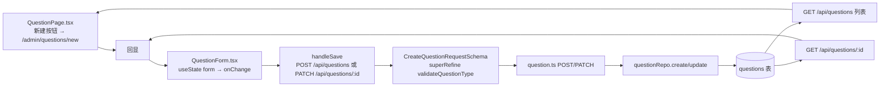
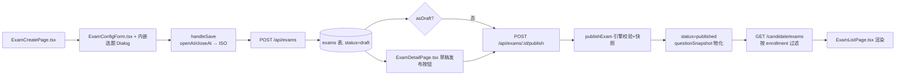

# P2 Authoring UI Flow Audit

> **Task:** P3-MOD-P2-1 — 命题 UI 流程审计（"从题目创建到考试发布并被考生看到"的真实功能链路）
> **Mode:** AUDIT ONLY（本轮只审计、不施工）
> **Scope note:** 本报告不涉及视觉重构 / 表格系统 / 设计 token / Teacher 权限 / 结果发布实现。当前 actor = Admin。

---

## A. Verdict

```text
P3-MOD-P2-1: CORRECTIVE REQUIRED
```

存在一处阻塞 P2 的真实命题功能缺口：

> **Admin 命题 UI（`QuestionForm`）无法创建 `text_response` 题型，也无法编辑 `rubric`。**
> 而 P3-L0-5 发布校验要求 `text_response` 在发布时具备非空 `rubric`。因此当前 UI 路径无法生产出
> "最终可用于考试发布"的合法 `text_response` —— 命题闭环对第 5 种 MVP 题型断裂。

**其余链路（客观题创建、考试创建/配置、resultPublicationMode、时间字段、发布转换、Candidate 可见性）均为 PROVEN 或 IMPLEMENTED-BUT-UNPROVEN，无 P0/P1 阻塞。**

```text
NEXT: P3-MOD-P2-1C — Restore text_response authoring closure
（详见 §M）。在 corrective 完成并复审前，不得进入 P2-2 / P2-3。
```

---

## B. Scope and inspected files

### 规范文件
- `docs/phase3/plan.md`（模块 P2 权威：教师能创建题目、组装/发布考试并向考生开放）
- `docs/SPEC.md`（背景，未逐字重读）
- `AGENTS.md`（项目约束、命令、数据库纪律）

### 命题前端（题目）
- `apps/web/src/pages/admin/QuestionPage.tsx`（题库列表 + "新建题目"入口 + 过滤器）
- `apps/web/src/pages/admin/QuestionEditPage.tsx`（创建/编辑页，承载 `QuestionForm`）
- `apps/web/src/components/question/QuestionForm.tsx`（**核心缺口所在**）
- `apps/web/src/components/question/QuestionPreview.tsx`（仅读取，未深查）
- `apps/web/src/lib/constants.ts`（`QUESTION_TYPE_LABEL_KEYS` / `TYPE_VARIANT`）
- `apps/web/src/i18n/locales/zh-CN.ts`（i18n 键存在性核验）

### 考试前端
- `apps/web/src/pages/admin/ExamCreatePage.tsx`（创建 + 选题 + 直接发布）
- `apps/web/src/pages/admin/ExamEditPage.tsx`（编辑 + schedule-only 守卫）
- `apps/web/src/components/exam/ExamConfigForm.tsx`
  > 任务卡路径写为 `apps/web/src/components/settings/ExamConfigForm.tsx`，仓库实际路径为
  > `apps/web/src/components/exam/ExamConfigForm.tsx`。组件确为创建/编辑复用。
- `apps/web/src/pages/admin/ExamDetailPage.tsx`（发布按钮）
- `apps/web/src/pages/exam/ExamListPage.tsx`（Candidate 侧列表消费）

### 契约 / API / 引擎 / 考生可见性
- `packages/contracts/src/question.ts`
- `packages/contracts/src/exam.ts`
- `apps/api/src/routes/question.ts`
- `apps/api/src/routes/exam.ts`
- `packages/exam-engine/src/examCommands.ts`（`publishExam` + `buildQuestionSnapshot`）
- `packages/exam-engine/src/candidateExamSummary.ts`（`deriveCandidateExamState`）
- `apps/api/src/routes/attempts.candidate.ts`（`GET /candidate/exams`）
- `apps/api/src/routes/reconciliation.ts`（读路径 reconcile）

### 测试（§K 详述）
- `apps/web/src/pages/admin/QuestionEditPage.test.tsx`
- `apps/web/src/components/exam/ExamConfigForm.test.tsx`
- `apps/api/src/routes/question.test.ts`
- `apps/e2e/e2e/admin-flow.spec.ts` + `apps/e2e/lib/seed.ts`

---

## C. Current architecture

### 命题创建链路（真实代码）



### 考试创建与发布链路（真实代码）



关键函数/路由/schema 名称：`CreateQuestionRequestSchema`、`CreateExamRequestSchema`、`publishExam`（`examCommands.ts:80`）、`buildQuestionSnapshot`（`examCommands.ts:49`）、`deriveCandidateExamState`（`candidateExamSummary.ts:38`）、`resolveResultPublicationMode`（`exam.ts:222`）、`reconcileExamForRead`（`reconciliation.ts:70`）。

---

## D. Question authoring flow（入口 / 模式 / 错误 / 回显）

| 能力 | 状态 | 证据 |
| --- | --- | --- |
| 题库页存在"新建题目"入口 | PROVEN | `QuestionPage.tsx:347` `navigate("/admin/questions/new")`，"导入"入口同页 `:342` |
| 路由进入 `QuestionEditPage` | IMPLEMENTED-BUT-UNPROVEN | `QuestionEditPage.tsx:34-35` `isEdit = id !== undefined && id !== "new"`；路由注册未逐行核验，但页面无 disabled/占位入口 |
| 创建与编辑模式区分 | PROVEN | `QuestionEditPage.tsx:114-118`：`isEdit` → `PATCH`，否则 `POST` |
| 保存成功导航 | PROVEN | `QuestionEditPage.tsx:119` `navigate("/admin/questions")` |
| API 错误展示 | PROVEN | `QuestionEditPage.tsx:120-121` `getApiErrorMessage` → `setSaveError` → `InlineErrorBanner` (`:160`) |
| 编辑回显（客观题） | PROVEN | `QuestionEditPage.tsx:52-77` 从 `GET /api/questions/:id` 装填 `formData`，字段对称（含 options/standardAnswer/gradingRule） |
| 编辑回显（text_response / rubric） | **MISSING/BROKEN** | `QuestionEditPage.tsx:62-77` 的 GET 投影**未包含 `rubric`**；即便后端返回 rubric，也不会进 `formData`。叠加 `QuestionForm` 不支持该类型，整条回显链断裂（见 §F） |

---

## E. Five MVP question type matrix

逐题型核对 `QuestionForm.tsx` 的类型选择器（`:183-196`）与表单分支。

| 题型 | 选择器可选 | 表单字段齐全 | `standardAnswer` 处理 | payload 可达 | 后端接受 | 结论 |
| --- | :---: | :---: | --- | :---: | :---: | --- |
| `single_choice` | ✅ `:184` | options + 单选 radio `:220-287` | string（optionId）`:113-115` | ✅ | ✅ | **PROVEN** |
| `multiple_choice` | ✅ `:187` | options + 多选 checkbox | string[] `:116-124` | ✅ | ✅ | **PROVEN** |
| `true_false` | ✅ `:193` | 固定 true/false options + radio | boolean `:112-113` | ✅ | ✅ | **PROVEN** |
| `fill_blank` | ✅ `:190` | standardAnswer input `:289-303`；匹配模式 `:379-420` | string `:164-166` | ✅ | ✅ | **PROVEN** |
| `text_response` | ❌ **无选项** | ❌ **无 rubric 控件** | — | ❌ | ✅（后端支持） | **MISSING/BROKEN** |

**`text_response` 缺口证据（逐行）：**
- `QuestionForm.tsx:30` —— `QuestionFormData.type` 联合类型**仅 4 个值**：
  `"single_choice" | "multiple_choice" | "fill_blank" | "true_false"`，无 `text_response`。
- `QuestionForm.tsx:183-196` —— 类型 `<Select>` 仅渲染 4 个 `<SelectItem>`，无 `text_response`。
- `QuestionForm.tsx:151-178` —— 切换类型的 `defaults` 分支只覆盖 4 个类型。
- 全组件**无 `rubric` 字段、无 rubric 输入控件、`QuestionFormData` 无 `rubric` 键**。
- `QuestionPage.tsx:403-419` —— 题库列表"按题型过滤"下拉同样**遗漏 `text_response`**（4 项）。
- `QuestionEditPage.tsx:52-77` —— 编辑模式 GET 投影**不读取 `rubric`**，即使存在也会丢失。

> 后端契约完全支持（见 §F），故缺口**仅在 UI 层**。但命题链路要求"端到端可通过 UI 创建合法 `text_response`"，UI 断裂即整链断裂。

---

## F. text_response rubric / standardAnswer proof

### 后端：PROVEN

| 环节 | 证据 | 状态 |
| --- | --- | --- |
| 契约接受 `text_response` | `question.ts:5-11` `QuestionTypeEnum` 含 5 值 | PROVEN |
| 契约接受 rubric（create） | `question.ts:201` `rubric: z.string().nullable().default(null)` | PROVEN |
| 契约接受 rubric（update） | `question.ts:222` `rubric: z.string().nullable().optional()` | PROVEN |
| 契约允许 `standardAnswer: null` | `question.ts:46-50,96-101` `StandardAnswerSchema` 接受 null，`validateQuestionType` 在 null 时提前返回 | PROVEN |
| 路由持久化 rubric（create） | `question.ts:229` `rubric: data.rubric`（注释标注 P3-L0-1C 修复了历史 drop） | PROVEN |
| 路由持久化 rubric（update） | `question.ts:288-291` merge `{...existing, ...data}` 再 `CreateQuestionRequestSchema.parse`，rubric 随 validated 透传 | PROVEN |
| 列表/详情读回 rubric | `question.ts:115`（list）、`:165`（detail）均投影 `rubric` | PROVEN |
| 发布校验要求 text_response 非空 rubric | `examCommands.ts:139-145`：`text_response` → `isEmptyOrPlaceholder(question.rubric)` 抛错；`standardAnswer` 对 text_response 可选 | PROVEN |
| 冻结快照携带 rubric | `examCommands.ts:69-71` `buildQuestionSnapshot` 复制 `rubric` 入 `QuestionSnapshot` | PROVEN |

### 契约测试：PROVEN
- `packages/contracts/src/__tests__/contracts.test.ts:371-482` 覆盖：create 接受 text_response+rubric+null standardAnswer；rubric 默认 null；update 接受 rubric；snapshot 携带/归一化 rubric。

### API 集成测试：PROVEN（静态存在；运行见 §L 环境说明）
- `question.test.ts:554-574` POST text_response + rubric → 201 且返回 rubric
- `question.test.ts:576-602` GET 回读 rubric 一致
- `question.test.ts:604+` PATCH 更新 rubric

### UI：MISSING/BROKEN

```text
P2 AUTHORING BLOCKER
```

**结论：** `text_response` 的"UI 可创建合法 rubric"链路**完全不存在**。
- `QuestionForm` 无类型选项、无 rubric 控件、无 `rubric` 数据键。
- 即便通过 seed/API 建出一条 `text_response`，`ExamCreatePage` 的选题 Dialog（`ExamCreatePage.tsx:375-398`）**不过滤题型**，可选中；但所选题目在发布时若 rubric 为空，`publishExam` 必然拒绝（`examCommands.ts:141-144`）。由于 UI 无法填充 rubric，UI 创建的 text_response 永远无法满足发布校验。
- 反向佐证：`QuestionPage` 过滤器、`QuestionForm` 类型映射、`TYPE_VARIANT`（`constants.ts:60-66`）均未对 `text_response` 收口（`TYPE_VARIANT` 在 `text_response` 之前结束，无该键；仅 `QUESTION_TYPE_LABEL_KEYS` `:18` 登记了显示键，说明运行时可显示，但创建入口缺失）。

---

## G. Exam creation and editing flow

| 能力 | 状态 | 证据 |
| --- | --- | --- |
| 创建页复用 `ExamConfigForm` | PROVEN | `ExamCreatePage.tsx:231-236`；`ExamEditPage.tsx:275-280` 复用同一组件 |
| create/edit 默认值一致 | PROVEN | create `:81-110` 与 edit `examToConfig` `:93-119` 字段集一致；edit 对缺失字段兜底（`?? 60 / ?? "immediate"` 等） |
| 字段命名对齐 contract | PROVEN | `ExamConfigData`（`ExamConfigForm.tsx:25-55`）键名与 `CreateExamRequestSchema`（`exam.ts:108-132`）一致 |
| 时间转换 | 见 §I（无确定性偏移） | `ExamCreatePage.tsx:184-189`、`ExamEditPage.tsx:83-90`（`isoToLocalInput`）、`:211-227`（`new Date(...).toISOString()`） |
| 保存后导航 | PROVEN | create → `/admin/exams`（`:202`）；edit → `/admin/exams/:id`（`:230`） |
| 直接从创建页发布 | PROVEN | `ExamCreatePage.tsx:193-195` `asDraft=false` → `POST /:id/publish` |
| 选题器从真实题库 API 加载 | PROVEN | `ExamCreatePage.tsx:117-119` `GET /api/questions`；`availableQuestions` 无题型过滤（`:218-220`），故 text_response **可被选中**（但因 rubric 缺口无法合法发布） |
| 编辑时已选题目回显 | PROVEN | `examToConfig.questionIds` `:106`；`selectedQuestions` 由 `questions.filter` 渲染 `:253-255` |

---

## H. Exam field contract matrix

证据行号：UI 可编辑=`ExamConfigForm.tsx`；payload=`ExamCreatePage.tsx handleSave:182-190`；API 接受=`exam.ts`；持久化=`repo.create`；回显=`ExamEditPage.tsx examToConfig`。

| 字段 | UI 可编辑 | payload 存在 | API 接受 | 持久化 | 编辑回显 |
| --- | :---: | :---: | :---: | :---: | :---: |
| title | ✅ `:123-128` | ✅ spread config | ✅ `exam.ts:109` | ✅ | ✅ `:95` |
| description | ✅ `:151-156` | ✅ | ✅ `:110` | ✅ | ✅ `:96` |
| questionIds | ✅（选题 Dialog，非表单内）`ExamCreatePage:140-155` | ✅ | ✅ `:119`；课程归属校验 `exam.ts:466-481` | ✅ | ✅ `:106` |
| durationMinutes | ✅ `:192-201` | ✅ | ✅ `:113` | ✅ | ✅ `:98` |
| passingScore | ✅ `:313-321` | ✅ | ✅ `:116` | ✅ | ✅ `:101` |
| openAt | ✅ `:173-177` | ✅ ISO | ✅ `:114` | ✅ | ✅ `:99` |
| closeAt | ✅ `:181-185` | ✅ ISO | ✅ `:115` | ✅ | ✅ `:100` |
| resultPublicationMode | ✅ `:466-496` | ✅ | ✅ `:131`；legacy 兼容 `exam.ts:222-236` | ✅ | ✅ `:107-109` |

**B4 `resultPublicationMode` 专项：**
- UI 暴露三选项 `immediate/after_grading/manual`（`ExamConfigForm.tsx:485-493`）。
- 与后端枚举 `ResultPublicationModeEnum`（`exam.ts:37-41`）**完全一致**。
- create/update 均传递；默认值 `immediate`（`ExamCreatePage.tsx:92`）。
- 旧名称：未见 `resultVisibility`/`publicationMode`/`releaseMode`。legacy `controlFlags.showResultImmediately` 仅作向后兼容（`resolveResultPublicationMode` `exam.ts:222-236`），一旦显式设置 mode 则 mode 胜出，flag 仍原样存盘，显示语义不会被后端错存。**无前后端语义错配。**

---

## I. 时间字段（B5）

| 检查项 | 结论 | 证据 |
| --- | --- | --- |
| local datetime → UTC 转换 | 正确 | `new Date(localStr).toISOString()`（`ExamCreatePage.tsx:185-189`、`ExamEditPage.tsx:221-226`）；`new Date("YYYY-MM-DDTHH:mm")` 按浏览器本地时区解析 → ISO |
| UTC → local 回显 | 正确 | `isoToLocalInput`（`ExamEditPage.tsx:83-90`）用 `getHours/getMinutes` 等本地方法重组，无时区偏移 |
| openAt < closeAt 校验 | 前后端均有 | 前端 `ExamConfigForm.tsx:84-87` + `ExamCreatePage.tsx:166-169`；后端 `examCommands.ts:114-116` |
| closeAt 与 duration 冲突 | 不校验（合理，duration 为作答时长） | 仅 `durationMinutes > 0` 校验 `examCommands.ts:98-100` |
| 空值语义 | create 有兜底默认 | `ExamCreatePage.tsx:184-189`：空 openAt→now，空 closeAt→now+1d；但 Phase1 `timed_window` 实际要求非空，contract `openAt/closeAt` 为必填 datetime，空串会在 Zod 层失败 —— **非确定性偏移，属可接受校验行为** |
| 无效日期串 | Zod `.datetime()` 兜底 | `exam.ts:114-115` |

**未发现确定性时区偏移。**

---

## J. Publish flow + Candidate visibility

### C1 发布按钮（`ExamDetailPage.tsx`）
- 仅 draft 显示：`:384`（发布区）、`:394`（按钮 `exam.status === "draft"`）。
- 重复点击保护：`:395` `disabled={publishing}`；`handlePublish` `:243-244` 早返回 `if (!id || publishing) return`。
- 成功后刷新：`:250` `await loadExam()`。
- 失败展示真实错误：`:251-256` `setPublishError` + toast。

### C2 发布校验数据源与覆盖
- 数据源：**live questions**。`exam.ts:661-665` 按 `exam.questionIds` 从 `questionRepo.findById` 逐题取 live 记录，传入 `publishExam`；`buildQuestionSnapshot`（`examCommands.ts:49-74`）基于这些 live 题目物化 `questionSnapshot`。
- 覆盖项（`examCommands.ts:80-173`）：
  - 考试存在 `:85-88`
  - 状态允许转换 `:90` `assertTransition(exam.status, "published")`（非 draft 抛 `InvalidStateTransitionError` → 路由映射为 `ExamAlreadyPublishedError` `exam.ts:672-677`）
  - 至少一题 `:92-94`
  - 每题内容合法：`buildQuestionSnapshot` 缺题抛 `:56-58`
  - objective 题有合法 standardAnswer `:146-152`（非空非占位）
  - **text_response 有非空 rubric；standardAnswer 可选 `:140-145`**
  - 分值有效：`passingScore>0`、`duration>0`、totalScore 匹配 `:156-165`、passing≤total `:163-165`
  - 时间有效 `:114-116`
  - 题目归属课程 `:119-121`
- 快照物化：`repo.update(examId, { status: "published", questionSnapshot })` `:167-170`。

### C3 发布后考生可见性
- 列表查询：`GET /candidate/exams`（`attempts.candidate.ts:280-401`）。
- 过滤链：
  1. 角色必须 `Candidate`（`:282`）。
  2. 取该 candidate 的 **enrollments**（`:300-304` `findByCandidate`）。**未 enrollment 的考试不出现。**
  3. 对每个 enrollment 调 `reconcileExamForRead`（`:313-322`）—— 若考试不存在返回 null 被过滤（`:322,396-400`）。
  4. `deriveCandidateExamState`（`candidateExamSummary.ts:38-119`）：
     - `examOpen = status === "published" || "open"`（`:59`）；`examClosed = status === "closed"`（`:63`）。
     - draft/archived/canceled → `unavailable`/`primaryAction none`（`:69-71`）—— 仍出现在列表但不可操作。
     - beforeWindow → `not_started_yet`（`:73-75`）；afterWindow → `expired`（`:104-109`）。
- **证明 published 考试（且已 enrollment）能进入 candidate 列表**；openAt 未到则显示 `not_started_yet` 而非隐藏。

> **可见性结论：** published 是进入 `examOpen` 的前提之一；但必须先 `enrollment`。命题闭环本身不含 enrollment（属后续分配），故"发布后可见"= "发布 + enrollment 后可见"。无前后端不一致。

---

## K. Existing test coverage

| 测试目标 | 文件 | text_response/rubric? | question 创建 UI? | exam 创建 UI? | 发布 UI? | Candidate 可见? |
| --- | --- | :---: | :---: | :---: | :---: | :---: |
| 题目 API | `question.test.ts` | ✅ 554-610+ | n/a（API） | — | — | — |
| 题目 UI | `QuestionEditPage.test.tsx` | ❌（仅 single_choice） | 部分（load/save，`:156-181`） | — | — | — |
| 考试表单 UI | `ExamConfigForm.test.tsx` | ❌ | — | 部分（totalScore/字段校验） | ❌ | — |
| E2E admin | `admin-flow.spec.ts` | ❌ | ❌（seed） | ❌（seed） | ❌（seed publish） | ❌ |
| E2E candidate | `candidate-happy-path.spec.ts` 等 | ❌ | ❌ | ❌ | ❌ | ✅（消费 seed） |

**逐项回答（§七）：**
1. 题目创建 E2E：**无**（`seedExam` 经 API 建）。
2. 考试创建 E2E：**无**（同上）。
3. 发布 E2E：**无** UI 发布；`seedExam` 直接发布。
4. Candidate 可见性 E2E：仅消费 seed 已发布考试，不验证"发布→出现"的转换。
5. 测试是否绕过 UI：**是**（全部经 `apps/e2e/lib/seed.ts` API 构造）。
6. 测试是否含 `text_response`：API 契约/集成测试 ✅；UI/E2E ❌（manual-grading.spec.ts 用 seed 建主观题）。
7. 测试是否验证 rubric：API ✅；UI/E2E ❌。
8. 测试是否验证 `resultPublicationMode`：UI 表单测试未验证其传值/枚举映射。
9. 固定 seed 是否掩盖 UI 缺口：**是** —— seed 绕过了 `QuestionForm`，故 `text_response` UI 缺口长期未被任何测试捕获。

---

## L. Findings

### P0 — 阻塞 P2

**F-1 `text_response` 命题 UI 缺失（P2 AUTHORING BLOCKER）**
- 现象：`QuestionForm` 无 `text_response` 类型选项、无 rubric 控件、无 `rubric` 数据键。
- 证据：`QuestionForm.tsx:30,183-196,151-178`；`QuestionPage.tsx:403-419`（过滤遗漏）；`QuestionEditPage.tsx:52-77`（回显不含 rubric）。
- 影响：UI 无法创建合法 `text_response`；`publishExam`（`examCommands.ts:140-145`）必然拒绝 rubric 为空者 → 命题闭环对第 5 种 MVP 题型断裂。

### P1 — 应在 P2 closure 前修复

**F-2 `QuestionEditPage` 编辑回显丢失 `rubric`**
- 证据：`QuestionEditPage.tsx:62-77` GET 投影字段集无 `rubric`。
- 影响：即便补齐 `QuestionForm` 的 rubric 控件，编辑既有 text_response 时 rubric 仍会被清空。须与 F-1 一同修复。

### P2 — 非阻塞但应记录

**F-3 `TYPE_VARIANT` 未登记 `text_response`**（`constants.ts:60-66`）—— 显示降级为 `default`，非功能阻塞。
**F-4 `QuestionPage` 题型过滤下拉遗漏 `text_response`**（`QuestionPage.tsx:403-419`）—— 仅影响按题型筛选，不阻塞创建。
**F-5 UI 测试覆盖不足**：`QuestionEditPage.test.tsx` 仅 single_choice；`ExamConfigForm.test.tsx` 未验证 `resultPublicationMode` 传值/枚举。生产路径客观题完整，属测试债（P2-2 范围）。

---

## M. Required corrective work（建议，本轮不实施）

```text
P3-MOD-P2-1C — Restore text_response authoring closure
```

- **precise owner:** 命题前端（`apps/web/src/components/question`、`pages/admin/QuestionEditPage`）
- **precise files:**
  - `apps/web/src/components/question/QuestionForm.tsx`
  - `apps/web/src/pages/admin/QuestionEditPage.tsx`
  - （建议顺手）`apps/web/src/pages/admin/QuestionPage.tsx`（过滤器补 text_response）
  - （建议顺手）`apps/web/src/lib/constants.ts`（`TYPE_VARIANT` 登记 text_response）
- **root cause:** P3-L0-1 在后端/契约引入 `text_response`+rubric，但命题 UI（`QuestionForm`）从未跟进；P3-MOD-P0-2 只补了考生运行时渲染，命题侧遗漏。
- **required behavior:**
  1. `QuestionFormData.type` 联合加入 `text_response`。
  2. 类型选择器新增 `text_response` 选项；切换时归一 `options=[]`、`standardAnswer=null`。
  3. 当 `type==='text_response'` 时渲染多行 `rubric` 编辑控件（Textarea），允许换行，进入 `formData.rubric`。
  4. 提交 payload 携带 `rubric`（string | null）与 `standardAnswer: null`。
  5. `QuestionEditPage` GET 投影读取并回显 `rubric`。
- **tests required:**
  - `QuestionEditPage.test.tsx` 新增：创建 text_response、rubric 多行、payload 含 rubric、standardAnswer 可选、编辑回显 rubric。
  - 建议新增 `QuestionForm.text_response.test.tsx` 覆盖控件与归一。
- **non-goals:** 不改后端契约/路由（已 PROVEN）；不做富文本；不实现结果发布；不迁 Teacher 权限。
- **completion gate:**
  - 经 UI 能创建带非空 rubric 的 text_response；
  - 该题目可被选入考试并通过 `publishExam` 发布；
  - （理想）P2-3 E2E 证明"UI 建 text_response → 发布 → candidate 可见"。

---

## N. Deferred / out-of-scope items

- 结果发布（`publish-results` / 可见性翻转）：属 **P3** 模块；本轮仅审计 `resultPublicationMode` 能否正确配置（已 PROVEN）。
- Teacher 角色 / RBAC 切换：**P4**。
- Email 通知：**P5**。
- 题目版本化、随机出卷、批量导入重设计、考试模板：P2 非目标。
- 视觉/表格/设计 token 调整：本轮禁止。

---

## O. Recommended next task

```text
P3-MOD-P2-1C — Restore text_response authoring closure
```

corrective 完成并复审后，方可进入：

```text
P3-MOD-P2-2 MVP 题目创建测试
P3-MOD-P2-3 考试发布到考生 E2E
```

---

## 附：执行过的测试及结果（§十二）

| 命令 | exit code | 结果 | 说明 |
| --- | :---: | --- | --- |
| `pnpm --filter web test -- QuestionEditPage` | 0 | 1073 passed (94 files) | web 测试全量通过（filter 标志未缩小范围，全量 GREEN）。含 `QuestionEditPage.test.tsx`、`ExamConfigForm.test.tsx` |
| `pnpm --filter api test -- question` | 1 | **未运行（环境）** | 失败原因：`[vitest globalSetup] Test database is unreachable` —— 本 WSL 环境无 `docker`（Docker Desktop WSL 集成未启用）且无 `psql`，Postgres 测试库不可达。**此为环境限制，非 authoring 缺口。** API 测试的静态证据（`question.test.ts:554-610+` 覆盖 text_response+rubric create/read/update）见 §F |

**失败分类：** 环境/基础设施（无 Postgres 测试库），与本次 authoring 缺口**分开记录**。在具备 `pnpm db:up` 的环境重跑 `pnpm --filter api test -- question` 即可验证 API 侧（已由静态阅读证明为 PROVEN）。
