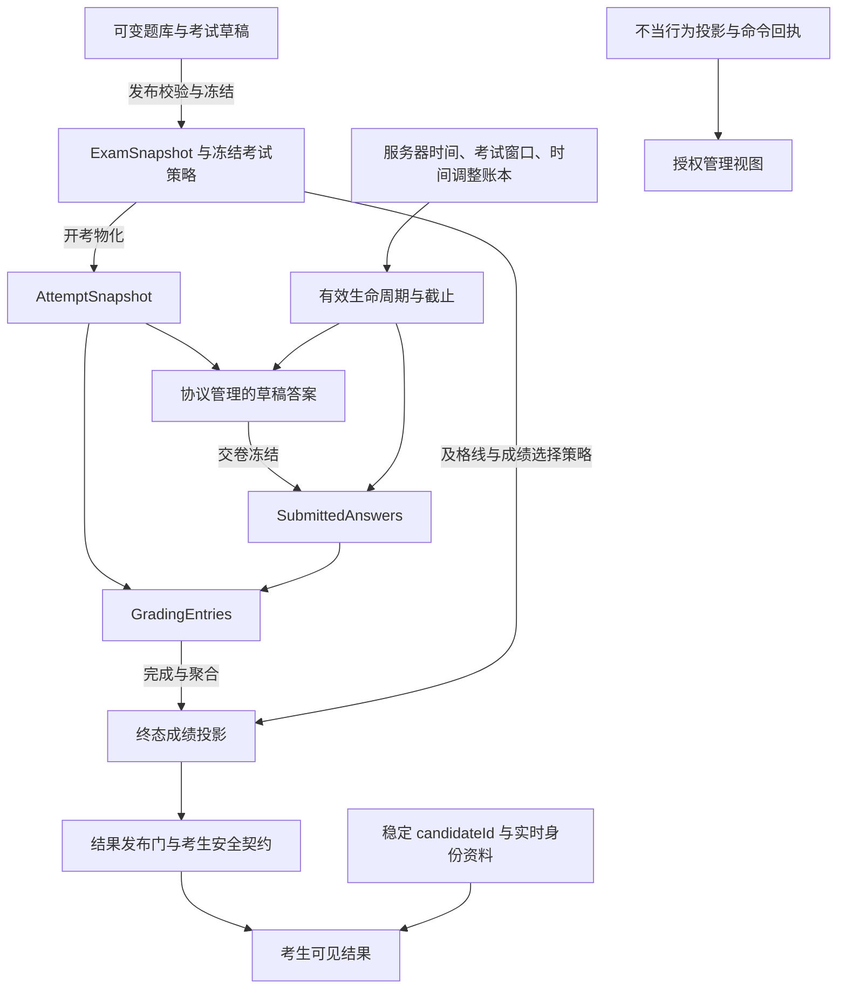

# Exam Semantic Closure Decision (2026-09-27)

> **Status:** ARCHIVED DECISION REPORT — historical evidence only.
>
> **Adoption disposition (added 2026-09-27, Phase A + Phase B).** This
> closure report is preserved verbatim below as the frozen decision input.
> The decisions it made are no longer carried here: they were adopted into
> the resident authority in the same campaign —
>
> - **Phase A (PR #642):** [`docs/architecture/exam-semantic-boundaries.md`](../../architecture/exam-semantic-boundaries.md)
>   (EXSEM-001..020) is the normative body; ADR-021 records the adoption and
>   the scoped ADR-008 supersession. This report is evidence, not a second
>   normative root.
> - **Phase B (PR #643):** the §8 conformance repairs (candidate secret
>   contracts, demo seed durable grading facts, export answer authority,
>   draft question-reference error semantics, targeted regressions) were
>   implemented there. The report's "CONDITIONAL_PASS" conditions are closed
>   by that work, not by this document.
>
> Do not cite this report to override the EXSEM body, an Accepted ADR, or
> current contracts. Where they disagree, this file is the stale copy.

## 1. Executive verdict

```text
SEMANTIC_CLOSURE = CONDITIONAL_PASS
REMAINING_PRODUCT_DECISIONS = 0
REMAINING_SEMANTIC_AMBIGUITIES = 0
```

**裁决：Exam 的核心语义已足以冻结；当前实现与文档尚未全部符合本次裁决。停止开放式语义扫描，进入有限的规范落地和一致性修复。**

`CONDITIONAL_PASS` 的条件是完成本报告第 8 节的对应修复与第 11 节的权威登记，不是要求再做一轮 D1–D7 产品选型。剩余缺陷不能用“已有语义冻结”来豁免，但也不需要继续发明架构。

审查基线：

```text
repository = jnhu76/exam
master     = 347d3a44a0b60c833cf7b7f08768979b01972b9d
tree       = 468b876bf8dbabe957dbf5e7107f03e6861a6368
date       = 2026-09-27
evidence   = Issue #640 + Issue #641，均无后续评论
mode       = 只读裁决；未修改仓库/GitHub；未运行测试或形式化模型
final_check = master SHA 与两个 issue 正文在报告完成时均未变化
```

直接读取了两个 issue 的完整正文，并在同一 SHA 下补读影响裁决的生产代码、契约、测试及相关 ADR。测试结论指现存断言的静态核实，不表示本次重新执行通过。证据索引见第 11 节。[E1](https://github.com/jnhu76/exam/issues/640)[E2](https://github.com/jnhu76/exam/issues/641)

冻结前必须纠正五处证据表述：

1. **F2 并非完全没有 API 级快照冻结测试。** `candidate-take-text-response.test.ts` 已有“publish → PATCH 活题 → start 新 attempt → save/submit → grading-details 仍见旧内容”的集成测试。剩余缺口是删除、撤回再发布及更多题型/结果路径，不应重复建设已存在的测试。[E3](https://github.com/jnhu76/exam/blob/347d3a44a0b60c833cf7b7f08768979b01972b9d/apps/api/src/routes/attempts/candidate-take-text-response.test.ts#L250-L415)
2. **F3 的 reconcile-first 已经是 Accepted ADR 的规则。** ADR-005 的 “Construction hard rule” 明确要求事务内锁定、对账、守卫、修改、审计。当前问题是跨文档表达和增量回归覆盖，不是此前没有架构约束。[E4](https://github.com/jnhu76/exam/blob/347d3a44a0b60c833cf7b7f08768979b01972b9d/docs/adr/ADR-005-exam-operation-state-baseline.md#L132-L178)
3. **F9 的部分读路径已经按状态选权威。** 考生摘要明确为 draft 使用 `questionIds.length`、非 draft 使用快照长度，并禁止静默 fallback；不能把审计中“普遍 snapshot-with-fallback”的概括写成现状。[E5](https://github.com/jnhu76/exam/blob/347d3a44a0b60c833cf7b7f08768979b01972b9d/apps/api/src/routes/attempts.candidate.ts#L400-L421)
4. **#641 的评分状态图过度概括。** 当前终态闭合把 `pending_manual` 推进为 `fully_graded`，但会保留 `auto_graded`；并非所有已评分 attempt 都变成 `fully_graded`。`after_grading + auto_graded` 结果隐藏有现存 API 测试明确约束。本次保留这一兼容行为，不借文档纠错改变发布策略；因此也不能承诺“全客观题在 after_grading 模式会自动放分”。[E6](https://github.com/jnhu76/exam/blob/347d3a44a0b60c833cf7b7f08768979b01972b9d/packages/exam-engine/src/grading.ts#L167-L334)[E7](https://github.com/jnhu76/exam/blob/347d3a44a0b60c833cf7b7f08768979b01972b9d/apps/api/src/routes/candidateResultVisibility.test.ts#L641-L698)
5. **ADR-008 包含已过期的实现范围表述。** 其中拒绝新增答案快照列、直接从锁内 answers 计算终态等 Phase-2 描述，已不完整描述当前 `submittedAnswers + entries` 实现。保留其单事务和 save/submit 竞争语义，显式更新/局部 supersede 过期部分，不能继续把整个旧正文当作现行实现规格。[E8](https://github.com/jnhu76/exam/blob/347d3a44a0b60c833cf7b7f08768979b01972b9d/docs/adr/ADR-008-submit-answer-freeze.md)[E9](https://github.com/jnhu76/exam/blob/347d3a44a0b60c833cf7b7f08768979b01972b9d/packages/exam-engine/src/examCommands.ts)

本次作出裁决与“已在 master 登记采纳”是两件事：本文完成了授权范围内的语义选择，仓库落地仍须通过后续变更完成，不声称本次已修改规范根。

## 2. Final authority graph



这是权威依赖图，不表示图中每个节点都是独立事务。首次交卷的答案冻结与评分工作集物化必须原子发生；自动题评分可在该事务内完成，人工题工作项之后单向完成。时间、身份、conduct 是正交事实，不能据此反向改写已冻结的题目、答案或成绩。

## 3. Decision table

| ID | Decision | Chosen model | Why | Consequence |
|---|---|---|---|---|
| D1 | 题库永久属于 authoring；运行时内容归相应快照 | **B** | 现有双重冻结已隔离活题；锁死题库会重新耦合内容维护与已发布考试，且不增加已有 attempt 的历史完整性 | 发布引用不阻止题库正常编辑/删除；未来发布重新校验；已发布考试及已有 attempt 不追读活题 |
| D2 | 撤回发布可保留旧快照，但 draft 不得把它当作当前内容 | **A** | 字段存在不等于仍持有权威；清空不是语义正确性的必要条件 | draft 依据当前选题与活题；重新发布重建并替换快照；残留不承诺完整发布历史 |
| D3a | 管理秘密在考生输出契约中不可表示；mapper 同时最小化投影 | **契约边界** | 单个 mapper 的偶然省略不能承担隐私与阅卷秘密边界 | `misconduct`、管理 actor/notes、标准答案、rubric 等不进入考生专用响应类型与序列化结果 |
| D3b | 原始 `gradingRule` 是内部评价元数据，当前所有考生题目响应均隐藏 | **B** | take 接口已有明确隐藏契约和测试；load 的暴露没有相应产品承诺；保持一套边界成本最低 | load/take/恢复/结果相关题目投影统一；不设计公开子集，不新增说明配置系统 |
| D4 | 普通 LMS 与报表使用实时身份；审计级历史身份制品是独立的未来能力 | **C** | 稳定 ID 已承担历史关联，姓名纠错应体现在普通展示；没有证据要求每次 attempt 冻结身份 | 不给 attempt 增加身份快照；普通 CSV 是生成时的数据展示，不保证重现考试当时姓名或字段定义 |
| D5 | 持久化状态保存已发生的业务事实；时间相关有效状态可派生并延迟物化 | **C：限定后的 B** | 把全部 status 叫缓存会错误弱化提交/取消/评分完成事实；要求所有时间转移即时写库也无必要 | 状态敏感写入必须按规范时间/状态对账与守卫；扫描器负责收敛，不决定真相 |
| D6 | 可表示、可读取、可达、受支持是不同概念 | **显式能力规则** | 枚举/列/接受字段不能证明完整的生产能力，更不能证明权限、失败路径和运行效果 | 保留读兼容；支持集合由有效契约、合法生产入口、守卫和验证共同界定；不得静默激活保留值 |
| D7 | 正确答案只有一个语义来源；`isCorrect` 当前是非权威兼容字段 | **C** | 表单也由 `standardAnswer` 驱动；把持久化 `isCorrect` 宣称为受保证的 UI 投影与现状不符 | 不要求维护第二套同步真相；不据其重建标准答案；字段删除属于后续兼容清理，不是此次前置 |

**D1：逐状态的内容权威。**

| 状态/阶段 | 内容权威 | 对题库与引用的含义 |
|---|---|---|
| draft，尚未发布 | `questionIds` 表示作者选题；内容来自当前活 Question；发布前完整验收 | 引用可暂时失效，但不能带着缺题成功发布 |
| published，尚未实际开考 | 当前发布的 ExamSnapshot 与冻结考试策略 | 后续新 attempt 也应从该快照生成，不重新读题库 |
| unpublished-after-previous-publish | 与普通 draft 相同 | 旧快照是非权威残留；不能补齐已删除活题或绕过重新发布验收 |
| active attempt | 该 attempt 的冻结题目/呈现，加规范允许的实时窗口和个人时间调整 | 题库编辑/删除、模板变更不反向传播 |
| graded attempt | AttemptSnapshot、SubmittedAnswers、完成的 entries 与终态投影 | 姓名等展示资料仍可 live；不得因此改变历史分数 |

撤回发布必须继续遵守现有 reconcile-under-lock 和实际尚未进入开放阶段的限制；不引入 open → draft，不引入进行中换题。状态转移才改变权威，JSON 字段非空本身不能改变权威。[E4](https://github.com/jnhu76/exam/blob/347d3a44a0b60c833cf7b7f08768979b01972b9d/docs/adr/ADR-005-exam-operation-state-baseline.md#L132-L178)[E9](https://github.com/jnhu76/exam/blob/347d3a44a0b60c833cf7b7f08768979b01972b9d/packages/exam-engine/src/examCommands.ts)

```text
QUESTION_AFTER_PUBLISH_MUTABILITY = ALLOWED_IN_AUTHORING_SCOPE
SNAPSHOT_EXECUTION_AUTHORITY = PUBLISHED_EXAM_SNAPSHOT_THEN_IMMUTABLE_ATTEMPT_SNAPSHOT
QUESTION_REFERENCE_MEANING = DRAFT_SELECTION_REFERENCE_OR_SNAPSHOT_PROVENANCE_ID; NOT_A_RUNTIME_LIVE_LINK

UNPUBLISH_SNAPSHOT_POLICY = RETAIN_AS_NON_AUTHORITATIVE_RESIDUE
DRAFT_CONTENT_AUTHORITY = CURRENT_QUESTION_IDS_AND_LIVE_AUTHORING_CONTENT
PUBLISHED_CONTENT_AUTHORITY = CURRENT_PUBLICATION_SNAPSHOT_AND_FROZEN_POLICY

CANDIDATE_SECRET_BOUNDARY = SECRET_FIELDS_UNREPRESENTABLE_IN_CANDIDATE_OUTPUT_CONTRACTS
CONTRACT_VS_MAPPER_RULE = SAFE_CONTRACT_AND_MINIMAL_PROJECTION; MAPPER_OMISSION_ALONE_IS_INSUFFICIENT
GRADING_RULE_VISIBILITY = HIDDEN_ON_ALL_CURRENT_CANDIDATE_QUESTION_SURFACES

CANDIDATE_IDENTITY_AUTHORITY = STABLE_ORGANIZATION_SCOPED_CANDIDATE_ID
REPORTING_IDENTITY_POLICY = LIVE_PROFILE_AND_LIVE_FIELD_DEFINITIONS_AT_READ_OR_EXPORT_TIME
AUDIT_GRADE_IDENTITY_POLICY = NOT_CURRENTLY_SUPPORTED; SEPARATE_EXPLICIT_ARCHIVAL_CAPABILITY_IF_REQUIRED

STORED_STATUS_SEMANTICS = DURABLE_BUSINESS_STATE_WITH_LAZY_TIME_TRANSITION_MATERIALIZATION
EFFECTIVE_STATE_AUTHORITY = STORED_FACTS_PLUS_CANONICAL_SERVER_TIME_AND_POLICY
RECONCILIATION_RULE = RECONCILE_OR_EVALUATE_CANONICAL_EFFECTIVE_STATE_BEFORE_STATE_DEPENDENT_MUTATION_UNDER_ITS_EXISTING_SERIALIZATION_PROTOCOL
SCANNER_ROLE = DISCOVERY_AND_CONVERGENCE; NOT_TRUTH_AUTHORITY

REPRESENTABILITY_VS_SUPPORT_RULE = REPRESENTABLE_DOES_NOT_IMPLY_SUPPORTED
SUPPORTED_SEMANTIC_TEST = ADOPTED_CURRENT_CONTRACT_AND_REACHABLE_AUTHORIZED_PRODUCTION_PATH_WITH_REQUIRED_GUARDS_EFFECTS_AND_REGRESSION_EVIDENCE
RESERVED_VOCABULARY_POLICY = READ_COMPATIBILITY_ALLOWED; NO_IMPLICIT_WRITER_OR_ACTIVATION

QUESTION_CORRECTNESS_AUTHORITY = AUTO_QUESTIONS_USE_STANDARD_ANSWER_AND_FROZEN_GRADING_RULE; MANUAL_QUESTIONS_USE_FROZEN_RUBRIC_AND_COMPLETED_MANUAL_ENTRY
OPTIONS_IS_CORRECT_ROLE = NON_AUTHORITATIVE_LEGACY_AUTHORING_METADATA; NO_EXECUTION_OR_GRADING_AUTHORITY
```

D3b 的理由不是“考生不应该知道计分政策”。部分分、大小写要求等可以是合理的公开考试说明；现有原始 `gradingRule` 结构并不是已经定义的说明产品。需要影响答题的公开要求应通过明确的考题/考试说明传达，且不得与实际规则冲突。以后若要自动生成公开规则，须显式定义输出语义，而不是重新开放整个内部对象。

D3a 的“不可表示”指服务器管理的秘密字段不能通过合法考生输出契约序列化；不声称类型系统能阻止开发者把秘密拼进任意文本。因此仍保留显式安全 mapper、输出解析与带秘密样本的线路测试。正常考生答案文本中出现同义词汇，不应被粗暴的全局字符串禁令误判。

D4 允许普通资料纠错，不允许重新绑定已存在 attempt 的历史考生身份。本裁决不承诺任何特定法域或认证制度的合规性；若未来需要可证明的历史身份/签署记录，须先定义归档制品及其使用要求，不能把当前动态 CSV 宣传成已有审计档案。

D5 不要求每次拒绝保存都新建提交事务，也不要求每次读取都写库。它要求决策不依赖过时的 status；是否立即物化、幂等分支顺序和事务边界继续由现有命令协议负责。不得以新规则为由重排既有锁序或改变已经合法的保存/交卷竞争结果。

## 4. Frozen semantic invariants

| ID | Normative invariant |
|---|---|
| **EXSEM-001** | 内容、考试、attempt、身份和结果访问必须受服务器解析的机构归属、资源关系与当前能力授权约束；前端、JWT 展示角色及调用者提供的身份不能成为授权权威。 |
| **EXSEM-002** | Question 是可变作者数据。发布引用不赋予活题对已发布考试或已有 attempt 的运行时权威；快照中的题目 ID 是身份/来源标识，不是重新读取活题的指令。 |
| **EXSEM-003** | 成功发布原子建立经校验的考试内容快照与发布状态；内容和评分相关策略在该次发布有效期间冻结。模板只是作者期输入，日程仅经已支持的命令改变。 |
| **EXSEM-004** | 合法撤回发布恢复 draft 作者权威；保留的旧快照无执行权威。重新发布必须从当前作者输入重新验收和冻结，不能复用旧快照绕过缺题或内容校验。 |
| **EXSEM-005** | attempt 创建后，其题目、选项身份、评分依据及已物化呈现由 AttemptSnapshot 决定；恢复与重载重放同一呈现，不重新读题库或重新随机化。 |
| **EXSEM-006** | 自动题以 `standardAnswer` 与冻结规则判分；人工题以冻结 rubric 指导获授权的人工评分。题型决定自动/人工模式；`isCorrect` 和标准答案是否为空均不得另立分类权威。 |
| **EXSEM-007** | 草稿答案只能通过服务器版本、操作幂等与冲突检查协议接受；客户端时间不决定先后或胜者，未被服务器接受的本地输入不自动成为交卷答案。 |
| **EXSEM-008** | 首次交卷在同一受保护事务内冻结锁内已接受答案、推进提交状态并物化逐题评分工作集；重复交卷不得重建或替换已冻结事实。 |
| **EXSEM-009** | 评分工作集从 SubmittedAnswers 与 AttemptSnapshot 建立并成为持久评分事实；自动条目完成后不重写，人工条目只允许 pending → completed。当前没有终态重评能力。 |
| **EXSEM-010** | 终态成绩、通过与逐题结果只能从完整且一致的终态工作集聚合；同一终态化事务按冻结考试策略更新 enrollment 投影。投影不得反过来成为评分输入或自动历史修复源。 |
| **EXSEM-011** | 服务器时间是截止与时间转移的唯一权威；有效截止遵循现有规范内核的空值/组合规则。客户端倒计时、事件时间和扫描发现时刻不授予额外答题时间。 |
| **EXSEM-012** | attempt 个人 deadline 的初始化之后，时间变动只能经获授权的既有调整语义及账本；考试窗口保持独立权威。补时、准入、心跳与恢复不得自行另造计时真相。 |
| **EXSEM-013** | 持久化状态记录已提交的业务事实，时间触发的状态可以延迟物化；有效状态必须结合这些事实与规范服务器时间，不能把所有 status 当作可任意重算的缓存。 |
| **EXSEM-014** | 状态/截止敏感的变更必须在既有事务与并发协议内先对账或检查规范有效状态，再作合法性决定；扫描器只是发现和收敛机制，所有物化通过现有领域命令完成。 |
| **EXSEM-015** | `(organizationId, candidateId)` 确定 attempt 的稳定历史归属；普通展示和报表读取当前身份资料与字段定义，不承诺考试当时身份的可重现性。 |
| **EXSEM-016** | misconduct 是独立、获授权、可在提交后更新的管理投影，命令回执记录已提交操作事实；其变化不自动重评、不自动作废 attempt，也不向考生开放管理 notes/actor。 |
| **EXSEM-017** | 所有考生响应使用考生安全输出契约和最小投影；标准答案、rubric、原始 gradingRule 及管理秘密字段不可作为服务器数据经这些契约输出。 |
| **EXSEM-018** | 评分事实与可见性分离：先满足既有结果就绪语义，再经考试发布门，才输出考生结果；列表、加载、结果及已知补考决策表面必须使用同一可见性权威，不得绕门泄露结果。 |
| **EXSEM-019** | 存储/Schema 可表示、读侧能处理、存在辅助计算代码都不等于受支持产品能力；保留值不得产生未经明确采纳的生产写入、执行效果或安全保证。 |
| **EXSEM-020** | 向正常产品路径提供“有效数据”的 demo seed/fixture 必须满足同一冻结与评分完整性；历史兼容和损坏数据修复只能走明确、有限的既有协议，不得成为新写入的第二套语义。 |

**评分裁决：确认现有工作集架构。**

```text
GRADING_WORKSET_AUTHORITY = ATTEMPT_SNAPSHOT_PLUS_SUBMITTED_ANSWERS_TO_DURABLE_PER_QUESTION_ENTRIES
TERMINAL_SCORE_PROJECTION_ROLE = VALIDATED_DERIVED_OUTPUT; NEVER_SCORING_INPUT
REGRADING_CURRENTLY_SUPPORTED = NO
```

`passed` 和 enrollment 最终选分还依赖发布后冻结的考试及格线/成绩策略；不能把所有评分上下文误写为都已复制到 AttemptSnapshot。普通重试返回已提交事实，不是重评；损坏历史数据的专门恢复也不是日常改分 API。[E6](https://github.com/jnhu76/exam/blob/347d3a44a0b60c833cf7b7f08768979b01972b9d/packages/exam-engine/src/grading.ts#L167-L334)[E9](https://github.com/jnhu76/exam/blob/347d3a44a0b60c833cf7b7f08768979b01972b9d/packages/exam-engine/src/examCommands.ts)[E10](https://github.com/jnhu76/exam/blob/347d3a44a0b60c833cf7b7f08768979b01972b9d/packages/exam-engine/src/gradingWorkset.ts)

**时间裁决：确认服务器时钟，补齐 min 公式的定义域。**

| `exam.closeAt` | `attempt.deadlineAt` | 有效截止 |
|---|---|---|
| 有 | 有 | 两者最早者 |
| 有 | 无 | 考试关闭边界 |
| 无 | 无 | 无截止；不因时间自动过期 |
| 无 | 有 | 当前非法混合形状；fail closed |

存在截止时 `now >= effectiveDeadline` 即过期；deadline 提交沿用有效截止作为相应提交时间，不能改成扫描器晚到的时间。考试 extend 不代表所有个人 deadline 等量延长；其影响受同一个截止内核约束。[E11](https://github.com/jnhu76/exam/blob/347d3a44a0b60c833cf7b7f08768979b01972b9d/packages/exam-engine/src/timer.ts#L14-L74)

## 5. Authority matrix

| Fact | Authority | Mutable when | Freeze/transfer point | Non-authoritative copies |
|---|---|---|---|---|
| 题库题目内容 | 活 Question；富文本内部按现有 content-document 契约决定原文/投影关系 | 经授权的作者操作，包括被已发布考试引用之后 | 发布时复制经验证内容 | 已发布快照不反向决定当前题库内容 |
| 考试快照与评分策略 | 当前发布的 ExamSnapshot 与冻结考试策略 | draft 作者输入可改；合法 republish 整体重建 | publish | 活题、profile 模板、draft 中残留的旧 snapshot |
| attempt 题目与呈现 | AttemptSnapshot | 创建时物化一次 | startOrRestoreAttempt 的新建分支 | 活题、当前 ExamSnapshot、客户端临时重排 |
| 选项正确性 | 自动题的 standardAnswer；人工题的 rubric/完成条目承担不同职责 | 作者期可改，随后逐层冻结 | publish → start → manual completion | options.isCorrect；人工题可选参考答案不等于唯一正确答案 |
| 草稿答案 | 答案保存协议接受的 answers + 版本/幂等事实 | 按当前状态与截止协议允许保存时；包括当前协议允许的 disrupted 保存 | submit 冻结锁内接受集 | 本地编辑、客户端时间、未确认请求 |
| 已交卷答案 | SubmittedAnswers | 正常新数据写一次 | 首次成功 submit | draft answers；entries 中的答案是由其物化的副本 |
| 评分条目 | attempt_grading_entries | 自动条目物化时完成；人工条目完成一次 | submit / manual completion | 临时评分响应、gradingStatus、gradingResult |
| 终态成绩与通过 | 由完整 entries、AttemptSnapshot 和冻结考试策略聚合的终态投影 | 正常闭合一次 | finalizeTerminalGrading | 客户端汇总、临时自动分、活题、手写 seed 成绩 |
| enrollment 最终成绩 | 终态化命令按冻结 scoreStrategy 选择的跨 attempt 投影 | 新 attempt 完成且符合选择策略时 | 同一评分闭合事务 | 任意最新 attempt 分数、客户端 bestScore 计算 |
| 生命周期 | 持久化命令事实 + 规范时间派生有效状态 | 合法命令或规范时间转移 | 经事务物化 | 未对账的 status 展示、扫描候选集合、客户端状态 |
| 有效截止 | 服务器时钟语义 + 当前合法考试窗口 + 个人 deadline | 窗口变更/个人调整各自通过已有命令 | 初始 deadline 创建；后续授权调整 | 本地 countdown、客户端 occurredAt、扫描调度间隔 |
| 时间调整事实 | 已提交调整账本与对应 deadline 效果 | 按既有授权协议追加 | 调整事务提交 | 请求意图、UI 预计增加时间 |
| 考生身份 | 稳定的机构内 candidateId；展示读取 live profile/config | ID 归属不变；资料经授权更正 | attempt 创建确定关联；普通导出只固定生成时文件内容 | 姓名字符串、旧 CSV、旧客户端缓存 |
| misconduct | 当前管理投影；操作重放由命令回执负责 | 当前协议允许任意状态下管理更新 | 每次成功命令提交 | 考生 DTO、普通日志、旧投影；回执不是完整评分历史 |
| 结果可见性 | 规范 ready 判定 + 冻结 publication mode + resultsPublishedAt | 就绪事实成立、合法结果发布 | 经过可见性门的每次读取 | 仅“有 score”或仅“已 submit”的推断 |
| 产品能力 | 已采纳的当前契约 + 可达且受守卫的生产行为 | 显式能力变更 | 架构/产品采纳并实现验证 | 枚举、DB CHECK、保留列、目标设计、无写者分支 |

## 6. #640 disposition table

下表每个 F 编号只有一个主分类。产品选择类在本报告中已完成选择；附带测试工作不改变主分类。

| Finding | Classification | Action | Architecture impact |
|---|---|---|---|
| **F1** misconduct 在考生契约中可表示 | **B. IMPLEMENTATION_DEFECT** | 收窄所有相关考生输出契约；保留最小 mapper；用含 notes/actor 的实体验证线上响应不含秘密 | 落实 EXSEM-017。当前证据是潜在回归缺陷，不是已发生泄露 |
| **F2** 题库持续可变与双重快照 | **A. NORMATIVE_SEMANTIC** | 冻结 D1；保留已有 API 测试，补删除及 republish 等缺口 | 不加“被发布引用即禁止改删”的耦合；历史完整性由快照承担 |
| **F3** 有效生命周期与 reconcile-first | **A. NORMATIVE_SEMANTIC** | 冻结限定后的 D5，引用 ADR-005 已有规则；纠正“所有 status 都是缓存” | 不新增状态机、后台强同步器或第二个截止公式 |
| **F4** 命令/机器/转移文档漂移 | **D. DOCUMENTATION_DRIFT** | 修正命令名与可达路径；把 enrollment、候选状态投影指向现有权威；标清无 writer 值 | 不因旧文档列出 voidAttempt 就实现它 |
| **F5** 历史成绩表面使用 live identity | **E. PRODUCT_DECISION — RESOLVED** | 采用 D4；写清普通报表的实时身份语义，补改名/字段定义变动回归 | 不给 attempt 增加身份快照；审计归档单列为未来能力 |
| **F6** gradingRule 的 load/take 分歧 | **E. PRODUCT_DECISION — RESOLVED** | 采用 D3b；load 暴露须移除并收窄契约；测试全部相关考生表面一致 | 明确隐藏原始内部规则；不把公平的公开说明与原始对象暴露混为一谈 |
| **F7** demo seed 缺少持久评分条目 | **B. IMPLEMENTATION_DEFECT** | **TEST-FIXTURE / DEMO-DATA DEFECT**；补合法 submitted truth、entries 及一致投影和验证 | 不准 demo 拥有第二套 grading semantics；不是生产交卷链已损坏的证据 |
| **F8** 导出读取 draft answers | **B. IMPLEMENTATION_DEFECT** | 正常 submitted/graded 导出改读 submittedAnswers；明确 pre-submit 与历史兼容来源 | **VALUE-EQUIVALENT TODAY BUT SEMANTICALLY WRONG**；不以当前相等为长期契约 |
| **F9** unpublish 保留旧 snapshot | **A. NORMATIVE_SEMANTIC** | 采用 D2；按状态解释权威，republish 更新；无需为了清洁清空字段 | 残留无权威也不是有版本的历史档案 |
| **F10** 无 regrade、无自动历史修复 | **F. RESERVED / NOT_SUPPORTED** | 明确普通 API 不支持终态改分；保留单向完成与明确离线修复边界 | “当前不支持”不等于永久禁止；未来 regrade 属 G 类能力，须另行决策 |
| **F11** 五项次级加固/证据缺口 | **C. TEST_GAP** | 按下面五项补最小、针对性的回归；仅在见证失败后修对应局部边界 | 不据此认定五个活跃漏洞，不扩张成 DTO、日志或事务架构重做 |

F11 的完整处置：

| 子项 | 主分类 | 有限动作与证据边界 |
|---|---|---|
| **F11a** private mapper 先含完整 snapshot、再覆盖 | **C. TEST_GAP** | 秘密样本须穿过真实考生输出解析与序列化。若内部 mapper 调整也不能让秘密进入输出，即满足契约；不要求为形式纯粹拆 DTO 架构。F1/F6 的契约修复同时降低此风险 |
| **F11b** 嵌套日志 redaction | **C. TEST_GAP** | 正确路径是 `apps/api/src/lib/logRedaction.ts`。现有日志契约已禁止答案键；补实际日志/error 对象形状的输出测试，必要时局部修 sanitizer/redaction。只看到配置不能证明生产已泄露，也不能保证任意深度动态对象安全；正常日志继续不装载完整题目/答案载荷 |
| **F11c** enrollment 并发与回滚证据 | **C. TEST_GAP** | 用确定性并发 start 和事务失败/回滚验证 attempt 与 enrollment 不出现可观察半提交；不先假设存在跨事务崩溃窗口 |
| **F11d** 发布后 title 不变 | **C. TEST_GAP** | 验证 draft 允许、实际 published/open 后禁止非日程改动；已有写入口守卫成立就无需新增 title 快照 |
| **F11e** publishResults stale-status | **C. TEST_GAP** | 用受控时间验证 stale published/open 输入遵守现有 reconcile 和 publication 命令守卫；不改变结果发布状态规则 |

日志的秘密禁止已经由 observability 契约规定；这里的加固不需要新产品决策。[E12](https://github.com/jnhu76/exam/blob/347d3a44a0b60c833cf7b7f08768979b01972b9d/docs/contracts/observability.md#L134-L156)

## 7. #641 observations disposition

仅收录进入此次闭合边界的观察；数值常量、具体判分算法、全量权限表与既有锁实现继续留在各自权威处。

| 观察 | 处置 | 裁决 |
|---|---|---|
| OBS-01、SNAP-01/02/03：快照依赖应用写入口保护 | **frozen invariant** | EXSEM-003/005/008；不因缺 DB trigger 就宣告冻结语义不存在，也不要求新增数据库冻结机制 |
| OBS-02：撤回残留与重新发布 | **frozen invariant** | EXSEM-004；保留残留，按状态识别权威，不新增发布版本史 |
| OBS-03：删除题目后 draft PATCH 误判课程不匹配 | **implementation defect** | 先区分引用不存在与真实课程不匹配；继续 fail closed。按既有反枚举/错误契约给出安全错误，不新增对未授权题目的存在性泄露 |
| OBS-04、SNAP-06：isCorrect/standardAnswer | **frozen invariant** | EXSEM-006；不宣称当前持久化 isCorrect 始终是正确投影，不开启第二个正确性写入口 |
| OBS-05：rubric 在发布时验收 | **frozen invariant** | 作者数据可以尚不满足发布要求；成功发布必须具有各题型所需评价依据，不把所有作者保存变成发布 |
| OBS-06/07/08/09：timed_sync、无 writer 状态、random、惰性控制旗 | **reserved/not-supported** | EXSEM-019；保留读兼容和当前禁用/不执行行为。目录里有设计契约也不等于当前产品已支持 |
| OBS-10/11/12/13：Snapshot 文档缺字段、disrupted、转移/发布前置、x-role | **documentation drift** | 与当前生产/契约对齐；submit 支持 disrupted，save 的服务端接受范围不等于页面立即可编辑。保留 ADR-012 的恢复页面权威，不据此放宽 UI |
| OBS-15：answerVisibility 恒 hidden | **reserved/not-supported** | 当前无考生标准答案/评分细则公开能力；字段里的 visible 值不构成产品承诺 |
| OBS-24：misconduct live、终态不可普通重评 | **frozen invariant** | EXSEM-009/016；管理标记不改变评分事实或自动作废 |
| OBS-26：structural tests 的证据角色 | **frozen invariant** | 测试守护采纳的语义，不创造语义；删除/失效测试只会削弱证据，不会自动撤销规则 |
| OBS-28：audit_logs 与命令回执不同 | **frozen invariant** | EXSEM-016：幂等重放依靠命令回执；普通审计日志不替代其 durable command fact，也不因自由 action 字符串自动升级为事件溯源 |
| OBS-30：旧 grading 状态与旧 dist 声明 | **documentation drift** | 活文档/生成产物若被维护入口使用，应对齐源码；历史迁移的处置 runbook 是历史证据，不改写迁移来伪造现状，不恢复旧 regrade API |
| 身份归档、统一考试存在性错误、盲评/更广敏感读审计等扩展 | **future product decision — DEFERRED** | 当前沿用已有身份、授权、错误与审计范围；本次没有批准这些新能力。若有需求，另作范围明确的决定，不阻塞本次核心权威闭合 |

不把 OBS-19–22 的数值/比较细节逐项提升为新的跨系统 EXSEM。不因观察到两种等价 `correct` 比较写法就重做评分；也不把畸形旧数据进入判分函数后的容错结果宣传为受支持题目格式。新作者输入仍受现有题型校验与发布验收约束。[E13](https://github.com/jnhu76/exam/blob/347d3a44a0b60c833cf7b7f08768979b01972b9d/packages/contracts/src/question.ts#L194-L260)

另明确两个容易被图误导的事实：临时 `pending_manual` 计算结果不是终态成绩；`gradingStatus` 不能凭空制造人工工作项。实际评分队列和终态化仍以 entries 为权威。[E6](https://github.com/jnhu76/exam/blob/347d3a44a0b60c833cf7b7f08768979b01972b9d/packages/exam-engine/src/grading.ts#L167-L334)[E10](https://github.com/jnhu76/exam/blob/347d3a44a0b60c833cf7b7f08768979b01972b9d/packages/exam-engine/src/gradingWorkset.ts)

## 8. Immediate repairs authorized by the semantic decision

以下修复不再需要重新选择产品模型。本节定义施工边界，**本次不实施，不写 GitHub，也不授权顺手扩大功能。**

| 顺序 | 修复 | 最低充分验收信号 |
|---|---|---|
| **1** | 收窄考生响应契约，排除 misconduct 与 raw gradingRule，维持标准答案/rubric/管理 actor 隔离；各候选 surface 使用真实安全输出链 | 同一含全部秘密的 attempt 经 load、take、start/restore、submit/result 等适用表面序列化后无服务器秘密；允许公开题干/分值及本人成绩继续正确出现 |
| **2** | 修正 demo 有效数据：submittedAnswers、逐题 entries、gradingStatus、terminal/enrollment 投影一致 | seed 后正常读取与既有一致性验证通过；重复 seed 不制造重复/矛盾条目；保留明确用于负向测试的非法 fixture 用途，不让其充当有效演示数据 |
| **3** | 修正 admin JSON/CSV 答案来源 | 用故意让 draft 与 submitted 不同的测试见证来源选择；submitted/graded 必须导出 frozen value；pre-submit 仍明确导出 draft，未答仍为 null |
| **4** | 修正 draft 中悬空 question 引用的错误语义 | 缺题与真实课程不匹配得到正确、安全的既有错误分类；缺题不得被旧快照补齐而成功发布 |
| **5** | 落地最小 semantic-boundaries 文档、采纳记录及精确交叉引用；修复现行文档漂移 | D1–D7/EXSEM 的规范载体唯一；ADR-005 既有 reconcile 规则不另抄一套；ADR-008 过期实施范围被明确局部替代；voidAttempt 等不再被称为当前命令 |
| **6** | 补已确定语义的局部回归：活题删除/republish、live identity、保留值禁写/禁激活、F11 和既有通知结果边界 | 以外部契约和失败模式为依据，复用现有测试；并发/回滚使用真实 PostgreSQL 与确定性调度；不靠 sleep、全仓重测或纯源码 grep 代替行为证据 |

导出历史兼容必须窄化：正常新提交没有 draft fallback；历史 `submittedAnswers = NULL` 的处理遵守既有明确兼容/恢复策略并单独测试。**NULL 本身不证明一行确属合法历史数据；不得用 fallback 隐藏当前数据损坏。** 有非空快照却缺某题时，更不得逐题回退草稿。本文不要求为此新增版本化基础设施，也不把历史兼容扩张为新的评分来源。

seed 可以通过符合现有依赖边界的有效 fixture 构造建立合法状态；不要求为了“调用同一个命令”而制造 `db → exam-engine` 依赖环。验收对象是同一事实关系，不是必须经同一 UI 路径造数据。

文档修复须同时处理 live 文档中的关联声明，不能只新增一个“正确文档”却留下另一个继续声称旧机制。历史 issue、审计报告和迁移记录保留其证据身份，用新裁决引用纠正，不重写历史。

## 9. Explicit non-goals / deferred capabilities

- **重评、成绩修订、申诉。** 当前不支持；若引入，必须决定条目修订、终态投影、enrollment 重选和发布影响。本次不设计。
- **历史身份归档、审计级/签署式导出。** 当前普通 UI/CSV 继续 live identity，不新增 attempt 身份快照。
- **attempt `not_started / queued / voided`、enrollment `blocked` 的生产写者。** 保留读兼容；不新增 voidAttempt，也不把 admission queue 等同于 queued attempt。
- **timed_sync 的实际启用。** 既有概念/计时定义继续保留，但发布门与生产 writer 未闭合前仍不支持。
- **random question selection。** 选题仍为 manual；现有题目/选项呈现乱序不是随机选题功能，不应一并禁用。
- **存储但惰性的 control flags 的运行时强制。** 不因历史 true 值激活监控、复制限制、IP 限制或 lockdown；启用需独立定义语义和兼容影响。
- **公开标准答案/rubric、自动生成考生计分政策子集。** 现有公开说明可以继续存在；不把原始内部对象直接暴露当作产品设计。
- **题库版本化、发布版本史、event sourcing、CQRS、全表不可变化。** 当前快照已承担执行完整性，未证明需要这些机制。
- **通用最终输入提交屏障。** 不改变 ADR-008 对“点击提交时尚未确认的本地答案”的非保证；不借语义收口新增 final-answer payload 或 submit 优先级。
- **全域日志系统、授权/RBAC、完整 E2E/形式化模型重新审计。** 本次只落实已确定边界；未运行的门禁不标 PASS，模型通过也不等于实现已证明。

未来能力存在不计入 `REMAINING_PRODUCT_DECISIONS`：该计数仅指当前支持集合完成本次收口尚待选择的问题，当前为零。

## 10. `exam-semantic-boundaries.md` outline

该文件应成为 **被 Accepted adoption decision 明确指定的跨边界语义规范正文**，不是另一份实现百科。建议结构：

```text
# Exam semantic boundaries

1. Scope and authority
   - 当前支持语义；采纳记录；与具体 ADR/契约的分工

2. Authority and freeze graph
   - 一张图；内容、答案、评分三个移交
   - 日程、身份、conduct 三个正交 live 权威

3. Normative rules
   - EXSEM-001 … EXSEM-020，简短稳定条款

4. Authority by stage
   - draft / published / attempt / submitted / graded 的精简矩阵
   - unpublish residual 与 republish；普通报告 live identity

5. Supported capability boundary
   - representable / readable / reachable / supported / reserved 的区别
   - 链接现有能力权威；不复制全量枚举与支持清单

6. Change and conformance
   - 精确 supersession 规则
   - 指向 ADR、契约、命令入口及关键回归证据
```

建议正文控制在约 **150–220 行**；这是编辑预算，不是 CI 指标。删除重复解释比机械压缩表格重要。本文的完整选择理由、F1–F11 历史处置和修复列表不全部搬入该文件。

职责边界：

| 载体 | 持有什么 |
|---|---|
| `exam-semantic-boundaries.md` | 事实归属、冻结/转移点、live 例外、考生边界、有效状态、支持能力定义及 EXSEM 标识 |
| 本次采纳 ADR | 为什么采纳、指定上述规范正文、逐条列出被替代的旧断言、兼容影响；不再抄第二份 EXSEM |
| 已有机制 ADR | 单事务交卷、时间、恢复、锁/授权等具体决策；未被精确替代的条款继续有效 |
| `exam-runtime.md` | 当前命令与机器关系，引用 EXSEM；不重新定义跨边界事实 |
| SPEC / contracts / OpenAPI | 产品模型、公开格式、可执行接口；引用边界规则，不擅自扩张能力 |
| 代码、测试、生成产物 | 机制与验证；不是可自行重解释冻结语义的替代立法入口 |
| issue / 审计 / Archive | 施工范围、证据和历史，不是常驻的第二规范根 |

本报告不分配未经后续 live 核实的 ADR 编号。采用现有 ADR 流程登记一次足够，不新建审批委员会或多层 gate。

## 11. Governance / anti-drift rule

以下为应采纳的规范原文：

> **Exam 语义变更规则**
>
> 本决定采纳的当前 Exam 语义，由 `docs/architecture/exam-semantic-boundaries.md` 中的 EXSEM 条款统一承载；其采纳 ADR 指定该正文，并列明被替代的既有断言。具体机制继续由未被 supersede 的 Accepted ADR、领域契约和相应权威入口负责。
>
> 实现必须符合已采纳语义。实现行为发生变化，不能据此自动修改或重新解释语义。测试必须验证已采纳语义；新增测试、测试 fixture 或变更期望值不能自行创造语义。注释只解释原因与边界，不是独立规范来源。
>
> Schema、枚举、数据库可表示值、读兼容分支、辅助函数及目标设计文档不得自行扩大受支持能力。新功能不得静默改变旧状态、旧数据或旧接口的含义；尤其不得因既存配置值而自动激活此前无运行效果的能力。
>
> 如果实现、测试、文档或已采纳决策对同一事实不一致，必须记录 as-built 证据及受影响条款，判定是修复违规还是变更语义。不得仅以“代码现在如此”“测试已通过”或“旧文档这样写”为由消除冲突。
>
> 改变已冻结语义必须通过一个显式 superseding architecture decision：点名受影响 EXSEM/既有决策、说明新含义与理由、说明接口/旧数据/运维兼容及迁移影响（无影响也应说明），并明确旧条款被替代的范围。未点名的条款保持有效。该决定与相应代码、契约、测试和权威导航在同一变更中对齐。
>
> 纯实现、性能、存储机制或 UI 调整，只要不改变这些含义，不需要新的语义决策。发现代码违反已冻结语义时，依当前任务授权直接修复并补充分层验证，不以新增 ADR 把缺陷合法化。

**采纳时的最小 supersession 清单：**

1. 由本次采纳记录把 D1–D7 与 EXSEM 纳入正式规范；`docs/README.md`、SPEC、相关 runtime 文档只登记准确分工和链接。不要宣称整个仓库的所有事实都由这一个文件取代。
2. ADR-008 中“此范围不加答案快照列/直接以 answers 计算”等阶段性实现描述，明确不再描述当前实现；由 EXSEM-008–010 指定现行 frozen answers/entries 权威。保留原有 save/submit 锁定竞争、无最终输入屏障等仍成立的行为。
3. D3b 收窄 load-attempt 的原始 `gradingRule` 输出，是有意的外部响应变化。同步契约、生成接口、客户端消费检查和回归；不假定“仓库 UI 没用”就代表外部没有使用者。F1 的 misconduct 排除修复潜在类型暴露，无证据表明现有 mapper 已实际输出它。
4. 其余既有机制 ADR 不做整体 supersede；把已证实的旧命令名、无 writer 状态、字段遗漏和图形错误定点纠正。不得把全部历史描述升级为当前支持承诺。

审计取证阶段的 Tier 1→4 顺序用于判断系统实际做了什么；**采纳之后不能继续用“代码优先”替每次偶然行为变化背书。** 这一区分是防止下一轮漂移的关键。

**固定基线证据索引**（除 issue 外，链接均固定在审查 SHA）：

- [E1 — #640 完整审计](https://github.com/jnhu76/exam/issues/640)
- [E2 — #641 语义清单](https://github.com/jnhu76/exam/issues/641)
- [E3 — API 快照冻结与考生秘密测试](https://github.com/jnhu76/exam/blob/347d3a44a0b60c833cf7b7f08768979b01972b9d/apps/api/src/routes/attempts/candidate-take-text-response.test.ts#L250-L415)
- [E4 — ADR-005 reconcile-under-lock 约束](https://github.com/jnhu76/exam/blob/347d3a44a0b60c833cf7b7f08768979b01972b9d/docs/adr/ADR-005-exam-operation-state-baseline.md#L132-L178)
- [E5 — 考生摘要按状态选择快照权威](https://github.com/jnhu76/exam/blob/347d3a44a0b60c833cf7b7f08768979b01972b9d/apps/api/src/routes/attempts.candidate.ts#L400-L421)
- [E6 — 评分闭合及 gradingStatus](https://github.com/jnhu76/exam/blob/347d3a44a0b60c833cf7b7f08768979b01972b9d/packages/exam-engine/src/grading.ts#L167-L334)
- [E7 — after_grading 可见性回归](https://github.com/jnhu76/exam/blob/347d3a44a0b60c833cf7b7f08768979b01972b9d/apps/api/src/routes/candidateResultVisibility.test.ts#L641-L698)
- [E8 — ADR-008 原有决策与阶段性限制](https://github.com/jnhu76/exam/blob/347d3a44a0b60c833cf7b7f08768979b01972b9d/docs/adr/ADR-008-submit-answer-freeze.md)
- [E9 — 发布/撤回命令](https://github.com/jnhu76/exam/blob/347d3a44a0b60c833cf7b7f08768979b01972b9d/packages/exam-engine/src/examCommands.ts)；[交卷冻结屏障](https://github.com/jnhu76/exam/blob/347d3a44a0b60c833cf7b7f08768979b01972b9d/packages/exam-engine/src/attemptCommands.ts#L435-L590)
- [E10 — 评分工作集物化与聚合](https://github.com/jnhu76/exam/blob/347d3a44a0b60c833cf7b7f08768979b01972b9d/packages/exam-engine/src/gradingWorkset.ts)
- [E11 — 有效截止内核](https://github.com/jnhu76/exam/blob/347d3a44a0b60c833cf7b7f08768979b01972b9d/packages/exam-engine/src/timer.ts#L14-L74)；[ADR-006](https://github.com/jnhu76/exam/blob/347d3a44a0b60c833cf7b7f08768979b01972b9d/docs/adr/ADR-006-exam-time-authority.md)
- [E12 — 日志 redaction 契约](https://github.com/jnhu76/exam/blob/347d3a44a0b60c833cf7b7f08768979b01972b9d/docs/contracts/observability.md#L134-L156)；[当前实现](https://github.com/jnhu76/exam/blob/347d3a44a0b60c833cf7b7f08768979b01972b9d/apps/api/src/lib/logRedaction.ts)
- [E13 — Question 跨字段验证](https://github.com/jnhu76/exam/blob/347d3a44a0b60c833cf7b7f08768979b01972b9d/packages/contracts/src/question.ts#L194-L260)；[表单正确答案来源](https://github.com/jnhu76/exam/blob/347d3a44a0b60c833cf7b7f08768979b01972b9d/apps/web/src/components/question/QuestionForm.tsx#L435-L456)
- [E14 — 考生输出契约](https://github.com/jnhu76/exam/blob/347d3a44a0b60c833cf7b7f08768979b01972b9d/packages/contracts/src/attempt.ts#L121-L175)；[mapper](https://github.com/jnhu76/exam/blob/347d3a44a0b60c833cf7b7f08768979b01972b9d/apps/api/src/routes/attempts.shared.ts#L54-L130)
- [E15 — 导出答案读取点](https://github.com/jnhu76/exam/blob/347d3a44a0b60c833cf7b7f08768979b01972b9d/apps/api/src/routes/attempts.admin.ts#L516-L545)；[demo seed 构造点](https://github.com/jnhu76/exam/blob/347d3a44a0b60c833cf7b7f08768979b01972b9d/packages/db/src/demo-seed.ts#L1057-L1133)
- [E16 — 当前权威导航](https://github.com/jnhu76/exam/blob/347d3a44a0b60c833cf7b7f08768979b01972b9d/docs/README.md#L15-L45)；[AGENTS.md](https://github.com/jnhu76/exam/blob/347d3a44a0b60c833cf7b7f08768979b01972b9d/AGENTS.md)

## 12. Closure statement

核心权威问题已经全部决定。后续任务是精确登记与修复，不再以扫描名义反复重开题库、快照、身份或评分架构。当前 master 的符合性需要第 8 节证据闭合；本报告没有把未实施修复记作完成。

```text
READY_TO_FREEZE_EXAM_SEMANTICS = YES

READY_TO_WRITE_EXAM_SEMANTIC_BOUNDARIES_DOC = YES

READY_TO_REPAIR_NON_DECISION_FINDINGS = YES
```
