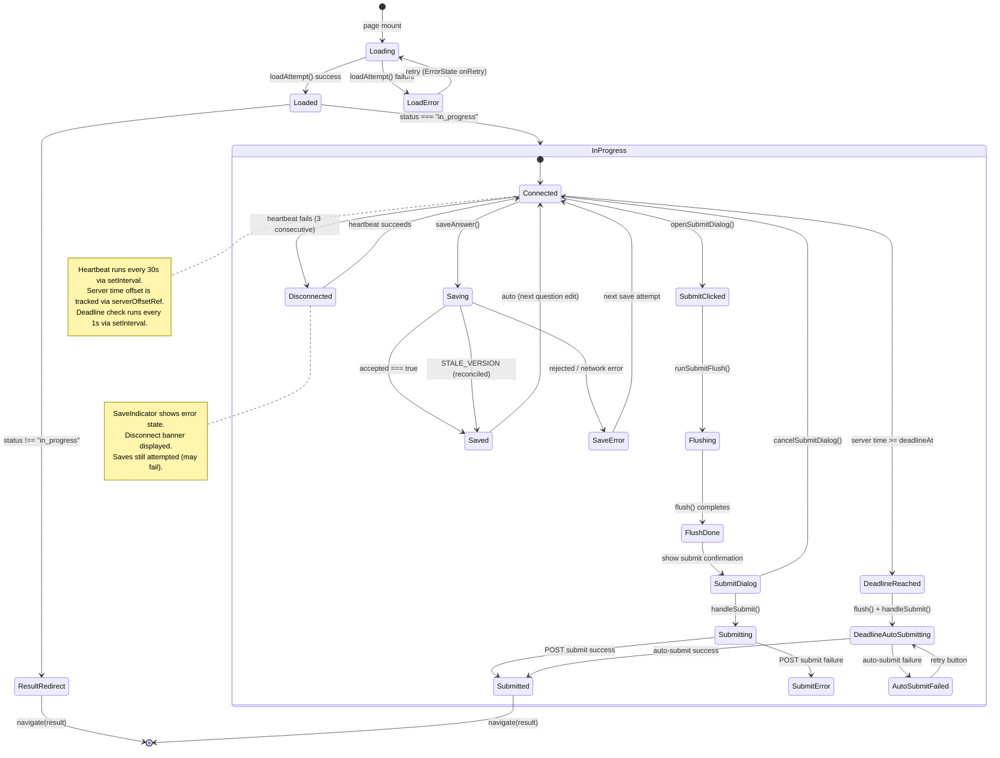
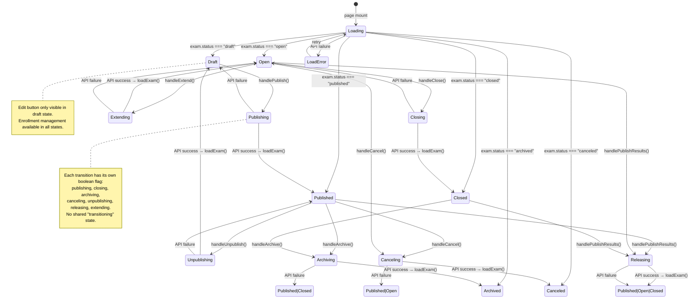

# Frontend State Machine Audit

**Audit date**: 2026-06-30
**Auditor**: Frontend architecture audit (read-only, no code changes)
**Scope**: All frontend state management across `apps/web/src/`
**Verdict**: Partial — multiple implicit state machines exist; no explicit state machine modeling; high-risk areas identified for Phase 3 role expansion.

---

## 1. Executive Summary

1. **The frontend has no explicit state machine library** — no XState, no Zustand, no React Query/SWR. All state is managed via `useState`/`useEffect`/`useRef` with manual orchestration.
2. **TakeExamPage.tsx (950 lines) is the single highest-risk implicit state machine** — it manages 12+ independent state variables, 5+ refs, heartbeat polling, deadline countdown, flush-before-submit, and reconnect detection without any formal state model.
3. **ExamDetailPage.tsx (864 lines) has 9 boolean mutation flags** (`publishing`, `closing`, `archiving`, `canceling`, `unpublishing`, `releasing`, `extending`, `addDialogOpen`, `addingEnrollment`) — each operation is guarded by its own `if (!id || X) return` check, but there is no shared "exam is transitioning" state.
4. **Admin/Candidate binary role assumption is hardcoded** in 5 critical files — `AuthContext.tsx:37`, `AdminLayout.tsx:39`, `ExamLayout.tsx:45`, `AppSidebar.tsx:190`, and the `Role` enum only defines `{Admin, Candidate, System}`. Adding Teacher/Proctor/Grader will break all of these.
5. **No request cancellation exists anywhere** — zero `AbortController` usage across the entire frontend. Unmounted components may still write state from stale responses.
6. **The `useSubmitFlush` hook is the best-engineered state module** — it already uses generation-based cancellation, debounced saves, and a formal `SaveStatus` enum (`idle | pending | inflight | saved | failed`). This is the closest thing to a real state machine in the codebase.
7. **Polling exists in 3 places** (ProctorDashboard 5s, ExamMonitoring 15s, heartbeat 30s) with inconsistent failure handling — ProctorDashboard shows error state on first failure, ExamMonitoring shows a stale-warning banner, heartbeat has no UI feedback at all.
8. **The `statusMeta.ts` table is well-designed** — it already defines a closed enum of ~25 status keys with i18n labels, tones, and icons. This is the natural foundation for explicit state machines.
9. **Recommendation: Do NOT introduce a state machine library yet.** Start with Phase A (state/event enums + transition tables + tests) for the Candidate Exam Flow, then expand.
10. **Biggest risk**: A Proctor/Grader logs in today, lands on the wrong dashboard, sees Admin-only controls, and the API silently accepts unauthorized mutations because the frontend never checked permissions beyond the binary role gate.

**Recommendation summary:**
- **Yes, introduce state machines** — but starting with enum-based modeling, not a library.
- **Start with the Candidate Exam Flow** — TakeExamPage is the most complex and most critical.
- **Do NOT state-machine the UI shell** (sidebar collapse, layout loading, form field errors).
- **Maximum risk**: Role-based routing and permission coupling breaking on Teacher/Proctor/Grader introduction.

---

## 2. Current Frontend State Inventory

### 2.1 Global / Cross-Cutting State

| Area | File / Component | State Source | State Variables | Backend Coupling | Risk |
| ---- | ---------------- | ------------ | --------------- | ---------------- | ---- |
| Auth session | `contexts/AuthContext.tsx` | React Context + useState | `user`, `isRestoringSession`, `isSubmittingLogin`, `isLoggingOut`, `error` | `/api/auth/me`, `/api/auth/login`, `/api/auth/logout` — cookie-based | **High**: binary role routing, no refresh/retry on 401 |
| Navigation redirect | `lib/api.ts:77-79` | Global `navigateFn` | Module-level mutable `navigateFn` | 401 response triggers `/login` redirect | Medium: stale closure if navigate changes |
| Branding | `components/layout/BrandProvider.tsx` | React Context | Product name, subtitle | Organization settings API | Low |
| Document title | `App.tsx:102-111` | `useEffect` on location + branding | `document.title` | None (derived) | Low |
| Client session | `lib/clientSessionId.ts` | `sessionStorage` | One UUID per tab | None (generated) | Low |
| Error boundary | `components/shared/ErrorBoundary.tsx` | Class component state | `hasError`, `error`, `errorInfo` | None (catches render errors) | Low |

### 2.2 Candidate Exam Flow State

| Area | File / Component | State Source | State Variables | Backend Coupling | Risk |
| ---- | ---------------- | ------------ | --------------- | ---------------- | ---- |
| Exam list | `pages/exam/ExamListPage.tsx` | useState + useEffect | `exams[]`, `isLoading`, `error` | `/api/candidate/exams` | Low |
| Start exam | `pages/exam/StartExamPage.tsx` | useState + useEffect | `exam`, `isLoading`, `isStarting`, `error` | `/api/candidate/exams/:id`, `/api/attempts/:examId/start` | Medium |
| **Take exam** | `pages/exam/TakeExamPage.tsx` | **12 useState + 7 useRef** | `attempt`, `isLoading`, `loadError`, `isDisconnected`, `saveRejection`, `currentIndex`, `questionStates`, `answers`, `saveState`, `showSubmitDialog`, `isSubmitting`, `isFlushing`, `flushResult`, `deadlinePassed`, `autoSubmitFailed` + refs: `versionsRef`, `clientSeqsRef`, `submittingRef`, `deadlineHandledRef`, `serverOffsetRef`, `heartbeatFailureRef`, `heartbeatFailureReportedRef` | `/api/attempts/:id`, `/api/attempts/:id/answers/:qid`, `/api/attempts/:id/submit`, `/api/attempts/:id/heartbeat` | **Critical** |
| Result | `pages/exam/ResultPage.tsx` | useState + useEffect | `result`, `error` | `/api/scores/attempts/:id` | Low |
| Save indicator | `components/exam/SaveIndicator.tsx` | Props-only | `state` or `status` (display only) | None (consumes parent state) | Low |
| Exam timer | `components/exam/ExamTimer.tsx` | useState + useEffect + setInterval | `remaining` (seconds) | Server time via `serverOffsetMs` prop | Low |
| Answer flush | `hooks/useSubmitFlush.ts` | useRef + useState | `pendingRef`, `inflightRef`, `statusRef`, `generationRef`, `failedQuestionIds` | None (caller provides save functions) | **Well-engineered** |

### 2.3 Admin Exam Management State

| Area | File / Component | State Source | State Variables | Backend Coupling | Risk |
| ---- | ---------------- | ------------ | --------------- | ---------------- | ---- |
| Exam list | `pages/admin/ExamPage.tsx` | useState + useEffect | `exams[]`, `isLoading`, `error` | `/api/exams` | Low |
| Exam detail | `pages/admin/ExamDetailPage.tsx` | **15 useState** | `exam`, `isLoading`, `error`, `publishing`, `closing`, `archiving`, `canceling`, `unpublishing`, `releasing`, `extending`, `extendDialogOpen`, `extendMinutes`, `enrollments`, `addDialogOpen`, `candidates`, `candidatePage`, `candidateTotal`, `loadingMoreCandidates`, `selectedCandidateIds`, `addingEnrollment`, `publishError` | `/api/exams/:id`, `/api/exams/:id/publish`, `/api/exams/:id/close`, `/api/exams/:id/unpublish`, `/api/exams/:id/archive`, `/api/exams/:id/cancel`, `/api/exams/:id/extend`, `/api/exams/:id/publish-results`, `/api/exams/:id/enrollments`, `/api/candidates` | **High** |
| Exam create | `pages/admin/ExamCreatePage.tsx` | useState + useEffect | `courses[]`, `questions[]`, `isLoading`, `error`, `saving`, `questionDialogOpen`, `fieldErrors`, `saveError`, `config` | `/api/courses`, `/api/questions`, `/api/exams`, `/api/exams/:id/publish` | Medium |
| Exam edit | `pages/admin/ExamEditPage.tsx` | useState + useEffect | `courses[]`, `questions[]`, `examStatus`, `isLoading`, `error`, `saving`, `questionDialogOpen`, `fieldErrors`, `saveError`, `config` | `/api/exams/:id`, `/api/courses`, `/api/questions`, PATCH `/api/exams/:id` | Medium |

### 2.4 Proctor / Monitoring State

| Area | File / Component | State Source | State Variables | Backend Coupling | Risk |
| ---- | ---------------- | ------------ | --------------- | ---------------- | ---- |
| Proctor dashboard | `pages/admin/ProctorDashboardPage.tsx` | useState + useEffect + setInterval | `data`, `isLoading`, `error`, `extendDialogOpen`, `extendMinutes`, `extending`, `extendTarget`, `misconductDialogOpen`, `misconductSeverity`, `misconductNotes`, `flagging`, `misconductTarget`, `forceSubmitting` | `/api/admin/exams/:id/candidates/status` (5s poll), `/api/admin/attempts/:id/force-submit`, `/api/admin/attempts/:id/extend-time`, `/api/admin/attempts/:id/misconduct` | **High** |
| Exam monitoring | `pages/admin/ExamMonitoringPage.tsx` | useState + useEffect + setInterval | `attempts[]`, `isLoading`, `loadError`, `staleWarning`, `lastRefreshedAt`, `selectedAttemptId`, `timeline`, `timelineLoading`, `timelineError`, `tick` | `/api/admin/exams/:id/proctor/attempts` (15s poll), `/api/admin/attempts/:id/proctor-events` | **High** |

### 2.5 Grading State

| Area | File / Component | State Source | State Variables | Backend Coupling | Risk |
| ---- | ---------------- | ------------ | --------------- | ---------------- | ---- |
| Grading queue | `pages/admin/GradingQueuePage.tsx` | useState + useEffect | `data`, `isLoading`, `error`, `page` | `/api/admin/grading-queue` | Low |
| Grading detail | `pages/admin/GradingDetailPage.tsx` | useState + useEffect | `data`, `isLoading`, `error`, `scores{}`, `comments{}`, `saving{}`, `validationErrors{}` | `/api/admin/attempts/:id/grading-details`, POST `/api/admin/attempts/:id/grade-question` | Medium |

---

## 3. Implicit State Machines Found

### 3.1 Candidate Exam Attempt (TakeExamPage)

**Current Implementation**: 12 `useState` + 7 `useRef` in a single 950-line component.

**States Inferred**:
```
loading → loaded | load_error
loaded → connected | disconnected
connected → saving | idle | submitting | flushing
disconnected → reconnecting → connected
saving → saved | save_error
deadline_passed → auto_submitting → submitted | auto_submit_failed
submitting → submitted | submit_error
flushing → flush_done
```

**Events Inferred**:
`LOAD_ATTEMPT`, `SAVE_ANSWER`, `HEARTBEAT_OK`, `HEARTBEAT_FAIL`, `SUBMIT_CLICKED`, `SUBMIT_CONFIRM`, `SUBMIT_CANCEL`, `DEADLINE_REACHED`, `AUTO_SUBMIT_RETRY`, `FLUSH_TIMEOUT`, `STALE_VERSION_RECONCILED`, `SAVE_REJECTED`

**Missing Transitions**:
- No explicit "disrupted → reconnecting" path (backend has `restoreAttempt`, but frontend has no UI for it)
- `saveState` is a flat string (`idle | saving | saved | error`) — it resets to `"idle"` implicitly when the user edits a new question, losing the previous question's status
- `deadlinePassed` and `isSubmitting` can both be true simultaneously, but the UI only checks them independently
- No "page visibility lost → pause saves" transition
- `isDisconnected` is set by both heartbeat failure AND save failure, but they use different counters

**Risk**: **Critical** — This is the most complex stateful component in the app. Race conditions between heartbeat, save, submit, and deadline are possible. The `submittingRef` is a manual mutex that prevents double-submit, but there is no mutex between `flush()` and `saveAnswer()`.

### 3.2 Admin Exam Lifecycle (ExamDetailPage)

**Current Implementation**: 9 independent boolean flags for mutations.

**States Inferred**:
```
draft → publishing → published | publish_error
published → unpublishing → draft | unpublish_error
open → closing → closed | close_error
open → extending → open
published|closed → archiving → archived | archive_error
published|open → canceling → canceled | cancel_error
published|open|closed → releasing → released | release_error
```

**Events Inferred**:
`PUBLISH`, `UNPUBLISH`, `CLOSE`, `EXTEND`, `ARCHIVE`, `CANCEL`, `RELEASE_RESULTS`

**Missing Transitions**:
- No "operation in progress" guard — if user clicks "Publish" then "Close" rapidly, both requests fire
- No "server status changed externally" detection — if another admin publishes the same exam, the UI still shows "draft" until manual refresh
- Each mutation calls `loadExam()` after success, but there is no optimistic update
- `publishError` is tracked separately from `error` (the page load error), creating two error channels
- No transition from `archived` to any other state (correct by design, but undocumented in the UI)

**Risk**: **High** — Duplicate click protection exists per-button (`if (publishing) return`), but there is no global "exam is transitioning" state. Two different mutations can overlap.

### 3.3 Proctor Dashboard Polling

**Current Implementation**: `setInterval(loadStatus, 5000)` with manual error tracking.

**States Inferred**:
```
initial_loading → loaded | load_error
loaded → polling → poll_error → polling (retry)
loaded → force_submitting → force_submitted → loaded
loaded → extending → extended → loaded
loaded → flagging → flagged → loaded
```

**Missing Transitions**:
- `pollError` is not tracked as a separate state — it overwrites `error`, which is also used for initial load failures
- After a `pollError`, the next successful poll clears `error` but there's no "recovered from stale" event
- `forceSubmitting` is a single boolean shared across all candidates — if two force-submit buttons exist, the second click is silently blocked while the first is in flight
- No "polling paused when tab hidden" optimization (visibility change triggers manual refresh, but the interval keeps running)
- `setData(result)` inside `loadStatus` overwrites data without checking if a mutation is in progress

**Risk**: **High** — 5-second polling with no abort on unmount race. Stale data can overwrite mutation results.

### 3.4 Exam Monitoring Polling

**Current Implementation**: `setInterval(loadAttempts, 15_000)` with visibility-change refresh and a `staleWarning` banner.

**States Inferred**:
```
initial_loading → loaded | load_error
loaded → polling_ok | polling_failed
polling_failed → shows stale_warning → polling_ok (recovered)
```

**Missing Transitions**:
- `staleWarning` is a string | null, not an enum — it's set on failure and cleared on success, but there's no "how many consecutive failures" counter
- `tick` (60s interval) forces a re-render to update "X minutes ago" labels — this is a workaround for not having a real time-based state
- Timeline loading is independent of attempts loading — they can overlap
- No "selected attempt became stale" detection — if the selected attempt's status changes during polling, the timeline is not auto-refreshed

**Risk**: **Medium** — Better failure handling than ProctorDashboard (stale banner vs. overwriting error), but still no abort controller.

### 3.5 Grading Detail (Per-Question Save)

**Current Implementation**: `scores{}`, `comments{}`, `saving{}`, `validationErrors{}` — all keyed by questionId.

**States Inferred**:
```
loaded → editing(questionId) → saving(questionId) → saved(questionId) | save_error(questionId)
editing → validation_error(questionId)
```

**Missing Transitions**:
- No "auto-save" or "save all" — each question saves independently
- `saving` is per-question, but there's no "all saved" aggregate state
- No dirty-tracking — user can navigate away with unsaved changes
- `gradingStatus` in the data is updated from the API response (`result.gradingStatus`) but not reactively reflected in the queue page

**Risk**: **Medium** — Grading is a multi-question sequential process. The per-question save model is correct, but the lack of dirty-tracking means changes can be silently lost.

---

## 4. Role / Permission Coupling Audit

### 4.1 Hardcoded Role Assumptions

| File | Line(s) | Current Role Assumption | Breakage After Teacher/Proctor/Grader | Recommended Fix |
| ---- | ------- | ----------------------- | ------------------------------------- | --------------- |
| `contexts/AuthContext.tsx` | 37 | `user.role === "Candidate"` → redirect to `/exam/list`; else → `/admin/dashboard` | Teacher/Proctor/Grader all land on `/admin/dashboard` (might be correct, but no proctor-specific landing) | Replace with role→dashboard map |
| `components/layout/AdminLayout.tsx` | 39 | `user.role === "Candidate"` → redirect to `/login` | Teacher/Proctor/Grader pass this check (good), but see management section below | Keep as "not Candidate" gate; add per-route permission check |
| `components/layout/ExamLayout.tsx` | 45 | `user.role !== "Candidate"` → redirect to `/login` | **Teacher/Proctor/Grader are locked out of exam layout** (they might need exam list for grading context) | Use permission-based check, not role-based |
| `components/layout/AppSidebar.tsx` | 190 | `user.role === Role.Admin` → show management items | Proctor sees no proctor nav items; Grader sees no grading nav items; Teacher sees nothing admin-specific | Build nav groups per role/permission |
| `packages/domain/src/enums.ts` | 11-16 | `Role = {Admin, Candidate, System}` — only 3 values | **No Teacher, Proctor, or Grader in the enum** | Add new roles to enum |
| `packages/contracts/src/` (RoleSchema) | — | `Admin | Candidate` only (login-capable roles) | New roles need login capability | Extend schema (Phase 3) |

### 4.2 Permission Gate Analysis

| Gate Type | Current Implementation | Files | Risk |
| --------- | ---------------------- | ----- | ---- |
| **Route-level** | `AdminLayout` checks `role !== "Candidate"`; `ExamLayout` checks `role === "Candidate"` | `AdminLayout.tsx:39`, `ExamLayout.tsx:45` | **Binary only** — no route-level permission check |
| **Sidebar visibility** | `showManagement = user.role === Role.Admin` | `AppSidebar.tsx:190` | **Admin-only** — Proctor/Grader/Teacher nav items don't exist |
| **Button visibility** | Conditional rendering based on `exam.status` (e.g., `exam.status === "draft"` → show Publish button) | `ExamDetailPage.tsx:380-514` | **Status-based, not permission-based** — any logged-in user who reaches the page can see all buttons |
| **API call permission** | No frontend permission check before API calls | All pages | **Relies entirely on backend enforcement** — correct architecture, but means frontend can show buttons that trigger 403 errors |
| **Menu items** | Static `groups` and `managementItems` arrays | `AppSidebar.tsx:55-148` | **No dynamic filtering** based on user permissions |

### 4.3 Specific Breakage Scenarios

1. **Teacher logs in**: `AuthContext.dashboardFor()` sends them to `/admin/dashboard`. They see the full Admin sidebar including management items (users, candidates, settings, etc.) because `AppSidebar` only hides management for `role === "Candidate"`. The backend should block API calls, but the UI is misleading.

2. **Proctor logs in**: Same as Teacher — lands on Admin dashboard with full sidebar. No proctor-specific nav (e.g., "My Proctored Exams"). ProctorDashboardPage is accessible only via direct URL or from ExamDetailPage's "Proctor" button.

3. **Grader logs in**: Same as Teacher — full Admin sidebar. GradingQueuePage is in the sidebar, but so are all Admin management pages.

4. **Candidate tries to access `/admin/*`**: Correctly redirected by `AdminLayout`. But if they navigate to a specific admin URL before the layout mounts, there's a flash of the loading skeleton.

5. **Multi-role user**: If `user_role_assignments` gives a user both Admin and Proctor roles, the frontend only reads `user.role` (the legacy single role). The richer permission data from `user_role_assignments` is ignored.

---

## 5. Candidate Exam Flow State Model

Based on code analysis of `TakeExamPage.tsx`, `StartExamPage.tsx`, `useSubmitFlush.ts`, `ExamTimer.tsx`, and backend API contracts.



### Key observations about the Candidate Exam state model:

1. **`saveState` is NOT per-question in the component state** — it's a single `SaveState` that gets overwritten by every `saveAnswer()` call. The per-question status lives in `useSubmitFlush`'s internal refs, but `TakeExamPage` only exposes a flat `saveState` to `SaveIndicator`.
2. **Heartbeat and deadline polling are independent intervals** — they don't coordinate with each other or with the save system.
3. **The "disrupted" state has no frontend path** — if the backend marks an attempt as `disrupted`, `TakeExamPage` loads it, sees `status !== "in_progress"`, and immediately navigates to result. There is no reconnect/resume UI.
4. **`deadlineHandledRef` prevents re-entry** but `deadlinePassed` state can still toggle if `attempt?.deadlineAt` changes (e.g., after an extend-time operation by a proctor).

---

## 6. Admin Exam Management State Model

Based on code analysis of `ExamDetailPage.tsx` and `ExamPage.tsx`.



### Key observations about the Admin Exam Management state model:

1. **9 independent boolean flags** (`publishing`, `closing`, `archiving`, `canceling`, `unpublishing`, `releasing`, `extending`, `addDialogOpen`, `addingEnrollment`) — each guards its own handler, but there is no mutual exclusion between different operations.
2. **No optimistic updates** — after every mutation, `loadExam()` refetches the entire exam object. This is correct but slow.
3. **Button visibility is based on `exam.status`** — this is the right approach (backend is the source of truth), but the buttons don't disable based on other in-flight operations.
4. **Enrollment management is orthogonal to exam lifecycle** — it's in a separate tab and loads independently. This is good separation.

---

## 7. Proctor / Grading State Readiness

### 7.1 Proctor State

| Domain | Current Readiness | Existing Files | Missing API/Data | Recommended Phase |
| ------ | ----------------- | -------------- | ---------------- | ----------------- |
| Candidate status polling | **Partial** — HTTP polling works, status cards display correctly | `ProctorDashboardPage.tsx`, `ExamMonitoringPage.tsx` | No WebSocket for real-time updates; no "proctor is online" heartbeat from proctor to server | Phase C (after RBAC) |
| Force submit | **Partial** — button with confirmation dialog, calls API | `ProctorDashboardPage.tsx:135-152` | No idempotency key; no retry on failure; no "force submit in progress" per-candidate tracking (single shared boolean) | Phase C |
| Extend time | **Partial** — dialog with minutes input, calls API | `ProctorDashboardPage.tsx:155-179` | No validation against exam-level closeAt; no "extended time remaining" display | Phase C |
| Misconduct flag | **Partial** — dialog with severity + notes, calls API | `ProctorDashboardPage.tsx:182-208` | No audit trail display in proctor view; no "flagged candidates" filter | Phase C |
| Timeline/events | **Partial** — loads proctor events via API, displays in dialog | `ExamMonitoringPage.tsx:123-138` | No real-time event stream; no event filtering; no event details drill-down | Phase D |
| Online/offline detection | **Partial** — `onlineState` field from API (online/stale/offline) | `ExamMonitoringPage.tsx:268-278` | Derived from heartbeat, but proctor has no own online indicator | Phase C |

### 7.2 Grading State

| Domain | Current Readiness | Existing Files | Missing API/Data | Recommended Phase |
| ------ | ----------------- | -------------- | ---------------- | ----------------- |
| Queue listing | **Good** — paginated list with status badges | `GradingQueuePage.tsx` | No real-time queue updates; no "my grading" filter for multi-grader | Phase D |
| Per-question grading | **Good** — score + comment per question, per-question save | `GradingDetailPage.tsx` | No "grade all and submit" batch action; no grading rubric support; no side-by-side reference view | Phase D |
| Grading status tracking | **Partial** — `gradingStatus` updated from API response | `GradingDetailPage.tsx:150-151` | Status not propagated to queue list in real-time; no "fully graded" finalization step | Phase D |
| Multi-grader coordination | **Missing** — no assignment, no conflict detection | None | No grader assignment API; no "another grader is viewing" indicator; no merge strategy | Phase D |

---

## 8. Async and Polling Risk Audit

| File | Async Pattern | Failure Handling | Stale Data Risk | Race Risk | Recommendation |
| ---- | ------------- | ---------------- | --------------- | --------- | -------------- |
| `TakeExamPage.tsx` heartbeat | `setInterval(30000)` + `api.post` | Sets `isDisconnected = true` on failure; increments `heartbeatFailureRef`; emits telemetry after 3 consecutive failures | **Medium** — `setIsDisconnected(false)` on success overwrites any concurrent disconnect state | **Low** — heartbeat is fire-and-forget, no data dependency | Add heartbeat state machine; consider exponential backoff |
| `TakeExamPage.tsx` deadline | `setInterval(1000)` checking `nowByServerClock()` | Auto-flush + auto-submit; sets `autoSubmitFailed` on failure | **Low** — deadline is monotonic, no stale data risk | **Low** — `deadlineHandledRef` prevents re-entry | Acceptable as-is |
| `TakeExamPage.tsx` save | Debounced via `useSubmitFlush` (1500ms) | `useSubmitFlush` handles per-question status; `isDisconnected` set on network error | **Low** — generation-based cancellation prevents stale writes | **Medium** — `saveAnswer` calls `setSaveState("saving")` which is a global state overwritten by any concurrent save | Consider per-question save indicator in parent state |
| `ProctorDashboardPage.tsx` polling | `setInterval(5000)` + `api.get` | Sets `error` on failure (overwrites initial load error) | **High** — `setData(result)` on success overwrites data without checking for in-flight mutations | **High** — `handleForceSubmit` calls `loadStatus()` after success, but the interval may also call `loadStatus()` concurrently | Add request cancellation; track mutation-in-progress |
| `ExamMonitoringPage.tsx` polling | `setInterval(15000)` + `api.get` + visibility change refresh | Shows `staleWarning` banner on failure (better than overwriting error) | **Medium** — same data overwrite pattern as ProctorDashboard | **Medium** — `loadAttempts` and `loadTimeline` are independent and can overlap | Add abort controller; auto-refresh timeline when selected attempt updates |
| `ExamTimer.tsx` countdown | `setInterval(1000)` | Calls `onTimeout()` when remaining <= 0 | **Low** — timer is purely derived from deadline + server offset | **Low** — single interval, no concurrent writes | Acceptable as-is |
| `clientEvents.ts` batch send | `fetch` with `keepalive: true` | Returns `false` on any failure; caller (buffer) handles retry | **Low** — events are append-only | **Low** — sequential send within a batch | Acceptable as-is |
| `AuthContext.tsx` session restore | `api.get("/api/auth/me")` on mount | Sets `user = null` on failure | **Low** — single request on mount | **Low** — `active` flag prevents stale closure write | Acceptable as-is |
| `GradingDetailPage.tsx` per-question save | `api.post` per question | Sets `saving[questionId] = false` in finally; shows toast on error | **Medium** — `setData(prev => ...)` uses functional update (good), but `gradingStatus` update depends on API response which may be stale if another grader saved concurrently | **Medium** — two graders saving different questions simultaneously could see stale `gradingStatus` | Add optimistic status tracking |

---

## 9. State Machine Adoption Plan

### Phase A — No Library Refactor (Recommended First PR)

**Goal**: Establish state/event enums, transition tables, and unit tests for the Candidate Exam Flow — without changing any runtime behavior.

**Scope**:
- Create `apps/web/src/lib/examFlowStates.ts` with:
  - `ExamPageState` enum: `loading | loaded | loadError | inProgress | resultRedirect`
  - `ExamSaveState` enum: `idle | saving | saved | saveError`
  - `ExamConnectionState` enum: `connected | disconnected`
  - `ExamSubmitState` enum: `idle | flushing | submitDialog | submitting | submitted | submitError | deadlineReached | autoSubmitting | autoSubmitFailed`
  - Transition table: `transition(currentState, event) => nextState`
  - Guard functions: `canSave(state)`, `canSubmit(state)`, `canEdit(state)`
- Create `apps/web/src/lib/examFlowStates.test.ts` with:
  - Unit tests for every transition in the table
  - Guard function tests
  - Edge case tests (e.g., "save while submitting", "deadline during flush")
- **No changes to TakeExamPage.tsx** — the enums and tests exist as documentation and future integration points.

**Files to modify**: New file only (`lib/examFlowStates.ts`, `lib/examFlowStates.test.ts`).
**Files NOT modified**: No component changes, no API changes, no backend changes.

### Phase B — Candidate Exam Machine

**Goal**: Wire `TakeExamPage.tsx` to use the state enums from Phase A.

**Scope**:
- Replace the 12 `useState` variables in `TakeExamPage` with a single `useReducer` or a small set of coordinated state slices using the enums from Phase A.
- Replace `setSaveState("saving")` / `setSaveState("saved")` / `setSaveState("error")` with `dispatch({ type: 'SAVE_STARTED' })` etc.
- Replace `setIsDisconnected(true/false)` with connection state enum.
- Replace `setDeadlinePassed(true)` + `setAutoSubmitFailed(true)` with submit state transitions.
- Add `useEffect` hooks that derive UI state from the machine state (e.g., `const showDisconnectBanner = connectionState === 'disrupted'`).
- Add integration tests that simulate the full exam flow (load → answer → save → submit).

**Files to modify**: `TakeExamPage.tsx`, `SaveIndicator.tsx` (minor), new `useExamAttemptMachine.ts` hook.

### Phase C — Admin Operation Machine

**Goal**: Replace the 9 boolean mutation flags in `ExamDetailPage` with a single operation state machine.

**Scope**:
- Create `AdminExamOperation` state machine:
  - States: `idle | publishing | closing | extending | archiving | canceling | unpublishing | releasing | error`
  - Events: `PUBLISH`, `CLOSE`, `EXTEND`, `ARCHIVE`, `CANCEL`, `UNPUBLISH`, `RELEASE`
  - Guard: `canTransition(currentState)` — only allow one operation at a time
- Wire into `ExamDetailPage.tsx` — replace 9 booleans with one state + one dispatch.
- Apply same pattern to `ProctorDashboardPage.tsx` (force submit / extend / flag).

**Files to modify**: `ExamDetailPage.tsx`, `ProctorDashboardPage.tsx`, new `useAdminExamOperation.ts` hook.

### Phase D — Proctor / Grading Machines

**Goal**: Introduce explicit state machines for Proctor and Grading after RBAC enforcement and API stability.

**Scope**:
- Depends on: Phase 3 RBAC enforcement, Proctor role permission boundaries, Grader role assignment API.
- Proctor machine: `online | monitoring | force_submitting | extending | flagging | error`
- Grading machine: `pending | grading | saved | submitted | returned | finalized | error`
- Only start after Phase C is proven in production.

---

## 10. Library Recommendation

| Option | Pros | Cons | Fit For This Project | Recommendation |
| ------ | ---- | ---- | -------------------- | -------------- |
| **No library: reducer + transition table** | Zero new dependencies; full control; easy to test; matches existing patterns; no bundle size increase | Requires discipline; no visual tooling; transition table is manual code | **Excellent** — project already uses no state libraries; Phase A proves the pattern with zero risk | **Recommended for Phase A-C** |
| **XState** | Formal modeling; visual editor; provably correct; built-in guards/actions/context | 28KB gzipped; steep learning curve; overkill for most pages; migration risk; team must learn XState DSL | **Poor fit** — only TakeExamPage and ExamDetailPage need formal machines; the rest are simple loading/data patterns | **Not recommended for Phase A-C**; reconsider for Phase D if Proctor/Grading become complex |
| **Zustand + finite-state reducer** | Lightweight (1KB); easy to integrate; good devtools | Not a state machine library — you still build transitions manually; adds global state when most state is local | **Mediocre fit** — would help with cross-component state (e.g., exam status shared between TakeExamPage and ExamTimer), but adds unnecessary global state | **Not recommended** — the project's state is mostly page-local |
| **React Query / TanStack Query** | Automatic caching, refetching, deduplication, retry, stale-while-revalidate; would replace most manual `useState + useEffect + api.get` patterns | 13KB gzipped; fundamentally changes data-fetching architecture; requires migration of all pages; doesn't help with mutation state machines | **Excellent for data fetching** but doesn't solve the core problem (mutation state machines, role coupling, exam flow state) | **Consider as a separate initiative** — not a replacement for state machine modeling |

**Final recommendation**: Start with **no library** (reducer + transition table) for Phase A-C. The Candidate Exam Flow and Admin Operation Machine are well-suited to this approach. React Query is worth considering as a separate modernization effort for data fetching, but it should not be conflated with state machine adoption.

---

## 11. Concrete First PR Recommendation

### PR: `feat(exam): add candidate exam flow state model and tests`

**Name**: `feat(exam): candidate exam flow state enums + transition table + tests`

**Goal**: Establish the formal state model for the Candidate Exam Attempt flow as a pure TypeScript module with comprehensive unit tests. No runtime behavior changes.

**Target branch**: Main (or feature branch per team convention)

**Files to create**:
1. `apps/web/src/lib/examFlowStates.ts` — State enums, event types, transition table, guard functions
2. `apps/web/src/lib/examFlowStates.test.ts` — Unit tests for all transitions and guards

**Files to modify**: None (new files only)

**What the state model covers**:
- `ExamPageState`: page-level state (loading → loaded → inProgress → resultRedirect)
- `ExamConnectionState`: heartbeat-derived (connected ↔ disconnected)
- `ExamSaveState`: per-question save lifecycle (idle → saving → saved | saveError)
- `ExamSubmitState`: submit flow (idle → flushing → submitDialog → submitting → submitted | submitError)
- `ExamDeadlineState`: deadline lifecycle (active → reached → autoSubmitting → autoSubmitFailed | submitted)

**What it does NOT cover** (explicitly out of scope):
- No changes to `TakeExamPage.tsx`
- No changes to any component
- No new dependencies
- No backend changes
- No API contract changes
- No role/permission changes

**Test requirements**:
- Every valid transition in the table must have a test case
- Every invalid transition (event in wrong state) must have a test case showing it's a no-op
- Guard functions tested for all state combinations
- Edge cases: "save during submit", "deadline during flush", "heartbeat during disconnect"
- All tests must pass with `pnpm test`

**Rollback**: Delete the two new files. No other files are touched.

---

## 12. Acceptance Criteria

- [x] No business logic modified
- [x] No new dependencies introduced
- [x] Report lists all key state domains (Auth, Candidate Exam, Admin Exam, Proctor, Grading, Async/Polling, Navigation)
- [x] Report identifies Admin/Candidate binary assumptions in 5+ specific files with line numbers
- [x] Report includes Mermaid state diagram for Candidate Exam Flow (§5)
- [x] Report includes Mermaid state diagram for Admin Exam Management (§6)
- [x] Report gives explicit recommendation on state machine library (§10: no library for Phase A-C)
- [x] Report defines first minimum viable PR scope (§11: state enums + tests, zero runtime changes)
- [x] All conclusions reference specific file paths and line numbers

---

## Appendix A: Key File Reference

| File | Lines | Role in Audit |
| ---- | ----- | ------------- |
| `apps/web/src/contexts/AuthContext.tsx` | 161 | Auth state, binary role routing |
| `apps/web/src/pages/exam/TakeExamPage.tsx` | 950 | **Critical** — most complex implicit state machine |
| `apps/web/src/pages/admin/ExamDetailPage.tsx` | 864 | **High risk** — 9 mutation booleans |
| `apps/web/src/pages/admin/ProctorDashboardPage.tsx` | 551 | Polling + mutation states |
| `apps/web/src/pages/admin/ExamMonitoringPage.tsx` | 440 | 15s polling + stale detection |
| `apps/web/src/pages/admin/GradingDetailPage.tsx` | 284 | Per-question save state |
| `apps/web/src/hooks/useSubmitFlush.ts` | 207 | **Best-engineered** — generation-based cancellation |
| `apps/web/src/components/layout/AdminLayout.tsx` | 68 | Binary role gate |
| `apps/web/src/components/layout/ExamLayout.tsx` | 104 | Binary role gate |
| `apps/web/src/components/layout/AppSidebar.tsx` | 309 | Admin-only nav items |
| `apps/web/src/lib/statusMeta.ts` | 234 | Status display registry (good foundation) |
| `apps/web/src/lib/api.ts` | 118 | API client with 401 redirect |
| `apps/web/src/lib/routes.ts` | 38 | Route constants |
| `packages/domain/src/enums.ts` | 259 | Role/Permission/Status enums |

## Appendix B: State Variable Count Per File

| File | `useState` count | `useRef` count | Total state slots |
| ---- | ---------------- | -------------- | ----------------- |
| `TakeExamPage.tsx` | 12 | 7 | 19 |
| `ExamDetailPage.tsx` | 15 | 0 | 15 |
| `ProctorDashboardPage.tsx` | 11 | 1 | 12 |
| `ExamMonitoringPage.tsx` | 8 | 1 | 9 |
| `ExamCreatePage.tsx` | 9 | 0 | 9 |
| `ExamEditPage.tsx` | 9 | 0 | 9 |
| `SettingsPage.tsx` | 7 | 0 | 7 |
| `GradingDetailPage.tsx` | 5 | 0 | 5 |
| `StartExamPage.tsx` | 4 | 0 | 4 |
| `ExamListPage.tsx` | 3 | 0 | 3 |
| `ResultPage.tsx` | 2 | 0 | 2 |
| `GradingQueuePage.tsx` | 3 | 0 | 3 |
| `LoginPage.tsx` | 3 | 0 | 3 |
| `AuthContext.tsx` | 5 | 0 | 5 |

**Total across codebase**: ~106 `useState` calls + ~10 `useRef` state slots = **~116 independent state variables** with no centralized state management.
