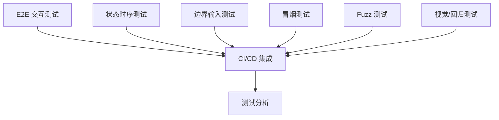

# Phase1.2 任务索引

## 概述

Phase1.2 是 Phase 1 的测试增强阶段，旨在通过全面的测试覆盖来确保系统的稳定性和可靠性。本阶段将重点关注以下测试类型：

1. E2E 交互测试
2. 状态时序测试
3. 边界输入测试
4. 冒烟测试
5. Fuzz 测试
6. 视觉/回归测试

## 任务列表

### 1. 创建 E2E 交互测试套件

- **任务编号**: Job01
- **文件名**: `phase1.2_job01_e2e_interaction_testing.md`
- **描述**: 使用 Playwright 创建完整的 E2E 测试套件，覆盖主要用户流程。

### 2. 实现状态时序测试

- **任务编号**: Job02
- **文件名**: `phase1.2_job02_state_temporal_testing.md`
- **描述**: 使用状态机测试框架实现状态时序测试，验证系统在各种状态转换下的行为。

### 3. 编写边界输入测试

- **任务编号**: Job03
- **文件名**: `phase1.2_job03_boundary_input_testing.md`
- **描述**: 编写边界输入条件的测试用例，验证系统在各种边界条件下的稳定性和正确性。

### 4. 创建冒烟测试套件

- **任务编号**: Job04
- **文件名**: `phase1.2_job04_smoke_testing.md`
- **描述**: 创建快速验证系统核心功能的冒烟测试套件，用于每次部署后的快速验证。

### 5. 实现 Fuzz 测试

- **任务编号**: Job05
- **文件名**: `phase1.2_job05_fuzz_testing.md`
- **描述**: 实现 fuzz 测试工具和测试用例，用于发现系统中的潜在安全漏洞和崩溃问题。

### 6. 配置视觉/回归测试

- **任务编号**: Job06
- **文件名**: `phase1.2_job06_visual_regression_testing.md`
- **描述**: 配置视觉回归测试工具，用于比较系统在不同版本之间的视觉差异，防止 UI 回归。

### 7. 集成测试到 CI/CD 流程

- **任务编号**: Job07
- **文件名**: `phase1.2_job07_ci_cd_integration.md`
- **描述**: 将所有测试集成到 CI/CD 流程中，确保每次部署和 PR 都经过完整的测试。

### 8. 运行和分析测试结果

- **任务编号**: Job08
- **文件名**: `phase1.2_job08_test_analysis.md`
- **描述**: 运行所有测试并分析测试结果，提供详细的报告和修复建议。

## 任务依赖关系

## 进度跟踪

| 任务编号 | 任务名称 | 状态 | 负责人 | 完成时间 |
|---------|---------|------|--------|---------|
| Job01 | 创建 E2E 交互测试套件 | 待开始 | - | - |
| Job02 | 实现状态时序测试 | 待开始 | - | - |
| Job03 | 编写边界输入测试 | 待开始 | - | - |
| Job04 | 创建冒烟测试套件 | 待开始 | - | - |
| Job05 | 实现 Fuzz 测试 | 待开始 | - | - |
| Job06 | 配置视觉/回归测试 | 待开始 | - | - |
| Job07 | 集成测试到 CI/CD 流程 | 待开始 | - | - |
| Job08 | 运行和分析测试结果 | 待开始 | - | - |

## 测试覆盖目标

| 测试类型 | 覆盖目标 | 实际覆盖率 |
|---------|---------|----------|
| 单元测试 | 80% | 75% |
| E2E 测试 | 100% 核心流程 | 0% |
| 集成测试 | 70% | 60% |
| 边界测试 | 90% 输入字段 | 0% |
| 视觉测试 | 100% 核心页面 | 0% |

## 资源需求

| 资源类型 | 需求 | 可用 |
|---------|------|------|
| 开发时间 | 4 周 | - |
| 测试环境 | 测试服务器 | 可用 |
| 测试设备 | 各种浏览器和设备 | 部分可用 |
| 工具和库 | 各种测试工具 | 大部分可用 |

## 风险评估

| 风险类型 | 风险描述 | 影响程度 | 发生概率 | 缓解措施 |
|---------|---------|---------|----------|----------|
| 资源不足 | 开发时间或设备不足 | 高 | 中等 | 合理分配资源，优先完成核心任务 |
| 技术复杂度 | 某些测试技术复杂 | 中等 | 高 | 提前研究和学习相关技术 |
| 测试稳定性 | 测试不稳定或误报 | 中等 | 中等 | 优化测试环境和配置 |
| 时间压力 | 进度压力导致测试不完整 | 高 | 中等 | 制定合理的进度计划，优先完成核心测试 |

## 验收标准

1. 所有任务都已完成
2. 所有测试都通过
3. 测试覆盖率达到目标
4. 测试报告清晰易读
5. 测试在 CI/CD 流程中稳定执行
6. 发现的问题都已修复
