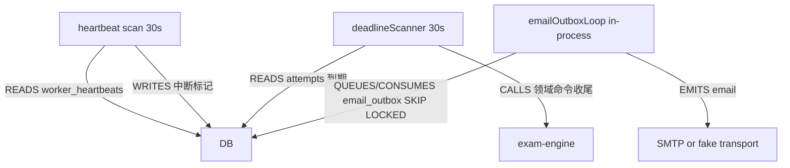
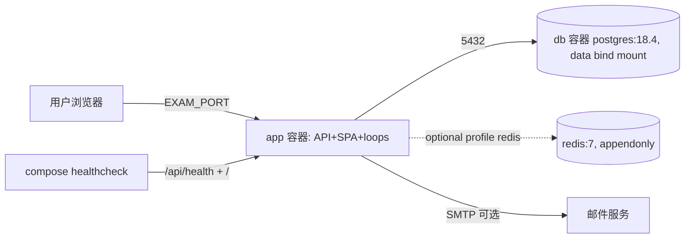

# 01 — Module Census 与模块微图

> **REPORT-CORRECTIVE-1**：本报告**保留原样**（模块普查事实与证据锚点在 corrective
> 重新取证中未发现错误）。唯一修正引用：本报告不引用 F1-04/F1-10/74-caps 等被纠正项。
> corrective 变更见 13 报告。

scope：枚举 master（BASE `b9b0e08c`）上真实存在的全部可部署/可运行单元及其内部模块；每张 module card 由代码反推，附最小证据锚点。method：目录普查 + 入口文件阅读 + 符号级 grep；不采信模块名与注释推定的职责。confidence：除非另行标注，所有 card 事实为 OBSERVED_CODE。

## 1. 仓库级拓扑（代码事实）

```text
exam (pnpm+turbo monorepo)
├── apps/api        Fastify 服务端（单一 Node 进程，含 SPA 静态托管与进程内后台循环）
├── apps/web        React SPA（react-router，~35 admin 路由 + 4 考生路由）
├── apps/e2e        Playwright E2E（含 patrol 配置）
├── packages/
│   ├── auth        密码 hash / JWT session / tokens（5 源文件）
│   ├── authz       capability catalog / role presets / scope resolver / system actor
│   ├── contracts   API zod Schema 与 DTO（30 源文件，API wire 契约；corrective 复核修正原"32"） |
│   ├── db          Drizzle schema(40 表) + 39 repository 模块 + 测试隔离/迁移基础设施
│   ├── domain      领域类型/枚举/错误/评分引擎/策略类型（不依赖框架）
│   ├── exam-engine 考试领域命令与状态机（28 源文件 + 40 测试文件）
│   └── import-export CSV 导入导出（csv.ts, index.ts）
├── formal/tla      TLA+ 模型（recovery、operator-grant）+ scripts/formal TLC runner
├── tests/deployment 9 个部署/备份/升级 shell 测试（corrective 复核修正原"8"）
└── scripts/        架构/契约/ copy /UI 门禁脚本 + db/e2e/backup 工具
```

Evidence anchors：`pnpm-workspace.yaml`；`package.json#scripts`；各 package `src/` 目录枚举（2026-09-14 实测）。

## 2. Module Cards

### 2.1 apps/api — HTTP 服务端

```text
MODULE:            apps/api（Fastify 单进程）
ENTRYPOINTS:       src/server.ts#main（唯一入口）；docker-entrypoint.sh 启动
INPUTS:            HTTP /api/*（27 个 route module）、Cookie auth-token（JWT）、env 配置（config/settings.ts 单源默认值）
OUTPUTS:           JSON API、SPA 静态文件（plugins/staticFrontend.ts）、audit_logs、email outbox 行、OpenAPI 文档
PERSISTENT STATE:  全部 40 张表经 repository 读写；无进程内存业务真相
MUTABLE PROCESS STATE: rate-limit 计数（内存或 Redis）、audit 写缓冲（auditLifecycle）、email 循环锁、scanner 周期计数器（deadlineScanner.ts:60 自述 single-instance counters）
AUTHORITY OWNED:   请求认证/授权入口、时间采样 now 插件、扫描循环触发、审计写入
AUTHORITY CONSUMED: exam-engine 领域命令、db repository、authz catalog
CALLS:             @exam/db、@exam/exam-engine、@exam/authz、@exam/auth、@exam/contracts、@exam/domain、@exam/import-export、redis（可选）
CALLED BY:         浏览器 SPA、Playwright E2E、部署 healthcheck
DB TABLES:         间接全部
LOCKS/TRANSACTIONS: 经 repository/engine；进程内循环使用 SKIP LOCKED（email outbox）
BACKGROUND EXECUTION: heartbeat 扫描（默认 30s）、deadlineScanner（默认 30s）、emailOutboxLoop（进程内，SKIP LOCKED）
UI SURFACE:        托管 apps/web 构建产物（public/）
RBAC:              plugins/auth（JWT→DB user→role assignments）+ plugins/authz（requireCapability 装饰器）
FAILURE MODES:     DB 不可用→请求失败；Redis off→内存限流（降级语义见 rateLimit）；进程崩溃→容器重启（restart: unless-stopped）
RESTART BEHAVIOR:  SIGTERM/SIGINT → stopAccepting audit → app.close → drain audit（10s）→ DB close（10s）→ 2s bounded exit assist（server.ts:34-94）
SCALE CHARACTERISTICS: 单进程单实例假设；无水平扩展协调（无 leader 选举，scanner 为 per-process）
OWNER TESTS:       routes/*.test.ts（co-located）、runtime/ 结构性测试
EVIDENCE:          server.ts:101-138、apiSurface.ts:37-63、registerApiRouteModules.ts:44-74
CONFIDENCE:        高
```

### 2.2 apps/web — SPA

```text
MODULE:            apps/web（React 18 + react-router BrowserRouter + Vite）
ENTRYPOINTS:       src/main.tsx → App.tsx#App
INPUTS:            /api/*（fetch）；URL 路由
OUTPUTS:           DOM；对 /api 的调用
PERSISTENT STATE:  无（localStorage/session 恢复经 AuthContext）
AUTHORITY OWNED:   无（UI 永远不是权限权威；仅 affordance）
CALLS:             全部业务经 /api REST；无直连 DB 依赖（架构门禁 lint:arch 强制）
CALLED BY:         用户浏览器；被 apps/api 静态托管
UI SURFACE:        公开：/login /launchpad /invite/accept /forgot-password /reset-password；考生：/exam/{list,settings,:examId/start,:attemptId/take,:attemptId/result}；管理：/admin/*（dashboard、system、operations、settings、candidate-fields、users、candidates、courses、questions*、exams*、exam-profiles*、proctor*、results、grading-queue*、audit-logs、permissions、import-logs、attempts/:id、recovery*）（App.tsx:79-157）
RBAC:              useAuth + lib/capabilities（adminLandingPath 等）做 UI 门控；服务端为权威
FAILURE MODES:     API 不可达→页面错误态；无离线业务能力
OWNER TESTS:       co-located *.test.tsx、页面几何契约（pageGeometryContract.test.ts）
EVIDENCE:          App.tsx:76-194、main.tsx
CONFIDENCE:        高
```

### 2.3 packages/exam-engine — 考试领域

```text
MODULE:            @exam/exam-engine
ENTRYPOINTS:       index.ts 导出命令与状态机
INPUTS:            RequestContext + 领域 payload（@exam/domain 类型）
OUTPUTS:           领域状态变更（经 repository 写 DB）、命令结果
PERSISTENT STATE:  examAttempts/examEnrollments/exams/examAdmissions/attemptInterruptions*/attemptTimeAdjustments/attemptGradingEntries/examIncidents*/attemptCommandReceipts
AUTHORITY OWNED:   Exam/Enrollment/Attempt 状态机转换、deadlineKernel（时间语义核心）、operatorGrant、interruption 策略、评分（grading/gradingWorkset/manualGrading）、incident 命令（incidentCommands/systemIncidentCommands）、systemMonitor
AUTHORITY CONSUMED: db repository（lockSeam 事务边界）、domain 类型
CALLS:             @exam/db repository、@exam/domain
CALLED BY:         apps/api routes/orchestrators
LOCKS/TRANSACTIONS: lockSeam.ts 定义锁缝；attemptCommands 内行锁/事务（详见 07 报告）
BACKGROUND:        无自身循环（由 api 进程插件驱动）
OWNER TESTS:       28 源文件 + 40 个 co-located 测试文件（attemptStateMachine、saveAnswer、grading、operatorGrant、systemIncidentCommands 等）
EVIDENCE:          packages/exam-engine/src 文件清单
CONFIDENCE:        高
```

### 2.4 packages/db

```text
MODULE:            @exam/db
ENTRYPOINTS:       index.ts（createDatabase、schema、repository）
INPUTS:            DATABASE_URL（databaseUrl.ts 单源解析）
OUTPUTS:           Drizzle db 实例 + postgres.js driver、39 个 repository 模块
PERSISTENT STATE:  schema/pg.ts 40 张表（organizations…passwordResetTokens；另见报告 07 表清单）
AUTHORITY OWNED:   唯一 SQL 访问层；迁移（migrations/）；测试隔离基础设施（worker-database、testInfraLock、e2eReset）
OWNER TESTS:       __tests__、testIsolation、testWorkerDatabase、postgres.test.ts 等
EVIDENCE:          packages/db/src 目录枚举、pg.ts 表清单（L69-L2604）
CONFIDENCE:        高
```

### 2.5 packages/authz

```text
MODULE:            @exam/authz
ENTRYPOINTS:       index.ts（catalog、presets、resolver、auditActions、systemActor、legacyMap）
OUTPUTS:           capability 常量全集、角色预设、scope 解析、system actor 定义
AUTHORITY OWNED:   capability 词表与角色→capability 映射的权威定义
CALLED BY:         apps/api（plugins/authz、各 route）、apps/web（lib/capabilities）
OWNER TESTS:       catalog-closed-union、presets-boundaries、maintainerPreset、legacyMap、systemActor、auditActions
EVIDENCE:          packages/authz/src 文件清单
CONFIDENCE:        高（矩阵细节见 04 报告，由 SA1 深审）
```

### 2.6 packages/auth / contracts / domain / import-export

```text
@exam/auth:        password.ts（hash）、session.ts（verifyJWT、deriveSessionId）、tokens.ts；被 api auth 插件消费。Evidence: packages/auth/src。
@exam/contracts:   30 个 zod Schema 文件 = API wire 契约（attempt/exam/auth/candidate/…/permissions）；openapi 由 api 生成并门禁（pnpm --filter @exam/api api:openapi:check）。
@exam/domain:      枚举、错误、examPolicy/examProfile 类型、gradingEngine（纯评分函数）、identity；不依赖 Fastify/React/Drizzle（lint:arch 强制）。
@exam/import-export: csv.ts + index.ts；题目 CSV 导入。
CONFIDENCE:        高
```

### 2.7 后台执行子系统（apps/api 内）

```text
MODULE:            heartbeat / deadlineScanner / emailOutboxLoop / emailDeliveryWorker(worker)
HEARTBEAT:         每 30s（HEARTBEAT_SCAN_INTERVAL_MS）扫描 worker_heartbeats，标记超时（HEARTBEAT_TIMEOUT_MS）考生为中断/失联（heartbeat.ts:20,283-351）
DEADLINE SCANNER:  每 30s 一轮；now 作为单次时间样本（deadlineScanner.ts:86）；单实例计数器，重启归零（L60）；驱动到期 attempt 的收尾（详见 03/05 报告）
EMAIL OUTBOX:      进程内循环；durable email_outbox 表 + SKIP LOCKED + 重试/退避 + 锁超时恢复 + at-least-once（docker-compose.yml 注释 #320 CONVERGE；plugins/emailOutboxLoop.ts）；独立 worker 入口保留为逃生舱（workers/emailDeliveryWorker.ts）
EVIDENCE:          heartbeat.ts、deadlineScanner.ts、emailOutboxLoop.ts、workers/emailDeliveryWorker.ts
CONFIDENCE:        高
```

### 2.8 formal / tests/deployment / scripts

```text
formal/tla:        TLA+ 模型（recovery safety/liveness、operator-grant server/client）+ TLC runner 脚本（pnpm formal:recovery、formal:operator-grant）
tests/deployment:  compose-smoke、fresh-install、launchpad-bootstrap、persistence-and-cold-restore、cold-backup、logical-backup-restore、pitr、upgrade-uninstall、cleanup-boundary（pnpm test:deployment*）
scripts:           架构/契约门禁（check-architecture、repository-contract/*、config-contract）、UI 门禁（check-ant-residue、check-token-bypass、check-raw-color-usage 等）、db 工具、e2e runner（run.sh / run-wsl.sh）、backup 工具
CONFIDENCE:        高（存在性 OBSERVED；执行证据见 08/09 报告）
```

## 3. 模块级微图（示例三张）

### 3.1 请求进入路径

```mermaid
graph LR
  B[Browser SPA] -->|HTTP cookie auth-token| API[/api scope/]
  API -->|AUTHENTICATES verifyJWT+DB user| AUTH[plugins/auth]
  AUTH -->|AUTHORIZES requireCapability| AUTHZ[plugins/authz + @exam/authz resolver]
  AUTHZ -->|CALLS| R[route module ×27]
  R -->|zod VALIDATES| C[@exam/contracts schema]
  R -->|CALLS| E[@exam/exam-engine commands]
  E -->|WRITES/READS via repository| DB[(PostgreSQL 40 tables)]
  R -->|READS via repository| DB
```

Evidence anchors：`server.ts:main`；`apiSurface.ts:apiSurfacePlugin`；`registerApiRouteModules.ts:registerApiRouteModules`；`plugins/auth.ts:authenticate`；`plugins/authz.ts`；`routes/attempts.candidate.ts`。

### 3.2 后台循环



Evidence anchors：`plugins/heartbeat.ts:283-351`；`plugins/deadlineScanner.ts:86,338`；`plugins/emailOutboxLoop.ts`；`docker-compose.yml email-outbox 注释`。

### 3.3 部署拓扑（生产）



Evidence anchors：`docker-compose.yml`（services: app/db/redis[profile]）；`Dockerfile`；`docker-entrypoint.sh`。

## 4. Observations（普查层）

1. 单一 Node 进程承载 API + SPA + 全部后台循环；没有独立 worker 拓扑（email worker 仅作逃生舱）。[OBSERVED_CODE]
2. 业务数据访问唯一通道为 repository；route 层未见直接 SQL（`lint:arch` + `check-architecture.mjs` 门禁存在；抽样阅读未见违例，系统性证明见 09 报告）。[OBSERVED_CODE + 门禁存在]
3. 无消息队列/外部中间件依赖：仅 PostgreSQL（必需）+ Redis（可选，限流）+ SMTP（可选）。[OBSERVED_CODE/SCHEMA]
4. 时间权威在服务端：now 插件 + deadlineKernel（细节见 03 报告）。[OBSERVED_CODE]

## 5. Unknowns

- `Dockerfile` 多阶段构建细节未逐行审计（仅确认存在与 compose 引用）。UNKNOWN→由 08 报告部署节补齐。
- `apps/e2e` 用例覆盖面清单留待 09 报告。
