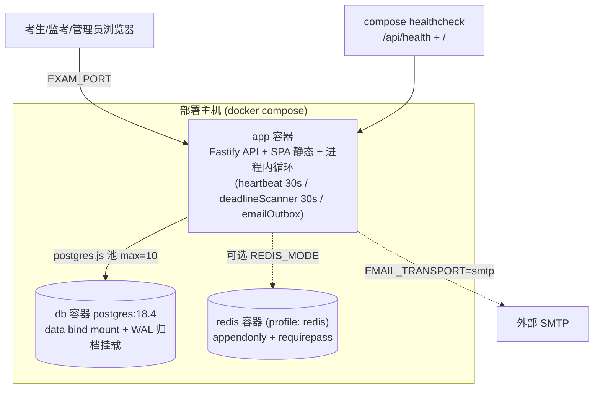
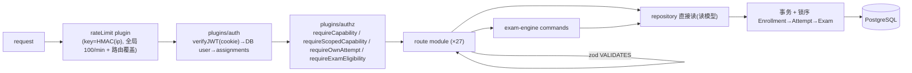
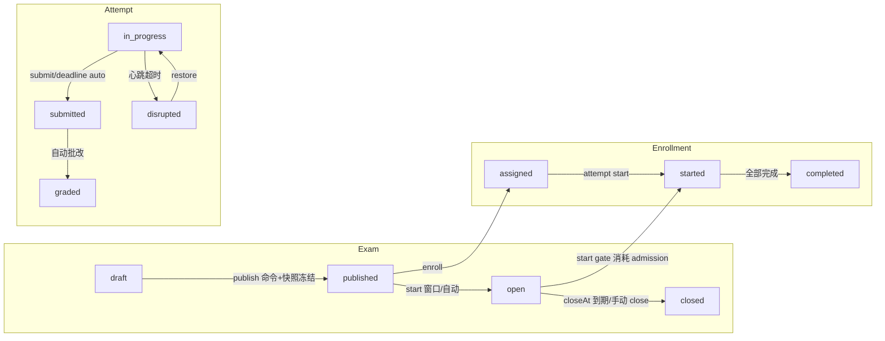

# 02 — 全系统代码推导架构（六个必需 view）

> **REPORT-CORRECTIVE-1**：本报告**保留原样**（六个 view 的代码事实与锚点在 corrective
> 中复核未发现错误）。B view 的限流语义一段与 corrective 的 topology 拆分不冲突
> （08 §4 表）；health 相关事实已按五层拆分补充在 08 §4。corrective 变更见 13 报告。

scope：从代码事实反推的六个架构 view。method：入口文件/路由注册/插件/引擎/repository 阅读为主 agent 亲自完成；attempt/time/admission/submission 深审由 SA2 补强（报告 03）；RBAC 深审见报告 04。所有图先有 code anchors 后有图。

---

## A. Process / Deployment 架构

Evidence anchors：`docker-compose.yml`（app/db/redis profile、stop_grace_period:45s、healthcheck 双探活）；`packages/db/src/postgres.ts:createPostgresDatabase`（默认池）；`apps/api/src/server.ts:main`；`apps/api/src/plugins/heartbeat.ts:283-351`；`apps/api/src/plugins/deadlineScanner.ts:338`。

关键事实（OBSERVED_CODE）：

1. **单进程假设**：API、SPA 托管、心跳扫描、deadline 扫描、email outbox 全在一个 Node 进程（`docker-compose.yml` email-outbox 注释 #320 CONVERGE；`server.ts` 插件注册表）。独立 email worker 入口保留为逃生舱（`apps/api/src/workers/emailDeliveryWorker.ts`、`worker:email` script）。
2. **多实例行为**：扫描循环为 per-process（deadlineScanner 内计数器自述 single-instance，重启归零）；email outbox 用 SKIP LOCKED + worker_heartbeats 行实现多实例安全；限流可用 Redis 跨实例共享（`redis/rateLimitKey.ts:1-24`）。除 email 外，其余循环在双实例下会重复触发——引擎命令幂等/锁语义决定重复触发是否安全（SA2：scanner 在锁下复查，安全；但无 leader 选举，重复扫描是浪费而非错误）。生产 compose 只定义单 app 实例，多实例属未测拓扑（UNKNOWN）。
3. **重启行为**：SIGTERM → audit stopAccepting → app.close → audit drain(10s) → DB close(10s) → 2s bounded exit assist（`server.ts:34-94`，注释声明 30s < 45s stop_grace_period 契约，由 `scripts/repository-contract/deployment-topology-contract.mjs` 门禁）。进程内循环状态（扫描计数器）丢失即重建，持久真相全在 DB。
4. **共享持久状态**：PostgreSQL 全部 40 表；Redis 仅限流计数（可禁用，内存 store 降级）；进程本地状态只有限流内存计数与循环定时器。
5. **迁移接线**：容器 entrypoint 负责迁移与 seed（`docker-entrypoint.sh`、`db:seed:e2e` 的编排注释"app container is the sole migration owner（ADR-011 §8.6/#320）"）。

---

## B. HTTP / Runtime 执行架构

Evidence anchors：`routes/apiSurface.ts:37-63`；`plugins/rateLimit.ts:97-104`；`redis/rateLimitKey.ts:24-30`；`plugins/auth.ts:60-207`；`plugins/authz.ts`；`routes/registerApiRouteModules.ts:44-74`。

关键事实：

1. **认证**（OBSERVED_CODE）：`auth-token` cookie 内 JWT → verifyJWT → 每请求从 DB 加载 user 与 ACTIVE role assignments（`plugins/auth.ts:129` 注释：users.role / JWT role claim 均为非权威投影）。无 assignment → 401；DB 完整性失败 → 503 fail-closed，不降级。
2. **授权**：两个通用门 + 三个专用门（requireOwnAttempt 所有权/404 反枚举、requireExamEligibility 服务端推导 eligibility、requireScoreCapability 自有/全员仲裁）。scope 经 DB resolver（attempt/exam/course/question/incident）逐请求解析。
3. **引擎不做 actor 授权**：exam-engine 信任调用方；仅 manualGrading.ts:138 与 systemIncidentCommands.ts:168-176（System 反伪造）两处例外（SA1，OBSERVED_CODE）。route 层是授权唯一边界，由结构性测试 `routeRegistryConformanceWholeApp.test.ts` 锁定（全 app 恰好一门/受保护路由）。
4. **route 层业务逻辑**：路由做 DTO 解析/组织边界/读模型组装，状态变更走 engine command；抽样未发现 route 直写 SQL（repository 是唯一 SQL 层，`lint:arch` 门禁 + `scripts/check-architecture.mjs` 存在）。
5. **限流语义**（OBSERVED_CODE + MEASURED）：key=HMAC(request.ip)；全局默认 100 req/min；`/auth/login`、`/invitations/accept` 10/min、password-reset 5/10min 路由覆盖（`routes/auth.ts:120,749,855`）。**本审计实测**（报告 08 §限流实验）：单 IP 30 并发用户干净窗口下 10 次登录后即 429；全局预算按实测考生流量 ~6.6 req/人/min 折算，单 NAT/IP 约 15 人触顶。GET /api/health 也在限流作用域内（apiSurface 注册顺序），可被 429。
6. **读模型**：candidate take-view、proctor monitoring、grading queue 均由 route 组装 repository 读模型，响应 Schema 来自 @exam/contracts。

---

## C. Exam / Attempt 状态架构（摘要；全表见 03）

Evidence anchors：`packages/exam-engine/src/examStateMachine.ts`、`attemptStateMachine.ts`、`enrollmentStateMachine.ts`（全转换表见 03 报告）；`examCommands.ts:244-247`（publish 冻结 questionSnapshot）；`heartbeat.ts`（disrupted 标记）；`schema/pg.ts:271-656`。

关键事实：状态均为**裸 text 列**（无 DB CHECK/enum，SA2 F1）；唯一写入口为引擎命令；attempt start 同时消耗 admission（CAS）并复制 questionSnapshot（冻结）；deadline 到期自动 submit+grade（submissionReason='deadline'）。

---

## D. Time 架构（摘要；详见 03 §时间权威）

回答规范问题"有几处独立决定'时间到了没有'"：**一个语义 kernel**（`exam-engine/src/timer.ts:29-74`：`computeEffectiveDeadline = min(exam.closeAt, attempt.deadlineAt)`；`isAttemptDeadlineExpired`），被两条冻结路径调用（lazy reconciliation 于 take/save/submit/restore/grant；deadlineScanner 30s 扫描且锁下复查）。唯一字面重复谓词在 `answerProtocol.ts:140`，但消费 kernel 的值（语义等价）。其余时间检查（start 窗口、enrollment 完成、exam 自动开闭、心跳过期、准入批次）回答的是不同问题，非竞争性到期判定。客户端倒计时仅显示（TakeExamPage.tsx:917 心跳 30s；auto-submit 仅 UX，服务端重判）。

边界语义：到期判定取**请求到达时刻**的 now（ADR-006 单 now 原则）；锁上排队的截止前 save 可能提交时已过线（有界、by design，SA2 F4）。

---

## E. Admission 架构

| 维度 | 判定 | 证据 |
| --- | --- | --- |
| durable fact | `exam_admissions` 行（joined_at 锚、admitted_at、consumed_at）；partial unique index 保证单活跃成员 | `schema/pg.ts:2468-2544`；SA2 |
| derived predicate | waiting/admitted/consumed 由时间戳推导；批次放行计划 = f(最早 joined_at, batchSize, batchInterval) 纯函数 | `admissionCommands.ts:135-157` |
| process-local scheduler | 无。放行不在后台循环物化，而在考生侧 queue join 请求中 lazy reconcile | `attempts.candidate.ts:597-598`（全仓唯一 reconcileAdmission 调用点）|
| 消费 | start 在同一事务内 CAS consumeActive（绑定 attemptId），Enrollment 锁串行化；零行即中止（fail-closed） | SA2 |
| operator 面 | 只读（GET /admin/exams/:id/admissions；exam.ts:2195 注释明示无手动准入产品语义）| OBSERVED_CODE |
| 放行触发 | **考生请求驱动**：queue join 路由 + start 门 ensureStartAdmission 两条路径 lazy reconcile（attempts.candidate.ts:597-598；admissionCommands.ts:361←attemptCommands.ts:316），无后台物化；真实前端以重发 queue 端点轮询（StartExamPage.tsx:71-94）| OBSERVED_CODE + MEASURED |

MEASURED（报告 08）：停轮询后的积压批次在下次轮询时**一次性补放**（56 人同刻就绪）；分批节奏只在考生持续轮询时成立；未报名者 join → 404（反枚举）；未就绪者 start → 409。

---

## F. Submission / Grading 架构（摘要；详见 03/07）

- 提交 = 单 RR 事务：EA 行锁 → lazy reconcile → 冻结屏障（freeze barrier）→ 写 `submitted_answers`（schemaVersion 1，未答=null）+ submissionReason + gradingStatus 分类 + 批改 workset。
- 双提交防护：行锁串行 + already-submitted-first 路径校验 workset 一致性 + unique(org,enrollment,attemptNo)；admin force-submit 另有 `attempt_command_receipts` UNIQUE(org,operation_id) 仲裁与 23505 恢复（SA2：非常强）。
- 批改：自动批改读冻结快照（`domain/gradingEngine.ts` 纯函数）；主观题进 pending_manual 手改队列，不自动终结；draft 兜底仅限 legacy NULL 行（backfill 脚本在列）。
- 结果可见性：resultVisibility/answerVisibility 字段控制（take meta OBSERVED_RUNTIME：hidden）。
- MEASURED：130 并发提交 100% 成功、全部落 graded（报告 08）。

---

## Observations（全系统）

1. 架构重心正确：所有考试不变量的仲裁者都在 PostgreSQL（行锁/CAS/unique/append-only receipts），进程内存只承载触发器与缓存语义。
2. 授权唯一边界在 route 层，且被结构性测试机械锁定——这是少数能防"新增路由忘加门"的仓库。
3. 弱点集中在"单进程单实例"假设与裸 text 状态列（无 DB 级完整性约束），以及限流按 IP 的部署敏感性。
4. 时间与准入都是单一 kernel + lazy 物化设计——一致性好，但准入节奏依赖客户端行为（E 实验证据）。

## Unknowns

- 多 app 实例拓扑下扫描循环重复触发的实测影响（代码分析判定安全，未测）。
- 生产规模数据量下的 repository 查询计划（实验 DB 行数量级远小于真实学期数据）。
