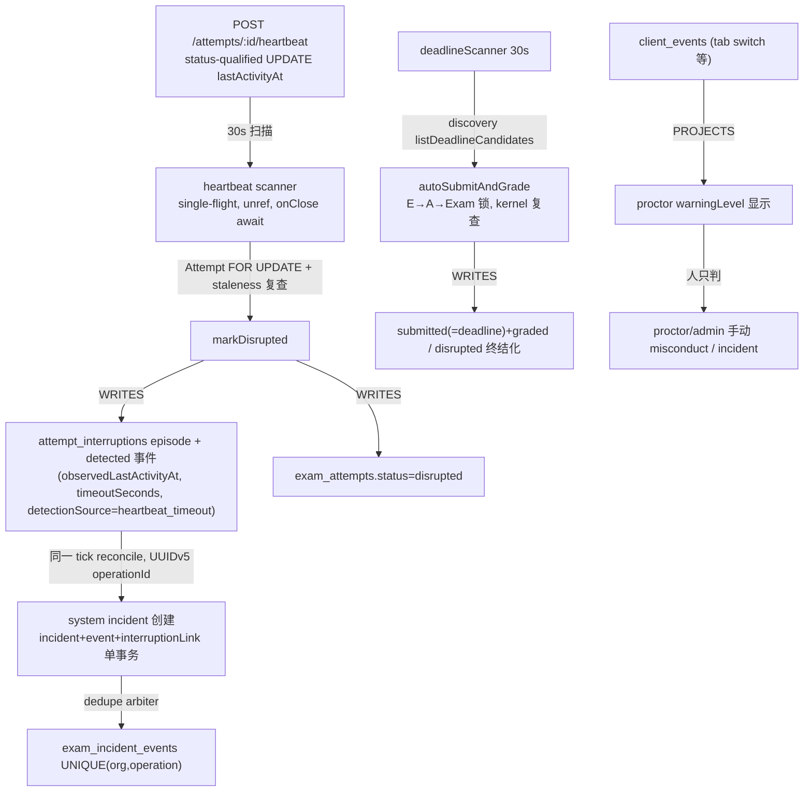

# 05 — Detection / Incidents 架构与 ADR 对账

scope：真实 detection architecture（code-first 推导）+ Accepted ADR 对账。method：SA3+4 子代理推导 + 主 agent 复核。Phase 1（仅代码）先行，Phase 2（ADR）在其后。

> **REPORT-CORRECTIVE-1**：① detection taxonomy 修正——"system incident
> reconcile"不再称为 detector，它是 durable episode → incident 的
> **RECONCILIATION / materialization**；② ADR-018 重新分类为 ALIGNED
> （/system/* 面 = 契约的 current realization；Prometheus/OTel 是 anti-goal）；
> ③ examProfile #286 行删除 AUTHORITY_CONFLICT。详见 13 报告。

## 1. Detection chain（Phase 1 — 仅代码，corrective 后 taxonomy 修正）



Evidence anchors：`attempts.candidate.ts:1170-1217`；`plugins/heartbeat.ts:50-55,322-344`；`attemptCommands.ts:633-705`；`systemIncidentCommands.ts:49-71,147-269`；`systemIncidentDelivery.ts:134-213`；`incidentOperationRecovery.ts`；`deadlineScanner.ts:147-273`；`TakeExamPage.tsx:930-957`；`proctorMonitoringService.ts:206-239`；`misconductMarkExecution.ts:45-66`。

### 直接回答规范问题（corrective 后的分层词汇：OBSERVATION / DETECTION / DURABLE DETECTION FACT / RECONCILIATION / INCIDENT MATERIALIZATION / HUMAN ADJUDICATION / AUTOMATIC CONSEQUENCE）

| 问题 | 答案 |
| --- | --- |
| what is observation? | client_events 遥测（tab 切换等）、CPU/内存/db 健康采样、proctor warningLevel、backup evidence、限流计数——无自动后果、无持久 detection fact |
| what is detection? | **恰好两类产生 durable fact 的自动判定**：心跳超时（30s 扫描器在 Attempt FOR UPDATE 下用 staleness predicate 判定）与 deadline 到期（deadlineScanner 锁下 kernel 复查判定）。检测输出 = attempt_interruption episode + 来源标记事件（detected, detectionSource=heartbeat_timeout）或 submitted(+graded) 终结化 |
| what becomes durable fact? | attempt_interruptions(+events)、exam_attempts.status、exam_incidents(+events/actions/links)、attempt_command_receipts、audit_logs、submitted_answers |
| what is reconciliation / incident materialization? | （原报告误称"系统 incident reconcile = detection"）心跳超时 episode 的**收敛物化**：同一 tick 内以 UUIDv5(episodeId) 幂等键把已存在的 durable episode 收敛为 incident aggregate（incident+event+interruptionLink 单事务）。它不是新的检测器——检测已在 episode 层完成；reconcile 只回答"这个已检测 episode 是否已物化为 incident"，dedupe 由 exam_incident_events UNIQUE(org,operation) 仲裁 |
| what creates incident? | heartbeat timeout episode 的 reconcile 物化（自动，幂等）；proctor/admin 手动创建（IncidentCreate） |
| what is human-only (judgment)? | misconduct 标记的实质判定、incident 调查/resolve/dismiss、时间授予、强制提交（虽有回执仲裁但触发是人） |
| what is System actor? | 闭集 {system:deadline-scanner, system:heartbeat, system:incident-detector}，DB CHECK 不可分配 |
| automatic consequence? | **恰好两类**：心跳超时→disrupted（可恢复状态）；deadline→自动提交+批改。incident 物化本身是**创建性后果（无惩罚语义）**——自动 incident 不触发 grant/处分；一切处分都是人 + 回执 |
| explicit NO automatic consequence? | tab 切换/复制粘贴遥测、IP、lockdown 字段（见 §3 #516）；CPU/内存观测 |

心跳链（corrective 版本）：

```text
heartbeat timestamps
        ↓
timeout predicate under lock          ← DETECTION（durable：attempt_interruption + detected 事件）
        ↓
attempt_interruption + detected event
        ↓
reconcile（UUIDv5 幂等，单事务）      ← RECONCILIATION / materialization
        ↓
system incident creation
        ↓
incident
        ↓
human investigate / resolve / dismiss ← JUDGMENT
```

## 2. Background loop census

| 循环 | 间隔 | overlap/单飞 | 重启 | 错误策略 | 多实例 |
| --- | --- | --- | --- | --- | --- |
| heartbeat 扫描 | 30s（HEARTBEAT_SCAN_INTERVAL_MS） | 单飞标志 activeScan | 无状态重建 | per-attempt 隔离 + 周期 catch（log-retry） | 安全但重复（无 leader） |
| system-incident reconcile | 同 tick | UUIDv5 operationId 唯一约束收敛 | 同上 | per-episode 失败不中止 | 收敛 |
| deadlineScanner | 30s | 单飞 + 锁下复查 | SIGKILL 进程测试证明 ≤30s 追赶 | RR 40001 重试 | 安全但重复 |
| emailOutboxLoop | 配置化轮询 | SKIP LOCKED + worker_heartbeats + recoverAbandoned | 锁超时恢复 | at-least-once + 监管重启 | 安全 |
| redis 探活 | 1s PING | — | 有界退避 200ms→2s | fail-fast + 自恢复 | — |
| client_events retention | **不存在** | — | — | — | — |

裁决：**scheduler 一律只是触发器**，canonical decision 全部在 DB 锁/约束下重算；未发现 scheduler 秘密持有真相。进程内指标（heartbeatMetrics 等）显式非权威、重启归零。

## 3. Phase 2 — ADR / 规范对账（code model 冻结后）

| ADR/声明 | 代码现实 | 分类 |
| --- | --- | --- |
| ADR-006 时间权威（单 now 原则） | ALIGNED：timer kernel + 请求到达采样；唯一重复谓词消费 kernel 值（03 报告 §4） | ALIGNED |
| ADR-008 提交冻结 | ALIGNED：冻结屏障单事务、workset、draft 兜底仅 legacy | ALIGNED |
| ADR-014 incident 权威（#304） | ALIGNED：UUIDv5 operationId 仲裁 + 单事务 + System 反伪造 + fresh-tx 恢复 | ALIGNED |
| ADR-015 proctor scope（J4-I1B） | ALIGNED：proctor 无危险 cap，assignment_scoped 404 | ALIGNED |
| ADR-011 邮件 outbox/#320 CONVERGE | ALIGNED：进程内循环 + worker 逃生舱并存（NOTE 级双轨残余） | ALIGNED（带 NOTE） |
| ADR-018 可观测窗口 | ALIGNED（corrective 修正）：当前 /system/* 面就是契约的 current realization（ADR-018 D1/D3 明示）；Metrics/Logs/Events/Materials 为 future、需 per-source ADR（D7）；Prometheus/OTel/generic observability platform 为**显式 anti-goal**（ADR-018 Context + observability.md Non-goals）。"无 metrics 推送/告警"是**生产可运维性缺口**（F4-05/F3-05），不是 ADR violation | ALIGNED（带 operability gaps） |
| #516 产品真实性（exam 控件不支持即拒绝） | ALIGNED 且已收口：detectTabSwitch/disableCopyPaste/restrictIp/requireLockdown 无运行时强制，**authoring 侧直接拒绝激活**（examPolicy.ts:33-39,190-200）；tab 切换仅遥测+监考警示 | ALIGNED |
| #292 准入队列 | ALIGNED；但放行节奏依赖考生轮询（MEASURED 补放波） | ALIGNED（带 MINOR F-08-2） |
| #498 / #534（tracker 语义） | corrective 修正：#498 **CLOSED**（2026-09-11），但 README.md:134、README.zh-CN.md:121、CONTRIBUTING.md:9、docs/README.md:28,52、docs/roadmap/current.md:6,15,28,40,61、docs/roadmap/post-mvp-issues.md:5,11,70 仍把它当"live tracker"引用 → CLOSED_TRACKER_STILL_REFERENCED_AS_CURRENT。#534 OPEN 但自称 MEMORY ROADMAP（"NOT CURRENT EXECUTION AUTHORITY"），其前置文本（"current execution authority remains #516 until closed"）在 #516 已关闭后未 reconcile → POST-#516_TRACKER_TEXT_NOT_RECONCILED。二者**不构成 duplicate execution authority**。文档/治理 finding（F2-10 TRACKER_POINTER_DRIFT），非 runtime finding | DOCUMENTATION_DRIFT（F2-10，重写） |
| 状态列完整性（migration 声明 typed） | 裸 text 无 CHECK（03 F1-03） | DOCUMENTATION_DRIFT（MINOR） |
| examProfile #286 收窄声明 | corrective 修正：examProfile 路由未做 teacher scope 收窄，但 profile 是 **organization-owned authoring template**（P7-M2 契约，courseId 显式排除），#286 只覆盖 course-resident resource —— 无 AUTHORITY_CONFLICT。**F1-04 REJECTED** | ALIGNED（F1-04 REJECTED） |

## 4. Findings

| ID | 级别 | 摘要 |
| --- | --- | --- |
| F1-05 | MINOR | client_events 无 retention/清理路径（insert-only repo，无 delete；retention_runs 仅备份证据）——无界增长 |
| F2-05 | MINOR | system-incident reconcile 发现对全部历史 heartbeat episode 无界扫描，30s/轮；代码自述接受"LAN-scale cost"（attemptInterruptionEventRepo.ts:180-240） |
| F3-05 | MINOR（reframed） | health 面拆分后：PROCESS LIVENESS（GET /api/health，静态 ok）= PROVEN；DB-AWARE READINESS（GET /api/system/health，DB ping + dbResponseMs，system.ts:304-323）= PROVEN；OPERATOR DIAGNOSTICS（/system/diagnostics）= PROVEN；**DEPLOYMENT HEALTH GATING（compose healthcheck 在 PG 宕机时仍 healthy，不 gate 流量）= NOT PRESENT**；**ACTIVE ALERTING = NOT PRESENT**。运维知识全 pull。不再是"health endpoint DB-blind"这种混合表述 |
| F4-05 | MINOR（operability gap） | 无 metrics 推送/告警面；heartbeat/deadline 指标进程内存、重启归零。**分类修正：生产可运维性缺口，不是 ADR-018 violation**（ADR-018 把 metrics 平台列 anti-goal；未来接入需 per-source ADR） |
| F5-05 | NOTE | 扫描循环无 leader 选举；多副本安全（事务收敛）但重复做工；部署契约单容器 |
| F6-05 | NOTE | email 进程内循环与独立 worker 入口并存（逃生舱，at-least-once 安全） |
| F7-05 | NOTE | systemMonitor 用 os.cpus()/totalmem() 在容器内取宿主机值（INFERRED） |

## 5. Unknowns

- client_events 在真实长期部署的实际增长速率。
- 多实例下扫描重复的实测 CPU 浪费幅度。
- 是否存在尚未接线的 OTel/告警计划（docs 未见）。
